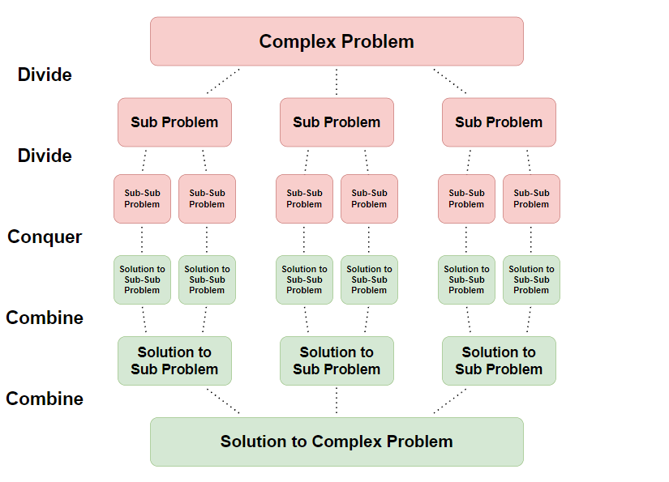

# &#128209; Table of Contents
- [💡 Overview](#-overview)
  - [Essential Terminology](#essential-terminology)
- [💻 Implementation](#-implementation)
  - [How to Implement](#how-to-implement)
  - [Pitfalls and Optimizations](#pitfalls-and-optimizations)
  - [Implemented Algorithms](#implemented-algorithms)
- [📊 Analysis](#-analysis)
  - [How to Analyze](#how-to-analyze)
  - [Trade-Offs](#trade-offs)
  - [Alternatives](#alternatives)
- [📝 Application](#-application)
  - [Common Use Cases](#common-use-cases)
  - [Some Practical Problems](#some-practical-problems)
- [🕙 Origins](#-origins)
- [🤝 Contributing](#-contributing)
- [📧 Contacts](#-contacts)
- [🙏 Credits](#-credits)
- [🔏 License](#-license)

# &#128161; Overview
**Divide-and-Conquer** is a widely-used problem-solving approach in computer science to solve complex problems by breaking them down into simpler, manageable subproblems, solving each sub-problem independently, and combining their solutions. It helps to design efficient algorithms and optimize performance across various applications, which makes understanding the concept quite beneficial.

## Essential Terminology
- **Problem** — is a task or challenge that requires a solution, typically defined by a set of inputs, constraints, and desired outputs. It can vary in complexity and scope, ranging from simple arithmetic calculations to complex optimization tasks.
  - **Sub Problem** — is a smaller, more manageable instance of the original problem.
- **Problem-Solving Strategy** — is a method of approaching a problem to find a solution.
- **Divide-and-Conquer** — is a strategy that consists of 3 steps: 
  1. **Divide** — brake down original problem into smaller, more manageable subproblems.
  2. **Conquer** — solve each sub-problem independently.
  3. **Combine** — combine those solutions to form solution to the original problem.
- **Decrease and Conquer** — is a variation, which leaves only required subproblem and discards other, that are not considered further in the solution process because they don't contain the solution to the original problem, therefore this approach just simply reduces the size of the original problem; e.g. binary search divides problem in halves, but search occurs only in one.

# &#x1F4BB; Implementation
When implementing a concept, it's essential to understand the fundamental techniques that drive its behavior and ensure its correct functionality. Additionally, recognizing the critical pitfalls and potential optimizations allows you to refine the implementation, making it more efficient and robust for various scenarios.

## How to Implement
Depending on the situation, the implementation of the concept may vary, though the core principle, refined through practice, remains the same: solving overlapping subproblems and storing their solutions to avoid redundancy. Classifying something is always a tricky task, but to provide a structured overview, I'll suggest that there are generally two main ways to achieve the desired behavior
- **Recursion** — solves each sub-problem either by recursively dividing again or if small enough solves directly; e.g. merge sort.
- **Iteration** — divides the problem in each iteration of the loop until original problem is solved; e.g. binary search.

> **Note:** Since you can observe the ideas of divide-and-conquer in many other approaches (probably due to its extremely general steps), it could be quite confusing to determine which specific implementation is being considered. In most cases I have encountered, divide-and-conquer is associated with recursion. Therefore, I recommend associating it as the default approach, but not limiting your design thinking only to it.

## Pitfalls and Optimizations
The effectiveness of the divide-and-conquer approach depends not only on how the problem is split, solved, and combined, but also on several critical factors such as the size and balance of a subproblem, recursion depth, total performance overhead, etc. Below are some common pitfalls and potential optimizations to consider when addressing this concept.

- **Subproblem Size** — how are the subproblems sized? For divide-and-conquer to be efficient, the subproblems should ideally be of similar size. When subproblems are unbalanced, it can lead to inefficiencies, such as in the worst-case scenario for Quicksort, where one partition is much larger than the other.
- **Merge Step Complexity** — how expensive is the merge step? In many divide-and-conquer algorithms, the merge step is a bottleneck. Ensuring that the merge is efficient or avoiding it when possible can significantly improve performance.
- **Recursive Depth** — how deep is the recursion? Excessive recursion depth can lead to stack overflow or memory issues. Optimizations like [tail recursion](https://github.com/vezzolter/DSA/blob/main/Algorithms/Recursion/Recursion.md) (when possible) or switching to an iterative approach for small subproblems can mitigate these risks.
- **Base Case Size** — when should the recursion stop? Recursively solving tiny subproblems can introduce unnecessary overhead. A common optimization is to stop the recursion when the problem size becomes small enough and switch to a simpler algorithm.
- **Overlapping Subproblems** — are the subproblems truly independent? Divide-and-conquer assumes that the subproblems can be solved independently. However, if subproblems overlap, a dynamic programming approach (storing intermediate results) may be more appropriate to avoid redundant work.
- **Space Complexity** — is additional memory required? Some divide-and-conquer algorithms require significant extra space for storing intermediate results, while others can be implemented in place. Choosing the right algorithm based on memory constraints is crucial.
- **Parallelization** — can the algorithm be parallelized? Divide-and-conquer algorithms are often good candidates for parallelism, as the subproblems can be solved concurrently. However, ensuring that the merging step can be parallelized (or is not a bottleneck) is key to realizing the performance gains.
- **Worst-Case Scenarios** — how does the algorithm perform in its worst case? Some divide-and-conquer algorithms, like Quicksort, can degrade to $O(n^2)$ in the worst case. Mitigating these scenarios, such as through randomized pivot selection, can improve the overall robustness of the algorithm.
- **Cache Efficiency** — does the algorithm make efficient use of memory caches? Divide-and-conquer can sometimes improve cache efficiency by working on smaller subproblems that fit into the CPU cache. However, poorly structured recursion or inefficient merging can lead to excessive cache misses, reducing performance.
- **Tail Recursion Optimization** — for divide-and-conquer algorithms that exhibit tail recursion, compilers may optimize recursion to avoid deep stack usage. Understanding when and where tail recursion applies can prevent issues related to excessive stack depth.

## Implemented Algorithms
When working with concepts that lack standalone functionality, there aren’t pre-built standard implementations like those available for search or sort in libraries. Instead, these concepts act as frameworks or strategies used to develop efficient algorithms for solving various problems.

The focus here is on understanding how these concepts are applied in specific algorithmic solutions. Below are implementations of popular algorithms that showcase how divide-and-conquer can be used in practice:
- [Strassen's Algorithm](https://github.com/vezzolter/DSA/tree/main/Algorithms/DivideAndConquer/StrassensAlgorithm) ✅
- [Karatsuba Algorithm](https://github.com/vezzolter/DSA/tree/main/Algorithms/DivideAndConquer/KaratsubaAlgorithm) ✅
- FFT (Fast Fourier Transform) (?)
- Newton's Method (?)

And here are some of the most well-known examples, available in other sections of the repository:
- [Binary Search](https://github.com/vezzolter/DSA/tree/main/Algorithms/Searching/BinarySearch) ✅
- [Merge Sort](https://github.com/vezzolter/DSA/tree/main/Algorithms/Sorting/MergeSort) ✅
- [Quicksort](https://github.com/vezzolter/DSA/tree/main/Algorithms/Sorting/Quicksort) ✅

# &#128202; Analysis
Understanding how to analyze a concept is crucial for identifying its key characteristics and evaluating its performance across different scenarios. Additionally, examining the trade-offs allows you to understand what you gain and what you give up when applying the concept. Finally, considering alternatives helps you determine when the concept is the best choice and when other approaches might be more appropriate.

## How to Analyze
- **Time Complexity:**
   - **Iterative Implementation** — requires evaluation of the fundamental instruction and the nuimber of times the instruction is executed.
   - **Recursive Implementation** — requires analyzing the [recurrence relation](https://github.com/vezzolter/DSA/blob/main/General/Analysis/Analysis.md) to derive the final complexity.
- **Space Complexity:**
   - **In-Place** — algorithm operates without needing additional memory beyond the input size, making it space efficient.
   - **Out-of-Space** — algorithm requires additional memory proportional to the size of the input or the depth of recursion.
- **Problem Decomposition:**
   - **Balanced Subproblems** — algorithm divides the problem into equally sized subproblems, ensuring that the work is evenly distributed and recursion is efficient.
   - **Unbalanced Subproblems** — algorithm divides the problem into uneven subproblems, which may lead to inefficiency, where one subproblem dominates and there is no benefit to approach.
- **Parallelism:**
   - **Parallelizable** — algorithm can be parallelized, meaning that subproblems can be solved independently and concurrently because they do not rely on one another.
   - **Not Parallelizable** — algorithm can't be parallelized due to dependencies between subproblems, meaning each step must be completed sequentially before moving to the next.

## Trade-Offs
**What Divide-and-Conquer Gives:**
- **Improved Asymptotic Performance** — divide-and-conquer allows to reduce time complexity compared to naive approaches, which in a long run can greatly benefit efficiency of the algorithm.
- **Parallelism** — divide-and-conquer enables solving subproblems independently, making it an ideal approach to leverage multi-core processors.

---
**What Divide-and-Conquer Takes:**
- **Recursion Overhead** — divide-and-conquer's recursive calls impose additional complexity, which can outweigh the benefits.
- **Memory Consumption** — divide-and-conquer requires extra space to perform some of its steps, which can be prohibitive in some environments with limited memory.
- **Non-Trivial Implementation** — divide-and-conquer is not a straightforward approach, division and merging processes may introduce additional complexities that make the algorithm harder to implement correctly.

## Alternatives
1. **Dynamic Programming** — instead of dividing the problem into independent subproblems, dynamic programming breaks the problem into overlapping subproblems and stores the results of these subproblems to avoid redundant computations. This method optimizes the solution by avoiding re-calculating the same result multiple times. It is particularly useful for problems like shortest paths in graphs or sequence alignment, where subproblems share significant overlap with one another.
2. **Greedy Algorithms** — rather than solving subproblems independently and combining their solutions, greedy algorithms make a sequence of locally optimal decisions at each step, with the hope that this will lead to an overall optimal solution. This approach is efficient for problems like minimum spanning trees (e.g., Prim's or Kruskal's algorithm) and Huffman coding, where a series of local optimizations lead to a globally optimal result.
3. **Brute Force** — instead of systematically breaking down a problem, brute force algorithms try all possible solutions until the correct one is found. While it is not efficient, brute force is often easier to implement and is guaranteed to find a solution. It's commonly used when the problem size is small or when no optimized solution is immediately obvious. Examples include combinatorial problems like generating all permutations or subsets.
4. **Heuristic Approaches** — instead of breaking the problem into smaller parts, heuristic methods provide good enough solutions in less time, especially when optimal solutions are not feasible. These approaches make use of domain knowledge and educated guesses to arrive at a practical solution, without dividing the problem explicitly. Heuristics are commonly applied in optimization problems (e.g., pathfinding algorithms like A*), where an exact divide-and-conquer solution would be too slow or complex.
5. **Direct Mathematical Solutions** — for certain problems, mathematical formulas or closed-form solutions can bypass the need for divide-and-conquer altogether. For example, instead of recursively summing numbers or calculating factorial values, direct mathematical solutions provide exact results in constant time using well-known formulas like the sum of an arithmetic series or $n!$ calculated iteratively.

# &#128221; Application
Understanding some of the most well-known use cases of a concept is crucial for grasping its practical relevance and potential impact in real-world scenarios. Additionally, familiarizing oneself with practical problems and practicing their solutions ensures that you retain essential details and develop a deep, intuitive understanding of the concept's capabilities and limitations.

## Common Use Cases
- **Sorting** — divide-and-conquer strategies are used in sorting algorithms to optimize the process of arranging data in a specific order. They achieve this by efficiently partitioning the data into smaller subsets, sorting each subset independently, and merging them back together to achieve the final sorted result; e.g. Merge sort, Quicksort, Heap sort.
- **Searching** — divide-and-conquer approach enhances searching algorithms by efficiently locating specific elements within a dataset. These algorithms partition the search space into smaller segments, recursively searching each segment, and converging on the target element or determining its absence, thereby facilitating efficient search operations; e.g. Binary search, maximum and minimum element search.
- **Matrix Operations** — divide-and-conquer techniques are applied to matrix operations. These techniques break down the matrices into smaller sub-matrices, perform computations recursively, and combine the results, enabling efficient matrix manipulations; e.g. Strassen's algorithm, recursive algorithms for matrix exponentiation
- **Computational Geometry** — divide-and-conquer algorithms are used in computational geometry to solve geometry problems. These algorithms partition the geometric space, solve subproblems independently, and combine the results to achieve geometric solutions efficiently; e.g. Graham Scan, QuickHull, Voronoi diagrams.
- **Numerical Methods** — divide-and-conquer methods are used in numerical methods to solve mathematical problems using numerical approximations and algorithms. These methods break down the problem into smaller subproblems, perform recursive computations, and combine the results to achieve efficient solutions; e.g. Simpson's Rule, Newton-Raphson method, Bisection method.

## Some Practical Problems
**Easy Problems:**
1. [Majority Element](https://leetcode.com/problems/majority-element/?envType=problem-list-v2&envId=divide-and-conquer)
2. [Reverse Bits](https://leetcode.com/problems/reverse-bits)
3. [Convert Sorted Array to Binary Search Tree](https://leetcode.com/problems/convert-sorted-array-to-binary-search-tree)

---
**Medium Problems:** 
1. [Maximum Subarray](https://leetcode.com/problems/maximum-subarray)
2. [Top K Frequent Elements](https://leetcode.com/problems/top-k-frequent-elements)
3. [Super Pow](https://leetcode.com/problems/super-pow)
4. [Sort an Array](https://leetcode.com/problems/sort-an-array)
5. [Sort List](https://leetcode.com/problems/sort-list)
6. [Kth Largest Element in an Array](https://leetcode.com/problems/kth-largest-element-in-an-array)

---
**Hard Problems:** 
1. [Median of Two Sorted Arrays](https://leetcode.com/problems/median-of-two-sorted-arrays)
2. [Reverse Pairs](https://leetcode.com/problems/reverse-pairs)
3. [Merge k Sorted Lists](https://leetcode.com/problems/merge-k-sorted-lists)

# &#x1F559; Origins
The idea of dividing one complex problem, solving them independently, and yielding the result dates back to ancient times, where it has been utilized for centuries in various cultures. In the realm of mathematics and computer science, the formalization and systematic study of divide-and-conquer algorithms began in the mid-20th century with the development of computer science as a field of study. Among the first introduced algorithms that utilized this idea were **Merge Sort** and **Quicksort**. From that point on, it gained widespread adoption and became a fundamental strategy in algorithm design and analysis.

# &#129309; Contributing
Contributions are highly appreciated! For detailed guidelines, please refer to the [root directory's contributing section](../../#-contributing).

# &#128231; Contacts
For contact details and additional information, please refer to the [root directory's contact information section](../../#-contacts).

# &#128591; Credits
&#128218; **Books:**
- **"Introduction to Algorithms" (3rd Edition)** — by Thomas H. Cormen, Charles E. Leiserson, Ronald L. Rivest and Clifford Stein
  - Section 4: Divide-and-Conquer
- **"Algorithms in C++, Parts 1-4: Fundamentals, Data Structure, Sorting, Searching" (3rd Edition)** — by Robert Sedgewick
  - Section 5.2: Divide and Conquer
- **"Data Structures and Algorithm Analysis in C++" (4th Edition)** — by Mark Allen Weiss
  - Section 10.2: Divide and Conquer
- **"The Algorithm Design Manual" (2nd Edition)** — by Steven Skiena
  - Section 4.10: Divide-and-Conquer
- **"The Art of Computer Programming, Volume 2: Seminumerical Algorithms" (3rd Edition)** — by Donald Ervin Knuth
  - Section 4.3: Multiple Precision Arithmetic
  - Section 4.6: Polynomial Arithmetic

---  
&#127760; **Web-Resources:**  
- [Divide-and-conquer algorithm](https://en.wikipedia.org/wiki/Divide-and-conquer_algorithm) (Wikipedia)

# &#128271; License
This project is licensed under the MIT License — see the [LICENSE](https://github.com/vezzolter/DSA/blob/main/LICENSE) file for details.

