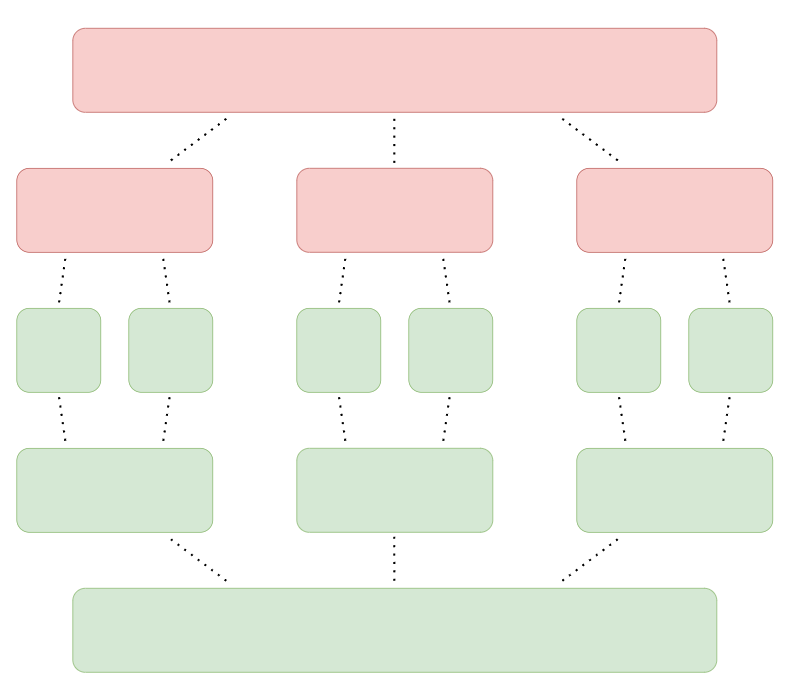

# &#128209; Table of Contents
- [💡 Overview](#-overview)
- [💻 Implementation](#-implementation)
- [📊 Analysis](#-analysis)
- [📝 Application](#-application)
- [⏳ Origins](#-origins)
- [🤝 Contributing](#-contributing)
- [📧 Contacts](#-contacts)
- [🙏 Credits](#-credits)
- [🔏 License](#-license)

# &#128161; Overview
**Divide and Conquer** is a widely used problem-solving strategy in computer science to solve complex problems by breaking them down into simpler ones. It helps to design elegant and efficient algorithms for all manner of applications, making it important to truly understand the concept.

---
**Essential Terminology (in the DSA context):**
- **Problem** — is a task or challenge that requires a solution, typically defined by a set of inputs, constraints, and desired outputs. It can vary in complexity and scope, ranging from simple arithmetic calculations to complex optimization tasks.
  - **Sub Problem** — is a smaller, more manageable instance of the original problem.
- **Problem-Solving Strategy** — is a method of approaching a problem to find a solution.
- **Divide and Conquer** — is a strategy that consists of 3 steps: 
  1. **Divide** — brake down original problem into smaller, more manageable sub-problems.
  2. **Conquer** — solve each sub-problem independently.
  3. **Combine** — combine those solutions to form solution to the original problem.
- **Decrease and Conquer** — is a variation, which leaves only required subproblem and discards other, that are not considered further in the solution process because they don't contain the solution to the original problem, therefore this approach just simply reduces the size of the original problem; e.g. binary search divides problem in halves, but search occurs only in one.

# &#x1F4BB; Implementation
The list of known divide and conquer algorithms is extensive and continues to grow. When it comes to implementation, some share some common ideas, while others possess distinctive characteristics. The choice between them depends on the specific requirements of the cases at hand. Generally, there are lot of ways to achieve behavior of this approach, most used of them are:
- **Recursion** — solves each sub-problem either by recursively dividing again or if small enough solves directly; e.g. merge sort.
- **Iteration** — divides the problem in each iteration of the loop until original problem is solved; e.g. binary search.
- **Dynamic Programming** — stores and reuses solutions to sub-problems to avoid redundant computations, particularly useful when there are overlapping sub-problems; e.g. matrix chain multiplication.

> Personal note: Since you can observe the ideas of Divide and Conquer in many other approaches (probably due to its extremely general steps), it could be quite confusing to determine which specific implementation is being considered. In most cases I have encountered, Divide and Conquer is associated with recursion. Therefore, I recommend associating it as the default approach, but not limiting your design thinking only to it.

# &#128202; Analysis
Currently in Progress...

# &#128221; Application
Currently in Progress...

# &#x23F3; Origins
Currently in Progress...

# &#129309; Contributing
Contributions are highly appreciated! For detailed guidelines, please refer to the [root directory's contributing section](../../#-contributing).

# &#128231; Contacts
For contact details and additional information, please refer to the [root directory's contact information section](../../#-contacts).

# &#128591; Credits
&#128218; **Books:**
- **"Introduction to Algorithms" (3rd Edition)** — by Thomas H. Cormen, Charles E. Leiserson, Ronald L. Rivest and Clifford Stein
  - Section 4: Divide-and-Conquer
- **"Algorithms in C++, Parts 1-4: Fundamentals, Data Structure, Sorting, Searching" (3rd Edition)** — by Robert Sedgewick
  - Section 5.2: Divide and Conquer
- **"Data Structures and Algorithm Analysis in C++" (4th Edition)** — by Mark Allen Weiss
  - Section 10.2: Divide and Conquer
- **"The Algorithm Design Manual" (2nd Edition)** — by Steven Skiena
  - Section 4.10: Divide-and-Conquer

---  
&#127760; **Web-Resources:**  
- [Divide-and-conquer algorithm](https://en.wikipedia.org/wiki/Divide-and-conquer_algorithm) (Wikipedia)

# &#128271; License
This project is licensed under the MIT License — see the [LICENSE](https://github.com/vezzolter/DSA/blob/main/LICENSE) file for details.

