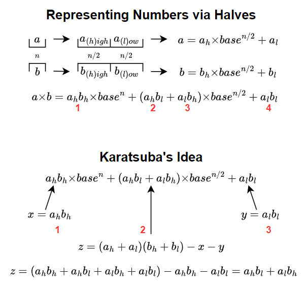
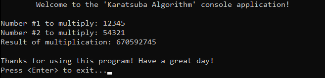

# &#128209; Table of Contents
- [💡 Overview](#-overview)
	- [Introduction](#introduction)
	- [Important Details](#important-details)
	- [Algorithm Steps (Base 10)](#algorithm-steps-base-10)
- [💻 Implementation](#-implementation)
	- [Design Decisions](#design-decisions)
	- [Complete Implementation](#complete-implementation)
	- [Detailed Walkthrough](#detailed-walkthrough)
- [📊 Analysis](#-analysis)
	- [Advantages](#advantages)
	- [Disadvantages](#disadvantages)
- [📝 Application](#-application)
	- [Common Use Cases](#common-use-cases)
	- [Some Practical Problems](#some-practical-problems)
- [🕙 Origins](#-origins)
- [🤝 Contributing](#-contributing)
- [📧 Contacts](#-contacts)
- [🙏 Credits](#-credits)
- [🔏 License](#-license)


# &#128161; Overview
The **Karatsuba Algorithm** is a multiplication algorithm, known for reducing the time complexity of this operation. It is named after its inventor, Anatoly Alexeyevich Karatsuba. Knowledge and understanding of it teaches the core principles of the divide-and-conquer paradigm, while also enhancing ability to approach algorithmic design with broader and more effective strategies.
<p align="center"></p>


## Introduction
**Karatsuba Algorithm** recursively splits the numbers into higher-order and lower-order halves. Normally, this would require 4 multiplications, but by cleverly substituting one of the multiplications with a combination of additions and subtractions, the algorithm reduces the number of multiplications to 3. This reduction leads to a faster overall time complexity, as multiplication dominates the computation cost.


## Important Details
1. While Karatsuba is efficient for large numbers, for very large numbers (beyond the capacity of built-in data types), arbitrary precision arithmetic is required to handle numbers with thousands of digits by dynamically managing memory. Alternatively, more advanced algorithms like Schönhage–Strassen may be used for even greater efficiency.
2. The Karatsuba algorithm can be implemented using different bases, such as binary or decimal, depending on the representation of the numbers. The choice of base primarily affects how the numbers are shifted, although core idea remains. Naturally computers do better those operations via binary, but to illustrate the concept decimal is preferred.


## Algorithm Steps (Base 10)
1. If either number (`a` or `b`) is less than 10, return the result of their direct multiplication ($a×b$).
2. Calculate the number of digits in the larger number and divide it by $2$ to determine where to split the numbers.
3. Divide both initial numbers (`a` or `b`) into higher-order and lower-order halves via previously computed half.
   - higher-order halves (`aHighHalf` and `bHighHalf`) are calculated via division by $10^{\text{half}}$
   - lower-order halves (`aLowHalf` and `bLowHalf`) are calculated as remainder from division by $10^{\text{half}}$ 
4. Recursively multiply:
   - lower-order halves $z_0 = \text{aLowHalf} \cdot \text{bLowHalf}$
   - cross terms $z_1 = (\text{aLowHalf} + \text{aHighHalf}) \cdot (\text{bLowHalf} + \text{bHighHalf})$
   - higher-order halves $z_2 = \text{aHighHalf} \cdot \text{bHighHalf}$
5. Combine the results via formula: $z_2 \cdot 10^{2 \cdot \text{half}} + (z_1 - z_2 - z_0) \cdot 10^{\text{half}} + z_0$


# &#x1F4BB; Implementation
The program prompts the user to enter two numbers in base $10$, multiplies them using the Karatsuba Algorithm, and displays the result.
<p align="center"></p>


## Design Decisions
To prioritize simplicity and emphasize algorithm itself, several design decisions were made:
- Opting for a base $10$ representation of numbers
- Using the highest possible built-in data type, `unsigned long long`.
- Limiting the operation only to positive numbers.
- Assuming valid input values from the user.
- Omitting certain optimizations to the algorithm.


## Complete Implementation
The Karatsuba algorithm is implemented within the `karatsuba()` function and its helper one,  `countDigits()`, both declared in `KaratsubaAlgorithm.h` header file and defined in `KaratsubaAlgorithm.cpp` source file. This approach is adopted to ensure encapsulation, modularity and compilation efficiency. The multiplication operation is examined within the `main()` function located in the `Main.cpp` file. Below you can find related code snippets.

```cpp
unsigned long long karatsuba(unsigned long long a, unsigned long long b) {
	if (a < 10 || b < 10) { return a * b; }

	int digitsInLarger = (countDigits(a) > countDigits(b)) ? countDigits(a) : countDigits(b);
	int half = digitsInLarger / 2;

	unsigned long long aHighHalf = a / (unsigned long long)pow(10, half); // 123456 / 10^3 = 123
	unsigned long long aLowHalf = a % (unsigned long long)pow(10, half); // 123456 % 10^3 = 456
	unsigned long long bHighHalf = b / (unsigned long long)pow(10, half);
	unsigned long long bLowHalf = b % (unsigned long long)pow(10, half);

	unsigned long long lowPart = karatsuba(aLowHalf, bLowHalf);
	unsigned long long crossPart = karatsuba((aLowHalf + aHighHalf), (bLowHalf + bHighHalf));
	unsigned long long highPart = karatsuba(aHighHalf, bHighHalf);

	return highPart * pow(10, 2 * half) + (crossPart - highPart - lowPart) * pow(10, half) + lowPart;
}
```


## Detailed Walkthrough 
1. The process begins by calling the `karatsuba()` function with two large numbers `a` and `b`. If either number is less than $10$, the algorithm performs the multiplication directly and returns the result. This is the base case of the recursion, which ensures that the numbers are small enough to be multiplied directly.
```cpp
  if (a < 10 || b < 10) { return a * b; }
```
2. To split the numbers, the algorithm first calculates the number of digits in the larger number, then divides this by 2 to determine the halfway point. This ensures the numbers are split evenly into high-order and low-order halves, allowing the algorithm to handle different-sized inputs uniformly during the recursive breakdown.
```cpp
	int digitsInLarger = (countDigits(a) > countDigits(b)) ? countDigits(a) : countDigits(b);
	int half = digitsInLarger / 2;
```
3. Then, both numbers `a` and `b` are now split into their high-order and low-order halves. The high-order half is obtained by dividing the number by $base^{half}$ (base in our case is $10$), which shifts the decimal point left, leaving only the more significant digits. The low-order half is found using the modulo operation, which gives the remainder when dividing by $base^{half}$, effectively isolating the less significant digits.
```cpp
	unsigned long long aHighHalf = a / (unsigned long long)pow(10, half); // 123456 / 10^3 = 123
	unsigned long long aLowHalf = a % (unsigned long long)pow(10, half); // 123456 % 10^3 = 456
	unsigned long long bHighHalf = b / (unsigned long long)pow(10, half);
	unsigned long long bLowHalf = b % (unsigned long long)pow(10, half);
```
4. The algorithm recursively calculates three key products: `lowPart` and `highPart`, which are the products of the respective halves, and `crossPart`, which is the core of this algorithm. When we expand the brackets, one multiplication produces two required pairs and two redundant ones, which are subtracted to make the equation correct. This approach helps avoid performing four multiplications. In the code implementation, instead of directly multiplying these parts as in traditional multiplication, the algorithm recursively calls itself for each smaller part. This recursive breakdown continues until the numbers are small enough to be multiplied directly (typically, single digits), at which point the actual multiplications are performed. This recursive process is what enables the Karatsuba algorithm to maintain its divide-and-conquer efficiency.
```cpp
	unsigned long long lowPart = karatsuba(aLowHalf, bLowHalf);
	unsigned long long crossPart = karatsuba((aLowHalf + aHighHalf), (bLowHalf + bHighHalf));
	unsigned long long highPart = karatsuba(aHighHalf, bHighHalf);
```
5. After recursively calculating the three parts, the final result is assembled using Karatsuba’s formula. The `highPart` is shifted to the left, placing it in the most significant digits of the final product, by analogue the `crossPart` is shifted into the middle, and `lowPart` is added as-is, as it already represent the least significant digits. As mentioned in the previous step, after expanding the parentheses, we subtract the redundant products from `crossPart` to ensure the equation is correct.
```cpp
	return highPart * pow(10, 2 * half) + (crossPart - highPart - lowPart) * pow(10, half) + lowPart;
```


# &#128202; Analysis
Analyzing the gives and takes of the algorithm reveals how the divide-and-conquer concept influences design choices, efficiency, and overall complexity. Mastering this approach not only improves performance in large-scale problems but also provides foundational insights applicable to various algorithmic strategies.


## Advantages
- **Asymptotic Improvement** — algorithm reduces the number of multiplications, resulting in a better time complexity of $O(n^{1.585})$ compared to the standard one $O(n^{2})$.


## Disadvantages
- **Overhead** — algorithm requires extra additions, subtractions, splitting, recursion, and combining, which can outweigh its benefits quite often in practice.
- **Size Requirements** — algorithm typically works best with medium-sized numbers, as the traditional approach is better for smaller inputs, and for extremely large numbers, the algorithm suffers from additional handling.
- **Implementation Complexity** — algorithm contains lots of implementation intricacies, making it not as convenient as the standard one.


# &#128221; Application
Understanding some of the most well-known use cases of an algorithm is crucial for grasping its practical relevance and potential impact in real-world scenarios. While there aren’t specific problems designed to practice this exact algorithm, the concept of divide-and-conquer it implements is essential for solving many foundational challenges that rely on breaking problems down into smaller and manageable parts, applicable across various algorithms.


## Common Use Cases
- **Cryptography** — algorithm is used in cryptographic algorithms that require fast multiplication of large numbers, such as RSA, for its ability to efficiently handle large integers and speed up encryption and decryption.
- **Arbitrary-precision arithmetic libraries** — algorithm is used in libraries like GMP (GNU Multiple Precision Arithmetic Library) to handle numbers beyond standard data types, for its ability to reduce the complexity of large-number multiplication and ensure faster computations.
- **Signal processing** — algorithm is used in digital signal processing where large-number multiplications are required in Fast Fourier Transform and other related computations, for its ability to accelerate these operations, which is crucial for real-time processing.
- **Scientific computing** — algorithm is used in large-scale simulations in fields like physics and weather modeling, for its ability to improve the efficiency of large-number multiplications, speeding up complex, high-precision high-precision simulations.


## Some Practical Problems
1. [Multiply Strings](https://leetcode.com/problems/multiply-strings)


# &#x1F559; Origins
The Karatsuba algorithm was devised in **1960** by the Russian mathematician **Anatoly Alexeyevich Karatsuba**. At the time, he was a student at Moscow State University and attended a seminar on mathematical problems in cybernetics led by the renowned professor Andrey Kolmogorov. During the seminar, Kolmogorov proposed that the lower bound for multiplication was quadratic, meaning any multiplication algorithm would require $O(n^2)$ operations.

Within a week, inspired by the rising popularity of the divide-and-conquer strategy, Karatsuba discovered a method that could multiply two $n$-digit numbers in ​$O(n^{\log_2 3}) \approx O(n^{1.585})$, a significant improvement over the existing approach. This breakthrough disproved Kolmogorov’s hypothesis. Kolmogorov, captivated by the discovery, took it upon himself to present Karatsuba's algorithm to the world through lectures and publications, ensuring its recognition and without his influence, the algorithm might have remained unnoticed.

Since then, many mathematicians have developed further optimizations and new algorithms inspired by Karatsuba’s original idea. Notable examples include the Schönhage-Strassen algorithm, which improves upon Karatsuba’s work for even larger inputs. Despite these advancements, Karatsuba’s algorithm remains a valuable tool, especially in cases where its simplicity and efficiency for moderately sized numbers make it the best choice.


# &#129309; Contributing
Contributions are highly appreciated! For detailed guidelines, please refer to the [root directory's contributing section](../../../#-contributing).


# &#128231; Contacts
For contact details and additional information, please refer to the [root directory's contact information section](../../../#-contacts).


# &#128591; Credits
&#128218; **Books:**
- **"Data Structures and Algorithm Analysis in C++" (4th Edition)** — by Mark Allen Weiss
  - Section 10.2.4: Theoretical Improvements for Arithmetic Problems
- **"The Art of Computer Programming, Volume 2: Seminumerical Algorithms" (3rd Edition)** — by Donald Ervin Knuth
  - Section 4.3.3: How Fast Can We Multiply?

---
&#127760; **Web-Resources:**  
- [Karatsuba Algorithm](https://en.wikipedia.org/wiki/Karatsuba_algorithm) (Wikipedia)
- [Karatsuba Algorithm](https://youtu.be/m9yO12Zlb1g?si=K4SSGMbXjzwv2ilF) (Video-Lecture)


# &#128271; License
This project is licensed under the MIT License — see the [LICENSE](https://github.com/vezzolter/DSA/blob/main/LICENSE) file for details.

[](https://opensource.org/licenses/MIT)