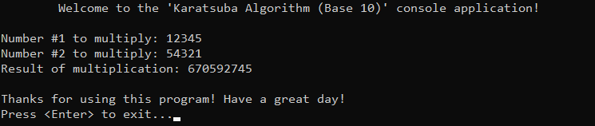

# &#128209; Table of Contents
- [💡 Overview](#-overview)
  - [Introduction](#introduction)
  - [Important Details](#important-details)
  - [Algorithm Steps](#algorithm-steps)
- [💻 Implementation](#-implementation)
  - [Design Decisions](#design-decisions)
  - [Complete Implementation](#complete-implementation)
  - [Detailed Walkthrough](#detailed-walkthrough)
- [📊 Analysis](#-analysis)
- [📝 Application](#-application)
  - [Common Use Cases](#common-use-cases)
  - [Some Practical Problems](#some-practical-problems)
- [🕙 Origins](#-origins)
- [🤝 Contributing](#-contributing)
- [📧 Contacts](#-contacts)
- [🙏 Credits](#-credits)
- [🔏 License](#-license)


# &#128161; Overview
The **Karatsuba Algorithm** is a multiplication algorithm, known for reducing the time complexity of this operation. It is named after its inventor, Anatoly Alexeyevich Karatsuba. Knowledge and understanding of it teaches the core principles of the divide-and-conquer paradigm, while also enhancing ability to approach algorithmic design with broader and more effective strategies.
<p align="center"></p>


## Introduction
**Karatsuba Algorithm** recursively splits the numbers into higher-order and lower-order halves. Normally, this would require 4 multiplications, but by cleverly substituting one of the multiplications with a combination of additions and subtractions, the algorithm reduces the number of multiplications to 3. This reduction leads to a faster overall time complexity, as multiplication dominates the computation cost.


## Important Details
1. While Karatsuba is efficient for large numbers, for very large numbers (beyond the capacity of built-in data types), arbitrary precision arithmetic is required to handle numbers with thousands of digits by dynamically managing memory. Alternatively, more advanced algorithms like Schönhage–Strassen may be used for even greater efficiency.


## Algorithm Steps
1. If either number (`a` or `b`) is less than 10, return the result of their direct multiplication ($a×b$).
2. Calculate the number of digits in the larger number and divide it by $2$ to determine where to split the numbers.
3. Divide both initial numbers (`a` or `b`) into higher-order and lower-order halves via previously computed half.
   - higher-order halves (`aHighHalf` and `bHighHalf`) are calculated via division by $10^{\text{half}}$
   - lower-order halves (`aLowHalf` and `bLowHalf`) are calculated as remainder from division by $10^{\text{half}}$ 
4. Recursively multiply:
   - lower-order halves $z_0 = \text{aLowHalf} \cdot \text{bLowHalf}$
   - cross terms $z_1 = (\text{aLowHalf} + \text{aHighHalf}) \cdot (\text{bLowHalf} + \text{bHighHalf})$
   - higher-order halves $z_2 = \text{aHighHalf} \cdot \text{bHighHalf}$
5. Combine the results via formula: $z_2 \cdot 10^{2 \cdot \text{half}} + (z_1 - z_2 - z_0) \cdot 10^{\text{half}} + z_0$


# &#x1F4BB; Implementation
The program prompts the user to enter two numbers, multiplies them using the Karatsuba Algorithm, and displays the result.
<p align="center"></p>


## Design Decisions
To prioritize simplicity and emphasize algorithm itself, several design decisions were made:
- Using the highest possible built-in data type, `unsigned long long`.
- Limiting the operation only to positive numbers.
- Assuming valid input values from the user.
- Omitting certain optimizations to the algorithm.


## Complete Implementation
The Karatsuba algorithm is implemented within the `karatsuba()` function and its helper one,  `countDigits()`, both declared in `KaratsubaAlgorithm.h` header file and defined in `KaratsubaAlgorithm.cpp` source file. This approach is adopted to ensure encapsulation, modularity and compilation efficiency. The multiplication operation is examined within the `main()` function located in the `Main.cpp` file. Below you can find related code snippets.

```cpp
unsigned long long karatsuba(unsigned long long a, unsigned long long b) {
	if (a < 10 || b < 10) { return a * b; }

	int digitsInLarger = (countDigits(a) > countDigits(b)) ? countDigits(a) : countDigits(b);
	int half = digitsInLarger / 2;

	unsigned long long aHighHalf = a / (unsigned long long)pow(10, half); // 123456 / 10^3 = 123
	unsigned long long aLowHalf = a % (unsigned long long)pow(10, half); // 123456 % 10^3 = 456
	unsigned long long bHighHalf = b / (unsigned long long)pow(10, half);
	unsigned long long bLowHalf = b % (unsigned long long)pow(10, half);

	unsigned long long lowPart = karatsuba(aLowHalf, bLowHalf);
	unsigned long long crossPart = karatsuba((aLowHalf + aHighHalf), (bLowHalf + bHighHalf));
	unsigned long long highPart = karatsuba(aHighHalf, bHighHalf);

	return highPart * pow(10, 2 * half) + (crossPart - highPart - lowPart) * pow(10, half) + lowPart;
}
```


## Detailed Walkthrough 
Currently in Progress...


# &#128202; Analysis
Currently in Progress...


# &#128221; Application
Currently in Progress...


## Common Use Cases
Currently in Progress...


## Some Practical Problems
Currently in Progress...


# &#x1F559; Origins
Currently in Progress...


# &#129309; Contributing
Contributions are highly appreciated! For detailed guidelines, please refer to the [root directory's contributing section](../../../#-contributing).


# &#128231; Contacts
For contact details and additional information, please refer to the [root directory's contact information section](../../../#-contacts).


# &#128591; Credits
&#128218; **Books:**
- **"Data Structures and Algorithm Analysis in C++" (4th Edition)** — by Mark Allen Weiss
  - Section 10.2.4: Theoretical Improvements for Arithmetic Problems
- **"The Art of Computer Programming, Volume 2: Seminumerical Algorithms" (3rd Edition)** — by Donald Ervin Knuth
  - Section 4.3.3: How Fast Can We Multiply?

---
&#127760; **Web-Resources:**  
- [Karatsuba Algorithm](https://en.wikipedia.org/wiki/Karatsuba_algorithm) (Wikipedia)
- [Karatsuba Algorithm](https://youtu.be/m9yO12Zlb1g?si=K4SSGMbXjzwv2ilF) (Video-Lecture)


# &#128271; License
This project is licensed under the MIT License — see the [LICENSE](https://github.com/vezzolter/DSA/blob/main/LICENSE) file for details.

[](https://opensource.org/licenses/MIT)