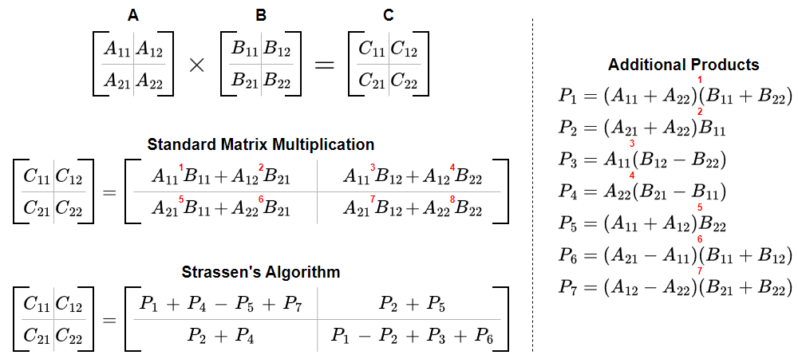
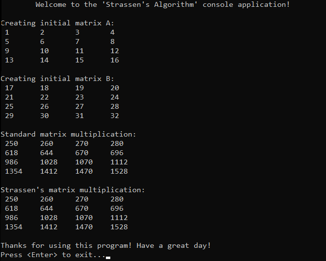

# &#128209; Table of Contents
- [💡 Overview](#-overview)
  - [Introduction](#introduction)
  - [Important Details](#important-details)
  - [Algorithm Steps (for matrices of size $2^n$)](#algorithm-steps-for-matrices-of-size-2n)
- [💻 Implementation](#-implementation)
  - [Design Decisions](#design-decisions)
  - [Complete Implementation](#complete-implementation)
  - [Detailed Walkthrough](#detailed-walkthrough)
- [📊 Analysis](#-analysis)
  - [Advantages](#advantages)
  - [Disadvantages](#disadvantages)
- [📝 Application](#-application)
  - [Common Use Cases](#common-use-cases)
  - [Some Practical Problems](#some-practical-problems)
- [🕙 Origins](#-origins)
- [🤝 Contributing](#-contributing)
- [📧 Contacts](#-contacts)
- [🙏 Credits](#-credits)
- [🔏 License](#-license)


# &#128161; Overview
The **Stassen's Algorithm** is undoubtedly a well-known algorithm for matrix multiplication, heavily reliant on the idea of divide-and-conquer approach. This subsection aims to establish a solid foundation for complex algorithmic designs and strengthen comprehension of problem-solving strategies by exploring this illustrative example.
<p align="center"></p>


## Introduction
The core idea behind Strassen's algorithm was to use a divide-and-conquer strategy, which involves recursively dividing the initial matrix into equal-sized submatrices, and employing additional computations and rearrangements of matrix elements to reduce the number of multiplications to $7$, compared to the standard mathematical algorithm with $8$, which is the dominant factor contributing to the overall time complexity. This reduction could lead to computational savings, as it transitions the whole operation's time complexity from $O(n^3)$ to $O(n^{2.81})$, which is particularly valuable for large matrices.


## Important Details
1. To ensure proper division, this algorithm requires that all matrices be of sizes that are powers of two. Although it is possible to pad «missing» rows and columns with zeros to meet this requirement, doing so adds significant complexity to the algorithm. As a result, this method is rarely implemented and is usually only mentioned in discussions.
2. The algorithm struggles with precision for floating-point numbers due to the nature of its computations, which can lead to numerical instability.
3. The algorithm's benefits are most evident within a specific range of matrix sizes. Its performance is relative and depends on factors such as hardware architecture, implementation details, and the characteristics of the matrices being multiplied. Generally, the optimal size range falls between $32$ and $128$ for most modern computing environments.


## Algorithm Steps (for matrices of size $2^n$)
1. Divide two matrices $A$ and $B$ of size $n×n$ into four submatrices of sizes $n/2$.
2. Compute the intermediate submatrix products:
   - $P_{1} = (A_{11} + A_{22})(B_{11} + B_{22})$
   - $P_{2} = (A_{21} + A_{22}) B_{11}$
   - $P_{3} = A_{11}(B_{12} + B_{22})$
   - $P_{4} = A_{22}(B_{21} + B_{11})$
   - $P_{5} = (A_{11} + A_{12})B_{22}$
   - $P_{6} = (A_{21} + A_{11})(B_{11} + B_{12})$
   - $P_{7} = (A_{12} + A_{22})(B_{21} + B_{22})$
3. Compute the resulting submatrices of the product matrix $C$:
   - $C_{11} = P_{1} + P_{4} - P_{5} + P_{7}$
   - $C_{11} = P_{3} + P_{5}$
   - $C_{21} = P_{2} + P_{5}$
   - $C_{22} = P_{1} + P_{3} + P_{2} + P_{6}$
4. Combine the resulting submatrices to form the final product of matrix $C$.


# &#x1F4BB; Implementation
The program initializes each matrix A and B as a vector of vectors with specified integers, performs their multiplication using the standard algorithm and Strassen's algorithm, and displays the results in order to compare them.
<p align="center"></p>


## Design Decisions
To prioritize simplicity and emphasize algorithm itself, several design decisions were made:
- Utilizing the library container `std::vector` as a building block for matrices.
- Assuming that each matrix will be a size that is a power of two.
- Performing multiplication exclusively on integer numbers.
- Omitting certain optimizations to the algorithm.

## Complete Implementation
Strassen's algorithm implemented within the `strassensAlgorithm()` with additional functions `addMatrices()` and `subtractMatrices()`, which are declared in `StrassensAlgorithm.h` header file and defined in `StrassensAlgorithm.cpp` source file. This approach is adopted to ensure encapsulation, modularity and compilation efficiency. Examination of the multiplication is conducted within the `main()` function located in the `Main.cpp` file.

```cpp
using Matrix = std::vector<std::vector<int>>;


Matrix addMatrices(const Matrix& A, const Matrix& B) {
    int n = A.size();
    Matrix C(n, std::vector<int>(n, 0));
    for (int i = 0; i < n; i++) {
        for (int j = 0; j < n; j++) {
            C[i][j] = A[i][j] + B[i][j];
        }
    }
    return C;
}

Matrix subtractMatrices(const Matrix& A, const Matrix& B) {
    int n = A.size();
    Matrix C(n, std::vector<int>(n, 0));
    for (int i = 0; i < n; i++) {
        for (int j = 0; j < n; j++) {
            C[i][j] = A[i][j] - B[i][j];
        }
    }
    return C;
}

Matrix strassensAlgorithm(const Matrix& A, const Matrix& B) {
    int n = A.size();
    if (n == 1) {
        Matrix C(1, std::vector<int>(1));
        C[0][0] = A[0][0] * B[0][0];
        return C;
    } else {
        int half = n / 2;

        Matrix A11(half, std::vector<int>(half));
        Matrix A12(half, std::vector<int>(half));
        Matrix A21(half, std::vector<int>(half));
        Matrix A22(half, std::vector<int>(half));
        Matrix B11(half, std::vector<int>(half));
        Matrix B12(half, std::vector<int>(half));
        Matrix B21(half, std::vector<int>(half));
        Matrix B22(half, std::vector<int>(half));

        for (int i = 0; i < half; i++) {
            for (int j = 0; j < half; j++) {
                A11[i][j] = A[i][j];
                A12[i][j] = A[i][j + half];
                A21[i][j] = A[i + half][j];
                A22[i][j] = A[i + half][j + half];
                B11[i][j] = B[i][j];
                B12[i][j] = B[i][j + half];
                B21[i][j] = B[i + half][j];
                B22[i][j] = B[i + half][j + half];
            }
        }

        Matrix P1 = strassensAlgorithm(addMatrices(A11, A22), addMatrices(B11, B22));
        Matrix P2 = strassensAlgorithm(addMatrices(A21, A22), B11);
        Matrix P3 = strassensAlgorithm(A11, subtractMatrices(B12, B22));
        Matrix P4 = strassensAlgorithm(A22, subtractMatrices(B21, B11));
        Matrix P5 = strassensAlgorithm(addMatrices(A11, A12), B22);
        Matrix P6 = strassensAlgorithm(subtractMatrices(A21, A11), addMatrices(B11, B12));
        Matrix P7 = strassensAlgorithm(subtractMatrices(A12, A22), addMatrices(B21, B22));

        Matrix C11 = addMatrices(subtractMatrices(addMatrices(P1, P4), P5), P7);
        Matrix C12 = addMatrices(P3, P5);
        Matrix C21 = addMatrices(P2, P4);
        Matrix C22 = addMatrices(subtractMatrices(addMatrices(P1, P3), P2), P6);

        Matrix C(n, std::vector<int>(n));
        for (int i = 0; i < half; i++) {
            for (int j = 0; j < half; j++) {
                C[i][j] = C11[i][j];
                C[i][j + half] = C12[i][j];
                C[i + half][j] = C21[i][j];
                C[i + half][j + half] = C22[i][j];
            }
        }
        return C;
    }
}
```

## Detailed Walkthrough 
1. The Strassen's algorithm starts with setting up the base case for recursion, which checks if the size equals to $1$, if so, it performs a simple multiplication of the single elements and returns the result.
```cpp
  int n = A.size();
  if (n == 1) {
    Matrix C(1, std::vector<int>(1));
    C[0][0] = A[0][0] * B[0][0];
    return C;
  }
```
2. If the matrices are larger than $1×1$, it divides both matrices $A$ and $B$ into four submatrices respectively ($A_{11}, A_{12}, A_{21}, A_{22}$ and $B_{11}, B_{12}, B_{21}, B_{22}$). First it calculates the half, creates matrices of this size, and fills them with corresponding elements within the original ones using the `half` to navigate.
```cpp
  int half = n / 2;
  
  Matrix A11(half, std::vector<int>(half));
  Matrix A12(half, std::vector<int>(half));
  Matrix A21(half, std::vector<int>(half));
  Matrix A22(half, std::vector<int>(half));
  Matrix B11(half, std::vector<int>(half));
  Matrix B12(half, std::vector<int>(half));
  Matrix B21(half, std::vector<int>(half));
  Matrix B22(half, std::vector<int>(half));

  for (int i = 0; i < half; i++) {
    for (int j = 0; j < half; j++) {
      A11[i][j] = A[i][j];
      A12[i][j] = A[i][j + half];
      A21[i][j] = A[i + half][j];
      A22[i][j] = A[i + half][j + half];
      B11[i][j] = B[i][j];
      B12[i][j] = B[i][j + half];
      B21[i][j] = B[i + half][j];
      B22[i][j] = B[i + half][j + half];
      }
  }
```
3. Then algorithm simply computes the intermediate submatrix products using formulas discussed previously.
```cpp
  Matrix P1 = strassensAlgorithm(addMatrices(A11, A22), addMatrices(B11, B22));
  Matrix P2 = strassensAlgorithm(addMatrices(A21, A22), B11);
  Matrix P3 = strassensAlgorithm(A11, subtractMatrices(B12, B22));
  Matrix P4 = strassensAlgorithm(A22, subtractMatrices(B21, B11));
  Matrix P5 = strassensAlgorithm(addMatrices(A11, A12), B22);
  Matrix P6 = strassensAlgorithm(subtractMatrices(A21, A11), addMatrices(B11, B12));
  Matrix P7 = strassensAlgorithm(subtractMatrices(A12, A22), addMatrices(B21, B22));
```
4. By the analogue, it computes the submatrices out of products.
```cpp
  Matrix C11 = addMatrices(subtractMatrices(addMatrices(P1, P4), P5), P7);
  Matrix C12 = addMatrices(P3, P5);
  Matrix C21 = addMatrices(P2, P4);
  Matrix C22 = addMatrices(subtractMatrices(addMatrices(P1, P3), P2), P6);
```
5. Finally, algorithm combines previous submatrices by assembling the resulting one.
```cpp
  Matrix C(n, std::vector<int>(n));
  for (int i = 0; i < half; i++) {
    for (int j = 0; j < half; j++) {
      C[i][j] = C11[i][j];
      C[i][j + half] = C12[i][j];
      C[i + half][j] = C21[i][j];
      C[i + half][j + half] = C22[i][j];
    }
  }
  return C;
```


# &#128202; Analysis
Analyzing the gives and takes of the algorithm reveals how the divide-and-conquer concept influences design choices, efficiency, and overall complexity. Mastering this approach not only improves performance in large-scale problems but also provides foundational insights applicable to various algorithmic strategies.


## Advantages
- **Asymptotic Improvement** — algorithm reduces the number of multiplications, resulting in a better time complexity of $O(n^{2.81})$ compared to the standard one  $O(n^{3})$.


## Disadvantages
- **Overhead** — algorithm requires extra additions and subtractions, as well as recursively partitioning the matrices and respective memory operations, which can outweigh its benefits quite often in practice.
- **Accuracy Issues** — algorithm involves more floating-point operations compared to the traditional version, which can introduce numerical instability and rounding errors, especially in the long run.
- **Size Requirements** — algorithm typically requires matrices to be of size of a power of two for efficient recursion, which is not often the case in day-to-day scenarios, and fixing it could add extra overhead to an already existing one.
- **Implementation Complexity** — algorithm contains lots of implementation intricacies, making it not as convenient as the standard one.


# &#128221; Application
Understanding some of the most well-known use cases of an algorithm is crucial for grasping its practical relevance and potential impact in real-world scenarios. While there aren’t specific problems designed to practice this exact algorithm, the concept of divide-and-conquer it implements is essential for solving many foundational challenges that rely on breaking problems down into smaller and manageable parts, applicable across various algorithms.


## Common Use Cases
- **Educational Context** — algorithm is used as a learning tool in many educational resources. While the main benefit of improved asymptotic notation can be overshadowed by the overhead associated with the algorithm, the visualization it provides effectively illustrates how to apply the divide-and-conquer strategy.


## Some Practical Problems
1. None


# &#x1F559; Origins
The idea of this algorithm dates back to **1969**, when the well-known German mathematician **Volker Strassen** developed the first program for performing matrix multiplication faster than the $O(n^3)$ time bound that would result from a standard method. This invention represented an important theoretical breakthrough in the history of computer science, demonstrating that even when a problem seems to have a fixed time complexity, nothing is certain until proven.


# &#129309; Contributing
Contributions are highly appreciated! For detailed guidelines, please refer to the [root directory's contributing section](../../../#-contributing).


# &#128231; Contacts
For contact details and additional information, please refer to the [root directory's contact information section](../../../#-contacts).


# &#128591; Credits
&#128218; **Books:**
- **"Introduction to Algorithms" (3rd Edition)** — by Thomas H. Cormen, Charles E. Leiserson, Ronald L. Rivest and Clifford Stein
  - Section 4: Divide-and-Conquer
- **"Data Structures and Algorithm Analysis in C++" (4th Edition)** — by Mark Allen Weiss
  - Section 10.2: Divide and Conquer
- **"The Algorithm Design Manual" (2nd Edition)** — by Steven Skiena
  - Section 4.10: Divide-and-Conquer
- **"The Art of Computer Programming, Volume 2: Seminumerical Algorithms" (3rd Edition)** — by Donald Ervin Knuth
  - Section 4.6.4: Evaluation of Polynomials

---  
&#127760; **Web-Resources:**  
- [Strassen algorithm](https://en.wikipedia.org/wiki/Strassen_algorithm) (Wikipedia)
- [Strassen's Algorithm](https://www.youtube.com/watch?v=D1GRgMfeRNk&ab_channel=%D0%9A%D0%B0%D1%84%D0%B5%D0%B4%D1%80%D0%B0%D0%91%D0%98%D0%A1) (Video-Lecture)


# &#128271; License
This project is licensed under the MIT License — see the [LICENSE](https://github.com/vezzolter/DSA/blob/main/LICENSE) file for details.

[](https://opensource.org/licenses/MIT)