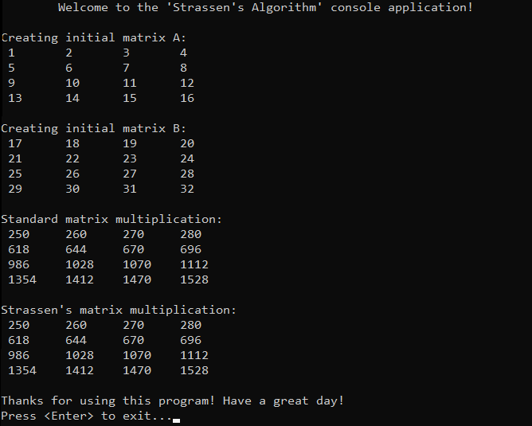

# &#128209; Table of Contents
- [💡 Overview](#-overview)
- [💻 Implementation](#-implementation)
- [📊 Analysis](#-analysis)
- [📝 Application](#-application)
- [⏳ Origins](#-origins)
- [🤝 Contributing](#-contributing)
- [📧 Contacts](#-contacts)
- [🙏 Credits](#-credits)
- [🔏 License](#-license)


# &#128161; Overview
The **Stassen's Algorithm** is undoubtedly a well-known algorithm for matrix multiplication, heavily reliant on the idea of divide and conquer approach. This subsection aims to establish a solid foundation for complex algorithmic designs and strengthen comprehension of problem-solving strategies by exploring this illustrative example.
<p align="center"></p>

---
The core idea behind Strassen's algorithm was to use a divide-and-conquer strategy, which involves recursively dividing the initial matrix into equal-sized submatrices, and employing additional computations and rearrangements of matrix elements to reduce the number of multiplications to $7$, compared to the standard mathematical algorithm with $8$, which is the dominant factor contributing to the overall time complexity. This reduction could lead to computational savings, as it transitions the whole operation's time complexity from $O(n^3)$ to $O(n^{2.81})$, which is particularly valuable for large matrices. However, the overhead that comes with the implementation negatively affects smaller matrices. Determining the optimal range for matrix size is relative and depends on hardware architecture, implementation details, and specific characteristics of the matrices being multiplied. As a general estimation, the optimal range typically falls between $32$ and $128$ for most modern computing environments. Also, it is crucial to mention not the best precision for floating numbers due to the nature of its computation.

> Note: To ensure the division proceeds correctly, this algorithm conceptually requires that all of the matrices have sizes that are powers of two. Even though it is possible to fill "missing" rows and columns with zeros to achieve required matrices, for educational purposes it would only obscure the concept with excessive operations (and practically I haven't seen people do that at all).

---
**Algorithm Steps (for matrices with sizes of powers of two):**
1. Divide two matrices $A$ and $B$ of size $n×n$ into four submatrices of sizes $n/2$.
2. Compute the intermediate submatrix products:
   - $P_{1} = (A_{11} + A_{22})(B_{11} + B_{22})$
   - $P_{2} = (A_{21} + A_{22}) B_{11}$
   - $P_{3} = A_{11}(B_{12} + B_{22})$
   - $P_{4} = A_{22}(B_{21} + B_{11})$
   - $P_{5} = (A_{11} + A_{12})B_{22}$
   - $P_{6} = (A_{21} + A_{11})(B_{11} + B_{12})$
   - $P_{7} = (A_{12} + A_{22})(B_{21} + B_{22})$
3. Compute the resulting submatrices of the product matrix $C$:
   - $C_{11} = P_{1} + P_{4} - P_{5} + P_{7}$
   - $C_{11} = P_{3} + P_{5}$
   - $C_{21} = P_{2} + P_{5}$
   - $C_{22} = P_{1} + P_{3} + P_{2} + P_{6}$
4. Combine the resulting submatrices to form the final product of matrix $C$.


# &#x1F4BB; Implementation
The program initializes each matrix A and B as a vector of vectors with specified integers, performs their multiplication using the standard algorithm and Strassen's algorithm, and displays the results in order to compare them.
<p align="center"></p>

To prioritize simplicity and emphasize algorithm itself, several design decisions were made:
- Utilizing the library container `std::vector` as a building block for matrices.
- Assuming that each matrix will be a size that is a power of two.
- Performing multiplication exclusively on integer numbers.
- Omitting certain optimizations to the algorithm.

---
Strassen's algorithm implemented within the `strassensAlgorithm()` with additional functions `addMatrices()` and `subtractMatrices()`, which are declared in `StrassensAlgorithm.h` header file and defined in `StrassensAlgorithm.cpp` source file. This approach is adopted to ensure encapsulation, modularity and compilation efficiency. Examination of the multiplication is conducted within the `main()` function located in the `Main.cpp` file.

**Complete Implementation:**
```cpp
using Matrix = std::vector<std::vector<int>>;


Matrix addMatrices(const Matrix& A, const Matrix& B) {
    int n = A.size();
    Matrix C(n, std::vector<int>(n, 0));
    for (int i = 0; i < n; i++) {
        for (int j = 0; j < n; j++) {
            C[i][j] = A[i][j] + B[i][j];
        }
    }
    return C;
}

Matrix subtractMatrices(const Matrix& A, const Matrix& B) {
    int n = A.size();
    Matrix C(n, std::vector<int>(n, 0));
    for (int i = 0; i < n; i++) {
        for (int j = 0; j < n; j++) {
            C[i][j] = A[i][j] - B[i][j];
        }
    }
    return C;
}

Matrix strassensAlgorithm(const Matrix& A, const Matrix& B) {
    int n = A.size();
    if (n == 1) {
        Matrix C(1, std::vector<int>(1));
        C[0][0] = A[0][0] * B[0][0];
        return C;
    }
    else {
        int half = n / 2;

        Matrix A11(half, std::vector<int>(half));
        Matrix A12(half, std::vector<int>(half));
        Matrix A21(half, std::vector<int>(half));
        Matrix A22(half, std::vector<int>(half));
        Matrix B11(half, std::vector<int>(half));
        Matrix B12(half, std::vector<int>(half));
        Matrix B21(half, std::vector<int>(half));
        Matrix B22(half, std::vector<int>(half));

        for (int i = 0; i < half; i++) {
            for (int j = 0; j < half; j++) {
                A11[i][j] = A[i][j];
                A12[i][j] = A[i][j + half];
                A21[i][j] = A[i + half][j];
                A22[i][j] = A[i + half][j + half];
                B11[i][j] = B[i][j];
                B12[i][j] = B[i][j + half];
                B21[i][j] = B[i + half][j];
                B22[i][j] = B[i + half][j + half];
            }
        }

        Matrix P1 = strassensAlgorithm(addMatrices(A11, A22), addMatrices(B11, B22));
        Matrix P2 = strassensAlgorithm(addMatrices(A21, A22), B11);
        Matrix P3 = strassensAlgorithm(A11, subtractMatrices(B12, B22));
        Matrix P4 = strassensAlgorithm(A22, subtractMatrices(B21, B11));
        Matrix P5 = strassensAlgorithm(addMatrices(A11, A12), B22);
        Matrix P6 = strassensAlgorithm(subtractMatrices(A21, A11), addMatrices(B11, B12));
        Matrix P7 = strassensAlgorithm(subtractMatrices(A12, A22), addMatrices(B21, B22));

        Matrix C11 = addMatrices(subtractMatrices(addMatrices(P1, P4), P5), P7);
        Matrix C12 = addMatrices(P3, P5);
        Matrix C21 = addMatrices(P2, P4);
        Matrix C22 = addMatrices(subtractMatrices(addMatrices(P1, P3), P2), P6);

        Matrix C(n, std::vector<int>(n));
        for (int i = 0; i < half; i++) {
            for (int j = 0; j < half; j++) {
                C[i][j] = C11[i][j];
                C[i][j + half] = C12[i][j];
                C[i + half][j] = C21[i][j];
                C[i + half][j + half] = C22[i][j];
            }
        }
        return C;
    }
}
```

---
**Detailed Walkthrough:**  
1. The Strassen's algorithm starts with setting up the base case for recursion, which checks if the size equals to $1$, if so, it performs a simple multiplication of the single elements and returns the result.
```cpp
  int n = A.size();
  if (n == 1) {
    Matrix C(1, std::vector<int>(1));
    C[0][0] = A[0][0] * B[0][0];
    return C;
  }
```
2. If the matrices are larger than $1×1$, it divides both matrices $A$ and $B$ into four submatrices respectively ($A_{11}, A_{12}, A_{21}, A_{22}$ and $B_{11}, B_{12}, B_{21}, B_{22}$). First it calculates the half, creates matrices of this size, and fills them with corresponding elements within the original ones using the `half` to navigate.
```cpp
  int half = n / 2;
  
  Matrix A11(half, std::vector<int>(half));
  Matrix A12(half, std::vector<int>(half));
  Matrix A21(half, std::vector<int>(half));
  Matrix A22(half, std::vector<int>(half));
  Matrix B11(half, std::vector<int>(half));
  Matrix B12(half, std::vector<int>(half));
  Matrix B21(half, std::vector<int>(half));
  Matrix B22(half, std::vector<int>(half));

  for (int i = 0; i < half; i++) {
    for (int j = 0; j < half; j++) {
      A11[i][j] = A[i][j];
      A12[i][j] = A[i][j + half];
      A21[i][j] = A[i + half][j];
      A22[i][j] = A[i + half][j + half];
      B11[i][j] = B[i][j];
      B12[i][j] = B[i][j + half];
      B21[i][j] = B[i + half][j];
      B22[i][j] = B[i + half][j + half];
      }
  }
```
3. Then algorithm simply computes the intermediate submatrix products using formulas discussed previously.
```cpp
  Matrix P1 = strassensAlgorithm(addMatrices(A11, A22), addMatrices(B11, B22));
  Matrix P2 = strassensAlgorithm(addMatrices(A21, A22), B11);
  Matrix P3 = strassensAlgorithm(A11, subtractMatrices(B12, B22));
  Matrix P4 = strassensAlgorithm(A22, subtractMatrices(B21, B11));
  Matrix P5 = strassensAlgorithm(addMatrices(A11, A12), B22);
  Matrix P6 = strassensAlgorithm(subtractMatrices(A21, A11), addMatrices(B11, B12));
  Matrix P7 = strassensAlgorithm(subtractMatrices(A12, A22), addMatrices(B21, B22));
```
4. By the analogue, it computes the submatrices out of products.
```cpp
  Matrix C11 = addMatrices(subtractMatrices(addMatrices(P1, P4), P5), P7);
  Matrix C12 = addMatrices(P3, P5);
  Matrix C21 = addMatrices(P2, P4);
  Matrix C22 = addMatrices(subtractMatrices(addMatrices(P1, P3), P2), P6);
```
5. Finally, algorithm combines previous submatrices by assembling the resulting one.
```cpp
  Matrix C(n, std::vector<int>(n));
  for (int i = 0; i < half; i++) {
    for (int j = 0; j < half; j++) {
      C[i][j] = C11[i][j];
      C[i][j + half] = C12[i][j];
      C[i + half][j] = C21[i][j];
      C[i + half][j + half] = C22[i][j];
    }
  }
  return C;
```


# &#128202; Analysis
Currently in Progress...


# &#128221; Application
Currently in Progress...


# &#x23F3; Origins
Currently in Progress...


# &#129309; Contributing
Contributions are highly appreciated! For detailed guidelines, please refer to the [root directory's contributing section](../../../#-contributing).


# &#128231; Contacts
For contact details and additional information, please refer to the [root directory's contact information section](../../../#-contacts).


# &#128591; Credits
&#128218; **Books:**
- **"Introduction to Algorithms" (3rd Edition)** — by Thomas H. Cormen, Charles E. Leiserson, Ronald L. Rivest and Clifford Stein
  - Section 4: Divide-and-Conquer
- **"Data Structures and Algorithm Analysis in C++" (4th Edition)** — by Mark Allen Weiss
  - Section 10.2: Divide and Conquer
- **"The Algorithm Design Manual" (2nd Edition)** — by Steven Skiena
  - Section 4.10: Divide-and-Conquer

---  
&#127760; **Web-Resources:**  
- [Strassen algorithm](https://en.wikipedia.org/wiki/Strassen_algorithm) (Wikipedia)
- [Strassen's Algorithm](https://www.youtube.com/watch?v=D1GRgMfeRNk&ab_channel=%D0%9A%D0%B0%D1%84%D0%B5%D0%B4%D1%80%D0%B0%D0%91%D0%98%D0%A1) (Lecture)


# &#128271; License
This project is licensed under the MIT License — see the [LICENSE](https://github.com/vezzolter/DSA/blob/main/LICENSE) file for details.

[](https://opensource.org/licenses/MIT)