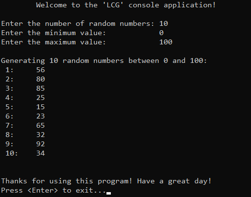

# 📑 Table of Contents
- [💡 Overview](#-overview)
  - [Introduction](#introduction)
  - [Important Details](#important-details)
  - [Algorithm Steps](#algorithm-steps)
- [💻 Implementation](#-implementation)
  - [Design Decisions](#design-decisions)
  - [Complete Implementation](#complete-implementation)
  - [Detailed Walkthrough](#detailed-walkthrough)
- [📊 Analysis](#-analysis)
  - [Algorithm Characteristics](#algorithm-characteristics)
  - [Algorithm Comparison](#algorithm-comparison)
- [📝 Application](#-application)
  - [Common Use Cases](#common-use-cases)
- [🕙 Origins](#-origins)
- [🤝 Contributing](#-contributing)
- [📧 Contacts](#-contacts)
- [🙏 Credits](#-credits)
- [🔏 License](#-license)


# 💡 Overview
The **Linear Congruential Generator (LCG)** is a simple, pretty deterministic and widely used algorithm for generating pseudo-random numbers. The name of it  derives from its core operation, which involves a linear congruence equation to produce the next number in the sequence. Knowledge and understanding of it lay a solid foundation for algorithmic design and tackling more complex problem-solving strategies.
<p align="center"></p>


## Introduction
LCG operates iteratively, at each step it takes the current number (initially its a seed) and generates the next number using a linear congruence equation of the form:  
$$X_{n+1} = (a \times X_n + c) \mod m$$

Where:
- $n$ — current number (initially its a seed).
- $m$ — modulus, determines the range of possible values that LCG can generate ($0$ to $m-1$).
- $a$ — multiplier, ensures good distribution of values across the range.
- $c$ — increment, ensures that the sequence doesn't repeat too soon.


## Important Details
1. Algorithm is highly depended on choosing correct parameters in order to elicit a great sequence in terms of randomness:
   - $m$ typically should be a power of $2$, because it allows for efficient computation using bitwise operations and covers the entire possible value set for typical data type like 32-bit or 64-bit integers.  
   E.g. $m = 2^{32} = 4294967296$; $m = 2^{64} = 18446744073709551616$.

   - $a-1$ should be divisible by all prime factors of $m$, because this is one of the great ways for the LCG to traverse through the entire range of possible values without skipping any.   
   E.g. $a = 1664525$; $a = 6364136223846793005$.

   - $c$ should be relatively prime to $m$, because if $c$ and $m$ share a common factor greater than $1$, the sequence could become trapped in a small subset of possible values, repeating more frequently and failing to achieve a full period.   
   E.g. $c = 1013904223$, $c = 1442695040888963407$.
2. The term _«multiplicative»_ congruential method is often used to refer to sequences where $c = 0$, while the term _«mixed»_ congruential method applies where $c \neq 0$.


> **Note:** For detailed guidance on picking the right values for the parameters, I recommend referring to «The Art of Computer Programming, Volume 2: Seminumerical Algorithms» by D. E. Knuth.


## Algorithm Steps
1. Define parameters according to the chosen criteria.
2. Use the formula to generate the pseudo-random number.
3. Update the seed for the next iteration ($X_n\text{ to }X_{n+1}$).
4. Repeat this process to generate required amount of numbers.


# &#x1F4BB; Implementation
The program initializes an array with specified integers, prompts the user to enter the value of a target element, performs a search using the interpolation search algorithm. It then displays the result, indicating whether the search was successful (element found) or not (element not found).
<p align="center"></p>


## Design Decisions
To prioritize simplicity and emphasize algorithm itself, several design decisions were made:
- Using fixed seed value to ensure reproducible results.
- Assuming valid input values from the user.
- Omitting certain optimizations to the algorithm.
- Choosing range values that are easily interpretable by humans ($0-100$).
- Limiting the number of elements to relatively small ($10$).


## Complete Implementation
PRNG is implemented within the function `lcg()` (and parameters as global variables), which is declared in `LCG.h` header file and defined in `LCG.cpp` source file. This approach is adopted to ensure encapsulation, modularity and compilation efficiency. Examination of generated values is conducted within the `main()` function located in the `Main.cpp` file. Below you can find related code snippets.

```cpp
const unsigned long long a = 1664525;          // Multiplier
const unsigned long long c = 1013904223;       // Increment
const unsigned long long m = 4294967296;       // Modulus (2^32)
unsigned long long seed = 12345;               // Initial seed

unsigned long long lcg() {
    seed = (a * seed + c) % m;
    return seed;
}
```


## Detailed Walkthrough
1. Begin by setting up the necessary parameters for the LCG.
```cpp
  const unsigned long long a = 1664525;          // Multiplier
  const unsigned long long c = 1013904223;       // Increment
  const unsigned long long m = 4294967296;       // Modulus (2^32)
  unsigned long long seed = 12345;               // Initial seed
```
2. Use the LCG formula to transform the seed into a pseudo-random number. This step not only produces the next number in the sequence but also updates the seed, ensuring it’s ready for generating the subsequent value in the next iteration.
```cpp
  seed = (a * seed + c) % m;
```
3. The resulting value from the LCG formula is returned. While this value alone might not be directly useful, it serves as the foundation for further modifications or range adjustments. The core algorithm effectively ends here.
```cpp
  return seed;
```
4. To make the generated value more practical and human-readable, a user-defined range can be applied. The range is defined by `maxVal` and `minVal`, which translates to `[minVal, maxVal)` and adding $1$ ensures inclusivity of the maximum value, resulting in the range `[minVal, maxVal]`. The modulo operator is then used to confine the LCG output within `[0, range]`. Adding `minVal` shifts the range to `[minVal, maxVal]`, ensuring the final value is within the user’s desired range, therefore can be tested easily.
```cpp
	for (int i = 0; i < numbers; i++)
		std::cout << " " << i + 1 << ":\t" << (minVal + (lcg() % (maxVal - minVal + 1))) << std::endl;
```


# &#128202; Analysis
Will be updated in future...


## Algorithm Characteristics
Will be updated in future...


## Algorithm Comparison
Will be updated in future...


# &#128221; Application
Understanding some of the most well-known use cases of an algorithm is crucial for grasping its practical relevance and potential impact in real-world scenarios. 


## Common Use Cases
- **Basic Randomness Generation** — algorithm is primarily used in situations where just enough randomness is needed for non-critical parts of an application. Its simple implementation and sufficient efficiency make it ideal for simulating random behavior or generating varied outputs without the overhead of more complex algorithms.


# &#x1F559; Origins
The development of electronic computing spurred innovations like **Derrick Henry Lehmer's** **1949** Lehmer generator, a precursor to the LCG, which utilized modular arithmetic to create reproducible random sequences. In **1958**, **W. E. Thomson** and **A. Rotenberg** formalized the LCG, providing a simple yet effective tool that could be easily implemented on early computers. This advancement was crucial at a time when computational resources were limited, and there was a growing need for efficient, repeatable random number generation in areas like statistical simulations, cryptography, and algorithm testing. While modern advancements have introduced more sophisticated algorithms, the LCG remains significant for its simplicity and historical importance, serving as a key step in the evolution of random number generation in computing.


# &#129309; Contributing
Contributions are highly appreciated! For detailed guidelines, please refer to the [root directory's contributing section](../../../#-contributing).


# &#128231; Contacts
For contact details and additional information, please refer to the [root directory's contact information section](../../../#-contacts).


# &#128591; Credits
&#128218; **Books:**
- **"The Art of Computer Programming, Volume 2: Seminumerical Algorithms" (3rd Edition)** — by Donald Ervin Knuth
  - Section 3.2.1: Linear Congruential Method
- **"Data Structures and Algorithm Analysis in C++" (4th Edition)** — by Mark Allen Weiss
  - Section 10.4.1: Random-Number Generators
- **"The Algorithm Design Manual" (2nd Edition)** — by Steven S. Skiena
  - Section 13.7: Random Number Generation


---
&#127760; **Web-Resources:**  
- [Linear congruential generator](https://en.wikipedia.org/wiki/Linear_congruential_generator)


# &#128271; License
This project is licensed under the MIT License — see the [LICENSE](https://github.com/vezzolter/DSA/blob/main/LICENSE) file for details.

[](https://opensource.org/licenses/MIT)