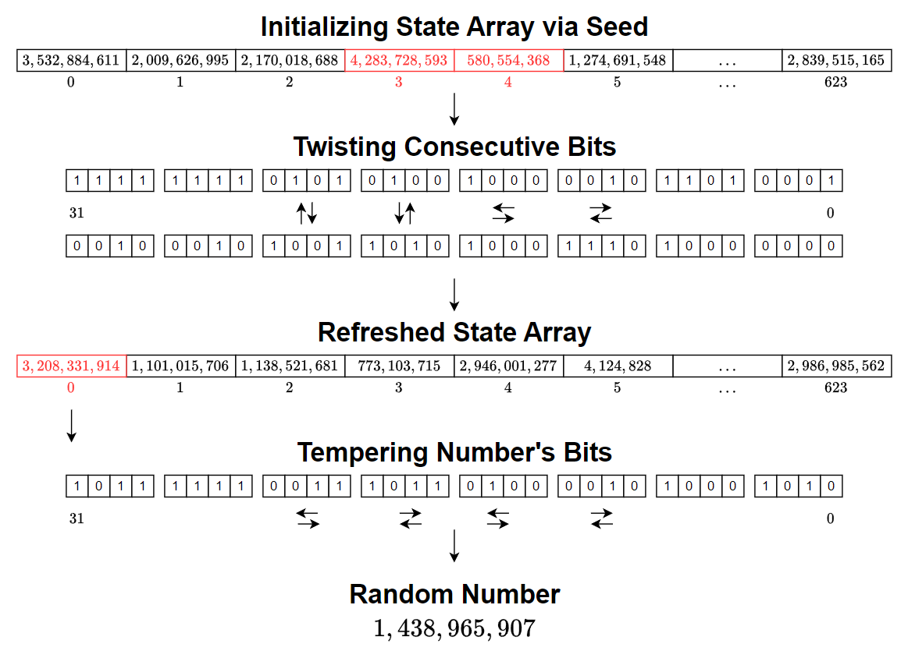
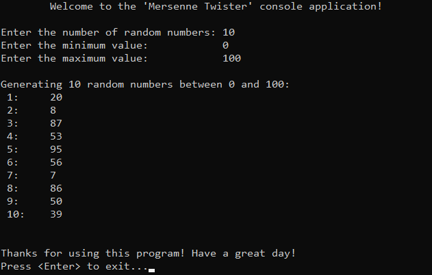

# &#128209; Table of Contents
- [💡 Overview](#-overview)
  - [Introduction](#introduction)
  - [Important Details](#important-details)
  - [Algorithm Steps](#algorithm-steps)
- [💻 Implementation](#-implementation)
  - [Design Decisions](#design-decisions)
  - [Complete Implementation](#complete-implementation)
  - [Detailed Walkthrough](#detailed-walkthrough)
- [📊 Analysis (Exploring Options)](#-analysis-exploring-options)
- [📝 Application](#-application)
  - [Common Use Cases](#common-use-cases)
  - [Some Practical Problems](#some-practical-problems)
- [🕙 Origins](#-origins)
- [🤝 Contributing](#-contributing)
- [📧 Contacts](#-contacts)
- [🙏 Credits](#-credits)
- [🔏 License](#-license)


# &#128161; Overview
The **Mersenne Twister** is a complex and highly efficient pseudorandom number generator (PRNG) known for its long period and excellent statistical properties. Its name comes from the fact that its period length is a Mersenne prime number, while «Twister» refers to the internal transformation step where bits of numbers are «twisted» through a series of bitwise operations to generate high-quality random numbers. Knowledge and understanding of it lay a solid foundation for algorithmic design and tackling more complex problem-solving strategies.
<p align="center"></p>


## Introduction
The Mersenne Twister generates a sequence of pseudorandom numbers by maintaining an internal state array. This array holds intermediate values used to produce random numbers. The algorithm periodically updates the state array through a process called «twisting», which mixes bits from consecutive elements. The final numbers are produced through «tempering», which applies bit shifts and masks to ensure the numbers are well-distributed. Both twisting and tempering involve specific constants, carefully chosen from mathematical research, to control how the bits are manipulated and ensure the algorithm's long period and high-quality randomness.


## Important Details
1. **State Array Size** — fixed at $624$ integers because multiplying it by $32$-bit unsigned integers gives $19968$ bits, which is slightly more than the $19937$ bits required for the algorithm’s period. This ensures that the internal state can maintain enough bits to support the long period without introducing unnecessary overhead.
2. **Initialization Multiplier** — constant `f = 1812433253u` is used to spread the seed value effectively across all $624$ integers in the state array. The choice of `f` comes from research that optimizes how the seed influences the state, ensuring that the entire array is well-mixed from the start.
3. **Twisting Constants:**
   - `m = 397` — this value is chosen because it offsets the state array elements far enough during twisting to introduce a significant level of mixing while still maintaining a manageable computational cost.
   - `r = 31` — specifies how the state elements are split between upper and lower bits during mixing. By splitting at $31$ bits, the algorithm separates the more influential upper bits from the less significant lower bits, ensuring efficient manipulation while preserving enough randomness.
   - `a = 0x9908B0DF` — this value is chosen to XOR specific bits during twisting. It’s designed to invert certain bits in the state, based on tests that showed it produced better-distributed randomness. The specific pattern of this constant ensures optimal bit flipping without creating unwanted patterns.
4. **Tempering Constants:**
   - `u = 11` — this right shift removes the lower $11$ bits of the number, which tend to carry less useful randomness, improving the quality of the remaining bits.
   - `s = 7` — this left shift introduces high-order bits that help maintain variability in the higher bit positions.
   - `t = 15` and `l = 18` — these additional shifts were chosen based on statistical tests to further refine the bit structure after twisting, ensuring that even subtle bit-level variations are spread across the final output.
5. **Tempering Masks:**
   - `b = 0x9D2C5680` — this mask is applied to selectively retain or alter certain bits in the tempered output. The specific hexadecimal value was derived from research showing it helps create a more uniform distribution of random numbers, particularly by controlling how high-order bits are modified.
   - `c = 0xEFC60000` — this mask is applied to further tweak bits after the first mask, particularly targeting the mid-range bits. Its value is specifically chosen to balance out any potential bias introduced by the previous operations, ensuring the numbers remain well-distributed.


## Algorithm Steps
1. Start by setting the first element of the state array to the initial seed value. Fill the remaining elements of the state array using the recurrence relation with `f = 1812433253u`:
   $$MT[i] = f \times (MT[i-1] \oplus (MT[i-1] \gg \text{nBits} - 1)) + i$$     
2. Perform the «twist» by combining bits from consecutive elements of the state array using the formula: `x = (MT[i] & upMask + (MT[(i+1) % n] & lowMask)`
3. Then, apply the XOR operation using constant `a`:  
$$xA = (x \gg 1) \oplus (a \text{ if } x \% 2 \neq 0)$$
4. Apply tempering to the twisted values. Take the current value `y = MT[i]`, and:
   - Right shift by `u = 11` bits.
   - Left shift by `s = 7` bits and apply the mask `b = 0x9D2C5680`.
   - Left shift by `t = 15` bits and apply the mask `c = 0xEFC60000`.
   - Right shift by `l = 18` bits.
5. Use the next element in the state array and apply the tempering process. If the state array has been fully used (i.e., the index runs out), perform another twist to generate a new batch of random numbers.

> **Note:** The implementation can be quite complex. If you'd like to explore it in more detail, I recommend reviewing the research paper by Makoto Matsumoto and Takuji Nishimura, titled «Mersenne twister: a 623-dimensionally equidistributed uniform pseudo-random number generator»


# &#x1F4BB; Implementation
The program prompts the user to specify the number of random values to generate and define the range. It then uses the implemented PRNG to generate the specified amount of numbers and displays them as a numbered list.
<p align="center"></p>


## Design Decisions
To prioritize simplicity and emphasize algorithm itself, several design decisions were made:
- Utilizing a library implementation of dynamic array `vector<>` to represent state array.
- Using fixed seed value to ensure reproducible results.
- Choosing range values that are easily interpretable by humans ($0-100$).
- Limiting the number of elements to a relatively small ($10$).
- Assuming valid input values from the user.
- Omitting certain optimizations to the algorithm.


## Complete Implementation
PRNG is implemented within the class `MersenneTwister`, which is declared in [MersenneTwister.h](https://github.com/vezzolter/DSA/tree/main/Algorithms/RNG/MersenneTwister/Include/MersenneTwister.h) header file and defined in [MersenneTwister.cpp](https://github.com/vezzolter/DSA/tree/main/Algorithms/RNG/MersenneTwister/Source/MersenneTwister.cpp) source file. This approach is adopted to ensure encapsulation, modularity and compilation efficiency. Examination of generated values is conducted within the `main()` function located in the [Main.cpp](https://github.com/vezzolter/DSA/tree/main/Algorithms/RNG/MersenneTwister/Source/Main.cpp) file. Below you can find declaration of the class.

```cpp
class MersenneTwister {
private:
    static const int n = 624;                 // Length of the state array (number of 32-bit values in the internal state)
    static const int m = 397;                 // Middle word; offset for mixing the state in the "twist" step
    static const int r = 31;                  // Number of bits used to separate the lower and upper parts of the state
    static const uint32_t a = 0x9908B0DF;     // Constant used in the twisting transformation
    static const int u = 11;                  // Shift used during the tempering process (right shift)
    static const int s = 7;                   // Shift used during the tempering process (left shift)
    static const int t = 15;                  // Another shift used in tempering (left shift)
    static const int l = 18;                  // Final right shift in the tempering process
    static const uint32_t b = 0x9D2C5680;     // Mask used in the tempering process for bitwise AND
    static const uint32_t c = 0xEFC60000;     // Another mask used in the tempering process
    static const uint32_t f = 1812433253u;    // Multiplier used during the initialization of the state array

    std::vector<uint32_t> state;
    int index = n + 1;

    void initialize(uint32_t seed);
    void twist();

public:
    MersenneTwister(uint32_t seed = 5489u);  
    uint32_t generate();
};
```


## Detailed Walkthrough
1. Start the process by calling the constructor with a seed. This seed is then passed to the `initialize()` function to set up the state array. This was done due to single responsibility principle and reusability, whenever need for reinitializing without creating new object occurs, like when the seed is changed.
```cpp
  MersenneTwister::MersenneTwister(uint32_t seed) { initialize(seed); }
```
2. Within this `initialize()` function do following actions: resize the state array to number of elements, initialize it by setting the first element to the provided seed, and fill the rest using linear recurrence method from the MT19937 algorithm.
```cpp
  void MersenneTwister::initialize(uint32_t seed) {
      state.resize(n);
      state[0] = seed;
      for (int i = 1; i < n; i++) {
        state[i] = f * (state[i - 1] ^ (state[i - 1] >> 30)) + i;
      }    
  }
```
3. When PRNG is set up, the user can call function `generate()` to X. In this function, the first thing to check is whether the index has exceeded the size of the state array (n = 624). If this condition is met, the state array has been fully used, and we need to call the `twist()` function to generate new values. Twisting allows us to refill the state array with fresh random numbers. For now, let’s assume everything is fine, and we don't need to twist. Later, I’ll explain exactly how twisting works. After checking this condition, the function proceeds to extract the next random number from the state array.
```cpp
  uint32_t MersenneTwister::generate() {
      if (index >= n) { twist(); }
```
4. Now that we know that state array contains fresh random numbers, the next step is to retrieve the current value from the state array at the position index. The index++ ensures that the next time `generate()` is called, we will move to the next element in the array. This gives us the raw number y to work with.
```cpp
  uint32_t y = state[index++];
```
5. Once the raw number `y` is extracted from the state array, a tempering process is applied to modify the bits in a specific way that ensures better distribution. The initial right shift by $11$ bits brings high-order bits into the lower positions, redistributing variability and reducing the influence of predictable lower bits. The left shift by $7$ bits, combined with a mask, adjusts the high-order bits, adding complexity to the most significant part of the number. The second left shift by $15$ bits targets the middle bits, with another mask ensuring that this critical range is randomized as well. Finally, the right shift by $18$ bits tweaks the higher bits once more, ensuring that they are fully influenced by the entire process.
```cpp
  y ^= (y >> u);
  y ^= (y << s) & b;
  y ^= (y << t) & c;
  y ^= (y >> l);
```
6. After twisting and tempering the final step is to return the processed number `y` ready for use.
```cpp
  return y;
```
7. Although the numbers in the state array might eventually run out, which is why we need to return to twisting. Start `twist()` operation by setting masks. Define `lowMask` to extract the lower `r` bits from the state array elements and `upMask` to extract the upper `w-r` bits. The purpose of these masks is to split each element in the state array into two parts: the upper part (controlled by `upMask`) and the lower part (controlled by `lowMask`). This separation allows the algorithm to combine upper bits from one element with the lower bits of the next element, creating a more randomized result for the twist operation.
```cpp
  void MersenneTwister::twist() {
      const uint32_t lowMask = (1u << r) - 1;  // Lowest r bits
      const uint32_t upMask = ~lowMask;        // Upper w-r bits
```
8. Iterate over all elements in the state array where the main part of twist operation happens. Use the masks to combine the upper bits of the current element `state[i]` with the lower bits of the next element `state[(i + 1) % n]`. This operation ensures that no single element's bits are kept in isolation, increasing the randomness of the process.
```cpp
  for (int i = 0; i < n; i++) {
      uint32_t x = (state[i] & upMask) + (state[(i + 1) % n] & lowMask);
```
9. Perform a right shift on the combined value x, discarding the least significant bit (LSB). This reduces the impact of lower bits that might carry less useful randomness.
```cpp
  uint32_t xA = x >> 1;
```
10.  If the original value of `x` has its lowest bit set (i.e., `x` is odd), XOR the shifted value `xA` with the constant `a = 0x9908B0DF`. This further randomizes the state by selectively flipping certain bits based on the lowest bit of `x`.
```cpp
  if (x % 2 != 0) { xA ^= a; } // If the lowest bit is 1
```
11.  Update the current element `state[i]` by XORing the result `xA` with the element m = 397 positions ahead in the state array. This ensures that each element in the state array is influenced not only by its neighbors but also by elements further down the array, enhancing randomness.
```cpp
  state[i] = state[(i + m) % n] ^ xA;
```
12.  Finally, once all elements in the state array have been processed, reset the `index` to `0` so that the next number generation can start from the beginning of the state array.
```cpp
  index = 0;
```
13. To make the generated value more practical and human-readable, a user-defined range can be applied. The range is defined by `maxVal` and `minVal`, which translates to `[minVal, maxVal)` and adding $1$ ensures inclusivity of the maximum value, resulting in the range `[minVal, maxVal]`. The modulo operator is then used to confine the PRNG output within `[0, range]`. Adding `minVal` shifts the range to `[minVal, maxVal]`, ensuring the final value is within the user’s desired range, therefore can be tested easily.
```cpp
	for (int i = 0; i < n; i++) {
		uint32_t randomNumber = minVal + (prng.generate() % (maxVal - minVal + 1));
		std::cout << " " << i + 1 << ":\t" << randomNumber << std::endl;
	}
```


# &#128202; Analysis (Exploring Options)
Will be updated in future...

> **Note:** I'm currently considering how to best structure this section, as it involves several characteristics that I find intriguing to explore, such as period, distribution, predictability, and correlation.


# &#128221; Application
Understanding some of the most well-known use cases of an algorithm is crucial for grasping its practical relevance and potential impact in real-world scenarios. While there aren’t specific problems designed to practice this exact approach, the concept of randomness it implements is essential for solving many foundational challenges that test the core idea of randomness itself, applicable across various algorithms. 


## Common Use Cases
- **Advanced Randomness Generation** — algorithm is used in scenarios requiring high-quality random numbers, particularly when statistical uniformity and a long period are critical. Its long period and excellent statistical uniformity ensure that sequences of random numbers do not repeat prematurely, making it reliable for applications that need precise and consistent randomness over many iterations.  


## Some Practical Problems
- Refer to [RNG's Practical Problems](../RNG.md#some-practical-problems) for examples of problems that explore randomness as a fundamental concept.


# &#x1F559; Origins
The Mersenne Twister was introduced in **1997** by Japanese mathematicians **Makoto Matsumoto (松本 眞)** and **Takuji Nishimura (西村 拓士)** as a solution to the limitations of existing PRNGs. At the time, many of them either suffered from short periods, poor statistical properties, or slow performance, making them unsuitable for simulations and other applications that required large amounts of high-quality random numbers.

Their breakthrough came with the idea of improving the Generalized Feedback Shift Register (GFSR) by «twisting» the recurrence relation in a way that better preserved randomness. They incorporated a matrix linear recurrence over a finite binary field, which led to the creation of a twisted GFSR (TGFSR). This method involved manipulating the sequence of numbers using a recurrence relation and introducing a tempering matrix to improve the uniformity of the generated numbers, ensuring better distribution and randomness.

Mersenne Twister quickly became the standard in many fields, offering an ideal balance of speed, long period, and strong statistical properties. Its widespread adoption in software platforms like Python, R, and C++, as well as tools like SPSS, highlights its reliability and versatility in generating high-quality random numbers across diverse applications.


# &#129309; Contributing
Contributions are highly appreciated! For detailed guidelines, please refer to the [root directory's contributing section](../../../#-contributing).


# &#128231; Contacts
For contact details and additional information, please refer to the [root directory's contact information section](../../../#-contacts).


# &#128591; Credits
&#127760; **Web-Resources:**  
- [Mersenne Twister](https://en.wikipedia.org/wiki/Mersenne_Twister) (Wikipedia)
- [Mersenne twister: a 623-dimensionally equidistributed uniform pseudo-random number generator](https://dl.acm.org/doi/pdf/10.1145/272991.272995) (Research Paper)


# &#128271; License
This project is licensed under the MIT License — see the [LICENSE](https://github.com/vezzolter/DSA/blob/main/LICENSE) file for details.

[](https://opensource.org/licenses/MIT)