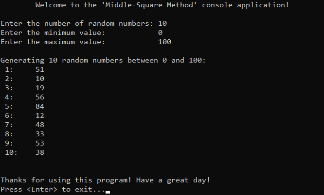

# &#128209; Table of Contents
- [💡 Overview](#-overview)
  - [Introduction](#introduction)
  - [Important Details](#important-details)
  - [Algorithm Steps](#algorithm-steps)
- [💻 Implementation](#-implementation)
  - [Design Decisions](#design-decisions)
  - [Complete Implementation](#complete-implementation)
  - [Detailed Walkthrough](#detailed-walkthrough)
- [📊 Analysis](#-analysis)
- [📝 Application](#-application)
  - [Common Use Cases](#common-use-cases)
  - [Some Practical Problems](#some-practical-problems)
- [🕙 Origins](#-origins)
- [🤝 Contributing](#-contributing)
- [📧 Contacts](#-contacts)
- [🙏 Credits](#-credits)
- [🔏 License](#-license)


# &#128161; Overview
The **Middle-Square Method** is a simple and early pseudorandom number generator (PRNG) known for its historical significance. Its name comes from core steps: squaring the seed value and then extracting the middle digits from the result. Knowledge and understanding of it lay a solid foundation for algorithmic design and tackling more complex problem-solving strategies.
<p align="center"></p>


## Introduction
The Middle-Square Method generates a sequence of numbers by squaring the current number (initially a seed) and extracting the middle digits from the result, which become the next number in the sequence.


## Important Details
1. The algorithm is highly dependent on choosing the correct seed to produce a good sequence in terms of randomness. A great sequence typically has no obvious patterns, cycles, or repetition over a substantial range of values. If the number of digits isn't carefully chosen (e.g., using a number with fewer digits), the method may quickly converge to zero or produce non-random looking sequences.
E.g. $seed = 3792$; $seed = 8256$.
2. Extracting the middle digits is the tricky part of algorithm, because the squared result can have more or fewer digits than expected, leading to poor randomness. This can be solved by padding the squared value with leading zeros to ensure a consistent length, or by using mathematical operations like division and modulus to isolate the middle digits directly without converting to a string.


## Algorithm Steps
1. Choose an initial seed value, which is typically a number with multiple digits.
2. Square the seed value to get a larger number.
3. Extract a middle portion of digits from the result, typically with the same amount of digits as seed has.
4. Use extracted digits as the new seed value.
5. Repeat this process to generate required amount of numbers.


# &#x1F4BB; Implementation
The program prompts the user to enter the required amount of numbers, digits and specify the seed, then it performs a respective generation using PRNG named Middle-Square Method, and finally displays the result.
<p align="center"></p>


## Design Decisions
To prioritize simplicity and emphasize algorithm itself, several design decisions were made:
- Using fixed seed value to ensure reproducible results.
- Assuming valid input values from the user.
- Utilizing only raw generated elements.
- Omitting certain optimizations to the algorithm.
- Limiting the number of elements to relatively small ($10$).


## Complete Implementation
PRNG algorithm implemented within the function `middleSquareMethod()`, which is declared in `MiddleSquareMethod.h` header file and defined in `MiddleSquareMethod.cpp` source file. This approach is adopted to ensure encapsulation, modularity and compilation efficiency. Examination of generated values is conducted within the `main()` function located in the `Main.cpp` file. Below you can find related code snippets.

```cpp
int middleSquareMethod(int seed, int digits) {
    long long squared = static_cast<long long>(seed) * seed;

    // Extract the middle digits
    int power = 1;
    for (int i = 0; i < digits; ++i)
        power *= 10;
    int shift = (digits % 2 == 0) ? digits / 2 : (digits + 1) / 2;
    int randomNumber = (squared / static_cast<long long>(pow(10, shift - 1))) % power;

    return randomNumber;
}

// Generate random numbers
std::cout << "\nGenerating " << numbers << " random " << digits << "-digit numbers...\n";
for (int i = 0; i < numbers; ++i) {
	int randomNumber = middleSquareMethod(seed, digits);
	std::cout << " " << i + 1 << ":\t" << randomNumber << std::endl;
	seed = randomNumber; // Step 4: Use extracted digits as the new seed value.
}
```

## Detailed Walkthrough
1. Calculate teh square of the seed value. Since the result of multiplying two int values could overflow, the seed is cast to a long long before multiplication to ensure that the result fits in the data type.
```cpp
  long long squared = static_cast<long long>(seed) * seed;
```
2. The most tricky part is extracting middle digits. Because of the conditional logic, that the number of digits to extract depends on whether the total number of digits is even or odd, it can be implemented differently for different needs, or excessively complicated to be a good "one-size-fits-all". Nevertheless, current implementation merely do the basics and have lots of troubles if you try to find them.
```cpp
  int power = 1;
  for (int i = 0; i < digits; ++i)
      power *= 10;
  int shift = (digits % 2 == 0) ? digits / 2 : (digits + 1) / 2;
  int randomNumber = (squared / static_cast<long long>(pow(10, shift - 1))) % power;
```
3. In the end, the new seed is returned, which can be used later in code to recreate a Middle-Square Method.
```cpp
  return randomNumber;
```


# &#128202; Analysis
Will be updated in the future...

> **Note:** I'm currently considering how to best structure this section, as it involves several characteristics that I find intriguing to explore, such as period, distribution, predictability, and correlation.


# &#128221; Application
Understanding some of the most well-known use cases of an algorithm is crucial for grasping its practical relevance and potential impact in real-world scenarios. While there aren’t specific problems designed to practice this exact approach, the concept of randomness it implements is essential for solving many foundational challenges that test the core idea of randomness itself, applicable across various algorithms. 


## Common Use Cases
- **Education** — algorithm is used only in educational context. Its inefficiency, bad randomness distribution period and insecurity make it largely obsolete in modern software development context, even for niche applications.


## Some Practical Problems
- There is no need to practice it


# &#x1F559; Origins
The **Middle-Square Method** was one of the first attempts to use a computational approach to generate sequences of seemingly random numbers, proposed and described by Hungarian-American mathematician and physicist **John von Neumann** at a conference in **1949**. At the time of its invention, digital computers were still in their infancy, and there was a need for methods to generate sequences of numbers that appeared random for various scientific and engineering applications. While the method is rudimentary by modern standards and has well-known shortcomings, it laid the foundation for subsequent developments in pseudorandom number generation.


# &#129309; Contributing
Contributions are highly appreciated! For detailed guidelines, please refer to the [root directory's contributing section](../../../#-contributing).


# &#128231; Contacts
For contact details and additional information, please refer to the [root directory's contact information section](../../../#-contacts).


# &#128591; Credits
&#128218; **Books:**
- **"The Art of Computer Programming, Volume 2: Seminumerical Algorithms" (3rd Edition)** — by Donald Ervin Knuth
  - Section 3.1: Introduction

---
&#127760; **Web-Resources:**  
- [Middle-square method](https://en.wikipedia.org/wiki/Middle-square_method) (Wikipedia)
- [Solved Example: Extracting Digits of a Number](https://www.knowledgeboat.com/learn/icse-computer-applications-bluej-class-10/lecture/ml4Jm/java-digit-extract)
- [The Middle of the Square](http://bit-player.org/2022/the-middle-of-the-square)
- [Too Big to Fail](https://www.pcg-random.org/posts/too-big-to-fail.html)


# &#128271; License
This project is licensed under the MIT License — see the [LICENSE](https://github.com/vezzolter/DSA/blob/main/LICENSE) file for details.

[](https://opensource.org/licenses/MIT)