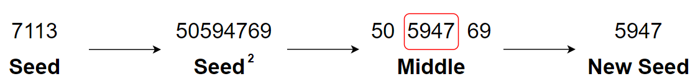
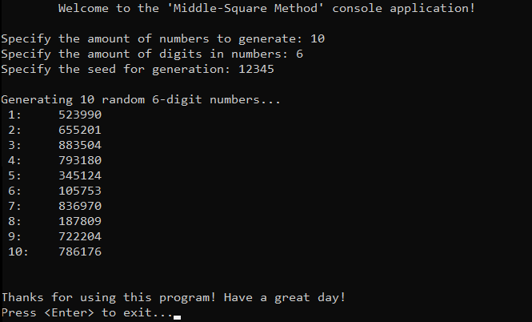

# &#128209; Table of Contents
- [💡 Overview](#-overview)
- [💻 Implementation](#-implementation)
- [📊 Analysis](#-analysis)
- [📝 Application](#-application)
- [🕙 Origins](#-origins)
- [🤝 Contributing](#-contributing)
- [📧 Contacts](#-contacts)
- [🙏 Credits](#-credits)
- [🔏 License](#-license)


# &#128161; Overview
The **Middle-Square Method** stands out as one of the simplest and earliest known pseudorandom number generators (PRNG). The algorithm is named this way, because of its two primary operations in it, which is squaring the seed value and then extracting the middle digits from the squared result. Knowledge and understanding of it, lays the foundation for tackling more complex random number generation methods and problem-solving strategies.
<p align="center"></p>

---
**Fundamentally, the concept operates through the following steps:**:
1. Choose an initial seed value, which is typically a number with multiple digits.
2. Square the seed value to get a larger number.
3. Extract a middle portion of digits from the result, typically with the same amount of digits as seed has.
4. Use extracted digits as the new seed value.
5. Repeat this process to generate required amount of random numbers.

> **Note:** In many cases, the raw random numbers generated from a PRNG may need to undergo some additional processing before they can be used in specific applications; e.g. a random function that needs to provide random integers within a specific range defined by the user.


# &#x1F4BB; Implementation
The program prompts the user to enter the required amount of numbers, digits and specify the seed, then it performs a respective generation using PRNG named Middle-Square Method, and finally displays the result.
<p align="center"></p>

To prioritize simplicity and emphasize algorithm itself, several design decisions were made:
- Utilizing only raw generated elements.
- Omitting certain optimizations to the algorithm.

---
PRNG algorithm implemented within the function `middleSquareMethod()`, which is declared in `MiddleSquareMethod.h` header file and defined in `MiddleSquareMethod.cpp` source file. This approach is adopted to ensure encapsulation, modularity and compilation efficiency. Examination of generation technique is conducted within the `main()` function located in the `Main.cpp` file.

**The Complete Implementation of a PRNG:**
```cpp
int middleSquareMethod(int seed, int digits) {
    long long squared = static_cast<long long>(seed) * seed;

    // Extract the middle digits
    int power = 1;
    for (int i = 0; i < digits; ++i)
        power *= 10;
    int shift = (digits % 2 == 0) ? digits / 2 : (digits + 1) / 2;
    int randomNumber = (squared / static_cast<long long>(pow(10, shift - 1))) % power;

    return randomNumber;
}

// Generate random numbers
std::cout << "\nGenerating " << numbers << " random " << digits << "-digit numbers...\n";
for (int i = 0; i < numbers; ++i) {
	int randomNumber = middleSquareMethod(seed, digits);
	std::cout << " " << i + 1 << ":\t" << randomNumber << std::endl;
	seed = randomNumber; // Step 4: Use extracted digits as the new seed value.
}
```

---
**The Detailed Algorithm Overview:**
1. Calculate teh square of the seed value. Since the result of multiplying two int values could overflow, the seed is cast to a long long before multiplication to ensure that the result fits in the data type.
```cpp
long long squared = static_cast<long long>(seed) * seed;
```

2. The most tricky part is extracting middle digits. Because of the conditional logic, that the number of digits to extract depends on whether the total number of digits is even or odd, it can be implemented differently for different needs, or excessively complicated to be a good "one-size-fits-all". Nevertheless, current implementation merely do the basics and have lots of troubles if you try to find them.
```cpp
int power = 1;
for (int i = 0; i < digits; ++i)
    power *= 10;
int shift = (digits % 2 == 0) ? digits / 2 : (digits + 1) / 2;
int randomNumber = (squared / static_cast<long long>(pow(10, shift - 1))) % power;
```

3. In the end, the new seed is returned, which can be used later in code to recreate a Middle-Square Method.
```cpp
return randomNumber;
```


# &#128202; Analysis
Will be updated in the future...

P.s. in order to grasp this topic in a better way, I'm going to update this section after respective RNG section. Right now, I can only suppose that the analysis of this RNG relies on metrics such as: distribution, period, predictability, patterns, implementation details.


# &#128221; Application
Middle-Square Method's utility is limited in modern software development contexts due to its inefficiency. Even for niche applications, there are better alternatives readily available, making this PRNG largely obsolete and making its purpose solely to be an educational.


# &#x1F559; Origins
The **Middle-Square Method** was one of the first attempts to use a computational approach to generate sequences of seemingly random numbers, proposed and described by Hungarian-American mathematician and physicist **John von Neumann** at a conference in **1949**. At the time of its invention, digital computers were still in their infancy, and there was a need for methods to generate sequences of numbers that appeared random for various scientific and engineering applications. While the method is rudimentary by modern standards and has well-known shortcomings, it laid the foundation for subsequent developments in pseudorandom number generation.


# &#129309; Contributing
Contributions are highly appreciated! For detailed guidelines, please refer to the [root directory's contributing section](../../../#-contributing).


# &#128231; Contacts
For contact details and additional information, please refer to the [root directory's contact information section](../../../#-contacts).


# &#128591; Credits
&#127760; **Web-Resources:**  
- [Middle-square method](https://en.wikipedia.org/wiki/Middle-square_method) (Wikipedia)
- [Pseudo random number using the Middle Square Method](https://www.educative.io/answers/pseudo-random-number-using-the-middle-square-method)
- [Solved Example: Extracting Digits of a Number](https://www.knowledgeboat.com/learn/icse-computer-applications-bluej-class-10/lecture/ml4Jm/java-digit-extract)
- [The Middle of the Square](http://bit-player.org/2022/the-middle-of-the-square)
- [Too Big to Fail](https://www.pcg-random.org/posts/too-big-to-fail.html)


# &#128271; License
This project is licensed under the MIT License — see the [LICENSE](https://github.com/vezzolter/DSA/blob/main/LICENSE) file for details.

[](https://opensource.org/licenses/MIT)