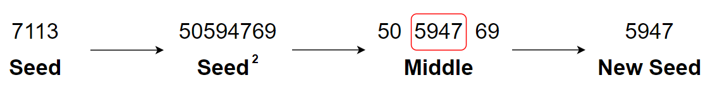

# &#128209; Table of Contents
- [💡 What is the Middle-Square Method](#-what-is-the-middle-square-method)
- [💻 Implementation](#-implementation)
- [📊 Analysis](#-analysis)
- [📝 Application](#-application)
- [⏳ Historical Notes](#-historical-notes)
- [🤝 Contributing](#-contributing)
- [📧 Contact Information](#-contact-information)
- [🙏 Credits](#-credits)
- [🔏 License](#-license)

# &#128161; What is the Middle-Square Method
The **Middle-Square Method** stands out as one of the simplest and earliest known pseudorandom number generators (PRNG). The algorithm is named this way, because of its two primary operations in it, which allow it to generate a number. Knowledge and understanding of it, lays the foundation for tackling more complex random number generation methods and problem-solving strategies.

---
**Middle-Square Method** works works by squaring a seed value, extracting the middle digits from the result, and using them as the next seed value. It consists of the following steps:
1. Choose an initial seed value, which is typically a number with multiple digits.
2. Square the seed value to get a larger number.
3. Extract a middle portion of digits from the result, typically with the same amount of digits as seed has.
4. Use extracted digits as the new seed value.
5. Repeat this process to generate required amount of random numbers.

**Note:** obtaining a specific range of random numbers is possible by applying some additional processing to the generated random number.

# &#x1F4BB; Implementation
Currenlty in progress...

# &#128202; Analysis
Currenlty in progress...

# &#128221; Application
Currenlty in progress...

# &#x23F3; Historical Notes
Currenlty in progress...

# &#129309; Contributing
Contributions are highly appreciated! For detailed guidelines, please refer to the [root directory's contributing section](../../../#-contributing).

# &#128231; Contact Information
For contact details and additional information, please refer to the [root directory's contact information section](../../../#-contact-information).

# &#128591; Credits
&#127891; **Courses:**
- [Cryptography](https://www.coursera.org/learn/cryptography) on Coursera

---  
&#127760; **Web-Resources:**  
- [Middle-square method](https://en.wikipedia.org/wiki/Middle-square_method) (Wikipedia)
- [Pseudo random number using the Middle Square Method](https://www.educative.io/answers/pseudo-random-number-using-the-middle-square-method)

# &#128271; License
This project is licensed under the MIT License — see the [LICENSE](https://github.com/vezzolter/DSA/blob/main/LICENSE) file for details.

