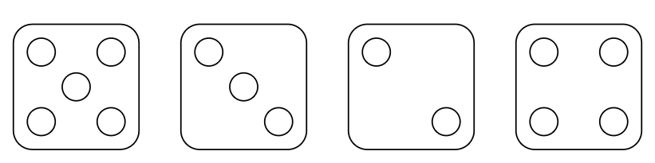
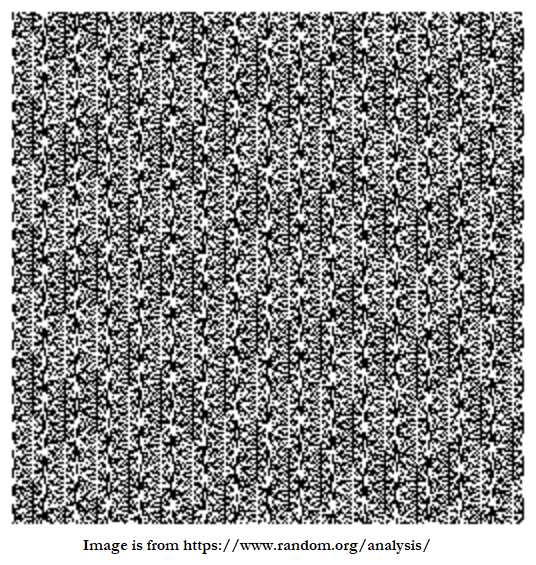
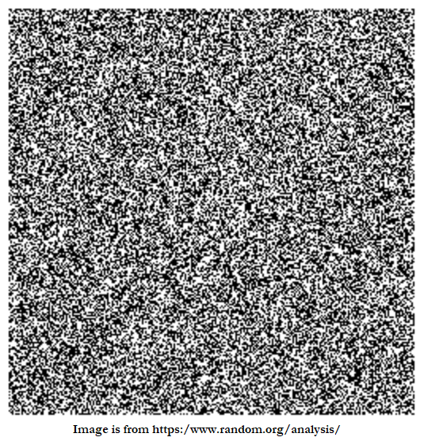

# &#128209; Table of Contents
- [💡 Overview](#-overview)
  - [Essential Terminology](#essential-terminology)
- [💻 Implementation](#-implementation)
  - [How to Implement](#how-to-implement)
  - [Pitfalls and Optimizations](#pitfalls-and-optimizations)
  - [Implemented Algorithms](#implemented-algorithms)
- [📊 Analysis (Exploring Options)](#-analysis-exploring-options)
  - [How to Analyze](#how-to-analyze)
  - [Trade-Offs](#trade-offs)
  - [Alternatives](#alternatives)
- [📝 Application](#-application)
  - [Common Use Cases](#common-use-cases)
  - [Some Practical Problems](#some-practical-problems)
- [🕙 Origins](#-origins)
- [🤝 Contributing](#-contributing)
- [📧 Contacts](#-contacts)
- [🙏 Credits](#-credits)
- [🔏 License](#-license)

# &#128161; Overview
**Random Number Generation** is a key operation in computer science, used to produce numbers that are **perceived** as random. It is crucial to understand the concept to ensure that the generated numbers exhibit the desired statistical properties and behaviors in various algorithms for all manner of applications.

## Essential Terminology
- **Randomness** — typically refers to the quality of unpredictability or lack of tracing pattern.
   - **Random Numbers** — is a sequence of numbers, where each number was obtained by chance, having nothing to do with other number of the sequence.
   - **RNG (Random Number Generator)** — is a computational algorithm that produces sequences of numbers that exhibit randomness.
- **Seed** — is an initial value used to initialize a PRNG. By setting a specific seed, it is possible to recreate the same sequence of random numbers, which can be useful for debugging or testing.
- **Period** — is a number of unique values in the sequence before it starts to repeat, while for PRNG it is finite, for TRNG it is effectively infinite.
- **Entropy** — is a degree of unpredictability of a sequence of data collected from hardware sources; i.e. the greater it is, the less predictable sequence is.
  - **Entropy Source** — is a physical or computational process that provides random or unpredictable data; i.e. basically the source from where the entropy is collected, such as electronic noise.
- **Distribution** — is a description of how values  are distributed.
  - **Uniform Distribution** — where every value within a given range has the same probability of occurring.
  - **Normal (Gaussian/Bell) Distribution** — where most values cluster around the mean, with fewer values farther from the mean.
  - **Binomial Distribution** — where the distribution describes the number of successes in a fixed number of independent trials, each with the same probability of success.
- **Internal State** — most PRNGs do not generate numbers from thin air but maintain an internal state, a set of stored values that is repeatedly modified using a defined transformation rule. This process determines the sequence, period length, and ensures the next output appears random.

# &#x1F4BB; Implementation
When implementing a RNG, it's essential to understand the fundamental techniques that drive its behavior and ensure its correct functionality. Additionally, recognizing the critical pitfalls and potential optimizations allows you to refine the implementation, making it more efficient and robust for various scenarios.

## How to Implement
The choice of RNG depends on the application's specific needs, including the balance between speed, randomness quality, and security. Generally, there are two main categories of generators:

**PRNG (Pseudorandom Number Generator)** — is a deterministic type of RNG that generates numbers that only appears to be random. It is called that way because given the same starting conditions, it yields the same result.

**TRNG (True Random Number Generator)** — is a non-deterministic type of RNG that generates truly random numbers. It involves exploiting inherently unpredictable physical processes related to hardware (e.g. quantum processes, radioactive decay, electronic noise, optical noise, etc).

## Pitfalls and Optimizations
When implementing or using random number generation, it’s crucial to consider both the reliability and applicability of the method in various scenarios. While many RNG algorithms seem simple, their performance and randomness quality can vary depending on the use case. To avoid potential issues and optimize for specific requirements, it's important to carefully evaluate several factors. Each algorithm may come with its own distinct pitfalls and optimization opportunities.

- **Period Length** — how long is the period of the RNG? Many algorithms, like Linear Congruential Generators (LCGs), have limited periods before they start repeating numbers. Choosing an algorithm with a long period is essential for applications that require a large number of random values.
- **Seed Selection** — how is the seed chosen? A poor seed choice can lead to predictable or poorly distributed random sequences. It’s important to use a sufficiently random or unpredictable seed, especially in security-sensitive applications.
- **Uniformity** — does the RNG produce values that are uniformly distributed? Some RNG algorithms may generate values that are biased towards certain numbers, affecting the uniformity. Ensuring that your algorithm produces a truly uniform distribution is critical for accuracy in simulations and statistical analysis.
- **Statistical Quality** — how well does the RNG pass randomness tests? An RNG might seem random at first glance, but it may fail standard statistical tests of randomness. Running tests such as Diehard or NIST to ensure high-quality randomness is crucial for reliability.
- **Data Type and Range** — can the RNG handle the required range and data type? Some algorithms might not easily adapt to generating random numbers within a specific range or may struggle with certain data types (e.g., integers vs. floating-point numbers). Ensuring compatibility with your data type and range is key.
- **Security** — is the RNG cryptographically secure? Not all RNGs are suitable for security purposes, such as key generation or encryption. Cryptographic applications require CSPRNGs, which offer unpredictability and resistance to attacks.
- **Efficiency** — how efficient is the RNG for your application? Some random number generators may be fast but produce lower quality randomness, while others are more reliable but slower. Balancing the need for speed and randomness quality is essential based on the context.
- **Pathological Cases** — how does the RNG behave in edge cases? For instance, poorly chosen seeds or specific parameter values can result in non-random or repetitive sequences. Being aware of these cases and handling them is crucial to maintaining randomness integrity.
- **Parallelization** — can the RNG be parallelized? In high-performance computing environments, it’s often necessary to generate random numbers concurrently. Some RNGs do not handle parallelization well, so ensuring that the algorithm scales in a parallelized context is important for performance.
- **Reproducibility** — does the algorithm allow for reproducibility when needed? In some simulations, the ability to reproduce a specific random sequence by using the same seed is vital. Ensuring your algorithm supports controlled randomness is crucial for debugging and testing.
- **Quality Over Time** — does the randomness degrade over time? Some RNGs produce high-quality randomness initially but lose uniformity or predictability as more numbers are generated. Monitoring the performance of the RNG over extended use is necessary for long-running processes.

## Implemented Algorithms
Discussing practical implementations, it's evident that well-established and widely recognized solutions already exist. In the context of C++, the `<random>` library provides access to robust RNG implementations, such as Mersenne Twister, Linear Congruential Generator and others. It's commonly recommended to rely on these proven implementations rather than reinventing the wheel. However, within the scope of this section, we'll take a closer look at simplified versions of popular RNG. This will help us gain a deeper understanding of the core mechanisms and design principles behind them.
  - [Middle-Square Method](https://github.com/vezzolter/DSA/tree/main/Algorithms/RNG/MiddleSquareMethod) ✅
  - [LCG (Linear Conguential Generator)](https://github.com/vezzolter/DSA/tree/main/Algorithms/RNG/LCG)  ✅
  - PCG (Permuted Congruential Generator)
  - [Xorshift32](https://github.com/vezzolter/DSA/tree/main/Algorithms/RNG/Xorshift32) ✅
  - Xoshiro128
  - [Mersenne Twister](https://github.com/vezzolter/DSA/tree/main/Algorithms/RNG/MersenneTwister) ✅

# &#128202; Analysis (Exploring Options)
Understanding how to analyze a concept is crucial for identifying its key characteristics and evaluating its performance across different scenarios. Additionally, examining the trade-offs allows you to understand what you gain and what you give up when applying the concept. Finally, considering alternatives helps you determine when the concept is the best choice and when other approaches might be more appropriate.

## How to Analyze
Currently in Progress...

## Trade-Offs
Currently in Progress...

## Alternatives
Currently in Progress...

# &#128221; Application
Understanding some of the most well-known use cases of a concept is crucial for grasping its practical relevance and potential impact in real-world scenarios. Additionally, familiarizing oneself with practical problems and practicing their solutions ensures that you retain essential details and develop a deep, intuitive understanding of the concept's capabilities and limitations.

## Common Use Cases
- **Simulations and Modeling** — RNG is used in simulating real-world systems where randomness is a key factor, such as weather forecasting, population studies, or financial modeling. RNG provides the necessary variability to replicate unpredictable behaviors in these complex systems.
- **Cryptography and Security** — RNG is used for generating cryptographic keys, tokens, and other security mechanisms to ensure unpredictability in protecting sensitive data and communications. Secure random numbers are crucial for making cryptographic processes resistant to attacks.
- **Gaming and Procedural Generation** — RNG is used for creating dynamic, unpredictable game elements such as random levels, enemy behavior, or loot drops. RNG adds variability and replayability, ensuring that no two game experiences are the same.
- **Load Testing and Performance Benchmarking** — RNG is used to generate random inputs or requests for load testing systems to assess stability, reliability, and scalability under varied conditions. The randomness helps simulate real-world user patterns, ensuring comprehensive stress tests.
- **Sampling and Statistical Analysis** — RNG is used to select random samples from larger datasets, ensuring that the results are representative and unbiased in statistical analysis and data science. This randomness ensures the integrity and fairness of data sampling for accurate results.

## Some Practical Problems
- Simulate a dice roll
- Generate a random 6-digit OTP
- Randomly shuffle an array
- Generate random boolean values
- Estimate Pi using a Monte Carlo simulation by generating random points inside a square
- Apply randomized QuickSort by randomly selecting the pivot
- Simulate a 2D random walk on a grid
- Use simulated annealing to find an optimal solution
- Implement Prim’s algorithm with random node selection for the Minimum Spanning Tree
- Create a cryptographically secure random number generator using an AES-based approach
- Implement the randomized Min-Cut algorithm by randomly merging edges to find the minimum cut

# &#x1F559; Origins
In the early days, people relied on manual methods to generate random numbers for both scientific and everyday purposes. These methods included tossing coins, rolling dice, or drawing cards. The journey toward mechanical random number generation began with **Leonard Henry Caleb Tippett's** **1927** invention of a table containing over 40,000 random digits. This marked a significant milestone, paving the way for subsequent innovations, such as the **1939** machine by the British statisticians **Maurice George Kendall** and **Bernard Babington Smith**, which produced a table of 100,000 random digits.

In the realm of computer science, a major breakthrough came in **1946** when Hungarian-American mathematician and physicist **John von Neumann** introduced the concept of generating random numbers through a computer’s arithmetic operations with his middle square method. Although deterministic, this method was effective for many applications where the appearance of randomness was sufficient. Subsequent advancements included the development of the Lehmer generator in **1949** by American mathematician **Derrick Henry Lehmer** and the creation of the Linear Congruential Generator by **W. E. Thomson** and **A. Rotenberg** in **1958**. Modern examples of RNGs include the Mersenne Twister by Japanese mathematicians and computer scientists **Makoto Matsumoto** and **Takuji Nishimura** in **1997** and xorshift in **2003** by American mathematician and computer scientist **George Marsaglia**, both of which have become widely used.

Today, companies like **Cloudflare** have taken innovative approaches to RNG, exemplified by their use of a wall of about 100 lava lamps in their headquarters. A camera captures images of these lamps at regular intervals, converting the dynamic and unpredictable movements into a series of random numbers. These numbers serve as the foundation for creating secure cryptographic keys and other essential random-based operations for their services. This approach exemplifies how RNG is becoming increasingly critical in security, simulations, and various cutting-edge technologies.

# &#129309; Contributing
Contributions are highly appreciated! For detailed guidelines, please refer to the [root directory's contributing section](../../#-contributing).

# &#128231; Contacts
For contact details and additional information, please refer to the [root directory's contact information section](../../#-contacts).

# &#128591; Credits
&#128218; **Books:**
- **"The Algorithm Design Manual" (2nd Edition)** — by Steven S. Skiena
  - Section 13.7: Random Number Generation
- **"Data Structures and Algorithm Analysis in C++" (4th Edition)** — by Mark Allen Weiss
  - Section 10.4.1: Random-Number Generators
- **"The Art of Computer Programming, Volume 2: Seminumerical Algorithms" (3rd Edition)** — by Donald Ervin Knuth
  - Section 3: Random Numbers

---  
&#127760; **Web-Resources:**  
- [Statistical Analysis](https://www.random.org/analysis/) (Article)
- [Random number generation](https://en.wikipedia.org/wiki/Random_number_generation) (Wikipedia)
- [List of random number generators](https://en.wikipedia.org/wiki/List_of_random_number_generators) (Wikipedia)
- [Understanding Entropy: The Key to Secure Cryptography and Randomness](https://blog.netdata.cloud/understanding-entropy-the-key-to-secure-cryptography-and-randomness/) (Article)
- [How do lava lamps help with Internet encryption?](https://www.cloudflare.com/ru-ru/learning/ssl/lava-lamp-encryption/) (Article)
- [<random\>](https://cplusplus.com/reference/random/) (Documentation)

# &#128271; License
This project is licensed under the MIT License — see the [LICENSE](https://github.com/vezzolter/DSA/blob/main/LICENSE) file for details.

