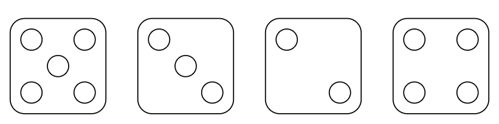
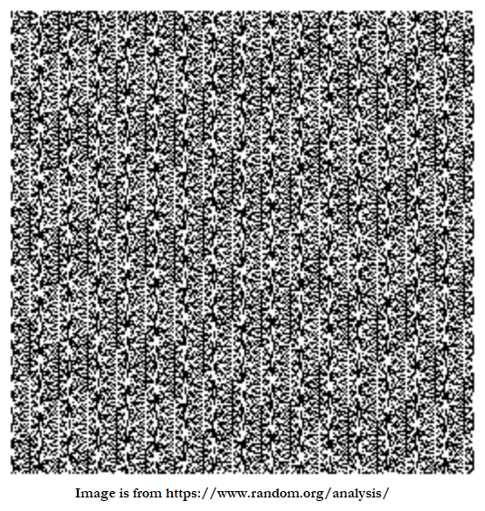
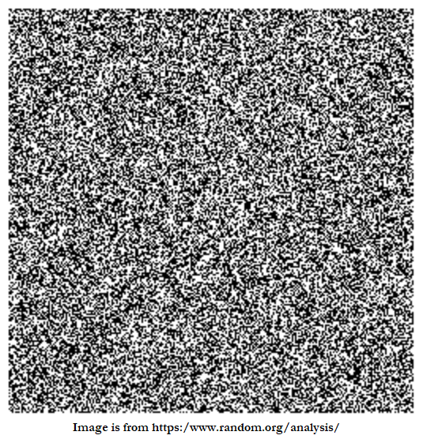

# &#128209; Table of Contents
- [💡 What is the RNG](#-what-is-the-rng)
- [💻 Implementation](#-implementation)
- [📊 Analysis](#-analysis)
- [📝 Application](#-application)
- [⏳ Historical Notes](#-historical-notes)
- [🤝 Contributing](#-contributing)
- [📧 Contact Information](#-contact-information)
- [🙏 Credits](#-credits)
- [🔏 License](#-license)

# &#128161; What is the RNG
**Random number generation** is a widely used operation in computer science to acquire number(s) that can be count as random. It helps to exhibit desired statistical properties and behaviors in various algorithms and for all manner of applications, therefore it is important to truly understand the concept.

---
**Essential Terminology:**
- **Randomness** — typically refers to the quality of unpredictability or lack of tracing pattern.
- **RNG (Random Number Generator)** — is a computational algorithm that produces sequences of numbers that exhibit randomness.
   - **PRNG (Pseudorandom Number Generator)** — is a deterministic type of RNG that generates numbers that only appears to be random.
   - **TRNG (True Random Number Generator)** — is a non-deterministic type of RNG that generates truly random numbers.
- **Seed** — is an initial value used to initialize a PRNG. By setting a specific seed, it is possible to recreate the same sequence of random numbers, which can be useful for debugging or testing.
- **Period** — is a number of unique values in the sequence before it starts to repeat, while for PRNG it is finite, for TRNG it is effectively infinite.
- **Entropy** — is a degree of unpredictability of a sequence of data collected from hardware sources; i.e. the greater it is, the less predictable sequence is.
- **Entropy Source** — is a physical or computational process that provides random or unpredictable data; i.e. basically the source from where the entopy is collected, such as electronic noise.

---
The list of known RNG is extensive and continues to grow. When it comes to implementation, they can be broadly classified into two types: PRNG and TRNG. While these types share some common ideas, each possesses distinctive characteristics. The choice between them depends on the specific requirements of the case at hand.

**PRNG (Pseudorandom Number Generator)** — is a deterministic type of RNG that generates numbers that only appears to be random. It is called that way because given the same starting conditions, it yields the same result.

**TRNG (True Random Number Generator)** — is a non-deterministic type of RNG that generates truly random numbers. It involves exploiting inherently unpredictable physical processes related to hardware (e.g. quantum processes, radioactive decay, electronic noise, optical noise, etc).

# &#x1F4BB; Implementation
Currently in Progress...

# &#128202; Analysis
Currently in Progress...

# &#128221; Application
Currently in Progress...

# &#x23F3; Historical Notes
Currently in Progress...

# &#129309; Contributing
Contributions are highly appreciated! For detailed guidelines, please refer to the [root directory's contributing section](../../#-contributing).

# &#128231; Contact Information
For contact details and additional information, please refer to the [root directory's contact information section](../../#-contact-information).

# &#128591; Credits
&#128218; **Books:**
- **"Random Number Generators―Principles and Practices: A Guide for Engineers and Programmers"** — by David Johnson
  - Section 1: Introduction
  - Section 4: Cryptographically Secure Pseudorandom Number Generators
  - Section 5: Nondeterministic Random Number Generators
  - Section 6: Statistically Uniform Noncryptographic PRNGs

---
&#127891; **Courses:**
- [Cryptography](https://www.coursera.org/learn/cryptography) on Coursera
  - Week 2: Computational Secrecy and Principles of Modern Cryptography

---  
&#127760; **Web-Resources:**  
- [Randomness](https://en.wikipedia.org/wiki/Randomness) (Wikipedia)
- [Statistical Analysis](https://www.random.org/analysis/)
- [Random number generation](https://en.wikipedia.org/wiki/Random_number_generation) (Wikipedia)
- [Pseudorandom number generator](https://en.wikipedia.org/wiki/Pseudorandom_number_generator) (Wikipedia)
- [Hardware random number generator](https://en.wikipedia.org/wiki/Hardware_random_number_generator) (Wikipedia)
- [Understanding Entropy: The Key to Secure Cryptography and Randomness](https://blog.netdata.cloud/understanding-entropy-the-key-to-secure-cryptography-and-randomness/)
- [List of random number generators](https://en.wikipedia.org/wiki/List_of_random_number_generators) (Wikipedia)

# &#128271; License
This project is licensed under the MIT License — see the [LICENSE](https://github.com/vezzolter/DSA/blob/main/LICENSE) file for details.

