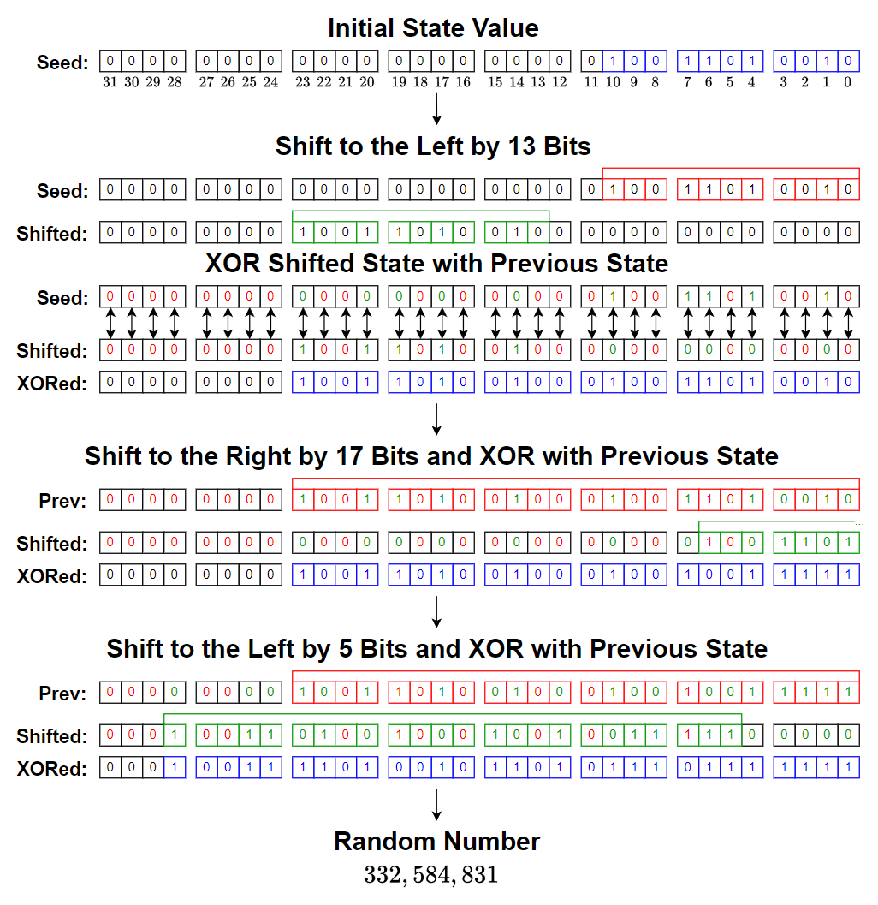
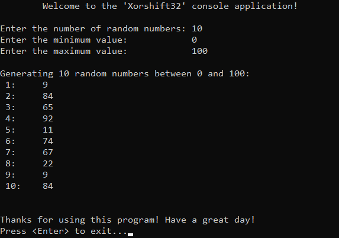

# &#128209; Table of Contents
- [💡 Overview](#-overview)
  - [Introduction](#introduction)
  - [Important Details](#important-details)
  - [Algorithm Steps](#algorithm-steps)
- [💻 Implementation](#-implementation)
  - [Design Decisions](#design-decisions)
  - [Complete Implementation](#complete-implementation)
  - [Detailed Walkthrough](#detailed-walkthrough)
- [📊 Analysis](#-analysis)
  - [Algorithm Characteristics](#algorithm-characteristics)
  - [Trade-Offs](#trade-offs)
- [📝 Application](#-application)
  - [Common Use Cases](#common-use-cases)
  - [Some Practical Problems](#some-practical-problems)
- [🕙 Origins](#-origins)
- [🤝 Contributing](#-contributing)
- [📧 Contacts](#-contacts)
- [🙏 Credits](#-credits)
- [🔏 License](#-license)


# &#128161; Overview
The **Xorshift32** is a lightweight and early pseudorandom number generator (PRNG) that generates numbers using exclusive OR (XOR) and bit shifts, avoiding expensive arithmetic operations. The **Xorshift** name represents a family of PRNGs that rely on efficient bitwise operations to transform their internal state, while individual variants modify the family name to indicate differences in state size, transformation steps, or additional modifications. Xorshift32 is named this way because its internal state is stored in a 32-bit variable, and all transformations operate within that fixed size. Knowledge and understanding of it lay a solid foundation for algorithmic design and tackling more complex problem-solving strategies.
<p align="center"></p>


## Introduction
Currently in Progress...


## Important Details
Currently in Progress...


## Algorithm Steps
Currently in Progress...


# &#x1F4BB; Implementation
The program prompts the user to enter the number of random values to generate and define the range, then it uses the implemented PRNG, Xorshift32, to generate and display the results.
<p align="center"></p>


## Design Decisions
To prioritize simplicity and emphasize algorithm itself, several design decisions were made:
- Utilizing the standard library type uint32_t to represent the internal state as a single 32-bit value.
- Using fixed seed value to ensure reproducible results.
- Choosing range values that are easily interpretable by humans ($0-100$).
- Limiting the number of elements to a relatively small ($10$).
- Assuming valid input values from the user.
- Omitting certain optimizations to the algorithm.


## Complete Implementation
PRNG is implemented within the class `Xorshift32`, which is declared in [Xorshift32.h](https://github.com/vezzolter/DSA/blob/xorshift/Algorithms/RNG/Xorshift32/Include/Xorshift32.h) header file and defined in [Xorshift32.cpp](https://github.com/vezzolter/DSA/blob/xorshift/Algorithms/RNG/Xorshift32/Source/Xorshift32.cpp) source file. This approach is adopted to ensure encapsulation, modularity and compilation efficiency. Examination of generated values is conducted within the `main()` function located in the [Main.cpp](https://github.com/vezzolter/DSA/blob/xorshift/Algorithms/RNG/Xorshift32/Source/Main.cpp) file. Below you can find declaration of the class.

```cpp
class Xorshift32 {
private:
	uint32_t state;

public:
	explicit Xorshift32(uint32_t seed);
	uint32_t generate();
};
```


## Detailed Walkthrough
Currently in Progress...


# &#128202; Analysis
Currently in Progress...


## Algorithm Characteristics
Currently in Progress...


## Trade-Offs
Currently in Progress...


# &#128221; Application
Currently in Progress...


## Common Use Cases
Currently in Progress...


## Some Practical Problems
Currently in Progress...


# &#x1F559; Origins
Currently in Progress...


# &#129309; Contributing
Contributions are highly appreciated! For detailed guidelines, please refer to the [root directory's contributing section](../../../#-contributing).


# &#128231; Contacts
For contact details and additional information, please refer to the [root directory's contact information section](../../../#-contacts).


# &#128591; Credits
&#127760; **Web-Resources:**  
- [Xorshift](https://en.wikipedia.org/wiki/Xorshift) (Wikipedia)
- [On the xorshift random number generators](https://www.researchgate.net/publication/220136542_On_the_xorshift_random_number_generators) (Research Paper)


# &#128271; License
This project is licensed under the MIT License — see the [LICENSE](https://github.com/vezzolter/DSA/blob/main/LICENSE) file for details.

[](https://opensource.org/licenses/MIT)