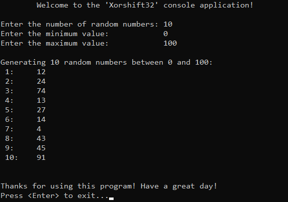

# &#128209; Table of Contents
- [💡 Overview](#-overview)
  - [Introduction](#introduction)
  - [Important Details](#important-details)
  - [Algorithm Steps](#algorithm-steps)
- [💻 Implementation](#-implementation)
  - [Design Decisions](#design-decisions)
  - [Complete Implementation](#complete-implementation)
  - [Detailed Walkthrough](#detailed-walkthrough)
- [📊 Analysis](#-analysis)
  - [Algorithm Characteristics](#algorithm-characteristics)
  - [Trade-Offs](#trade-offs)
- [📝 Application](#-application)
  - [Common Use Cases](#common-use-cases)
  - [Some Practical Problems](#some-practical-problems)
- [🕙 Origins](#-origins)
- [🤝 Contributing](#-contributing)
- [📧 Contacts](#-contacts)
- [🙏 Credits](#-credits)
- [🔏 License](#-license)


# &#128161; Overview
The **Xorshift32** is a lightweight and early pseudorandom number generator (PRNG) that generates numbers using exclusive OR (XOR) and bit shifts, avoiding expensive arithmetic operations. The **Xorshift** name represents a family of PRNGs that rely on efficient bitwise operations to transform their internal state, while individual variants modify the family name to indicate differences in state size, transformation steps, or additional modifications. Xorshift32 is named this way because its internal state is stored in a 32-bit variable, and all transformations operate within that fixed size. Knowledge and understanding of it lay a solid foundation for algorithmic design and tackling more complex problem-solving strategies.
<p align="center"></p>


## Introduction
Xorshift32 is a simple way to generate random numbers using bitwise operations. Instead of relying on complex mathematical formulas, it works by storing a number (internal state) and repeatedly modifying it using a combination of XOR (exclusive OR) and bit shifts. The shifts follow a specific sequence with constants selected through extensive testing to ensure a maximum period of $2^{32} - 1$ ($4,294,967,295$) and high-quality randomness. Each transformation efficiently spreads and mixes bits, producing values that are highly unpredictable. The updated number then becomes the new internal state, continuing the sequence.


## Important Details
1. Algorithm is highly depended on choosing the correct constants:
   - `a = 13` — the first shift constant, responsible for spreading higher bits into lower positions, ensuring a wider influence of bits across the state.  
   - `b = 17` — the second shift constant, applied in the opposite direction, introducing non-linearity and disrupting simple bit propagation.
   - `c = 5` — the final shift constant, further refining the randomness and ensuring additional scrambling of bits.
2. Algorithm is highly depended on choosing the correct order of shifts:
   - `<<` — the first left shift expands high-order bits into lower positions, ensuring that previously unoccupied bits gain new information.
   - `>>` — the right shift counteracts some of the previous expansion, introducing controlled bit reduction and increasing unpredictability.
   - `<<` — the final left shift reinforces mixing, ensuring that the transformation is not easily reversible and maximizes the spread of bit changes.


## Algorithm Steps
1. Set the internal state to an initial non-zero $32$-bit seed value.
2. Perform a left shift by 13 bits and XOR the result with the state:  
   ${\text{state} = \text{state} \oplus (\text{state} \ll 13)}$
3. Perform a right shift by 17 bits and XOR the result with the state:  
   ${\text{state} = \text{state} \oplus (\text{state} \gg 17)}$
4. Perform a left shift by 5 bits and XOR the result with the state:  
    ${\text{state} = \text{state} \oplus (\text{state} \ll 5)}$
5. Return the updated state as the next random number.
6. Repeat the process for each new number generated.


# &#x1F4BB; Implementation
The program prompts the user to enter the number of random values to generate and define the range, then it uses the implemented PRNG, Xorshift32, to generate and display the results.
<p align="center"></p>


## Design Decisions
To prioritize simplicity and emphasize algorithm itself, several design decisions were made:
- Utilizing the standard library type uint32_t to represent the internal state as a single 32-bit value.
- Using fixed seed value to ensure reproducible results.
- Choosing range values that are easily interpretable by humans ($0-100$).
- Limiting the number of elements to a relatively small ($10$).
- Assuming valid input values from the user.
- Omitting certain optimizations to the algorithm.


## Complete Implementation
PRNG is implemented within the class `Xorshift32`, which is declared in [Xorshift32.h](https://github.com/vezzolter/DSA/blob/xorshift/Algorithms/RNG/Xorshift32/Include/Xorshift32.h) header file and defined in [Xorshift32.cpp](https://github.com/vezzolter/DSA/blob/xorshift/Algorithms/RNG/Xorshift32/Source/Xorshift32.cpp) source file. This approach is adopted to ensure encapsulation, modularity and compilation efficiency. Examination of generated values is conducted within the `main()` function located in the [Main.cpp](https://github.com/vezzolter/DSA/blob/xorshift/Algorithms/RNG/Xorshift32/Source/Main.cpp) file. Below you can find declaration of the class.

```cpp
class Xorshift32 {
private:
	uint32_t state;

public:
	explicit Xorshift32(uint32_t seed);
	uint32_t generate();
};
```


## Detailed Walkthrough
1. Start by calling the constructor `Xorshift32()` with a seed value. This initializes the internal state with the given seed while ensuring it is never zero.
```cpp
  Xorshift32::Xorshift32(uint32_t seed) {
      state = seed ? seed : 1;
  }
```
2. Once the PRNG is initialized, the user can call the `generate()` function to produce a new random number. Inside this function, the internal state is modified using a sequence of XOR and shift operations discussed earlier.
```cpp
  state ^= state << 13;
  state ^= state >> 17;
  state ^= state << 5;
```
3. Return the updated state the next random number.
```cpp
  return state;
```
4. To make the generated value more practical and human-readable, a user-defined range can be applied. The range is defined by `maxVal` and `minVal`, which translates to `[minVal, maxVal)` and adding $1$ ensures inclusivity of the maximum value, resulting in the range `[minVal, maxVal]`. The modulo operator is then used to confine the PRNG output within `[0, range]`. Adding `minVal` shifts the range to `[minVal, maxVal]`, ensuring the final value is within the user’s desired range, therefore can be tested easily.
```cpp
	for (int i = 0; i < n; ++i) {
		uint32_t randomNumber = minVal + (prng.generate() % (maxVal - minVal + 1));
		std::cout << " " << i + 1 << ":\t" << randomNumber << std::endl;
	}
```

# &#128202; Analysis
Will be updated in future...

> **Note:** I'm currently considering how to best structure this section, as it involves several characteristics that I find intriguing to explore, such as period, distribution, predictability, and correlation.


# &#128221; Application
Currently in Progress...


## Common Use Cases
Currently in Progress...


## Some Practical Problems
Currently in Progress...


# &#x1F559; Origins
The Xorshift family of PRNGs was introduced in **2003** by American mathematician and computer scientist **George Marsaglia**. A pioneer in random number generation, Marsaglia had already made significant contributions to the field, including the **Marsaglia Polar Method** for generating normally distributed numbers and the **Ziggurat algorithm**. By the early 2000s, he was exploring fast, efficient PRNGs that relied purely on bitwise operations, aiming to eliminate costly arithmetic computations.

Marsaglia’s breakthrough came with the realization that exclusive OR (XOR) and bit shifts could be combined to produce high-speed random sequences with long periods. His 2003 paper, Xorshift RNGs, outlined the theory behind the method and provided tested shift constants that ensured maximum period length while maintaining good statistical properties. Xorshift PRNGs quickly gained attention due to their simplicity, efficiency, and suitability for performance-critical applications. Although Xorshift32 was the simplest form, variations such as **Xorshift128**, **Xorshift64**, and **Xorshift+** were later introduced to improve randomness and address statistical weaknesses. In **2014**, the development of **Xoshiro** and **Xoroshiro PRNGs** by **David Blackman** and **Sebastiano Vigna** built upon the principles of Xorshift, refining its statistical performance while maintaining its speed, ensuring its influence on the design of modern high-speed PRNGs.


# &#129309; Contributing
Contributions are highly appreciated! For detailed guidelines, please refer to the [root directory's contributing section](../../../#-contributing).


# &#128231; Contacts
For contact details and additional information, please refer to the [root directory's contact information section](../../../#-contacts).


# &#128591; Credits
&#127760; **Web-Resources:**  
- [Xorshift](https://en.wikipedia.org/wiki/Xorshift) (Wikipedia)
- [Xorshift RNGs](https://www.jstatsoft.org/article/view/v008i14) (Research Paper)
- [On the xorshift random number generators](https://www.researchgate.net/publication/220136542_On_the_xorshift_random_number_generators) (Research Paper)


# &#128271; License
This project is licensed under the MIT License — see the [LICENSE](https://github.com/vezzolter/DSA/blob/main/LICENSE) file for details.

[](https://opensource.org/licenses/MIT)