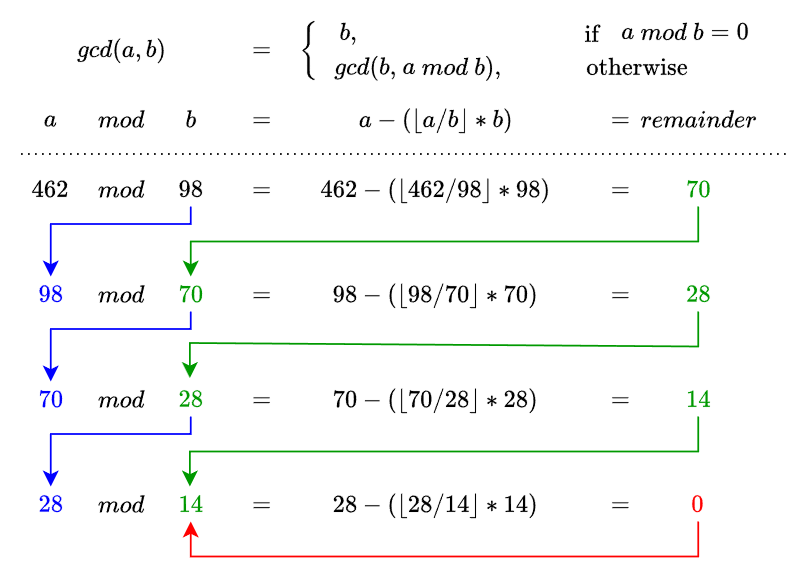
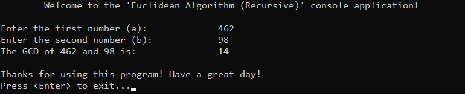

# &#128209; Table of Contents
- [💡 Overview](#-overview)
  - [Introduction](#introduction)
  - [Important Details](#important-details)
  - [Algorithm Steps (Recursive)](#algorithm-steps-recursive)
- [💻 Implementation](#-implementation)
  - [Design Decisions](#design-decisions)
  - [Complete Implementation](#complete-implementation)
  - [Detailed Walkthrough](#detailed-walkthrough)
- [📊 Analysis](#-analysis)
  - [Algorithm Characteristics](#algorithm-characteristics)
  - [Trade-Offs](#trade-offs)
- [📝 Application](#-application)
  - [Common Use Cases](#common-use-cases)
  - [Some Practical Problems](#some-practical-problems)
- [🕙 Origins](#-origins)
- [🤝 Contributing](#-contributing)
- [📧 Contacts](#-contacts)
- [🙏 Credits](#-credits)
- [🔏 License](#-license)


# &#128161; Overview
The **Euclidean Algorithm** is one of the oldest and most efficient methods for computing the greatest common divisor (GCD) of two integers, widely used in number theory, cryptography and various other algorithmic applications. It is named after the ancient Greek mathematician Euclid, who first described it in his work Elements. Knowledge and understanding of it, lays a solid foundation for algorithmic design and tackling more complex problem-solving strategies.
<p align="center"></p>


## Introduction
The core idea behind finding the GCD of two integers using the Euclidean algorithm is that we repeatedly replace the larger number with its remainder when divided by the smaller number, continuing until one of the numbers becomes zero. The last nonzero number is the GCD. Mathematically, this is expressed as:

$
\gcd(a, b) =
\begin{cases} 
b, & \text{if } (a \mod b) = 0 \\  
\gcd(b, a \mod b), & \text{otherwise}
\end{cases}
$


## Important Details
1. The algorithm operates on **two non-negative integers**.

2. The core property of algorithm lies in the fact that equation $\gcd(a, b) = \gcd(b, a \mod b)$ holds at every step, ensuring that the **GCD remains unchanged** throughout the process.

3. The algorithm can be implemented both **recursively and iteratively**, where the recursive approach mirrors the mathematical definition, while the iterative version is more efficient as it avoids function call overhead.

4. There are many other interesting concepts related to the Euclidean Algorithm, such as Bézout’s identity, the extended Euclidean algorithm, and its connection to LCM, but the most essential ones for a basic understanding of the algorithm have been covered.


## Algorithm Steps (Recursive)
1. Define the base case, based on the rule $\gcd(a, 0) = a$.
2. Define the recursive case, based on the rule $\gcd(a, b) = \gcd(b, a \mod b)$.


# &#x1F4BB; Implementation
The program prompts the user to input two non-negative integers, computes their GCD using a recursive implementation of the Euclidean Algorithm, and displays the result.  
<p align="center"></p>


## Design Decisions
To prioritize simplicity and emphasize algorithm itself, several design decisions were made:
- Assuming valid input values from the user.
- Omitting certain optimizations to the algorithm.


## Complete Implementation
Algorithm implemented within the function `euclidean()`, which is declared in [EuclideanAlgorithm.h](https://github.com/vezzolter/DSA/blob/main/Algorithms/Recursion/EuclideanAlgorithm/Include/EuclideanAlgorithm.h) header file and defined in [EuclideanAlgorithm.cpp](https://github.com/vezzolter/DSA/blob/main/Algorithms/Recursion/EuclideanAlgorithm/Source/EuclideanAlgorithm.cpp) source file. This approach is adopted to ensure encapsulation, modularity and compilation efficiency. Examination of factorial computation is conducted within the `main()` function located in the [Maincpp](https://github.com/vezzolter/DSA/blob/main/Algorithms/Recursion/EuclideanAlgorithm/Source/Main.cpp) file. Below you can find related code snippets.

```cpp
int euclidean(int a, int b) {
	if (b == 0) { return a; }
	return euclidean(b, a % b);
}
```


## Detailed Walkthrough
1. Start by setting up the base case, where if `b` $= 0$, the function immediately returns `a`. 
```cpp
  if (b == 0) { return a; }
```
2. If `b` $\neq 0$, proceed to the recursive step by calling the function with `b` as the new first argument and the remainder of dividing `a` by `b` as the new second argument. This progressively reduces the values of `a` and `b` until the base case is reached.
```cpp
  return euclidean(b, a % b);
```


# &#128202; Analysis
Understanding the characteristics of an algorithm is essential for choosing the right solution to a problem, as it reveals their impact on resource utilization, potential limitations, and capabilities. Additionally, understanding its strengths and weaknesses enables more informed decisions, helping to determine the most suitable algorithm for a given problem among alternative approaches.


## Algorithm Characteristics
- **Time Complexities:**  
  - $O(\log \min(a, b))$ — the number of recursive calls is determined by how many times the smaller number can be reduced before reaching zero, as each step shrinks the remainder to at most half of the previous value in the worst case, causing the number to decrease exponentially and resulting in a logarithmic number of steps.
- **Auxiliary Space Complexity:** 
   - $O(\log \min(a, b))$ — the recursion depth corresponds to the number of times the algorithm reduces the problem size before termination. Since each call processes a smaller remainder, the total number of recursive calls—and thus the stack depth—is logarithmic in the size of the input.


## Trade-Offs
➕ **Advantages:**  
- **Easy to Follow** — algorithm consists of a two simple steps making it straightforward to understand and apply.  
- **Fast Computation** — algorithm efficiently finds the GCD in $O(\log \min(a, b))$ time, with variations (e.g. extended, binary) further optimizing performance in specific cases.  
- **Robust Input Handling** — algorithm remains efficient even for very large numbers, making it robust in practical applications.

---  
➖ **Disadvantages:**  
- **Call Stack Overhead** — while algorithm requires auxiliary space for function calls in the recursive implementation, it can be reduced to $O(1)$ in the iterative version.  


# &#128221; Application
Understanding some of the most well-known use cases of an algorithm is crucial for grasping its practical relevance and potential impact in real-world scenarios. Additionally, familiarizing oneself with common practical problems and practicing their solutions ensures that you remember the essential details and develop a deep, intuitive understanding of the functionality and limitations.


## Common Use Cases
- **GCD Calculation** — algorithm is used to efficiently compute the GCD of two numbers. By iteratively reducing the problem size, it finds the largest integer that divides both numbers without a remainder, making it fundamental in number theory.

- **Fraction Simplification** — algorithm is applied to reduce fractions to their simplest form. By computing $\gcd(a, b)$, both the numerator and denominator can be divided by their GCD, ensuring the fraction is in its lowest terms.

- **Modular Arithmetic** — algorithm is used to compute modular inverses in number theory and cryptography. The Extended Euclidean Algorithm finds coefficients satisfying $ax + by = \gcd(a, b)$, which is essential for solving modular equations and encryption systems like RSA.

- **Least Common Multiple Computation** — algorithm is utilized to compute the LCM efficiently. Using the formula $\text{lcm}(a, b) = \frac{|a \times b|}{\gcd(a, b)}$, it avoids prime factorization and speeds up LCM calculations.

- **Solving Diophantine Equations** — algorithm is used to determine integer solutions for linear Diophantine equations of the form $ax + by = c$. If $\gcd(a, b)$ divides $c$, integer solutions exist and can be computed using the Extended Euclidean Algorithm.


## Some Practical Problems
- [Find Greatest Common Divisor of Array](https://leetcode.com/problems/find-greatest-common-divisor-of-array)
- [Greatest Common Divisor of Strings](https://leetcode.com/problems/greatest-common-divisor-of-strings)
- [GCD Sort of an Array](https://leetcode.com/problems/gcd-sort-of-an-array)
- [Sorted GCD Pair Queries](https://leetcode.com/problems/sorted-gcd-pair-queries)
- [Greatest Common Divisor Traversal](https://leetcode.com/problems/greatest-common-divisor-traversal)


# &#x1F559; Origins
The Euclidean Algorithm, one of the oldest known algorithms still in use today, was first documented in Elements by the Greek mathematician **Euclid** around 300 BCE. It is difficult to pinpoint exactly how the idea behind the Euclidean Algorithm was first conceived, as it likely emerged from practical problems in measuring and dividing quantities rather than from a purely theoretical approach. Ancient mathematicians may have independently discovered its principles through trial and error while working with lengths, areas, and ratios, gradually formalizing the process into a structured algorithm over time.

Despite its long history, formal mathematical analysis of the Euclidean Algorithm only emerged in the 19th century. The first significant time complexity analysis is credited to **Gabriel Lamé** in 1844, who established that the number of steps is proportional to the number of digits in the smaller input. However, earlier work on the algorithm’s efficiency can be traced to **Antoine-André-Louis Reynaud** in 1811, **Émile Léger** in 1837, and **Pierre-Joseph-Étienne Finck** in 1841, who made key observations about its worst-case behavior and Fibonacci sequence connections.

Over time, the algorithm has been optimized and extended in various ways, including the Extended Euclidean Algorithm, which finds coefficients satisfying Bézout’s identity, and the Binary GCD Algorithm, which improves performance in certain cases.


# &#129309; Contributing
Contributions are highly appreciated! For detailed guidelines, please refer to the [root directory's contributing section](../../../#-contributing).


# &#128231; Contacts
For contact details and additional information, please refer to the [root directory's contact information section](../../../#-contacts).


# &#128591; Credits
&#128218; **Books:**
- **"Introduction to Algorithms" (3rd Edition)** — by Thomas H. Cormen, Charles E. Leiserson, Ronald L. Rivest and Clifford Stein
  - Section 31.2: Greatest common divisor
- **"Algorithms in C++, Parts 1-4: Fundamentals, Data Structure, Sorting, Searching" (3rd Edition)** — by Robert Sedgewick
  - Section 5.1: Recursive Algorithms
- **"Data Structures and Algorithm Analysis in C++" (4th Edition)** — by Mark Allen Weiss
  - Section 2.4: Running-Time Calculations
- **"The Algorithm Design Manual" (2nd Edition)** — by Steven S. Skiena
  - Section 9.2.3: Least Common Multiple

---
&#127891; **Courses:**
- [Mastering Data Structures & Algorithms using C and C++](https://www.udemy.com/course/datastructurescncpp/) on Udemy
   - Section 5: Recursion

---
&#127760; **Web-Resources:**
- [Euclidean algorithm](https://en.wikipedia.org/wiki/Euclidean_algorithm) (Wikipedia)
- [Greatest common divisor](https://en.wikipedia.org/wiki/Greatest_common_divisor) (Wikipedia)
- [Origins of the Analysis of the Euclidean Algorithm ](https://www.sciencedirect.com/science/article/pii/S0315086084710317/pdf?md5=8f1036a4e7079a56daf22434498f19a6&pid=1-s2.0-S0315086084710317-main.pdf) (Research Paper)


# &#128271; License
This project is licensed under the MIT License — see the [LICENSE](https://github.com/vezzolter/DSA/blob/main/LICENSE) file for details.

[](https://opensource.org/licenses/MIT)