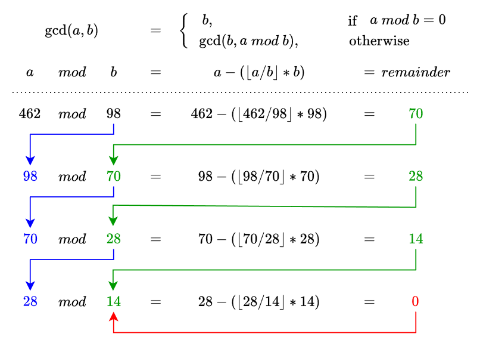

# 📑 Table of Contents
- [💡 Overview](#-overview)
  - [Introduction](#introduction)
  - [Important Details](#important-details)
  - [Algorithm Steps](#algorithm-steps)
- [💻 Implementation](#-implementation)
  - [Design Decisions](#design-decisions)
  - [Complete Implementation](#complete-implementation)
  - [Detailed Walkthrough](#detailed-walkthrough)
  - [Call Stack Interaction](#call-stack-interaction)
- [📊 Analysis](#-analysis)
  - [Algorithm Characteristics](#algorithm-characteristics)
  - [Algorithm Comparison](#algorithm-comparison)
- [📝 Application](#-application)
  - [Common Use Cases](#common-use-cases)
  - [Some Practical Problems](#some-practical-problems)
- [🕙 Origins](#-origins)
- [🤝 Contributing](#-contributing)
- [📧 Contacts](#-contacts)
- [🙏 Credits](#-credits)
- [🔏 License](#-license)

# 💡 Overview
The **Euclidean Algorithm** is one of the oldest and most efficient methods for computing the greatest common divisor (GCD) of two integers, widely used in number theory and various algorithmic applications. It is named after the ancient Greek mathematician Euclid, who first described it in his work Elements. Knowledge and understanding of it, lays a solid foundation for algorithmic design and tackling more complex problem-solving strategies.

## Introduction
Currently in Progress...

## Important Details
Currently in Progress...

## Algorithm Steps
Currently in Progress...

# &#x1F4BB; Implementation
Currently in Progress...

## Design Decisions
Currently in Progress...

## Complete Implementation
Currently in Progress...

## Detailed Walkthrough
Currently in Progress...

## Call Stack Interaction
Currently in Progress...

# &#128202; Analysis
Currently in Progress...

## Algorithm Characteristics
Currently in Progress...

## Algorithm Comparison
Currently in Progress...

# &#128221; Application
Currently in Progress...

## Common Use Cases
Currently in Progress...

## Some Practical Problems
Currently in Progress...

# &#x1F559; Origins
Currently in Progress...

# &#129309; Contributing
Contributions are highly appreciated! For detailed guidelines, please refer to the [root directory's contributing section](../../../#-contributing).

# &#128231; Contacts
For contact details and additional information, please refer to the [root directory's contact information section](../../../#-contacts).

# &#128591; Credits
&#128218; **Books:**
- **"Introduction to Algorithms" (3rd Edition)** — by Thomas H. Cormen, Charles E. Leiserson, Ronald L. Rivest and Clifford Stein
  - Section 31.2: Greatest common divisor
- **"Algorithms in C++, Parts 1-4: Fundamentals, Data Structure, Sorting, Searching" (3rd Edition)** — by Robert Sedgewick
  - Section 5.1: Recursive Algorithms
- **"Data Structures and Algorithm Analysis in C++" (4th Edition)** — by Mark Allen Weiss
  - Section 2.4: Running-Time Calculations
- **"The Algorithm Design Manual" (2nd Edition)** — by Steven S. Skiena
  - Section 9.2.3: Least Common Multiple

---
&#127891; **Courses:**
- [Mastering Data Structures & Algorithms using C and C++](https://www.udemy.com/course/datastructurescncpp/) on Udemy
   - Section 5: Recursion

---
&#127760; **Web-Resources:**
- [Euclidean algorithm](https://en.wikipedia.org/wiki/Euclidean_algorithm) (Wikipedia)
- [Greatest common divisor](https://en.wikipedia.org/wiki/Greatest_common_divisor) (Wikipedia)

# &#128271; License
This project is licensed under the MIT License — see the [LICENSE](https://github.com/vezzolter/DSA/blob/main/LICENSE) file for details.

