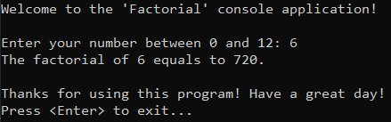
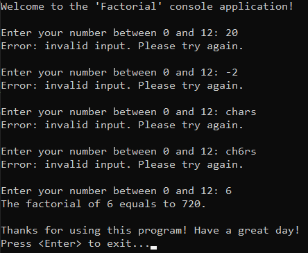
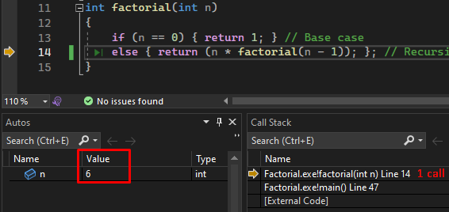
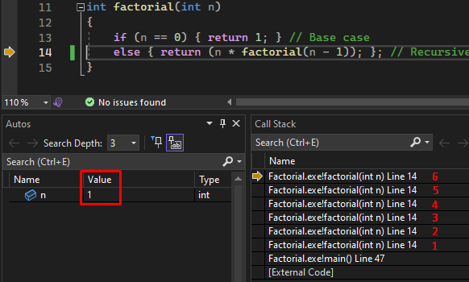
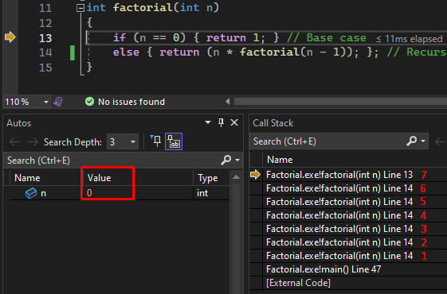
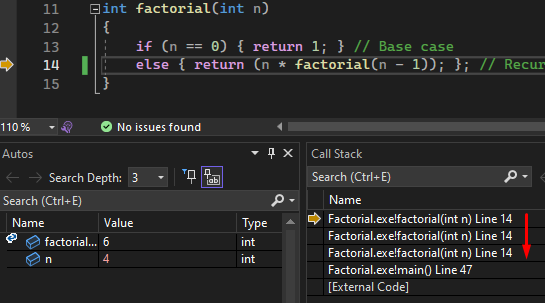
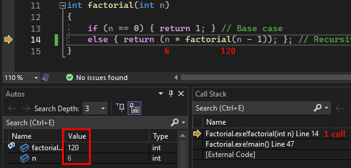
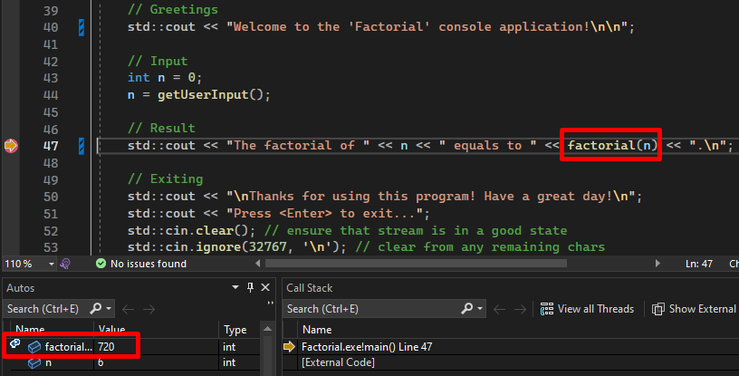

# &#128209; Table of Contents
- [💡 Overview](#-overview)
- [💻 Implementation](#-implementation)
  - [Recursive Paragidm](#recursive-paragidm)
  - [Detailed Overview](#detailed-overview)
  - [Call Stack Interaction](#call-stack-interaction)
- [📊 Analysis](#-analysis)
- [📝 Application](#-application)
- [🕙 Origins](#-origins)
- [🤝 Contributing](#-contributing)
- [📧 Contacts](#-contacts)
- [🙏 Credits](#-credits)
- [🔏 License](#-license)


# &#128161; Overview
The factorial stands among the fundamental mathematical patterns with widespread applications in permutation and combinatorial algorithms. It serves as an excellent example for understanding recursive principles in mathematics and computer science. A thorough understanding of the factorial enhances problem-solving skills and lays the foundation for tackling more complex mathematical and computational challenges.

---
**Factorial of a Number (n!)** — is a math operation, which represents product of all positive integers from number 1 to the given(n),   
e.g. $4! = 1×2×3×4 = 24$.

**Main Rules:**
- number must be a non-negative integer
- $0! = 1$ *(there is only one way to arrange 0 as element)*
- $n! = (n-1)!×n$  


# &#x1F4BB; Implementation
**Idea**  
The program prompts the user to input a number for which the factorial is to be calculated and then displays the resulting output.
<p align="center"></p>

## Recursive Paragidm
Technically speaking, factorial can be implemented using both iterative and recursive approach. Even though, iterative solutions are often preferred over recursive ones (due to space complexity, performance, readabillity, stack overflow, optimization limitations), the last approach was chosen within the context of this repository's section.


## Detailed Overview
1. In order to prioritize simplicity and highlight algorithm itself, `int` is picked as data type. 

2. For the same reasons, the algorithm is implemented within the function named `factorial(int n)`, and this function is separated into distinct files `factorial.h` and `factorial.cpp` away from `main.cpp`:
```cpp
int main()
{
   // Greetings
   std::cout << "Welcome to the 'Factorial' console application!\n\n";

   // Input
   int n = 0;
   n = getUserInput();

   // Result
   std::cout << "The factorial of " << n << " equals to " << factorial(n) << ".\n";
      
   // Exiting
   std::cout << "\nThanks for using this program! Have a great day!\n";
   std::cout << "Press <Enter> to exit...";
   std::cin.clear(); // ensure that stream is in a good state
   std::cin.ignore(32767, '\n'); // clear from any remaining chars
   std::cin.get();
   return 0;
}
```

3. The program starts by asking user to enter a non-negative number within specified range and validates the input all via function `getUserInput()` in the `main.cpp` file. The range limit is dictated by the size of data type in order to prevent overflow. Therefore, the range for the number is $[0;12]$, because the factorial of $13 (6,227,020,800)$ exceeds the capacity of `int` variable $(2,147,483,647)$.
```cpp
int getUserInput()
{
   int n = 0;
   
   while (true)
   {
      std::cout << "Enter your number between 0 and 12: ";
      std::cin >> n;
      
      if (std::cin.fail() || n < 0 || n > 12)
      {
         std::cin.clear(); // ensure that stream is in a good state
         std::cin.ignore(32767, '\n'); // clear from any remaining chars
         std::cout << "Error: invalid input. Please try again.\n\n"; // inform
      }
      else { break; }
   }

	return n;
}
```
<p align="center"></p>

4. Then control flow is directed to the `factorial(int n)` function, where until the number is not equal to zero, the recursive function will call itself, continuously progressing towards this condition:
    - **Base case** — adheres to the rule $0! = 1$, establishing a termination point for the recursion.
    - **Recursive case** — fulfills the other rule $n! = (n - 1)! × n$, breaking down the factorial calculation, until reaching the base case.
```cpp
int factorial(int n)
{
	if (n == 0) { return 1; } // Base case
	else { return (n * factorial(n - 1)); }; // Recursive case
}
```

5. After completing its intended tasks, the program expresses gratitude and awaits closure.


## Call Stack Interaction
To offer a comprehensive insight into the fundamental mechanics of this recursive approach, here is presented a step-by-step execution of the algorithm along with a detailed description of its interaction with the call stack.

1. Starting the recursion process with the input number 6
<p align="center"></p> 

2. Invoking the recursive case repeatedly until the specified criteria are met (6 times).
<p align="center"></p> 

3. Upon the 7th recursive call, when the value becomes 0, we initiate the base case, therefore existing the recursive process.
<p align="center"></p>

4. This marks the phase where the recursion is concluding, and the process of returning the calculated value is underway.
<p align="center"></p> 

5. Continuing this process until we reach the initial (first) function call.
<p align="center"></p>

6. Concluding the recursion by returning the final calculated value.    
<p align="center"></p> 


# &#128202; Analysis
The current implementation demonstrates inefficient utilization of recursion ([as mentioned earlier, during the discussion of the paradigm approach](#recursive-paragidm)). Simply by converting it into a loop, the running time can be significantly diminished, and there won't be any additional memory allocation involved at all (common designing principle discussed in [recursion](https://github.com/vezzolter/DSA/tree/main/Algorithms/Recursion/Recursion.md) file).

**Time Complexity:** $O(n)$ — number of recursive calls made by this algorithm is directly proportional to the input.  
**Auxiliary Space Complexity:** $O(n)$ — some memory gets allocated in the stack, which depends on the amount of calls.


# &#128221; Application
Practically speaking, factorial is a **number of different permutations** you can have with items. Consequently, is it widely used in the field of computer science, especially in combinatorics and probability theory. Here I'll provide only the fundamental overview of what you can think of, whenever you refer to the factorial, without overwhelming with redundant intricacies.

For better understanding of the topic, I'll govern the **Fundamental Counting Principle**, which states that if there are $m$ ways to do one thing and $n$ ways to do another, then there are $m×n$ ways to do both. For example creating a meal, if you have $3$ different main courses, $4$ different side dishes and $2$ drinks, this means that you can create a meal in $3×4×2=24$ ways.  

Additionally, when selecting from a consistent pool of options (e.g. such as picking from a single shelf of books), it is crucial to note a key principle. With each selection of an element $n$, the available options for the next selection reduce by one $(n−1)$ due to the previous selection. This reflects the diminishing pool of choices as elements are chosen **sequentially**.

---
**Well-known combinatoric operations involving factorials:**
1. **Permutation** — is a distinct arrangement of **all (n)** elements of a finite set $S$  in a **particular order**.  
   For example, if $S = \set{a, b, c}$, then $S$ has $6$ permutations $(3! = 6): abc, acb, bac, bca, cab, cba$.  
   The formula is: $P(n) = n!$  

   e.g. the total number of ways to permutate these (6) books is: $P(n) = 6×5×4×3×2×1 = 6! = 720$.

2. **Arrangement (k-permutation)** — is a distinct arrangement of **particular (k)** elements of a finite set $S$ in a **particular order**.  
   For example, if $S = \set{a, b, c}$, then possible 2-permutations $(k = 2)$ are: $ab, ac, ba, bc, ca, cb$.  
   The formula is: $A_n^k = \frac{n!}{(n-k)!}$  

   e.g. the total number of ways to arrange these (4) books apart from the first (6) is:  $A_n^k = \frac{6!}{(6-4)!} = \frac{6×5×4×3×2!}{2!} = 6×5×4×3 = 360$

3. **Combination**  — is an **unordered** arrangement of **particular (k)** elements of a finite set $S$.  
   For example, if $S = \set{a, b, c}$, then possible 2-combinations $(k = 2)$ are: $ab, ac, bc$.  
   The formula is: $C_n^k = \frac{n!}{(n-k)!k!}$

   e.g. the total number of ways to pack these (3) books apart from second shelf (4) is:  $C_n^k = \frac{4!}{(4-3)!3!} = \frac{4!}{1!3!} = \frac{4×3!}{1×3!} = \frac{4×1}{1×1} = 4$
   

# &#x1F559; Origins
Throughout human history, we have proven to be inherently drawn to stories, as understanding and retaining information is more effective through narrative and association. Realizing the potential, this historical section is included, offering a versatile approach to additional comprehension.

While the exact historical moment of the discovery of factorials remains elusive, the concept likely emerged organically as mathematicians grappled with combinatorial questions over centuries. Unlike some mathematical concepts with well-documented stories, the origin of factorials might be attributed to the collective evolution of mathematical thought rather than a single revelatory moment.

However, the term **factorial** was coined by French mathematician **Christian Kramp** in **1808**. Kramp's notation $n!$ brought a standardized and concise representation to express the product of all positive integers up to $n$. This notation became widely adopted and is fundamental in modern mathematics.


# &#129309; Contributing
Contributions are highly appreciated! For detailed guidelines, please refer to the [root directory's contributing section](../../../#-contributing).


# &#128231; Contacts
For contact details and additional information, please refer to the [root directory's contact information section](../../../#-contacts).


# &#128591; Credits
&#128218; **Books:**
- **"Introduction to Algorithms" (3rd Edition)** — by Thomas H. Cormen, Charles E. Leiserson, Ronald L. Rivest and Clifford Stein
  - Appendix C: Counting and Probability.
- **"Data Structures and Algorithm Analysis in C++" (4th Edition)** — by Mark Allen Weiss
  - Section 2.4: Running-Time Calculations.
- **"Algorithms in C++, Parts 1-4: Fundamentals, Data Structure, Sorting, Searching" (3rd Edition)** — by Robert Sedgewick
  - Section 5.1: Recursive Algorithms.

---
&#127891; **Courses:**
- [Mastering Data Structures & Algorithms using C and C++](https://www.udemy.com/course/datastructurescncpp/) on Udemy
   - Section 5: Recursion

---
&#127760; **Web-Resources:**
- [Factorial](https://en.wikipedia.org/wiki/Factorial) (Wikipedia)
- [What is a Factorial? How to Calculate Factorials with Examples](https://www.freecodecamp.org/news/what-is-a-factorial/#:~:text=A%20factorial%20is%20a%20mathematical,1%20(which%20%3D%206).)
- [What is a Factorial in Maths](https://www.geeksforgeeks.org/factorial/) 
- [Permutations and Factorials](https://www.youtube.com/watch?v=e28WnaMQ0ts) (Video)
- [Fundamental Counting Principle](https://brilliant.org/wiki/fundamental-counting-principle/#:~:text=The%20fundamental%20counting%20principle%20is,perform%20both%20of%20these%20actions.)
- [The Factorial Notation | Christian Kramp | 1808](https://www.mysciencehistory.com/blog/2021/2/22/the-factorial-notation-christian-kramp)


# &#128271; License
This project is licensed under the MIT License — see the [LICENSE](https://github.com/vezzolter/DSA/blob/main/LICENSE) file for details.

[](https://opensource.org/licenses/MIT)