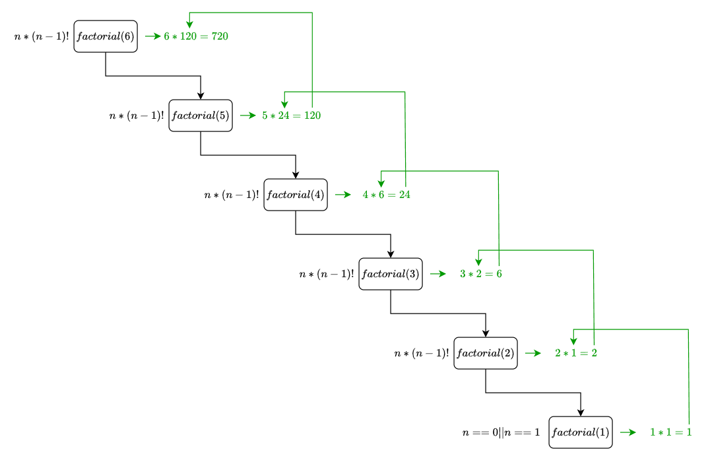
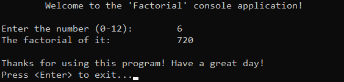

# &#128209; Table of Contents
- [💡 Overview](#-overview)
  - [Introduction](#introduction)
  - [Important Details](#important-details)
  - [Algorithm Steps (Recursive)](#algorithm-steps-recursive)
- [💻 Implementation](#-implementation)
  - [Design Decisions](#design-decisions)
  - [Complete Implementation](#complete-implementation)
  - [Detailed Walkthrough](#detailed-walkthrough)
- [📊 Analysis](#-analysis)
  - [Algorithm Characteristics](#algorithm-characteristics)
  - [Trade-Offs](#trade-offs)
- [📝 Application](#-application)
  - [Common Use Cases](#common-use-cases)
  - [Some Practical Problems](#some-practical-problems)
- [🕙 Origins](#-origins)
- [🤝 Contributing](#-contributing)
- [📧 Contacts](#-contacts)
- [🙏 Credits](#-credits)
- [🔏 License](#-license)


# &#128161; Overview
The **factorial** is one of the most fundamental mathematical operations, widely recognized for its role in combinatorics, permutations, and many other mathematical contexts. The term «factorial» comes from «factor», as the operation involves multiplying a sequence of factors to produce a product. Knowledge and understanding of it, lays a solid foundation for algorithmic design and tackling more complex problem-solving strategies.
<p align="center"></p>


## Introduction
**Factorial** of a number (denoted $n!$) is a math operation, which represents product of all positive integers from number $1$ to the given $(n)$, mathematically expressed as $n! = n × (n-1)!$ and the only exception is $0! = 1$, because there is only one way to arrange $0$ as element. 


## Important Details
1. Number must be a non-negative integer.
2. There are several approaches to implement a factorial function: iterative, recursive, memoization, lookup table, Stirling's approximation.
3. It's crucial to account for data type limitations, as the factorial function grows very quickly. Large inputs can easily exceed the capacity of standard data types, leading to overflow.


## Algorithm Steps (Recursive)
1. Define base case, based on the rule: $0! = 1$.
2. Define recursive case, based on the rule: $n! = n × (n-1)!$.


# &#x1F4BB; Implementation
The program prompts the user to input a number between $0$ and $12$, computes its factorial using a recursive algorithm, and displays the result.
<p align="center"></p>


## Design Decisions
To prioritize simplicity and emphasize algorithm itself, several design decisions were made:
- Limiting the range of possible values for number to $[0, 12]$ since factorial of $13 (6,227,020,800)$ exceeds the capacity of `int` variable $(2,147,483,647)$
- Assuming valid input values from the user.
- Omitting certain optimizations to the algorithm.


## Complete Implementation
Algorithm implemented within the function `factorial()`, which is declared in [Factorial.h](https://github.com/vezzolter/DSA/blob/main/Algorithms/Recursion/Factorial/Include/Factorial.h) header file and defined in [Factorial.cpp](https://github.com/vezzolter/DSA/blob/main/Algorithms/Recursion/Factorial/Source/Factorial.cpp) source file. This approach is adopted to ensure encapsulation, modularity and compilation efficiency. Examination of factorial computation is conducted within the `main()` function located in the [Main.cpp](https://github.com/vezzolter/DSA/blob/main/Algorithms/Recursion/Factorial/Source/Main.cpp) file. Below you can find related code snippets.

```cpp
  int factorial(int n) {
	  if (n == 0 || n == 1) { return 1; }
	  return n * factorial(n - 1);
  }
```


## Detailed Walkthrough
1. We start by setting up the base case, where if the number is $0$ or $1$, the function immediately returns $1$ since the factorial of both is defined as $1$.
```cpp
  if (n == 0 || n == 1) { return 1; }
```
2. If the number is greater than $1$, the function recursively calls itself, multiplying the current number $n$ by the factorial of $n-1$, progressively reducing the problem until the base case is reached.    
```cpp
  return n * factorial(n - 1);
```


# &#128202; Analysis
Understanding the characteristics of an algorithm is essential for choosing the right solution to a problem, as it reveals their impact on resource utilization, potential limitations and capabilities. Comparing the algorithm with other approaches provides insights into its strengths and weaknesses, helping to make informed decisions in various scenarios.


## Algorithm Characteristics
- **Time Complexity:**
    - $O(n)$ — the algorithm makes exactly $n$ recursive calls, reducing the problem size by one at each step, leading to a linear runtime.
- **Auxiliary Space Complexity:** 
   - $O(n)$ — the recursion stack grows linearly with the input size as each recursive call adds a new frame to the stack until the base case is reached, requiring memory proportional to $n$.


## Trade-Offs
➕ **Advantages:**  
- **Simplicity and Clarity** — algorithm follows a straightforward recursive structure where each call reduces the problem size by one, making it easy to implement and reason about.  

---  
➖ **Disadvantages:**  
- **Call Stack Overhead** — recursive calls consume additional memory on the stack, which can cause stack overflow for large inputs.
- **Slow Computation** — algorithm performs a large number of multiplications as input size increases, making it inefficient for very large numbers compared to optimized iterative approaches. 


# &#128221; Application
Understanding some of the most well-known use cases of an algorithm is crucial for grasping its practical relevance and potential impact in real-world scenarios. Additionally, familiarizing oneself with common practical problems and practicing their solutions ensures that you remember the essential details and develop a deep, intuitive understanding of the functionality and limitations.


## Common Use Cases
- **Mathematics** — factorial is widely used in mathematical contexts. It gives the number of different permutations for a set of items, which can be directly applicable or adapted for use in fields like combinatorics, probability, and statistics, all of which are essential in many real-life areas.
   

## Some Practical Problems
1. [Factorial Trailing Zeroes](https://leetcode.com/problems/factorial-trailing-zeroes)
2. [Clumsy Factorial](https://leetcode.com/problems/clumsy-factorial)
3. [Memoize](https://leetcode.com/problems/memoize)


# &#x1F559; Origins
Throughout human history, we have proven to be inherently drawn to stories, as understanding and retaining information is more effective through narrative and association. Realizing the potential, this historical section is included, offering a versatile approach to additional comprehension.

While the exact historical moment of the discovery of factorials remains elusive, the concept likely emerged organically as mathematicians grappled with combinatorial questions over centuries. Unlike some mathematical concepts with well-documented stories, the origin of factorials might be attributed to the collective evolution of mathematical thought rather than a single revelatory moment.

However, the term **factorial** was coined by French mathematician **Christian Kramp** in **1808**. Kramp's notation $n!$ brought a standardized and concise representation to express the product of all positive integers up to $n$. This notation became widely adopted and is fundamental in modern mathematics.


# &#129309; Contributing
Contributions are highly appreciated! For detailed guidelines, please refer to the [root directory's contributing section](../../../#-contributing).


# &#128231; Contacts
For contact details and additional information, please refer to the [root directory's contact information section](../../../#-contacts).


# &#128591; Credits
&#128218; **Books:**
- **"Algorithms in C++, Parts 1-4: Fundamentals, Data Structure, Sorting, Searching" (3rd Edition)** — by Robert Sedgewick
  - Section 5.1: Recursive Algorithms
- **"Data Structures and Algorithm Analysis in C++" (4th Edition)** — by Mark Allen Weiss
  - Section 2.4: Running-Time Calculations

---
&#127891; **Courses:**
- [Mastering Data Structures & Algorithms using C and C++](https://www.udemy.com/course/datastructurescncpp/) on Udemy
   - Section 5: Recursion

---
&#127760; **Web-Resources:**
- [Factorial](https://en.wikipedia.org/wiki/Factorial) (Wikipedia)


# &#128271; License
This project is licensed under the MIT License — see the [LICENSE](https://github.com/vezzolter/DSA/blob/main/LICENSE) file for details.

[](https://opensource.org/licenses/MIT)