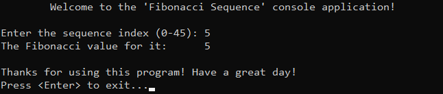

# &#128209; Table of Contents
- [💡 Overview](#-overview)
  - [Introduction](#introduction)
  - [Important Details](#important-details)
  - [Algorithm Steps (Recursive)](#algorithm-steps-recursive)
- [💻 Implementation](#-implementation)
  - [Design Decisions](#design-decisions)
  - [Complete Implementation](#complete-implementation)
  - [Detailed Walkthrough](#detailed-walkthrough)
- [📊 Analysis](#-analysis)
  - [Algorithm Characteristics](#algorithm-characteristics)
  - [Trade-Offs](#trade-offs)
- [📝 Application](#-application)
  - [Common Use Cases](#common-use-cases)
  - [Some Practical Problems](#some-practical-problems)
- [🕙 Origins](#-origins)
- [📖 Resources](#-resources)
- [🤝 Contributing](#-contributing)
- [🔏 License](#-license)


# &#128161; Overview
The **Fibonacci sequence** is one of the simplest and earliest known sequences defined by a recurrence relation, which stands among the fundamental mathematical patterns with widespread applications in algorithms and data structures. It is named after Leonardo of Pisa, who introduces it to Western mathematics. Knowledge and understanding of it lay a solid foundation for algorithmic design and tackling more complex problem-solving strategies.
<p align="center"></p>


## Introduction
**Fibonacci Sequence** is a series of numbers, where each number is the sum of the two preceding numbers. Traditionally starts with $0$ and $1$ (but can start with different initial values), forming following sequence: $0, 1, 1, 2, 3, 5, 8, 13, 21, 34, 89, 144, 233, 377$ and so on. The terms of this sequence are known as **Fibonacci numbers** and can be denoted as $F_n$, therefore general formula can be recursively written as $F_n = F_{n-1} + F_{n-2}$.


## Important Details
- The other related concept to the Fibonacci Sequence is **golden ratio** ($\Phi = \frac{1+\sqrt{5}}{2} ≈ 1.61803398875$) — is an irrational number, which appears between ratio of bigger and smaller value, holding property: $\frac{bigger+smaller}{bigger} = \frac{bigger}{smaller} = \phi$
- Ratio of any two consecutive Fibonacci numbers, gets closer to the golden ratio ($\Phi$) as the numbers get larger,  
e.g. $\frac{13}{8} = 1.625$; $\frac{233}{144} = 1.61805$
- Having one Fibonacci number, the next/previous neighbor can be approximately calculated by multiplying/dividing it with golden ration,  
e.g. $5×1.618034=8.09017$ and $21÷1.618034=12.97871$.
- Any Fibonacci number can be precisely calculated by using Binet's formula $F_n = \frac{\phi^n-(1-\phi)^n}{\sqrt{5}}$,  
e.g. $F_8 = \frac{\phi^8-(1-\phi)^8}{\sqrt{5}} = \frac{\big(\frac{1+\sqrt{5}}{2}\big)^8-\big(1-\frac{1+\sqrt{5}}{2}\big)^8}{\sqrt{5}}=\frac{\frac{(1+\sqrt{5})^8}{2^8}-\frac{(1-\sqrt{5})^8}{2^8}}{\sqrt{5}}=\frac{(1+\sqrt{5})^8-(1-\sqrt{5})^8}{2^8\sqrt{5}}=\frac{\big((1+\sqrt{5})^8-(1-\sqrt{5})^8\big)\sqrt{5}}{1280}=$  
$=\frac{\big(6016+2688\sqrt{5}-6016+2688\sqrt{5} \big)\sqrt{5}}{1280}=\frac{(5376\sqrt{5})\sqrt{5}}{1280}=\frac{26880}{1280}=21$
- There are numerous fascinating properties of the Fibonacci sequence yet to be explored (such as terms below zero, alternation of even and odd numbers, 1/89, etc).


## Algorithm Steps (Recursive)
1. Define the base case, based on the rule «$F(0) = 0$» and «$F(1) = 1$».
2. Define the recursive case, based on the rule «$F(n) = F(n-1) + F(n-2)$».


# &#x1F4BB; Implementation
The program prompts the user to input a number representing the position of a Fibonacci number, calculates the corresponding Fibonacci value using a recursive algorithm, and then displays the result.
<p align="center"></p>


## Design Decisions
To prioritize simplicity and emphasize algorithm itself, several design decisions were made:
- Limiting the range of possible value for elements to $[0, 45]$, since computation of $46$ element exceeds the capacity of `int` variable $(2,147,483,647)$
- Assuming valid input values from the user.
- Omitting certain optimizations to the algorithm.


## Complete Implementation
Algorithm implemented within the function `fibonacci()`, which is declared in [Fibonacci.h](https://github.com/vezzolter/DSA/blob/main/Algorithms/Recursion/Fibonacci/Include/Fibonacci.h) header file and defined in [Fibonacci.cpp](https://github.com/vezzolter/DSA/blob/main/Algorithms/Recursion/Fibonacci/Source/Fibonacci.cpp) source file. This approach is adopted to ensure encapsulation, modularity and compilation efficiency. Examination of fibonacci sequence computation is conducted within the `main()` function located in the [Main.cpp](https://github.com/vezzolter/DSA/blob/main/Algorithms/Recursion/Fibonacci/Source/Main.cpp) file. Below you can find related code snippets.

```cpp
  int fibonacci(int n) {
	  if (n <= 1) { return n; }
	  return fibonacci(n - 1) + fibonacci(n - 2);
  }
```


## Detailed Walkthrough
1. Start by setting up the base case, where if the input number is less than or equal to `1`, the function immediately returns the input value itself. This is because the Fibonacci sequence defines `F(0) = 0` and `F(1) = 1`.
```cpp
  if (n <= 1) { return n; }
```
2. If the number is greater than `1`, the function recursively calls itself twice: once for `fibonacci(n - 1)` and once for `fibonacci(n - 2)`. The results of these two recursive calls are added together to produce the Fibonacci number for the input `n`. This continues until the base case is reached for each recursive branch.
```cpp
  return fibonacci(n - 1) + fibonacci(n - 2);
```


# &#128202; Analysis
Understanding the characteristics of an algorithm is essential for choosing the right solution to a problem, as it reveals their impact on resource utilization, potential limitations, and capabilities. Additionally, understanding its strengths and weaknesses enables more informed decisions, helping to determine the most suitable algorithm for a given problem among alternative approaches.


## Algorithm Characteristics
- **Time Complexity:**
    - $O(2^n)$ — each function call branches into two more calls, leading to an exponential growth in the number of calls.
- **Auxiliary Space Complexity:** 
   - $O(n)$ — the maximum depth of the recursion tree is $n$ because each recursive call adds a new frame to the call stack until it reaches the base case.


## Trade-Offs
> **Note**: You should be aware of the fact that trade-offs are inherently dualistic and not intrinsic properties of objects or concepts; rather, they are human interpretations based on context, perspective, and priorities. Also, you should consider taking into account that more of them doesn’t always mean better decisions — the weight of impactful factors plays a role. The idea of trade-offs is that they are a heuristic tool (a mental shortcut for solving problems in a quick way that delivers a result sufficient enough to be useful given time constraints), meaning that they are not proof but cues to explore more, accept imperfect knowledge and make the best choice with the available data.

---
➕ **Advantages:**  
- **Simplicity and Clarity** — algorithm directly follows the mathematical recurrence relation of the Fibonacci sequence, making it easy to translate into code.  
- **Good for Small Inputs** — algorithm works fine for small input values where the growing number of function calls does not impact performance significantly.  

---  
➖ **Disadvantages:**  
- **Call Stack Overhead** — recursive calls consume additional memory on the stack, leading to inefficiency and potential stack overflow for large inputs.
- **Slow Computation** — algorithm repeatedly recalculates the same values, leading to excessive redundant work that slows down performance.
- **Lack of Reuse of Computed Values** — algorithm does not store previously computed results, causing unnecessary recomputation and inefficiency.


# &#128221; Application
Understanding some of the most well-known use cases of an algorithm is crucial for grasping its practical relevance and potential impact in real-world scenarios. Additionally, familiarizing oneself with common practical problems and practicing their solutions ensures that you remember the essential details and develop a deep, intuitive understanding of the functionality and limitations.


## Common Use Cases
- **Fibonacci Heaps** — sequence is used in priority queue data structures to manage heap-ordered trees. When two trees of the same rank are merged, the number of trees is reduced based on Fibonacci numbers, ensuring that the structure remains balanced and  contributing to the overall amortized time of operations.

- **Fibonacci Search** — sequence is used in algorithm to search within sorted arrays. The sequence’s predictable growth pattern helps determine optimal probing positions, minimizing the number of comparisons during the search process.

- **Lagged Fibonacci Generator (LFG)** — sequence is used in pseudo-random number generator. The recursive relationship of the sequence combines previous values with a lag, improving the statistical properties and period length of the generated sequence.


## Some Practical Problems
1. [Fibonacci Number](https://leetcode.com/problems/fibonacci-number)
2. [Climbing Stairs](https://leetcode.com/problems/climbing-stairs)
3. [Split Array into Fibonacci Sequence](https://leetcode.com/problems/split-array-into-fibonacci-sequence)
4. [Length of Longest Fibonacci Subsequence](https://leetcode.com/problems/length-of-longest-fibonacci-subsequence)
5. [Find the Minimum Number of Fibonacci Numbers Whose Sum Is K](https://leetcode.com/problems/find-the-minimum-number-of-fibonacci-numbers-whose-sum-is-k)


# &#x1F559; Origins
The first mention of sequence was around 200 BC done by Indian mathematician **Acharya Pingala** in his work on Sanskrit prosody. Though Pingala did not employ the modern notation or terminology, he comprehended the fundamental nature of the sequence and its correlation with the golden ratio. Later those series were mentioned by other indian mathematicians such as **Bharata Muni** and **Virahanka**,**Gopala**.

Centuries later, in 1170, an Italian mathematician named **Leonardo** was born in Pisa. As a teenager, he accompanied his father to work in the port city of Bugia, present-day Algeria, where he represented Italian merchants. In Bugia, Leonardo encountered numerous merchants using Hindi and Arab numerals in their calculations. Intrigued by the efficiency and simplicity of this numerical system, which contrasted with the widely used Roman numerals in Europe, Leonardo began to learn and appreciate the advantages of it.

Over the course of his life, Leonardo interacted with numerous merchants, absorbing knowledge from them and translating his insights into several books. These works covered the advantages of Hindu numerals, delved into various mathematical problems, explored geometry and delved into number theory. However, his most renowned contribution is arguably found in «Liber Abaci» (1202). In this book, Leonardo explained how adopting this numerical system could greatly simplify business transactions.

Besides popularizing the Hindu-Arabic numerical system, he introduced the discussed sequence while addressing a challenge linked to the proliferation of rabbit populations. Notably, he did not explicitly named it the «Fibonacci sequence». It was only later, as his books gained popularity, that the name «Fibonacci», derived from «filius Bonacci» (roughly meaning «son of the Bonacci family»), was coined by Franco-Italian historian Guillaume Libri in 1838 to distinguish him from other Leonardo.


# &#128214; Resources
&#128218; **Books:**
- **"Algorithms in C++, Parts 1-4: Fundamentals, Data Structure, Sorting, Searching" (3rd Edition)** — by Robert Sedgewick
  - Section 5.3: Dynamic programming
- **"Data Structures and Algorithm Analysis in C++" (4th Edition)** — by Mark Allen Weiss
  - Section 2.4: Running-Time Calculations
- **"The Art of Computer Programming, Volume 1: Fundamental Algorithms" (3rd Edition)** — by Donald Ervin Knuth 
  - Section 1.2.8: Fibonacci Numbers

---
&#127891; **Courses:**
- [Mastering Data Structures & Algorithms using C and C++](https://www.udemy.com/course/datastructurescncpp/) on Udemy
   - Section 5: Recursion

---
&#127760; **Web-Pages:**
- [Fibonacci Sequence](https://en.wikipedia.org/wiki/Fibonacci_sequence) (Wikipedia)
- [Golden ratio](https://en.wikipedia.org/wiki/Golden_ratio) (Wikipedia)
- [Golden ratio: A beginner's guide](https://www.adobe.com/creativecloud/design/discover/golden-ratio.html) (Article)
- [Binet's Formula](https://artofproblemsolving.com/wiki/index.php/Binet%27s_Formula) (Article)
- [The Fibonacci Sequence. Its history, Significance, and Manifestations in Nature](https://core.ac.uk/download/pdf/58824887.pdf) (Research Paper)
- [The so-called fibonacci numbers in ancient and medieval India](https://www.sciencedirect.com/science/article/pii/0315086085900217?via%3Dihub) (Research Paper)


# &#129309; Contributing
Contributions are highly appreciated! For detailed guidelines, contact details, and additional information, please refer to the [root directory's contributing section](../../../#-contributing).


# &#128271; License
This project is licensed under the MIT License — see the [LICENSE](https://github.com/vezzolter/DSA/blob/main/LICENSE) file for details.

[](https://opensource.org/licenses/MIT)