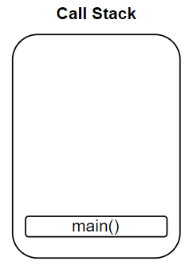

# &#128209; Table of Contents
- [💡 What is the Fibonacci Sequence](#-what-is-the-fibonacci-sequence)
- [💻 Implementation](#-implementation)
  - [Recursive Paragidm](#recursive-paragidm)
  - [Detailed Overview](#detailed-overview)
  - [Call Stack Interaction](#call-stack-interaction)
- [📊 Analysis](#-analysis)
- [📝 Application](#-application)
- [⏳ Historical Notes](#-historical-notes)
- [🤝 Contributing](#-contributing)
- [📧 Contact Information](#-contact-information)
- [🙏 Credits](#-credits)
- [🔏 License](#-license)


# &#128161; What is the Fibonacci Sequence

The Fibonacci sequence is one of the simplest and earliest known sequences defined by a recurrence relation, which stands among the fundamental mathematical patterns with widespread applications in algorithms and data structures. Knowledge of the Fibonacci sequence enhances problem-solving skills and lays the foundation for tackling more complex mathematical and computational challenges.

<p align="center">
       
</p>

---

**Fibonacci Seqence** — is a series of numbers, where each number is the sum of the two preceding numbers. Traditionally starts with $0$ and $1$ (but can start with different initial values), forming following sequence: $0, 1, 1, 2, 3, 5, 8, 13, 21, 34, 89, 144, 233, 377$ and so on. The terms of this sequence are known as **Fibonacci numbers** and can be denoted as $F_n$, therefore general formula can be recursively written as $F_n = F_{n-1} + F_{n-2}$.

The other related concept to the Fibonacci Sequence is **golden ratio** ($\Phi = \frac{1+\sqrt{5}}{2} ≈ 1.61803398875$) — is an irrational number, which appears between ratio of bigger and smaller value, holding property: $\frac{bigger+smaller}{bigger} = \frac{bigger}{smaller} = \phi$

**Relation Between Golden Ratio and Fibonacci Sequence:**
- Ratio of any two consecutive Fibonacci numbers, gets closer to the golden ratio ($\Phi$) as the numbers get larger,  
e.g. $\frac{13}{8} = 1.625$; $\frac{233}{144} = 1.61805$

- Having one Fibonacci number, the next/previous neighbour can be approximately calculated by multiplying/dividing it with golden ration,  
e.g. $5×1.618034=8.09017$ and $21÷1.618034=12.97871$.

- Any Fibonacci number can be precisely calculated by using Binet's formula $F_n = \frac{\phi^n-(1-\phi)^n}{\sqrt{5}}$,  
e.g. $F_8 = \frac{\phi^8-(1-\phi)^8}{\sqrt{5}} = \frac{\big(\frac{1+\sqrt{5}}{2}\big)^8-\big(1-\frac{1+\sqrt{5}}{2}\big)^8}{\sqrt{5}}=\frac{\frac{(1+\sqrt{5})^8}{2^8}-\frac{(1-\sqrt{5})^8}{2^8}}{\sqrt{5}}=\frac{(1+\sqrt{5})^8-(1-\sqrt{5})^8}{2^8\sqrt{5}}=\frac{\big((1+\sqrt{5})^8-(1-\sqrt{5})^8\big)\sqrt{5}}{1280}=$  
$=\frac{\big(6016+2688\sqrt{5}-6016+2688\sqrt{5} \big)\sqrt{5}}{1280}=\frac{(5376\sqrt{5})\sqrt{5}}{1280}=\frac{26880}{1280}=21$

---

While there are numerous fascinating properties of the Fibonacci sequence yet to be explored (such as terms below zero, alternation of even and odd numbers, 1/89, etc), for the scope of this subsection in the repository, the knowledge of the above would be sufficient to implement and comprehend the key ideas.


# &#x1F4BB; Implementation
**Idea**  
The program prompts the user to specify a number of an element, for which the Fibonacci Number is to be calculated, and then displays the resulting output.

<p align="center">
         
</p>

## Recursive Paragidm
Technically speaking, Fibonnaci sequence can be implemented using both iterative and recursive approach. For that particular problem iterative solutions are often preferred over recursive ones (due to space complexity, performance, readabillity, stack overflow, optimization limitations). Talking about last one, it is considered more efficient to use memoization or dynamic programming techniques to store previously computed Fibonacci numbers and avoid redundant calculations. However it is important to note that the chosen implementation deliberately emphasizes the recursive paradigm for clarity and instructional purposes.


## Detailed Overview
1. In order to prioritize simplicity and highlight algorithm itself, `int` is picked as data type.

2. For the same reasons, the algorithm is implemented within the function named `fibonacci(int n)`, and this function is separated into distinct files `fibonacci.h` and `fibonacci.cpp` away from `main.cpp`:
   ```cpp
   int main()
   {
     // Greetings
     std::cout << "Welcome to the 'Fibonacci Sequence' console application!\n\n";

     // Input
     int n = 0;
     n = getUserInput();

     // Output
     std::cout << "The Fibonacci Number for element '" << n << "' is " << fibonacci(n) << ".\n";

     // Exiting
     std::cout << "\nThanks for using this program! Have a great day!\n";
     std::cout << "Press <Enter> to exit...";
     std::cin.clear(); // ensure that stream is in a good state
     std::cin.ignore(32767, '\n'); // clear from any remaining chars
     std::cin.get();
     return 0;
   }
   ```

3. The program starts by asking user enter the number of an element within specified range and validates the input all via function `getUserInput()` in the `main.cpp` file. The range limit is dictated by the size of data type in order to prevent overflow. Therefore, the range for the number is $[0;45]$, because even though the Fibonacci Number of $46th$ element $(1,836,311,903)$ doesn't exceed the capacity of `int` variable $(2,147,483,647)$, the issue is with redundant calculations that occur during the recursive process.
   ```cpp
   int getUserInput()
   {
     int n = 0;

     while (true)
     {
       std::cout << "Specify the number of an element (0 to 45): ";
       std::cin >> n;

       if (std::cin.fail() || n < 0 || n > 45)
       {
         std::cin.clear(); // ensure that stream is in a good state
         std::cin.ignore(32767, '\n'); // clear from any remaining chars
         std::cout << "Error: invalid input. Please try again.\n\n"; // inform
       }
       else { break; }
     }

     return n;
   }
   ```

   Here is an example of how this function validates the user's input:
   <p align="center">
         
   </p>

4. Then control flow is directed to the `fibonacci(int n)` function, where until the element is not $0th$ or $1th$, the recursive function will call itself, continuously progressing towards this condition:
    - **Base case** — considers first elements as $F_0=0$ and $F_1 = 1$, establishing a termination point for the recursion.
    - **Recursive case** — adheres to the formula of general term $F_n = F_{n-1} + F_{n-2}$, breaking down the calculation, until base case is met.
   ```cpp
   int fibonacci(int n)
   {
     if (n <= 1) { return n; } // Base case
     else { return fibonacci(n - 1) + fibonacci(n - 2); } // Recursive case

   }
   ```

5. After completing its intended tasks, the program expresses gratitude and awaits closure.


## Call Stack Interaction
To enhance the clarity of the recursion process explanation, I'll illustrate it with a simple example using a relatively small number of elements, specifically $n=5$. This approach aims to avoid navigating to the development environment, where it becomes easier to lose track of the algorithm, especially with higher values.

1. First things first, the program calls `main()` function and its frame is added on top of the call stack.
   <p align="center">
      
   </p> 
2. When we encounter the call of `fibonacci(int n)` function, we add its frame (`fibonacci(5)`) on top of the call stack. As long as given number ($n=5$) is not equals to $0$ or $1$, we reach `return fibonacci(n - 1) + fibonacci(n - 2);` this part of function, where start to add two another frames - `fibonacci(4)` for `fibonacci(n - 1)` and  `fibonacci(3)` for `fibonacci(n - 2)`: 
   <p align="center">
      
   </p> 

3. This process of breaking of problem continues until we delve to the base cases, therefore forming next sequence of calls: 
   
   <p align="center">
      
   </p> 

4. Upon reaching base cases, the called functions now start to return values and pop off their frames from the stack.
   
   <p align="center">
      
   </p>

5. This visualization allows to see recursive nature in action and denoting, that there is no need to actually calculate some function calls, because they were already calculated in onther area. Unfortunatelly, this implementation of recursion can't affect that, thats the area of memoization and dynamic programming.
   
   <p align="center">
      
   </p> 

6. So the control flow continues this process until we reach the initial (first) function call.
   
   <p align="center">
      
   </p>


# &#128202; Analysis
The current implementation demonstrates inefficient utilization of recursion ([as mentioned earlier, during the discussion of the paradigm approach](#recursive-paragidm)). Running the program for elements around 40, it becomes notably slow due to a substantial amount of redundant work being executed (common designing principle discussed in [recursion](https://github.com/vezzolter/DSA/tree/main/Algorithms/Recursion/Recursion.md) file).

**Time Complexity:** $O(n!)$ — every function calls two other functions.  
**Auxiliary Space Complexity:** $O(n)$ — maximum depth of the recursion tree is $n$.


# &#128221; Application
 
The Fibonacci sequence, with its unique mathematical property also known as divine or golden proportion, extends beyond the realm of abstract numbers and finds practical applications in **various fields** (math, nature, art, architecture, etc.). Its most known influence can be observed in intricate designs, where the sequence dictates proportions and arrangements. Artists, designers and architects leverage the Fibonacci sequence to create visually stunning compositions. Some of them intentionally use its aesthetic benefits, while others may trace it coincidentally in their work. An excellent illustration is Leonardo da Vinci's Vitruvian Man, where he translated his fascination with the golden ratio into artistic expression.

In **computer science**, beside laying foundation for tackling more complex mathematical and computational concepts, is used in dynamic programming and memoization techniques to enhance the efficiency of algorithms, reducing redundant calculations and improving overall computational performance. 

---

**Some of the Most Well-Known Use Cases:**
- **Fibonacci Heaps** — a type of priority queue data structure, utilize the Fibonacci sequence to optimize the amortized time complexity of certain operations, such as decrease key and merge operations.
- **Fibonacci Search** — uses the Fibonacci sequence to determine positions to probe within a sorted array, therefore achieving a balance between efficiency and simplicity.
- **Lagged Fibonacci Generator (LFG)** — employs the Fibonacci sequence in a lagged recurrence relation to generate pseudo-random numbers. The algorithm combines two or more previous values, resembling the Fibonacci sequence, and introduces a lagged aspect for variations, impacting the statistical properties and period length of the generated sequence.


# &#x23F3; Historical Notes
The first mention of sequence was around 200 BC done by Indian mathematician **Acharya Pingala** in his work on Sanskrit prosody. Though Pingala did not employ the modern notation or terminology, he comprehended the fundamental nature of the sequence and its correlation with the golden ratio. Later those series were mentioned by other indian mathematicians such as **Bharata Muni** and **Virahanka**,**Gopala**.

Centuries later, in 1170, an Italian mathematician named **Leonardo** was born in Pisa. As a teenager, he accompanied his father to work in the port city of Bugia, present-day Algeria, where he represented Italian merchants. In Bugia, Leonardo encountered numerous merchants using Hindi and Arab numerals in their calculations. Intrigued by the efficiency and simplicity of this numerical system, which contrasted with the widely used Roman numerals in Europe, Leonardo began to learn and appreciate the advantages of it.

Over the course of his life, Leonardo interacted with numerous merchants, absorbing knowledge from them and translating his insights into several books. These works covered the advantages of Hindu numerals, delved into various mathematical problems, explored geometry and delved into number theory. However, his most renowned contribution is arguably found in "Liber Abaci" (1202). In this book, Leonardo explained how adopting this numerical system could greatly simplify business transactions.

Besides popularizing the Hindu-Arabic numerical system, he introduced the discussed sequence while addressing a challenge linked to the proliferation of rabbit populations. Notably, he did not explicitly named it the "Fibonacci sequence." It was only later, as his books gained popularity, that the name "Fibonacci", derived from "filius Bonacci" (roughly meaning "son of the Bonacci family"), was coined by Franco-Italian historian Guillaume Libri in 1838 to distinguish him from other Leonardo.


# &#129309; Contributing
Contributions are highly appreciated! For detailed guidelines, please refer to the [root directory's contributing section](../../../#-contributing).


# &#128231; Contact Information
For contact details and additional information, please refer to the [root directory's contact information section](../../../#-contact-information).


# &#128591; Credits
&#128218; **Books:**
- **"Data Structures and Algorithm Analysis in C++""** — by Mark A. Weiss
  - Section 2.4: Running-Time Calculations.
- **"Algorithms in C++, Parts 1-4"** — by Robert Sedgewick
  - Section 5.2: Dynamic programming.


&#127891;**Courses:**
- [Mastering Data Structures & Algorithms using C and C++](https://www.udemy.com/course/datastructurescncpp/?LSNPUBID=JVFxdTr9V80&ranEAID%3B=JVFxdTr9V80&ranMID%3B=39197&ranSiteID%3B=JVFxdTr9V80-_3GVcwGZFWT4XsSuZYrgGA&utm_source=adwords&utm_medium=udemyads&utm_campaign=DSA_Catchall_la.EN_cc.ROW&utm_content=deal4584&utm_term=_._ag_88010211481_._ad_535397282064_._kw__._de_c_._dm__._pl__._ti_dsa-406594358574_._li_9061020_._pd__._&matchtype=&gad_source=1&gclid=CjwKCAiA3aeqBhBzEiwAxFiOBgRFL7RkV-WJI9tPKml75et478Ai5oJigSKAivJ2txZ9Jhi0mhsTdxoC_foQAvD_BwE) on Udemy
   - Section 5: Recursion

&#127760;**Web-Resources:**
- [Fibonacci Sequence](https://en.wikipedia.org/wiki/Fibonacci_sequence) (Wikipedia)
- [Fibonacci Sequence](https://www.cuemath.com/numbers/fibonacci-sequence/)
- [What is the Fibonacci sequence?](https://www.livescience.com/37470-fibonacci-sequence.html)
- [Golden ratio](https://en.wikipedia.org/wiki/Golden_ratio) (Wikipedia)
- [Golden ratio: A beginner's guide](https://www.adobe.com/creativecloud/design/discover/golden-ratio.html)
- [Binet's Formula](https://artofproblemsolving.com/wiki/index.php/Binet%27s_Formula)
- [The Fibonacci Sequence. Its history, Significance, and Manifestations in Nature](https://core.ac.uk/download/pdf/58824887.pdf)
- [The so-called fibonacci numbers in ancient and medieval India](https://www.sciencedirect.com/science/article/pii/0315086085900217?via%3Dihub) (Research)
- [Indian origins of the Fibonacci sequence](https://trueindologytwitter.wordpress.com/2020/03/31/indian-origins-of-the-fibonacci-sequence/)


# &#128271; License
This project is licensed under the MIT License — see the [LICENSE](LICENSE) file for details.

[](https://opensource.org/licenses/MIT)