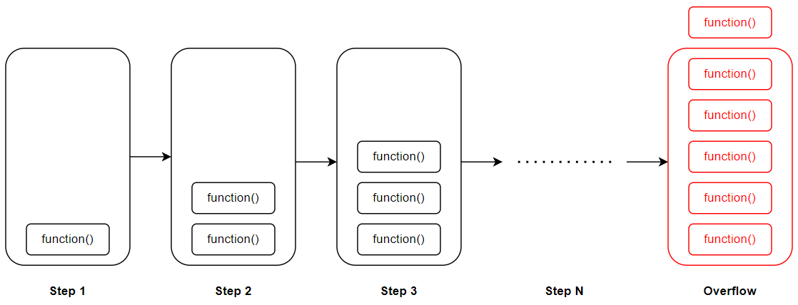

# &#128209; Table of Contents
- [💡 Overview](#-overview)
- [💻 Implementation](#-implementation)
- [📊 Analysis](#-analysis)
- [📝 Application](#-application)
- [🕙 Origins](#-origins)
- [🤝 Contributing](#-contributing)
- [📧 Contacts](#-contacts)
- [🙏 Credits](#-credits)
- [🔏 License](#-license)


# &#128161; Overview
**Recursion** is a widely used problem-solving approach in computer science to solve complex problems by recalling to the same instance, typically function, multiple times if needed. It helps to design elegant and efficient algorithms for all manner of applications, making it important to truly understand the concept.
<p align="center"></p>

---
**Essential Terminology:**
- **Problem-Solving Approach** — is a method of approaching a problem to find a solution.
- **Recursion** — is an approach that solves a problem by recalling to the same instance (e.g. function) with updated values multiple times, i.e. it solves smaller instances of the same problem.
  - **Direct Recursion** — whole recursive process proceeds within a single entity.
  - **Indirect Recursion** — whole recursive process distributed across at least two entities.
- **Recursive Function** — is one that calls itself and has both base and recursive cases.
- **Base Case** — represents a situation, where the solution is directly known (already provided) without requiring further recursion.
- **Recursive Case** — represents other situation, where the solution to the bigger problem is expressed in terms the same problem but with modified values.

--- 
**Important Details**  

Not all mathematically recursive functions are efficiently (or correctly) implemented by C++’s simulation of recursion. Recursion is used when it makes the solution clearer. In order to make a good use of this approach, it's worth to consider a few deducible guidelines for designing:

1. **Termination conditions** — there must always be some base cases that can be solved without resorting to recursion. Otherwise it may lead to infinite recursion, which cause stack overflow problem (refer to '[Call Stack](#call-stack)' subsection).
2. **Making progress** —  it's essential that each recursive call contributes to progress towards reaching a base case, making sure that termination conditions are reachable.
3. **Trust the encapsulation** — assume the functionality of all recursive calls is correct. This attempt to trace the sequence of calls, may spend unnecessary time, which actually, can be an indication of a good use of recursion, since the computer is being allowed to work out the complicated details.
4. **No duplicating** — the recursion should avoid duplicating work by solving the same instance of a problem in distinct recursive calls, because it could lead to inefficiencies and unnecessary computations.

---
**Stack**  

**Call Stack** — is a region of memory, that stores information about the active function calls in a program by forming a stack (pile) of frames for each caller, i.e. tracks the order of calls. It operates based on the principles of a fundamental abstract data structure known as a [Stack](https://github.com/vezzolter/DSA/tree/main/DataStructures/Stack), meaning items that entered the last are the first to be removed or simply Last In First Out (LIFO).

**Stack Frame** — section of memory, allocated on stack, which stores function related information, such as: return address, parameters, local variables, saved registers, flags, frame pointer. As the function executes, its frame provides the necessary context. When the function completes, its stack frame is popped off the stack, and control returns to the calling function.

<p align="center"></p>

The detailed interaction of recursion with the Call Stack is actually quite complex topic with lots of intricacies, particularly in the context of C++. This complexity arises from various factors, including: templates, diverse variables/parameters types (static, global, ...), inlining mechanisms, aspects of OOP, exception handling, and more. Attempting to govern all of those moments in a single list can be quite challenging. With that in mind, I aim to offer a general overview of how functions interact with the Call Stack below:
1. When a function is called, the function's stack frame is added to the top of the call stack.
2. When function (a) calls another function (b), the variables' state of the calling function (a) is still stored in memory.
3. Each call to a function has its own set of local variables; therefore, it's not possible to access a different function's set of a local variables.
4. When the termination condition is reached, the function returns its value to the calling function, and memory is de-allocated, allowing the process to continue

Using stack is convenient, because there is no need to manually keep tracking the pile, but saving all that info can take up a lot of memory. In some programming languages, the maximum size of the call stack is much less than the space available in the heap, and recursive algorithms tend to require more stack space than iterative algorithms. Consequently, these languages sometimes place a limit on the depth of recursion to avoid stack overflows.
<p align="center"></p>

**Stack Overflow** — is a runtime error, that occurs when a program's call stack exceeds its allocated size, potentially causing program termination, data loss, resource cleanup issues, system instability and other destructive behavior if it is not handled appropriately.

Common causes for exceeding stack limits include uncontrolled recursion, infinite loops, deep base cases, excessive consumption in multithreaded environments, and overuse of exception handling. The key is to identify recursive behavior and handle it appropriately. In large projects, simple but subtle details like the example below can be easily overlooked:
```cpp
// Since 'i' is an unsigned character, it will be converted to an 8-bit value,
// which, upon reaching 255, will overflow and return to 0, thus infinite loop
unsigned char halfLimit = 150;

for (unsigned char i = 0; i < 2 * halfLimit; ++i) {
  // do something
}
```

---
**Converting Recursion to Iteration**

In computer science, **iteration** and **recursion** stand out as two fundamental **problem-solving strategies**. Both are equally expressive: they involve executing instructions repeatedly until task is finished. Moreover recursion can be replaced by iteration with an explicit call stack, while iteration can be replaced with tail recursion. The preference for one approach depends on the specific problem under consideration and the programming language being used.

<p align="center"></p>

**Iteration** finds its strength in performance-oriented scenarios, and in many cases, there is no inherent advantage to using recursion. However, if converting recursion into a straightforward loop structure poses difficulties, it might be an indication that recursion becomes a prominent choice.

**Recursion**, as it was said, is more suitable approach in cases where implementing an algorithm using iteration is challenging, therefore recursion provides clear and natural solutions. However, if feasible, converting recursion into iteration is often preferred for improved performance and resource utilization.

To successfully convert recursion into a loop, it's essential for the recursion to be **tail-recursive**. Tail recursion is characterized by having the recursive call as the last statement executed by the function. In other words, the function's calls involve a single invocation of the recursive call followed by an immediate return of the result without additional processing or calculation. When utilizing a compiler or interpreter that treats tail-recursive calls as jumps rather than function calls, the program becomes essentially iterative. Therefore, equivalent to using control structures like the "for" and "while" loops, which saves both space and time.


# &#x1F4BB; Implementation
When it comes to implementation, the number of times people have resorted to using recursion can't be counted. In fact, the majority of those scenarios share some common ideas, which are built through practice.

```cpp
// Recursive function to calculate sum of elements in array
int recursiveArraySum(int arr[], int size) {
    // Base case: when the array is empty, the sum is directly known (0)
    if (size == 0) { return 0; }
    // Recursive case: sum current element with sum of the rest
    else { return arr[size - 1] + recursiveArraySum(arr, size - 1); }
}
```

---
Therefore, I will present some of the most illustrative examples specifically to enlighten the details of the recursive approach:  
- [Recursion.md](https://github.com/vezzolter/DSA/tree/main/Algorithms/Recursion/Recursion.md) ✅
- [Factorial](https://github.com/vezzolter/DSA/tree/main/Algorithms/Recursion/Factorial) ✅
- [Fibonacci](https://github.com/vezzolter/DSA/tree/main/Algorithms/Recursion/Fibonacci) ✅
- GCD (Greatest Common Divisor)
- Taylor Series (?)


# &#128202; Analysis
**How to Analyze:**   
When an algorithm contains a recursive call to itself, it is possible to describe running time as [recurrence relation](https://github.com/vezzolter/DSA/tree/main/Algorithms/Analysis/Analysis.md), which can be solved in order to provide different bounds on performance.

---
**Advantages:**
- **Natural Choice** — recursion allows to represent problems in natural way, making them easy to understand and thus implement; e.g. sortings, tree traversals, mathematical functions.

---
**Disadvantages:**
- **Call Stack Overhead** — recursion involve overhead for maintaining the call stack. Each call consumes additional memory and processing time, which can significantly affect the efficiency.
- **Stack Overflow** — recursion may lead to stack overflow runtime error. When a program's call stack exceeds its allocated size, its potentially causing destructive behavior for the program if it is not handled appropriately.
- **Complex Debugging** — recursion can have a complex call structure. Keeping track of the call stack and variable states can be quite challenging, especially for high recursion depth or intricate logic.


# &#128221; Application
**Some of the Most Well-Known Use Cases:**
- **Sortings** — recursive algorithms leverage recursion to partition the data into smaller subarrays or sublists, subsequently sorting and merging them to achieve the final ordered result.
- **Divide-and-Conquer** — numerous algorithms employing a divide-and-conquer strategy, like the binary search, utilize recursion to decompose the problem into more manageable subproblems.
- **Memoization (Dynamic Programming)** — as long as this technique entails storing the outcomes of resource-intensive function calls and retrieving the cached result when encountering identical inputs in subsequent calls, recursive functions are often employed for those problems.
- **Backtracking** — backtracking algorithms are used to solve problems that involve making a sequence of decisions, where each decision depends on the previous ones. These algorithms can be implemented using recursion to explore all possible paths and backtrack when a solution is not found.
- **Trees and Graphs** — recursion finds common application in traversing and searching data structures like trees and graphs. Recursive algorithms prove effective in systematically exploring all nodes or vertices within a tree or graph.
- **Permutations and Combinations** — recursive algorithms are often used to generate permutations and combinations of a set of elements.

---
**Popular Related Problems:**
- Factorial Calculation
- Fibonacci Sequence
- Tower of Hanoi Puzzle
- Depth-First Search (DFS)
- Breadth-First Search (BFS)
- Binary Search
- Merge Sort
- Quick Sort
- Maze Solving
- N-Queens Problem
- Palindrome Check
- Subset Generation
- Permutations
- Combinations
- Ackermann Function
- Pascal's Triangle
- Parentheses Matching
- Expression Evaluation
- Inversion Count


# &#x1F559; Origins
Recursion, as a concept, has deep historical roots that trace back to ancient times, where it found expression in various fields, including mathematics, linguistics and even philosophy and theological discussions, where it appeared reflecting a fundamental human tendency to contemplate self-reference and iteration.

The notion of recursion goes back to the **1888** year, when mathematician **Richard Dedekind** used the notion to obtain functions needed in his formal analysis of the concept of natural number. In 1889 Dadekind and Giuseppe Peano used the principle of defining a function by induction. This principle played an important role in the foundations of mathematics and was only much later called "primitive recursion".

In **1931**, **Kurt Gödel** used the notion of a primitive recursive function, which he called "recursive" (eine rekursive Funktion). These functions were chosen for their ease of representation within Gödel's formal system for arithmetic, providing him with the tools to assign "Gödel numbers" to all syntactic objects. This, in turn, allowed him to achieve self-reference, leading to the discovery of incompleteness in mathematical systems.

Later, in **1932**, **Rózsa Péter** unveiled her findings on recursive theory, titled "Rekursive Funktionen," at the International Congress of Mathematicians in Zürich, Switzerland. Collaborating with Paul Bernays during the summer of 1933 in Göttingen, Germany, she contributed significantly to the extensive chapter on recursive functions in the book "Grundlagen der Mathematik," published in 1934 under the joint authorship of David Hilbert and Paul Bernays. Changing her surname her Jewish surname Politzer into Péter, she received her PhD with the highest honors in 1935. In 1936, Péter presented a paper titled "Über rekursive Funktionen der zweiten Stufe" at the International Congress of Mathematicians in Oslo. These seminal papers played a pivotal role in establishing the modern field of recursive function theory as an independent area of mathematical research. Kleene in 1952 described Péter as "the leading contributor to the special theory of recursive functions".

**Stephen Cole Kleene** also made significant contributions to the development of recursive function theory between 1931 and 1943. He explored operations on functions to understand if they maintain certain properties. One notable concept he introduced is the "least number operator." Kleene showed that if a relation between two variables is describable using a specific method, then a related partial function can also be described using a similar method. This work led to the formulation of Kleene's influential Normal Form Theorem in 1936, which essentially stated that every computable function could be expressed in a standardized form. He extended this by introducing the concept of partial recursive functions, which are essential in understanding computation.

While Kurt Gödel, Rózsa Péter, and Stephen Kleene made significant contributions to the theoretical foundations of recursion, it was later computer scientists and programmers who popularized the practical use of recursion in programming languages. One prominent figure is **John McCarthy**, who developed Lisp in the **1958**, a programming language that heavily relied on recursion. Lisp and its recursive features influenced subsequent programming languages and their design, contributing to the widespread adoption of recursive techniques. Additionally, **Edsger Dijkstra**, a Dutch computer scientist, emphasized the importance of recursion in algorithmic thinking and structured programming. These individuals, among others, played crucial roles in integrating recursion into practical programming paradigms.


# &#129309; Contributing
Contributions are highly appreciated! For detailed guidelines, please refer to the [root directory's contributing section](../../#-contributing).


# &#128231; Contacts
For contact details and additional information, please refer to the [root directory's contact information section](../../#-contacts).


# &#128591; Credits
&#128218; **Books:**
- **"Introduction to Algorithms" (3rd Edition)** — by Thomas H. Cormen, Charles E. Leiserson, Ronald L. Rivest and Clifford Stein
  - Section 4: Divide-and-Conquer.
- **"Algorithms in C++, Parts 1-4: Fundamentals, Data Structure, Sorting, Searching" (3rd Edition)** — by Robert Sedgewick
  - Section 5.1: Recursive Algorithms
- **"Data Structures and Algorithm Analysis in C++" (4th Edition)** — by Mark Allen Weiss
  - Section 1.3: A Brief Introduction to Recursion
- **"The Algorithm Design Manual" (2nd Edition)** — by Steven S. Skiena
  - Section 1.3.4: Induction and Recursion

---
&#127891; **Courses:**
- [Mastering Data Structures & Algorithms using C and C++](https://www.udemy.com/course/datastructurescncpp/) on Udemy
   - Section 5: Recursion

---
&#127760; **Web-Resources:**
- [Recursion in Computer Science](https://en.wikipedia.org/wiki/Recursion_(computer_science)) (Wikipedia)
- [How stack frames work](https://nordvpn.com/ru/cybersecurity/glossary/stack-frame/#:~:text=A%20stack%20frame%2C%20often%20just,%2DOut%20(LIFO)%20manner)
- [Difference Between Recursion and Iteration](https://www.enjoyalgorithms.com/blog/difference-between-iteration-and-recursion)
- [Types of Recursion](https://datatrained.com/post/types-of-recursion/)
- [Tail Call](https://en.wikipedia.org/wiki/Tail_call) (Wikipedia)
- [Tail Call Optimization](https://wiki.c2.com/?TailCallOptimization)
- [Top 50 Problems on Recursion Algorithm asked in SDE Interviews](https://www.geeksforgeeks.org/top-50-interview-problems-on-recursion-algorithm/)
- [30 Recursion Interview Questions and Coding Exercises for Programming Interviews](https://medium.com/javarevisited/30-recursion-interview-questions-and-coding-exercises-for-programming-interviews-2816302e9ab)
- [The Advent of Recursion in Programming, 1950s-1960s](https://eprints.illc.uva.nl/id/document/935#:~:text=The%20notion%20of%20recursion%20dates,the%20foundations%20of%20mathematics%20cf.)
- [Computability and Recursion](http://www.people.cs.uchicago.edu/~soare/History/compute.pdf)
- [How recursion got into programming](https://vanemden.wordpress.com/2014/06/18/how-recursion-got-into-programming-a-comedy-of-errors-3/)


# &#128271; License
This project is licensed under the MIT License — see the [LICENSE](https://github.com/vezzolter/DSA/blob/main/LICENSE) file for details.

[](https://opensource.org/licenses/MIT)