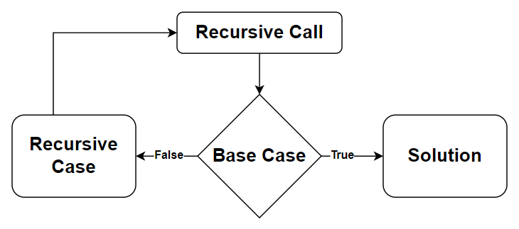
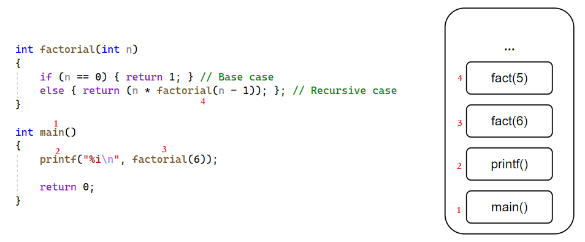

# &#128209; Table of Contents
- [💡 Overview](#-overview)
  - [Essential Terminology](#essential-terminology)
- [💻 Implementation](#-implementation)
  - [How to Implement](#how-to-implement)
  - [Pitfalls and Optimizations](#pitfalls-and-optimizations)
  - [Implemented Algorithms](#implemented-algorithms)
- [📊 Analysis](#-analysis)
  - [How to Analyze](#how-to-analyze)
  - [Trade-Offs](#trade-offs)
  - [Alternatives](#alternatives)
- [📝 Application](#-application)
  - [Common Use Cases](#common-use-cases)
  - [Some Practical Problems](#some-practical-problems)
- [🕙 Origins](#-origins)
- [🤝 Contributing](#-contributing)
- [📧 Contacts](#-contacts)
- [🙏 Credits](#-credits)
- [🔏 License](#-license)


# &#128161; Overview
**Recursion** is a widely-used problem-solving approach in computer science to solve complex problems by recalling to the same instance, typically function, multiple times if needed. It helps to design efficient algorithms and optimize performance across various applications, which makes understanding the concept quite beneficial.
<p align="center"></p>


## Essential Terminology
- **Problem-Solving Strategy** — is a method of approaching a problem to find a solution.
- **Recursion** — is a strategy that solves a problem by recalling to the same instance (e.g. function) with updated values multiple times, i.e. it solves smaller instances of the same problem.
  - **Direct Recursion** — whole recursive process proceeds within a single entity.
  - **Indirect Recursion** — whole recursive process distributed across at least two entities.
- **Recursive Function** — is one that calls itself and has both base and recursive cases.
- **Base Case** — represents a situation, where the solution is directly known (already provided) without requiring further recursion.
- **Recursive Case** — represents a situation, where the solution to the bigger problem is expressed in terms the same problem, but with modified values.


# &#x1F4BB; Implementation
When implementing a concept, it's essential to understand the fundamental techniques that drive its behavior and ensure its correct functionality. Additionally, recognizing the critical pitfalls and potential optimizations allows you to refine the implementation, making it more efficient and robust for various scenarios.


## How to Implement
Depending on the situation, the implementation of the concept may vary, though the core principle, refined through practice, remains the same: try to solve a problem, and if not, break it into a smaller instance and repeat until a solution is reached. Classifying something is always a tricky task, but to provide a structured overview, I'll suggest that there are generally three aspects to consider in order to achieve the desired behavior:

1. **Recursion Structure** — is composed of two key parts that work together to solve problems:
   - **Base Case** — represents a situation, where the solution is directly known (already provided) without requiring further recursion.
   - **Recursive Case** — represents a situation, where the solution to the bigger problem is expressed in terms the same problem, but with modified values.
   ```cpp
   // Recursive function to calculate sum of elements in array
   int recursiveArraySum(int arr[], int size) {
     // Base case: when the array is empty, the sum is directly known (0)
     if (size == 0) { return 0; }
     // Recursive case: sum current element with sum of the rest
     else { return arr[size - 1] + recursiveArraySum(arr, size - 1); }
   }
   ```

2. **Call Stack** — is a region of memory, that stores information about the active function calls in a program by forming a stack (pile) of frames for each caller, i.e. tracks the order of calls. It operates based on the principles of a fundamental abstract data structure known as a [Stack](https://github.com/vezzolter/DSA/tree/main/DataStructures/Stack), meaning items that entered the last are the first to be removed or simply Last In First Out (LIFO).
   - **Stack Frame** — section of memory, allocated on stack, which stores function related information, such as: return address, parameters, local variables, saved registers, flags, frame pointer. As the function executes, its frame provides the necessary context. When the function completes, its stack frame is popped off the stack, and control returns to the calling function. The detailed interaction of recursion with the call stack is actually quite complex topic with lots of intricacies, particularly in the context of C++. This complexity arises from various factors, including: templates, diverse variables/parameters types (static, global, ...), inlining mechanisms, aspects of OOP, exception handling, and more. Attempting to govern all of those moments in a single list can be quite challenging. With that in mind, I aim to offer a general overview of how functions interact with the call stack below:
     1. When a function is called, the function's stack frame is added to the top of the call stack.
     2. When function (a) calls another function (b), the variables' state of the calling function (a) is still stored in memory.
     3. Each call to a function has its own set of local variables; therefore, it's not possible to access a different function's set of a local variables.
     4. When the termination condition is reached, the function returns its value to the calling function, and memory is de-allocated, allowing the process to continue
   <p align="center"></p>  

3. Using stack is convenient, because there is no need to manually keep tracking the pile, but saving all that info can take up a lot of memory. In some programming languages, the maximum size of the call stack is much less than the space available in the heap, and recursive algorithms tend to require more stack space than iterative algorithms. Consequently, these languages sometimes place a limit on the depth of recursion to avoid stack overflows.  
   - **Stack Overflow** — is a runtime error, that occurs when a program's call stack exceeds its allocated size, potentially causing program termination, data loss, resource cleanup issues, system instability and other destructive behavior if it is not handled appropriately.

   Common causes for exceeding stack limits include uncontrolled recursion, infinite loops, deep base cases, excessive consumption in multithreaded environments, and overuse of exception handling. The key is to identify recursive behavior and handle it appropriately. In large projects, simple but subtle details like the example below can be easily overlooked:  
   ```cpp
    // Since 'i' is an unsigned character, it will be converted to an 8-bit value,
    // which, upon reaching 255, will overflow and return to 0, thus infinite loop
    unsigned char halfLimit = 150;

    for (unsigned char i = 0; i < 2 * halfLimit; ++i) {
      // do something
    }
    ```


## Pitfalls and Optimizations
Not all mathematically recursive functions are efficiently (or correctly) implemented by C++’s simulation of recursion. Recursion is used when it makes the solution clearer. In order to make a good use of this approach, it's worth to consider some common pitfalls and potential optimizations when addressing this concept.

- **Termination conditions** — there must always be some base cases that can be solved without resorting to recursion. Otherwise it may lead to infinite recursion, which cause stack overflow problem.
- **Making progress** —  it's essential that each recursive call contributes to progress towards reaching a base case, making sure that termination conditions are reachable.
- **Trust the encapsulation** — assume the functionality of all recursive calls is correct. This attempt to trace the sequence of calls, may spend unnecessary time, which actually, can be an indication of a good use of recursion, since the computer is being allowed to work out the complicated details.
- **No duplicating** — recursion should avoid duplicating work by solving the same instance of a problem in distinct recursive calls, because it could lead to inefficiencies and unnecessary computations.
- **Tail-Recursion** — recursion can be easily converted into loops, as the recursive call is the last action performed, followed by an immediate return. This allows the compiler or interpreter to treat the recursive call like a loop, saving both time and space. Converting recursion to iteration is often preferred for better performance and resource use. However, if recursion can't be simplified into a loop, it may indicate that recursion is the better choice for clarity or structure.


## Implemented Algorithms
When working with concepts that lack standalone functionality, there aren’t pre-built standard implementations like those available for search or sort in libraries. Instead, these concepts act as frameworks or strategies used to develop efficient algorithms for solving various problems.

The focus here is on understanding how these concepts are applied in specific algorithmic solutions. Below are implementations of popular algorithms that showcase how recursion can be used in practice:
- [Factorial](https://github.com/vezzolter/DSA/tree/main/Algorithms/Recursion/Factorial) ✅
- [Fibonacci](https://github.com/vezzolter/DSA/tree/main/Algorithms/Recursion/Fibonacci) ✅
- GCD (Greatest Common Divisor)
- Taylor Series (?)


# &#128202; Analysis
Understanding how to analyze a concept is crucial for identifying its key characteristics and evaluating its performance across different scenarios. Additionally, examining the trade-offs allows you to understand what you gain and what you give up when applying the concept. Finally, considering alternatives helps you determine when the concept is the best choice and when other approaches might be more appropriate.


## How to Analyze   
- **Time Complexity:**
   - **Recursive Implementation** — requires analyzing the [recurrence relation](https://github.com/vezzolter/DSA/blob/main/General/Analysis/Analysis.md) to derive the final complexity.
- **Space Complexity:**
   - **In-Place** — algorithm operates without needing additional memory beyond the input size, making it space efficient.
   - **Out-of-Space** — algorithm requires additional memory proportional to the size of the input or the depth of recursion.


## Trade-Offs
**What Recursion Gives:**
- **Natural Choice** — recursion allows to represent problems in natural way, making them easy to understand and thus implement; e.g. sortings, tree traversals, mathematical functions.

---
**What Recursion Takes:**
- **Call Stack Overhead** — recursion involve overhead for maintaining the call stack. Each call consumes additional memory and processing time, which can significantly affect the efficiency.
- **Stack Overflow** — recursion may lead to stack overflow runtime error. When a program's call stack exceeds its allocated size, its potentially causing destructive behavior for the program if it is not handled appropriately.
- **Complex Debugging** — recursion can have a complex call structure. Keeping track of the call stack and variable states can be quite challenging, especially for high recursion depth or intricate logic.


## Alternatives
Currently in Progress...


# &#128221; Application
Understanding some of the most well-known use cases of a concept is crucial for grasping its practical relevance and potential impact in real-world scenarios. Additionally, familiarizing oneself with practical problems and practicing their solutions ensures that you retain essential details and develop a deep, intuitive understanding of the concept's capabilities and limitations.


## Common Use Cases
- **Divide-and-Conquer** — recursion is used to implement the divide-and-conquer strategy. Recursion's capacity to break complex problems into smaller independent subproblems makes it ideal for efficiently solving problems like searching, matrix multiplication, or other computational tasks that benefit from parallelism and reduced problem size.
- **Memoization (Dynamic Programming)** — recursion is used in memoization for solving problems with overlapping subproblems, like the Fibonacci sequence or knapsack problem. By caching intermediate results and recalling them as needed, recursion avoids redundant computations, leading to significant performance improvements in both time and space complexity for large problem instances.
- **Backtracking** — recursion is used in backtracking algorithms to explore all possible solutions in problems such as puzzle-solving, constraint satisfaction, and combinatorial optimization. By reverting to previous states when a solution path doesn’t work, recursion efficiently navigates complex decision trees, making it suitable for solving problems that require exhaustive search, but in a smarter way.
- **Data Structures** — recursion is used in traversing and manipulating hierarchical data structures such as trees, graphs, and linked lists. Recursive algorithms are ideal for operations like searching, traversing, and modifying nodes in these structures because they mirror the self-referential nature of such data structures, simplifying implementation and enhancing readability.
- **Permutations and Combinations** — recursion is used in generating permutations and combinations of a set of elements. The recursive approach allows for exploring every possible configuration in an organized, step-by-step manner, making it a natural fit for combinatorial problems in areas like cryptography, game development, and bioinformatics.


## Some Practical Problems
**Easy Problems:**
1. [Merge Two Sorted Lists](https://leetcode.com/problems/merge-two-sorted-lists)
2. [Power of Two](https://leetcode.com/problems/power-of-two)
3. [Reverse Linked List](https://leetcode.com/problems/reverse-linked-list)

---
**Medium Problems:** 
1. [Add Two Numbers](https://leetcode.com/problems/add-two-numbers)
2. [Reorder List](https://leetcode.com/problems/reorder-list)
3. [Different Ways to Add Parentheses](https://leetcode.com/problems/different-ways-to-add-parentheses)
4. [Decode String](https://leetcode.com/problems/decode-string)
5. [Count Collisions of Monkeys on a Polygon](https://leetcode.com/problems/count-collisions-of-monkeys-on-a-polygon)
6. [Lowest Common Ancestor of a Binary Tree](https://leetcode.com/problems/lowest-common-ancestor-of-a-binary-tree)

---
**Hard Problems:** 
1. [Regular Expression Matching](https://leetcode.com/problems/regular-expression-matching)
2. [Reverse Nodes in k-Group](https://leetcode.com/problems/reverse-nodes-in-k-group)
3. [Permutation Sequence](https://leetcode.com/problems/permutation-sequence)


# &#x1F559; Origins
Recursion, as a concept, has deep historical roots that trace back to ancient times, where it found expression in various fields, including mathematics, linguistics and even philosophy and theological discussions, where it appeared reflecting a fundamental human tendency to contemplate self-reference and iteration.

The notion of recursion goes back to the **1888** year, when mathematician **Richard Dedekind** used the notion to obtain functions needed in his formal analysis of the concept of natural number. In 1889 Dadekind and Giuseppe Peano used the principle of defining a function by induction. This principle played an important role in the foundations of mathematics and was only much later called "primitive recursion".

In **1931**, **Kurt Gödel** used the notion of a primitive recursive function, which he called "recursive" (eine rekursive Funktion). These functions were chosen for their ease of representation within Gödel's formal system for arithmetic, providing him with the tools to assign "Gödel numbers" to all syntactic objects. This, in turn, allowed him to achieve self-reference, leading to the discovery of incompleteness in mathematical systems.

Later, in **1932**, **Rózsa Péter** unveiled her findings on recursive theory, titled "Rekursive Funktionen," at the International Congress of Mathematicians in Zürich, Switzerland. Collaborating with Paul Bernays during the summer of 1933 in Göttingen, Germany, she contributed significantly to the extensive chapter on recursive functions in the book "Grundlagen der Mathematik," published in 1934 under the joint authorship of David Hilbert and Paul Bernays. Changing her surname her Jewish surname Politzer into Péter, she received her PhD with the highest honors in 1935. In 1936, Péter presented a paper titled "Über rekursive Funktionen der zweiten Stufe" at the International Congress of Mathematicians in Oslo. These seminal papers played a pivotal role in establishing the modern field of recursive function theory as an independent area of mathematical research. Kleene in 1952 described Péter as "the leading contributor to the special theory of recursive functions".

**Stephen Cole Kleene** also made significant contributions to the development of recursive function theory between 1931 and 1943. He explored operations on functions to understand if they maintain certain properties. One notable concept he introduced is the "least number operator." Kleene showed that if a relation between two variables is describable using a specific method, then a related partial function can also be described using a similar method. This work led to the formulation of Kleene's influential Normal Form Theorem in 1936, which essentially stated that every computable function could be expressed in a standardized form. He extended this by introducing the concept of partial recursive functions, which are essential in understanding computation.

While Kurt Gödel, Rózsa Péter, and Stephen Kleene made significant contributions to the theoretical foundations of recursion, it was later computer scientists and programmers who popularized the practical use of recursion in programming languages. One prominent figure is **John McCarthy**, who developed Lisp in the **1958**, a programming language that heavily relied on recursion. Lisp and its recursive features influenced subsequent programming languages and their design, contributing to the widespread adoption of recursive techniques. Additionally, **Edsger Dijkstra**, a Dutch computer scientist, emphasized the importance of recursion in algorithmic thinking and structured programming. These individuals, among others, played crucial roles in integrating recursion into practical programming paradigms.


# &#129309; Contributing
Contributions are highly appreciated! For detailed guidelines, please refer to the [root directory's contributing section](../../#-contributing).


# &#128231; Contacts
For contact details and additional information, please refer to the [root directory's contact information section](../../#-contacts).


# &#128591; Credits
&#128218; **Books:**
- **"Introduction to Algorithms" (3rd Edition)** — by Thomas H. Cormen, Charles E. Leiserson, Ronald L. Rivest and Clifford Stein
  - Section 4: Divide-and-Conquer.
- **"Algorithms in C++, Parts 1-4: Fundamentals, Data Structure, Sorting, Searching" (3rd Edition)** — by Robert Sedgewick
  - Section 5.1: Recursive Algorithms
- **"Data Structures and Algorithm Analysis in C++" (4th Edition)** — by Mark Allen Weiss
  - Section 1.3: A Brief Introduction to Recursion
- **"The Algorithm Design Manual" (2nd Edition)** — by Steven S. Skiena
  - Section 1.3.4: Induction and Recursion

---
&#127891; **Courses:**
- [Mastering Data Structures & Algorithms using C and C++](https://www.udemy.com/course/datastructurescncpp/) on Udemy
   - Section 5: Recursion

---
&#127760; **Web-Resources:**
- [Recursion in Computer Science](https://en.wikipedia.org/wiki/Recursion_(computer_science)) (Wikipedia)
- [Call stack](https://en.wikipedia.org/wiki/Call_stack) (Wikipedia)
- [Tail Call Optimization](https://wiki.c2.com/?TailCallOptimization)
- [The Advent of Recursion in Programming, 1950s-1960s](https://eprints.illc.uva.nl/id/document/935#:~:text=The%20notion%20of%20recursion%20dates,the%20foundations%20of%20mathematics%20cf.)
- [Computability and Recursion](http://www.people.cs.uchicago.edu/~soare/History/compute.pdf)


# &#128271; License
This project is licensed under the MIT License — see the [LICENSE](https://github.com/vezzolter/DSA/blob/main/LICENSE) file for details.

[](https://opensource.org/licenses/MIT)