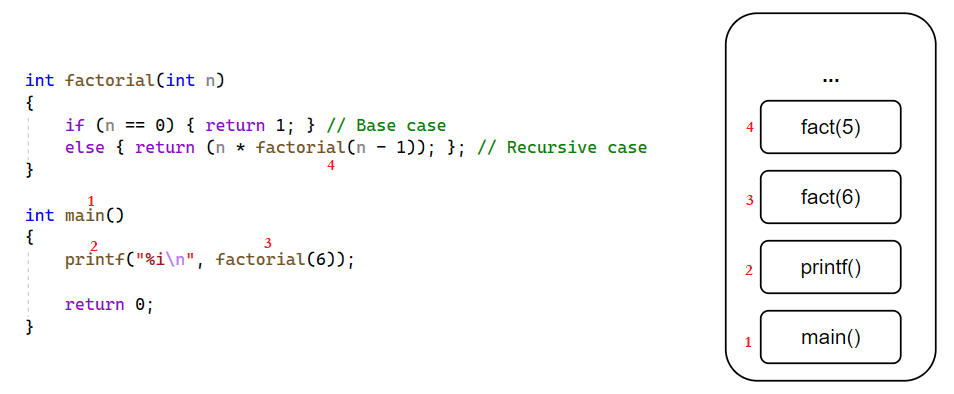
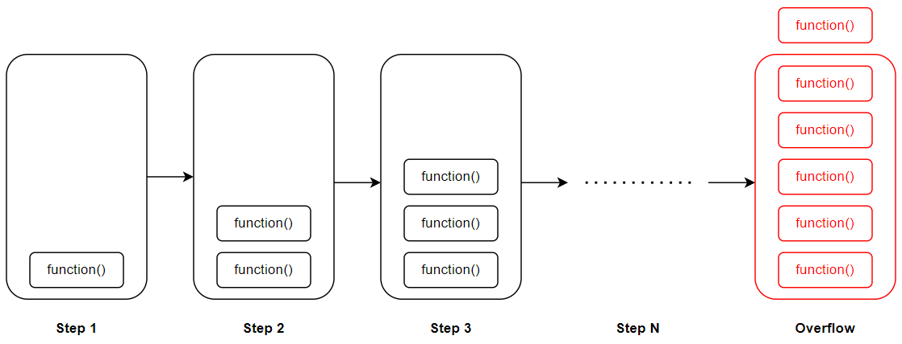
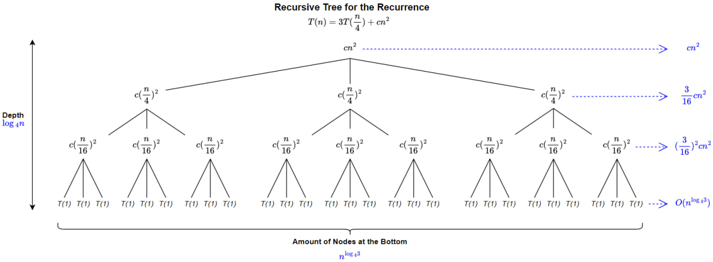
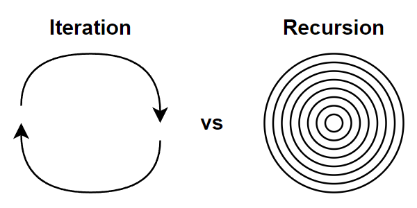

# &#128209; Table of Contents
- [💡 What is the Recursion](#-what-is-the-recursion)
- [💻 Implementation](#-implementation)
- [📚 Call Stack](#-call-stack)
- [📊 Analysis](#-analysis)
- [📝 Application](#-application)
- [⏳ Historical Notes](#-historical-notes)
- [🤝 Contributing](#-contributing)
- [📧 Contact Information](#-contact-information)
- [🙏 Credits](#-credits)
- [🔏 License](#-license)


# &#128161; What is the Recursion
**Recursion** is a widely used idea in computer science to solve complex problems by breaking them down into simpler ones. It helps to develop elegant & efficient data structures and algorithms for all manner of applications. Many important implementations use recursion, so it's important to understand the concept.

As a practical instance showcasing the nonmathematical application of recursion, let's turn to the example outlined by Mark Allen Weiss in his work "Data Structures and Algorithm Analysis in C++", listed below:

> Consider a large dictionary. Words in dictionaries are defined in terms of other words. When we look up a word, we might not always understand the definition, so we might have to look up words in the definition. Likewise, we might not understand some of those, so we might have to continue this search for a while. Because the dictionary is finite, eventually either (1) we will come to a point where we understand all of the words in some definition (and thus understand that definition and retrace our path through the other definitions) or (2) we will find that the definitions are circular and we are stuck, or that some word we need to understand for a definition is not in the dictionary.


# &#x1F4BB; Implementation
**Recursive Algorithm** — is one that solves a problem by solving smaller instances of the same problem. Implemented via recursive functions.  
**Recursive Function** — is one that calls itself and has two main components:
1. **Base Case** — represents a situation, where the solution is directly known (already provided) without requiring further recursion.
2. **Recursive Case** — represents other situation, where the solution to the bigger problem is expressed in terms of smaller problems.

```cpp
// Recursive function which calculates the sum of elements in an array
int recursiveArraySum(int arr[], int size)
{
    // Base case: when the array is empty, the sum (0) is directly known 
    if (size == 0) { return 0; }
    // Recursive case: sum the current element with the sum of the rest
    else { return arr[size - 1] + recursiveArraySum(arr, size - 1); }
}

// Note: example just illustrates the key components of a recursive function;
// this implementation is not the most preferred way to achieve this
```

Not all mathematically recursive functions are efficiently (or correctly) implemented by C++’s simulation of recursion. Recursion is used when it makes the solution clearer. In order to make a good use of this approach, it's worth to consider a few deducable guidelines for designing:

1. **Termination conditions** — there must always be some base cases that can be solved without resorting to recursion. Otherwise it may lead to infinite recursion, which cause stack overflow problem (refer to '[Call Stack](#call-stack)' subsection).
2. **Making progress** —  it's essential that each recursive call contributes to progress towards reaching a base case, making sure that termination conditions are reachable.
3. **Trust the encapsulation** — assume the functionality of all recursive calls is correct. This attempt to trace the sequence of calls, may spend unnecessary time, which actually, can be an indication of a good use of recursion, since the computer is being allowed to work out the complicated details.
4. **No duplicating** — the recursion should avoid duplicating work by solving the same instance of a problem in distinct recursive calls, because it could lead to inefficiencies and unnecessary computations.

It's noteworthy that recursion is possible to achieve in two different ways: either within the body of a single recursive function, known as **Direct Recursion**, or distributed across at least two functions, referred to as **Indirect Recursion**. The former is commonly preferred for its contribution to code readability, while the latter is beneficial when several related tasks or subproblems require to be divided and conquered.


# &#128218; Call Stack
Another vital consideration when discussing recursion is the role of the Call Stack in it.
<p align="center"></p>

**Call Stack** — is a region of memory, that stores information about the active function calls in a program by forming a stack (pile) of frames for each caller, i.e. tracks the order of calls. It operates based on the principles of a fundamental abstract data structure known as a Stack _(a link to the repository's dedicated section will be added in the near future)_, meaning items that entered the last are the first to be removed or simply Last In First Out (LIFO).

**Stack Frame** — section of memory, allocated on stack, which stores function related information, such as: return adress, parameters, local variables, saved registers, flags, frame pointer. As the function executes, its frame provides the necessary context. When the function completes, its stack frame is popped off the stack, and control returns to the calling function.

The detailed interaction of recursion with the Call Stack is actually quite complex topic with lots of intricacies, particularly in the context of C++. This complexity arises from various factors, including: templates, diverse variables/parameters types (static, global, ...), inlining mechanisms, aspects of OOP, exception handling, and more. Attempting to govern all of those moments in a single list can be quite challenging. With that in mind, I aim to offer a general overview of how functions interact with the Call Stack below.

**Fundametal Aspects of Call Stack Interaction:**
1. When a function is called, the function's stack frame is added to the top of the call stack.
2. When function (a) calls another function (b), the variables' state of the calling function (a) is still stored in memory.
3. Each call to a function has its own set of local variables; therefore, it's not possible to access a different function's set of a local variables.
4. When the termination condition is reached, the function returns its value to the calling function, and memory is de-allocated, allowing the process to continue

Using stack is convenient, because there is no need to manually keep tracking the pile, but saving all that info can take up a lot of memory. In some programming languages, the maximum size of the call stack is much less than the space available in the heap, and recursive algorithms tend to require more stack space than iterative algorithms. Consequently, these languages sometimes place a limit on the depth of recursion to avoid stack overflows.
<p align="center"></p>

**Stack Overflow** — is a runtime error, that occurs when a program's call stack exceeds its allocated size, potentially causing program termination, data loss, resource cleanup issues, systen instability and other destructive behaviour if it is not handled appropriately.

Common causes for exceeding stack limits include uncontrolled recursion, infinite loops, deep base cases, excessive consumption in multithreaded environments, and overuse of exception handling. The key is to identify recursive behavior and handle it appropriately. In large projects, simple but subtle details like the example below can be easily overlooked:
```cpp
// Since 'i' is an unsigned character, it will be converted to an 8-bit value,
// which, upon reaching 255, will overflow and return to 0, thus infinite loop
unsigned char halfLimit = 150;

for (unsigned char i = 0; i < 2 * halfLimit; ++i)
{
  // do something
}
```


# &#128202; Analysis
Certainly, by evaluating multiple candidate algorithms for a given problem, we can pinpoint the most efficient one. The process might be quite complex, considering various factors, such as implementation of a memory model, size of an input, extent of random, programming language, etc. So people came up with two widely adopted measurements to analyze the algorithms, which are no different for the recursive ones:
1. **Space Complexity** — how the memory usage grows with the input size.
2. **Time Complexity** — how the time requirements grow with the input size.

Both recursive and non-recursive algorithms may use auxiliary space for data structures, the key difference in space complexity analysis between recursive and non-recursive algorithms lies in the consideration of the call stack, which has been discussed in a previous subsection.

When an algorithm containts a recursive call to itself, it is possible to describe running time as reccurence relation, which can be solved in order to provide different bounds on performance, such as lower ($\Omega$), tight ($\Theta$) or upper bound ($O$) each serving its own purpose.

**Recurrence Relation** — is an equation (or inequality), which recursively defines a sequence in which any term is defined by its previous terms. Used to analyze the time complexity of recursive algorithms in terms of input size.

**Methods to Solve Recurrences:**
1. **Substitution** — guess a bound, than prove with mathematical induction. Beneficial when encounter non-trivial cases or you have a good guess.
2. **Recursion Tree** — visualize the recurrence as a tree and calculating nodes sum per level together. Primarly used for generating good guesses to substitution method and also provides proof to master method.
3. **Master Theorem** — provides solution for recurrences of the particular form, which pretty frequently occurs in many commonly encountered algorithms.

Analyzing and solving recurrences is a nuanced process, and the choice of method depends on the characteristics of the recurrence relation. Each method has its strengths, making it well-suited for certain types of recurrences. In simple terms, if recurrence is not solvable by Master Theorem, you can try Substitution and tree can help in both cases. Detailed overview of each of these methods and CLRS examples you can find below.

---
**Substitution Method** — guess a bound, than prove with mathematical induction. Method is powerful, but in order to apply there must be good guess of a form and there is no general way to do so, it takes experience and creativity, although heuristics and recursion trees can help generate those guesses. Beneficial when encounter non-trivial cases or you have a good guess.

**Induction** — proving method, which's key idea is to establish the base case and then prove that a statement is true for all natural numbers.

**Example**   
Determine upper bound $O(n)$ for the next recurrence relation $T(n) = 2T(\lfloor \frac{n}{2} \rfloor) + n$

1. Make a guess, that solution is $T(n) = O(n×log{_2}{n})$.
2. Prove, that $T(n) \leqslant O(n×log{_2}{n})$ for an appropiate choice of `const` $c>0$.
3. Assume that this bound holds for all positive $m < n$, in particular for $m = \lfloor \frac{n}{2} \rfloor$.  

4. This yields with $T(\lfloor \frac{n}{2} \rfloor) \leqslant c \lfloor \frac{n}{2} \rfloor × log{_2}({\lfloor \frac{n}{2} \rfloor})$, which we simply substitute into a recurrence $T(n) = 2T(\lfloor \frac{n}{2} \rfloor) + n$.

5. And then solving the default mathematical relation:  
$T(n) \leqslant 2 \left( c \lfloor \frac{n}{2} \rfloor log{_2}({\lfloor \frac{n}{2} \rfloor})\right) + n$; (rule: expending brackets)   
$T(n) \leqslant cnlog{_2}({\lfloor \frac{n}{2} \rfloor}) + n$; (rule: $log{_a}{b}=log{_2}{a}-log{_2}{b}$)  
$T(n) = cnlog{_2}{n} - cnlog{_2}{2} + n$; (rule: $log{_a}{a^k}=k$)  
$T(n) = cnlog{_2}{n} - cn + n$; (`const` is not much valuable for asymptotic notation)  
$T(n) \leqslant cn×log{_2}{n}$; (holds as long as $c \leqslant 1$ )


---
**Recursion Tree Method**  — visualize the recurrence as a tree, where each node represents the cost of a single subproblem, those costs on each tree level form a per-level costs, and the sum of those per-level costs is the overall complexity. If there is no need to prove anything in master theorem, this method allows for a degree of flexibility or informality in the analysis for generating guesses.

**Example**   
Making a good guess for the next recurrence relation $T(n) = 3T(\frac{n}{4}) + cn^2$.

Having in mind, that this is a guess and not a proof case, the assumption, that $n$ can be a power of $4$ can be tolerated due to the possible flexibility. This is done, so the number of subproblems would be an integer and thus building a tree would be easier.

<p align="center">   </p>

The $cn^2$ term at the root represents the cost at the top level of recursion. 
Three subtrees represent the costs (each $c(\frac{n}{4})^2$) incurred by the subproblems of size $\frac{n}{4}$. This process of expending the nodes by breaking them into smaller parts continues until the bottom of a tree.

Because problem decrease by a factor of $4$ each level, the subproblem size for a node at depth $i$ is $\frac{n}{4^i}$, thus size hits $n=1$, when $\frac{n}{4^i}=1$, or equivalently when $i=\log{_4}{n}$, thus tree has $\log{_4}{n} + 1$ levels.

Each level has $3$ times more nodes, so number of nodes at $i$ level has $3^i$. Because subproblem sizes reduce by a factor of $4$ for each level, each node at depth $i$ for $i = 0, 1, 2, ..., \log{_4}{n} - 1$ has cost of $c(\frac{_n}{4^i})^2$. By multiplying it is observable, that total costs over all nodes at depth $i$ is $3^i c(\frac{n}{4^i})^2 = (\frac{_3}{16})^i cn^2$. The bottom level, at depth $\log{_4}{n}$ has $3^{\log{_4}{n}} = n^{\log{_4}{3}}$ nodes, each contributing cost $T(1)$, for a total cost of $n^{\log{_4}{3}}T(1)$, which is $\theta(n^{\log{_4}{3}})$.

In order, to determine the cost for the entire tree, we need to add up costs over all levels, resulting in the next recurrence equation:  
$T(n) = cn^2 + \frac{3}{16} cn^2 + (\frac{3}{16})^2 cn^2 + ... + (\frac{3}{16})^{\log{_4}{n} - 1}cn^2 + \theta(n^{\log{_4}{3}})$  

$T(n) = \sum_{i=0}^{\log{_4}{n} - 1}(\frac{_3}{16})^i cn^2 + \theta(n^{\log{_4}{3}})$   

$T(n) = \frac{\frac{3}{16}^{\log{_4}{n}}-1}{\frac{3}{16}-1} cn^2 + \theta(n^{\log{_4}{3}})$  


Where it is possible to take advantage of a flexibility and use a infinite decreasing geometric series as an upper bound:

$T(n) = \sum_{i=0}^{\log{_4}{n} - 1}(\frac{_3}{16})^i cn^2 + \theta(n^{\log{_4}{3}})$  

$T(n) < \sum_{i=0}^{\inf}(\frac{_3}{16})^i cn^2 + \theta(n^{\log{_4}{3}})$  

$T(n) = \frac{1}{1-\frac{3}{16}} cn^2 + \theta(n^{\log{_4}{3}})$  

$T(n) = \frac{16}{13}cn^2 + \theta(n^{\log{_4}{3}})$

$T(n) = O(n^2)$

So the result of building the tree is a guess of $T(n) = O(n^2)$, which is actually true if you try to prove it with substitution method.

---
**Master Theorem Method** — provides solution for recurrences of the form $T(n) = aT(\frac{n}{b}) + f(n)$, where:
- $f(n)$ — is asymptotically positive function, represents cost of the work done outside the recursive call (with merging and dividing);
- `const` $a \geqslant 1$ — number of subproblems; 
- $n$ — size of input;
- `const` $b > 1$ — the factor by which the problem size ($n$) is reduced in each recursive step, therefore $\frac{n}{b}$ size of each subproblem;

Master Theorem works in a way it provides cases, which are quick way to determine the time complexity of a wide range of recursive algorithms without having to go through detailed mathematical derivations, like previous methods did.

**Main Cases:**
1. **Case "Polynomially not faster"** — if $f(n) = O(n^{\log_b{a} - \epsilon})$ for some `const` $\epsilon > 0$, then $T(n) = \Theta(n^{\log_b{a}})$
2. **Case "Polynomially the same"** — if $f(n) = \Theta(n^{\log_b{a}})$, then $T(n) = \Theta(n^{\log_b{a}} \log{n})$
3. **Case "Polynomially not slower"** — if $f(n) = \Omega(n^{\log_b{a} + \epsilon})$ for some `const`  $\epsilon > 0$ (and if $af(\frac{n}{b}) \leqslant cf(n)$ for `const` $c<1$), then $T(n) = \Theta(f(n))$


**Example for case 1**  
$T(n) = 9T(\frac{n}{3}) + n$
We have $a=9, b=3, f(n) = n$, thus $n^{\log{_b}{a}} = n^{\log{_3}{9}} = \Theta(n^2)$  
Since $f(n) = O(n^{\log{_b}{a} - \epsilon})$, where $\epsilon = 1$, we can apply case 1 and conclude $T(n) = \Theta(n^2)$.

**Example for case 2**  
$T(n) =T(\frac{2n}{3}) + 1$  
We have $a=1, b=\frac{3}{2}, f(n) = 1$, thus $n^{\log{_b}{a}}=n^0=1$  
Since $f(n) = \Theta(n^{\log{_b}{a}}) = \Theta(1)$, we can apply case 2 and conclude $T(n) = \Theta(\log{_2}{n})$.

**Example for case 3**  
$T(n) = 3T(\frac{n}{4}) + n\log{_2}{n}$  
We have $a=3, b=4, f(n) = n\log{_2}{n}$, thus $n^{\log{_b}{a}} = n^{\log{_4}{3}} = O(n^{0.793})$  
Since $f(n) = \Omega(n^{\log{_b}{a} + \epsilon})$, where $\epsilon = 0.2$, we can apply case 3 but only if we can show that the regularity condition holds for $f(n)$ for sufficiently large $n$, we have that $af(\frac{n}{b}) = 3(\frac{n}{4})\log{_2}{\frac{n}{4}} \leqslant \frac{3}{4}n\log{_2}{n} = cf(n)$ for $c=\frac{3}{4}$. Consequently, conducting case 3, the solution is $T(n) = \Theta(n\log{_2}{n})$

**Example for no match**  
$T(n) = 2T(\frac{n}{2}) + n\log{_2}{n}$  
This recurrence is not solvable via Master Theorem, because $f(n) = n\log{_2}{n}$, is not polynomially larger than $n^{\log{_b}{a}} = b$


# &#128221; Application
In computer science, **iteration** and **recursion** stand out as two fundamental **problem-solving strategies**. Both are equally expressive: they involve executing instructions repeatedly until task is finished. Moreover recursion can be replaced by iteration with an explicit call stack, while iteration can be replaced with tail recursion. The preference for one approach depends on the specific problem under consideration and the programming language being used.
<p align="center">   </p>

**Iteration** finds its strength in performance-oriented scenarios, and in many cases, there is no inherent advantage to using recursion. However, if converting recursion into a straightforward loop structure poses difficulties, it might be an indication that recursion becomes a prominent choice.

**Recursion**, as it was said, is more suitable approach in cases where implementing an algorithm using iteration is challenging, thefore recursion provides clear and natural solutions. However, if feasible, converting recursion into iteration is often preferred for improved performance and resource utilization.

To successfully convert recursion into a loop, it's essential for the recursion to be **tail-recursive**. Tail recursion is characterized by having the recursive call as the last statement executed by the function. In other words, the function's calls involve a single invocation of the recursive call followed by an immediate return of the result without additional processing or calculation. When utilizing a compiler or interpreter that treats tail-recursive calls as jumps rather than function calls, the program becomes essentially iterative. Therefore, equivalent to using control structures like the "for" and "while" loops, which saves both space and time.

---
**Some of the Most Well-Known Use Cases:**
- **Sortings** — recursive algorithms leverage recursion to partition the data into smaller subarrays or sublists, subsequently sorting and merging them to achieve the final ordered result.
- **Divide-and-Conquer** — numerous algorithms employing a divide-and-conquer strategy, like the binary search, utilize recursion to decompose the problem into more manageable subproblems.
- **Memoization (Dynamic Programming)** — as long as this technique entails storing the outcomes of resource-intensive function calls and retrieving the cached result when encountering identical inputs in subsequent calls, recursive functions are often employed for those problems.
- **Backtracking** — backtracking algorithms are used to solve problems that involve making a sequence of decisions, where each decision depends on the previous ones. These algorithms can be implemented using recursion to explore all possible paths and backtrack when a solution is not found.
- **Trees and Graphs** — recursion finds common application in traversing and searching data structures like trees and graphs. Recursive algorithms prove effective in systematically exploring all nodes or vertices within a tree or graph.
- **Permutations and Combinations** — recursive algorithms are often used to generate permutations and combinations of a set of elements.

---
**Popular Related Problems:**
- Factorial Calculation
- Fibonacci Sequence
- Tower of Hanoi Puzzle
- Depth-First Search (DFS)
- Breadth-First Search (BFS)
- Binary Search
- Merge Sort
- Quick Sort
- Maze Solving
- N-Queens Problem
- Palindrome Check
- Subset Generation
- Permutations
- Combinations
- Ackermann Function
- Pascal's Triangle
- Parentheses Matching
- Expression Evaluation
- Inversion Count


# &#x23F3; Historical Notes
Recursion, as a concept, has deep historical roots that trace back to ancient times, where it found expression in various fields, including mathematics, linguistics and even philosophy and theological discussions, where it appeared reflecting a fundamental human tendency to contemplate self-reference and iteration.

The notion of recursion goes back to the **1888** year, when mathematician **Richard Dedekind** used the notion to obtain functions needed in his formal analysis of the concept of natural number. In 1889 Dadekind and Giuseppe Peano used the principle of defining a function by induction. This principle played an important role in the foundations of mathematics and was only much later called "primitive recursion".

In **1931**, **Kurt Gödel** used the notion of a primitive recursive function, which he called "recursive" (eine rekursive Funktion). These functions were chosen for their ease of representation within Gödel's formal system for arithmetic, providing him with the tools to assign "Gödel numbers" to all syntactic objects. This, in turn, allowed him to achieve self-reference, leading to the discovery of incompleteness in mathematical systems.

Later, in **1932**, **Rózsa Péter** unveiled her findings on recursive theory, titled "Rekursive Funktionen," at the International Congress of Mathematicians in Zürich, Switzerland. Collaborating with Paul Bernays during the summer of 1933 in Göttingen, Germany, she contributed significantly to the extensive chapter on recursive functions in the book "Grundlagen der Mathematik," published in 1934 under the joint authorship of David Hilbert and Paul Bernays. Changing her surname her Jewish surname Politzer into Péter, she received her PhD with the highest honors in 1935. In 1936, Péter presented a paper titled "Über rekursive Funktionen der zweiten Stufe" at the International Congress of Mathematicians in Oslo. These seminal papers played a pivotal role in establishing the modern field of recursive function theory as an independent area of mathematical research. Kleene in 1952 described Péter as "the leading contributor to the special theory of recursive functions".

**Stephen Cole Kleene** also made significant contributions to the development of recursive function theory between 1931 and 1943. He explored operations on functions to understand if they maintain certain properties. One notable concept he introduced is the "least number operator." Kleene showed that if a relation between two variables is describable using a specific method, then a related partial function can also be described using a similar method. This work led to the formulation of Kleene's influential Normal Form Theorem in 1936, which essentially stated that every computable function could be expressed in a standardized form. He extended this by introducing the concept of partial recursive functions, which are essential in understanding computation.

While Kurt Gödel, Rózsa Péter, and Stephen Kleene made significant contributions to the theoretical foundations of recursion, it was later computer scientists and programmers who popularized the practical use of recursion in programming languages. One prominent figure is **John McCarthy**, who developed Lisp in the **1958**, a programming language that heavily relied on recursion. Lisp and its recursive features influenced subsequent programming languages and their design, contributing to the widespread adoption of recursive techniques. Additionally, **Edsger Dijkstra**, a Dutch computer scientist, emphasized the importance of recursion in algorithmic thinking and structured programming. These individuals, among others, played crucial roles in integrating recursion into practical programming paradigms.


# &#129309; Contributing
Contributions are highly appreciated! For detailed guidelines, please refer to the [root directory's contributing section](../../#-contributing).


# &#128231; Contact Information
For contact details and additional information, please refer to the [root directory's contact information section](../../#-contact-information).


# &#128591; Credits
&#128218; **Books:**
- **"Introduction to Algorithms" (3rd Edition)** — by Thomas H. Cormen, Charles E. Leiserson, Ronald L. Rivest and Clifford Stein
  - Section 4: Divide-and-Conquer.
- **"Algorithms in C++, Parts 1-4: Fundamentals, Data Structure, Sorting, Searching" (3rd Edition)** — by Robert Sedgewick
  - Section 5.1: Recursive Algorithms
- **"Data Structures and Algorithm Analysis in C++" (4th Edition)** — by Mark Allen Weiss
  - Section 1.3: A Brief Introduction to Recursion
- **"The Algorithm Design Manual" (2nd Edition)** — by Steven S. Skiena
  - Section 1.3.4: Induction and Recursion

---
&#127891; **Courses:**
- [Mastering Data Structures & Algorithms using C and C++](https://www.udemy.com/course/datastructurescncpp/) on Udemy
   - Section 5: Recursion

---
&#127760; **Web-Resources:**
- [Recursion in Computer Science](https://en.wikipedia.org/wiki/Recursion_(computer_science)) (Wikipedia)
- [Recursion: Direct vs Indirect](https://www.baeldung.com/cs/recursion-direct-vs-indirect)
- [How stack frames work](https://nordvpn.com/ru/cybersecurity/glossary/stack-frame/#:~:text=A%20stack%20frame%2C%20often%20just,%2DOut%20(LIFO)%20manner)
- [What are the benefits and drawbacks of using stack frames for nested function calls?](https://www.linkedin.com/advice/0/what-benefits-drawbacks-using-stack-frames-nested#:~:text=A%20stack%20frame%20is%20a,registers%20of%20the%20caller%20function.)
- [Difference Between Recursion and Iteration](https://www.enjoyalgorithms.com/blog/difference-between-iteration-and-recursion)
- [Types of Recursion](https://datatrained.com/post/types-of-recursion/)
- [Tail Call](https://en.wikipedia.org/wiki/Tail_call) (Wikipedia)
- [Tail Call Optimization](https://wiki.c2.com/?TailCallOptimization)
- [Recursion in Data Structure](https://www.codingninjas.com/studio/library/types-of-recursion)
- [Recursion in C++](https://favtutor.com/blogs/recursion-cpp)
- [Complexity analysis for recursion](https://tarunjain07.medium.com/complexity-analysis-for-recursion-notes-cd4930e26683)
- [Time Complexity Analysis of Recursive Function in DSA](https://www.enjoyalgorithms.com/blog/time-complexity-analysis-of-recursion-in-programming)
- [Recurrence Relations](https://youtu.be/NESmtDBA6Cw?si=Mr9Pl_mPC98pp9WZ) (Lecture)
- [Top 50 Problems on Recursion Algorithm asked in SDE Interviews](https://www.geeksforgeeks.org/top-50-interview-problems-on-recursion-algorithm/)
- [30 Recursion Interview Questions and Coding Exercises for Programming Interviews](https://medium.com/javarevisited/30-recursion-interview-questions-and-coding-exercises-for-programming-interviews-2816302e9ab)
- [The Advent of Recursion in Programming, 1950s-1960s](https://eprints.illc.uva.nl/id/document/935#:~:text=The%20notion%20of%20recursion%20dates,the%20foundations%20of%20mathematics%20cf.) (Research)
- [Computability and Recursion](http://www.people.cs.uchicago.edu/~soare/History/compute.pdf) (Research)
- [How recursion got into programming](https://vanemden.wordpress.com/2014/06/18/how-recursion-got-into-programming-a-comedy-of-errors-3/)


# &#128271; License
This project is licensed under the MIT License — see the [LICENSE](https://github.com/vezzolter/DSA/blob/main/LICENSE) file for details.

[](https://opensource.org/licenses/MIT)