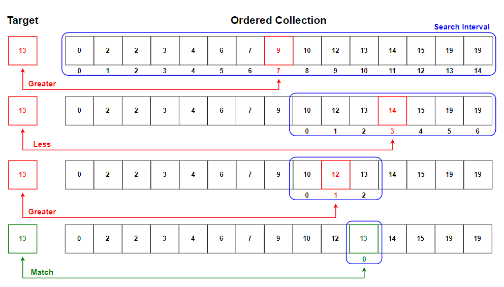
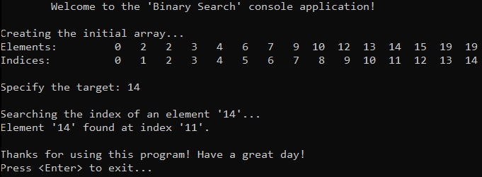
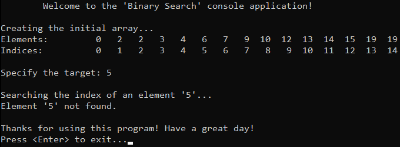

# &#128209; Table of Contents
- [💡 What is the Binary Search](#-what-is-the-binary-search)
- [💻 Implementation](#-implementation)
- [📊 Analysis](#-analysis)
- [📝 Application](#-application)
- [⏳ Historical Notes](#-historical-notes)
- [🤝 Contributing](#-contributing)
- [📧 Contact Information](#-contact-information)
- [🙏 Credits](#-credits)
- [🔏 License](#-license)


# &#128161; What is the Binary Search
The **Binary Search** stands out as one of the most fundamental approaches to search for an element in the ordered collection. The algorithm is named for the way it divides the search interval in half. Knowledge and understanding of it, lays a solid foundation for algorithmic design and tackling more complex problem-solving strategies.
<p align="center"></p>

---
**Binary Search** repeatedly divides the search interval of an ordered collection until a match is found or the interval is empty, pretty much like the intuitive process of looking for a particular page in some type of dictionary without any prior knowledge of its content or index. It consists of the following steps:
1. Make sure the collection is in sorted order.
2. Calculate the midddle index.
3. Compare target element with middle one.
   - if target **matches** with middle, the search is successful, **return** the index.
   - if target is **less** then middle, continue the search on the **left** half of a collection.
   - if target is **greater** then middle, continue the search on the **right** half of a collection.
4. Repeat previous steps until either target element is found or the search interval is empty.


# &#x1F4BB; Implementation
The program initializes an array with specified integers, prompts the user to enter the value of a target element, performs a search using the binary search algorithm, and finally displays the result indicating whether the operation was successful or not.
<p align="center"></p>
<p align="center"></p>

To prioritize simplicity and emphasize algorithm itself, several design decisions were made:
- Utilizing a small integer array as a collection.
- Omitting certain optimizations to the algorithm.
- Assumming that collections is already sorted.

---
Searching algorithm implemented within the function `binarySearch()`, which is declared in `BinarySearch.h` header file and defined in `BinarySearch.cpp` source file. This approach is adopted to ensure encapsulation, modularity and compilation efficiency. Examination of sorting technique is conducted within the `main()` function located in the `Main.cpp` file.

**The Complete Implementation of a Search:**
```cpp
int binarySearch(int arr[], int left, int right, int target) {
	while (left <= right) {
		int mid = left + (right - left) / 2;

		if (arr[mid] == target)
			return mid;

		if (arr[mid] < target)
			left = mid + 1;
		else
			right = mid - 1;
	}

	return -1;
}
```

---
**The Detailed Algorithm Overview:**
1. We start by passing the sorted array, target element and left side index and right side index of search interval, which basically are start (`0`) and end (`size-1`) of a collection. This way we can iterate over search intervals of a collection anywhere by comparing them:
```cpp
while (left <= right) {
```

2. In order to determine the middle intex of a search interval, we apply this formula because it is more preferable due to the fact that it avoids overflow.
```cpp
int mid = left + (right - left) / 2;
```

3. Then we can start searching process by comparing target with middle. First we check if we have found the element, if so return the index of it; otherwise we have to divide the search interval.
```cpp
if (arr[mid] == target)
	return mid;
```

4. The idea behind division is pretty simple and straightforward: we "throw away" half of elements by moving the left index to the right of middle by one if target element appears to be greater then all of the elements in the left half and vice versa for right index.
```cpp
if (arr[mid] < target)
	left = mid + 1;
else
	right = mid - 1;
```

5. And if target element didn't match with any of present in collection, return an error code, indicating that the search is unsuccessful.
```cpp
return -1;
```

# &#128202; Analysis
- **Search Strategy:** 
  - **Binary Approach** — operate on sorted datasets and repeatedly divide the search space in half until the target element is found.

- **Time Complexity:**
     - Worst Case: $O(logn)$ — occurs when target is either not present, therefore algorithm requires traverse through all elements.
     - Average Case: $O(logn)$ — occurs when target is spread within uniform probability, therefore algorithm doesn't require to perform all the steps to the end.
     - Best Case: $O(1)$ — occurs when target is found at the middle, therefore only one comparison.

- **Auxiliary Space Complexity:** 
  - $O(1)$ — as no additional space is required beyond the input collection and a few variables.

- **Element's Mutability:**
   - **Suitable for Static** — as algorithm operates on sorted collections, maintaining sorted order of frequent changes could become costly in terms of resources, especially if it involves reallocation of memory, thus making it not the best option for a dynamic collection.

- **Key Representation:**
   - **Suitable for Actual Keys** — algorithm is primarily concerned with comparing keys directly in their original form, especially because of better alternatives out there.

- **Adaptability:**
   - **Non-Adaptive** — data processed through the same path of steps, regardless of their values, however algorithm requires the collection to be in sorted order.

- **Storage:**
   - **Suitable for Internal** — binary search is not suitable for external searching due to its reliance on random access patterns, which are inefficient for disk-based storage systems, thus for this type of searching there are more optimized alternatives.


# &#128221; Application
**Some of the Most Well-Known Use Cases:**
- **Sorted Collections** — most common application of algorithm due to its efficiency in logarithmic time compexity, which makes it a good choice for dictionaries or large datasets.
- **Finding Upper/Lower Bound** — algorithm can be used when dealing with numberical datasets or when designing algorithms that require matching or approximation, because of how easy it is to find the target element, and calculate closest to it.
- **Building Data Structures** — binary search principle is crucial for data structures, that rely on maintaining sorted order efficient searching capabilities such as BSTs and Heaps, due to its efficiency.


# &#x23F3; Historical Notes
The idea of Binary Search has evolved over time and there is no single individual behind them, especially because historical origins are not always well-recorded. In terms of computer science, it was one of the earliest searching algorithms to be implemented in early computer programs. Since then, many others have contributed to its understanding, analysis, and optimization.


# &#129309; Contributing
Contributions are highly appreciated! For detailed guidelines, please refer to the [root directory's contributing section](../../../#-contributing).


# &#128231; Contact Information
For contact details and additional information, please refer to the [root directory's contact information section](../../../#-contact-information).


# &#128591; Credits
&#128218; **Books:**
- **"Grokking Algorithms: An Illustrated Guide for Programmers and Other Curious People"** — by Aditya Bhargava
  - Section 1.2: Binary Search
- **"The Art of Computer Programming, Volume 3: Sorting and Searching" (2nd Edition)** — by Donald Ervin Knuth
  - Section 6.2.1: Searching an Ordered Table
- **"Algorithms in C++, Parts 1-4: Fundamentals, Data Structure, Sorting, Searching" (3rd Edition)** — by Robert Sedgewick
  - Section 12.4: Binary Search
  - Section 2.6: Examples of Algorithm Analysis
- **"Data Structures and Algorithm Analysis in C++" (4th Edition)** — by Mark Allen Weiss
  - Section 2.4.4: Logarithms in the Running Time

---  
&#127891; **Courses:**
- [Mastering Data Structures & Algorithms using C and C++](https://www.udemy.com/course/datastructurescncpp/) on Udemy
   - Section 7: The Array ADT (Binary Search)

---  
&#127760; **Web-Resources:**  
- [Binary search algorithm](https://en.wikipedia.org/wiki/Binary_search_algorithm) (Wikipedia)
- [Binary Search](https://www.geeksforgeeks.org/binary-search/)
- [Why start + (end – start)/2 is preferable method for calculating middle of an array over (start + end)/2 ?](https://www.geeksforgeeks.org/start-end-start2-preferrable-method-calculating-middle-array-start-end2/)
- [Binary Search Algorithm: Function, Benefits, Time & Space Complexity](https://www.upgrad.com/blog/binary-search-algorithm/)


# &#128271; License
This project is licensed under the MIT License — see the [LICENSE](https://github.com/vezzolter/DSA/blob/main/LICENSE) file for details.

[](https://opensource.org/licenses/MIT)