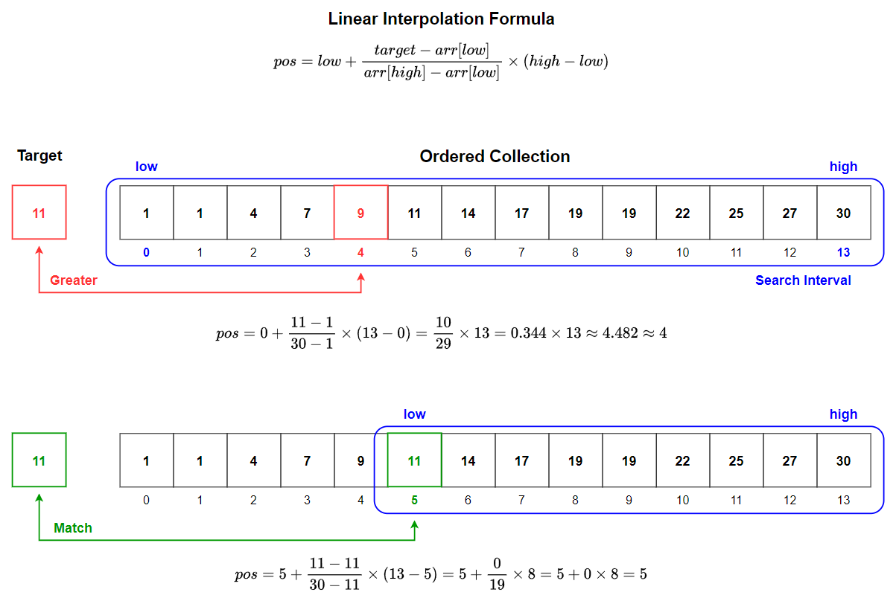
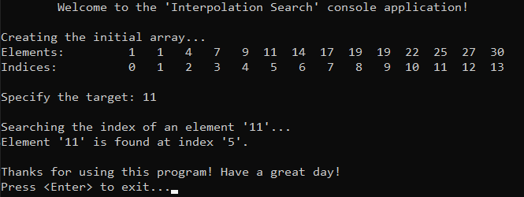
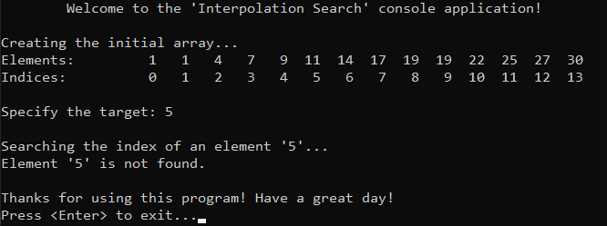

# &#128209; Table of Contents
- [💡 Overview](#-overview)
  - [Introduction](#introduction)
  - [Important Details](#important-details)
  - [Algorithm Steps](#algorithm-steps)
- [💻 Implementation](#-implementation)
  - [Design Decisions](#design-decisions)
  - [Complete Implementation](#complete-implementation)
  - [Detailed Walkthrough](#detailed-walkthrough)
- [📊 Analysis](#-analysis)
  - [Algorithm Characteristics](#algorithm-characteristics)
  - [Algorithm Comparison](#algorithm-comparison)
- [📝 Application](#-application)
  - [Common Use Cases](#common-use-cases)
  - [Some Practical Problems](#some-practical-problems)
- [🕙 Origins](#-origins)
- [🤝 Contributing](#-contributing)
- [📧 Contacts](#-contacts)
- [🙏 Credits](#-credits)
- [🔏 License](#-license)


# &#128161; Overview
**Interpolation Search** is a search algorithm known for efficiently finding elements in a uniformly distributed ordered collection by estimating the position of the target value. The algorithm's name comes from the interpolation formula it uses to predict where the desired element is likely to be within the current search interval. Knowledge and understanding of it lay a solid foundation for algorithmic design and tackling more complex problem-solving strategies.
<p align="center"></p>


## Introduction
**Interpolation Search** optimizes the search process in an ordered collection by estimating the likely position of the target element using the values at the boundaries and applying linear interpolation.


## Important Details
- The algorithm is only applicable to sorted collections; otherwise, it may search the wrong parts of the data and return no result, even if the element is present.
- The algorithm requires specific data characteristics — data should be uniformly distributed, as the interpolation formula assumes a linear relationship between values. If the data is clustered, has irregular gaps, or includes many duplicates, the performance may degrade, making other approaches more reliable.


## Algorithm Steps
1. Make sure the collection is in sorted order.
2. Initialize the search interval with the lowest (`low`) and highest (`high`) indices of the collection.
3. While the `low` index is less than or equal to the `high` index and the target is within search interval:
   - Calculate the estimated position using the interpolation formula:  
     $\text{pos} = \text{low} + \frac{\text{target} - \text{arr[low]}}{\text{arr[high]} - \text{arr[low]}} \times (\text{high} - \text{low})$
   - Compare the target element with the element at the estimated position (`arr[pos]`).
     - If the target **matches**, the search is successful; **return** the index `pos`.
     - If the target is **less**, adjust the search interval to the **left** by setting `high = pos - 1`.
     - If the target is **greater**, adjust the search interval to the **right** by setting `low = pos + 1`.
4. Repeat the previous steps until the target element is found or the search interval is empty.
5. If the target element is not found, return an indication of failure.


# &#x1F4BB; Implementation
The program initializes an array with specified integers, prompts the user to enter the value of a target element, performs a search using the interpolation search algorithm. It then displays the result, indicating whether the search was successful (element found) or not (element not found).
<p align="center"></p>
<p align="center"></p>


## Design Decisions
To prioritize simplicity and emphasize algorithm itself, several design decisions were made:
- Utilizing a small integer array as a collection.
- Omitting certain optimizations to the algorithm.


## Complete Implementation
Searching algorithm implemented within the function `interpolationSearch()`, which is declared in `InterpolationSearch.h` header file and defined in `InterpolationSearch.cpp` source file. This approach is adopted to ensure encapsulation, modularity and compilation efficiency. Examination of sorting technique is conducted within the `main()` function located in the `Main.cpp` file. Below you can find related code snippets.

```cpp
int interpolationSearch(int arr[], int size, int target) {
    int low = 0;
    int high = size - 1;

    while (low <= high && target >= arr[low] && target <= arr[high]) {
        // Edge case: one element
        if (arr[low] == arr[high]) {
            if (arr[low] == target) { return low; } // target present
            else { return -1; }                     // target absent
        }

        int pos = low + ((target - arr[low]) * (high - low)) / (arr[high] - arr[low]);

        if (arr[pos] == target) { return pos; }   // match, return
        if (arr[pos] < target) { low = pos + 1; } // greater, move low
        else { high = pos - 1; }                  // less, move high
            
    }

    return -1; // target absent
}
```


## Detailed Walkthrough
1. Initialize lowest and highest indices borders of the collection.
```cpp
  int low = 0;
  int high = size - 1;
```
2. Start the while loop to continue searching as long as the range is valid and the target is within bounds.
```cpp
  while (low <= high && target >= arr[low] && target <= arr[high]) {
```
3. Handle edge case, where only one element is present in the search interval. Return if its the target, and return an indication of failure if its not.
```cpp
  // Edge case: one element
  if (arr[low] == arr[high]) {
      if (arr[low] == target) { return low; } // target present
      else { return -1; }                     // target absent
  }
```
4. Calculate the estimated position using the interpolation formula.
```cpp
  int pos = low + ((target - arr[low]) * (high - low)) / (arr[high] - arr[low]);
```
5. Now check if estimation position is correct, return if true, adjust the search interval if not.
```cpp
  if (arr[pos] == target) { return pos; }   // match, return
  if (arr[pos] < target) { low = pos + 1; } // greater, move low
  else { high = pos - 1; }                  // less, move high
```
6. Finally, if target element didn't match with any of present in collection, return an error code, indicating that the search is unsuccessful.
```cpp
  return -1; // target absent
```


# &#128202; Analysis
Understanding the characteristics of an algorithm is essential for choosing the right solution to a problem, as it reveals their impact on resource utilization, potential limitations and capabilities. Comparing the algorithm with other approaches provides insights into its strengths and weaknesses, helping to make informed decisions in various scenarios.


## Algorithm Characteristics
- **Search Strategy:** 
  - **Interpolative Approach** — estimates the likely position of the target within the collection by using the values at the boundaries and assumes uniform distribution of elements.
- **Time Complexity:**
   - **Worst Case** $O(n)$ — occurs when elements are not uniformly distributed, or the interpolation formula repeatedly misestimates, leading to a linear search-like behavior.
   - **Average Case** $O(\log \log n)$ — occurs in uniformly distributed datasets, where the interpolation formula effectively narrows down the search range quickly.
   - **Best Case** $O(1)$ — occurs when the target is found immediately at the estimated position after the first interpolation.
- **Auxiliary Space Complexity:** 
  - $O(1)$ — as no additional space is required beyond the input collection and a few variables.
- **Element's Mutability:**
   - **Suitable for Static** — the algorithm relies on the uniform distribution of elements, making it less efficient with dynamic or frequently updated collections.
- **Key Representation:**
   - **Suitable for Numeric Keys** — the interpolation formula works best with numeric keys that can be linearly interpolated, and less so with non-numeric or transformed keys.
- **Adaptability:**
   - **Non-Adaptive** — follows the same path of steps, regardless of the distribution of data, but is sensitive to the distribution of values.
- **Storage:**
   - **Suitable for Internal** — as the algorithm is generally used on collections that can fit entirely in RAM.


## Algorithm Comparison
Will be Updated in the Future...


# &#128221; Application
Understanding some of the most well-known use cases of an algorithm is crucial for grasping its practical relevance and potential impact in real-world scenarios. Additionally, familiarizing oneself with common practical problems and practicing their solutions ensures that you remember the essential details and develop a deep, intuitive understanding of the functionality and limitations.


## Common Use Cases
- **Uniformly Distributed Data** — algorithm excels in scenarios where data is uniformly distributed. This is because the algorithm's estimation of the target's position is more accurate when the values are evenly spaced, allowing it to outperform other search methods that do not account for data distribution.
- **Large Datasets** — algorithm is particularly useful in large datasets. Its ability to estimate the target's location based on the distribution of data reduces the need for repeated halving, as in binary search, making it more efficient when the data distribution is favorable.


## Some Practical Problems
> **Note:** I was unable to identify any problems that are best solved exclusively by interpolation search or that significantly highlight its unique advantages.


# &#x1F559; Origins
Currently in Progress...


# &#129309; Contributing
Contributions are highly appreciated! For detailed guidelines, please refer to the [root directory's contributing section](../../../#-contributing).


# &#128231; Contacts
For contact details and additional information, please refer to the [root directory's contact information section](../../../#-contacts).


# &#128591; Credits
&#128218; **Books:**
- **"The Art of Computer Programming, Volume 3: Sorting and Searching" (2nd Edition)** — by Donald Ervin Knuth
  - Section 6.2.1: Searching an Ordered Table

---  
&#127760; **Web-Resources:**  
- [Interpolation search](https://en.wikipedia.org/wiki/Interpolation_search) (Wikipedia)
- [Interpolation search vs Binary search](https://www.geeksforgeeks.org/g-fact-84/)


# &#128271; License
This project is licensed under the MIT License — see the [LICENSE](https://github.com/vezzolter/DSA/blob/main/LICENSE) file for details.

[](https://opensource.org/licenses/MIT)