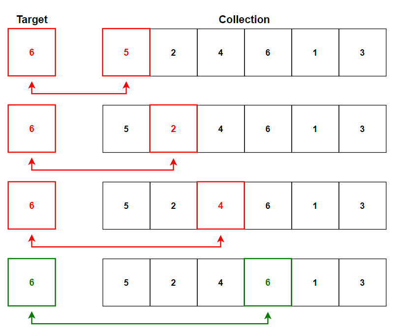
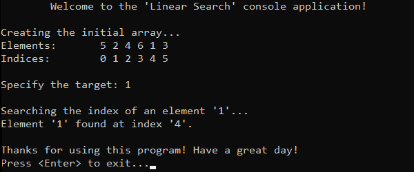
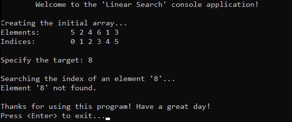

# &#128209; Table of Contents
- [� Table of Contents](#-table-of-contents)
- [💡 Overview](#-overview)
  - [Introduction](#introduction)
  - [Algorithm Steps](#algorithm-steps)
- [💻 Implementation](#-implementation)
  - [Design Decisions](#design-decisions)
  - [Complete Implementation](#complete-implementation)
  - [Detailed Walkthrough](#detailed-walkthrough)
- [📊 Analysis](#-analysis)
  - [Algorithm Characteristics](#algorithm-characteristics)
  - [Algorithm Comparison](#algorithm-comparison)
- [📝 Application](#-application)
  - [Common Use Cases](#common-use-cases)
  - [Some Practical Problems](#some-practical-problems)
- [🕙 Origins](#-origins)
- [📖 Resources](#-resources)
- [🤝 Contributing](#-contributing)
- [🔏 License](#-license)


# &#128161; Overview
The **Linear Search** stands out as the simplest known approach to search for an element in a collection. The algorithm is named for its linear (or sequential) traversal of the dataset, making it straightforward intuitive approach. Knowledge and understanding of it lay a solid foundation for algorithmic design and tackling more complex problem-solving strategies.
<p align="center"></p>


## Introduction
**Linear Search** sequentially checks each element in the collection, starting from the first element and moving one by one until the target element is found or the end of the collection is reached. 


## Algorithm Steps
1. Start at the first element of the collection.
2. Compare the current element with the target element.
3. If they match, the search is successful, return the current index.
4. Otherwise, move to the next element in the collection.
5. Repeat steps 2-4 until the target element is found or the collection ends.
6. If the end of the collection is reached without finding a match, the search is unsuccessful, return a signal.


# &#x1F4BB; Implementation
The program initializes an array with specified integers, prompts the user to enter the value of a target element, performs a search using the linear search algorithm. It then displays the result, indicating whether the search was successful (element found) or not (element not found).
<p align="center"></p>
<p align="center"></p>


## Design Decisions
To prioritize simplicity and emphasize algorithm itself, several design decisions were made:
- Utilizing a small integer array as a collection.
- Omitting certain optimizations to the algorithm.


## Complete Implementation
Searching algorithm implemented within the function `linearSearch()`, which is declared in `LinearSearch.h` header file and defined in `LinearSearch.cpp` source file. This approach is adopted to ensure encapsulation, modularity and compilation efficiency. Examination of sorting technique is conducted within the `main()` function located in the `Main.cpp` file. Below you can find related code snippets.

```cpp
int linearSearch(int arr[], int size, int target) {
	for (int i = 0; i < size; i++) {
		if (arr[i] == target) { return i; }
	}
			
	return -1;
}
```


## Detailed Walkthrough
1. Iterate over a collection.
```cpp
  for (int i = 0; i < size; i++)
```
2. Compare the current element of iteration with the target one. If it matches, then return it; otherwise keep traversing.
```cpp
  if (arr[i] == target) { return i; }
```
3. If target element didn't match with any of present in collection and reached the end of it, return an error code, indicating that the search is unsuccessful.
```cpp
  return -1;
```


# &#128202; Analysis
Understanding the characteristics of an algorithm is essential for choosing the right solution to a problem, as it reveals their impact on resource utilization, potential limitations and capabilities. Comparing the algorithm with other approaches provides insights into its strengths and weaknesses, helping to make informed decisions in various scenarios.


## Algorithm Characteristics
- **Search Strategy:** 
  - **Linear Approach** — sequentially examine each element in the collection until the target is found or the end of the dataset is reached.
- **Time Complexity:**
     - **Worst Case** $O(n)$ — occurs when target is either not present or at the end, therefore algorithm requires iterating through all elements.
     - **Average Case** $O(n)$ — occurs when target is spread within uniform probability, therefore algorithm checks half of the elements.
     - **Best Case** $O(1)$ — occurs when target is found at the beginning, therefore only one comparison.
- **Auxiliary Space Complexity:** 
  - $O(1)$ — as no additional space is required beyond the input collection and a few variables.
- **Element's Mutability:**
   - **Suitable for Static** — algorithm require to scan the whole collection sequentially and frequent changes could lead to starting the process all over, thus making it not the best option for a dynamic collection.
- **Key Representation:**
   - **Suitable for Actual Keys** — even though algorithm can work with transformed keys, it is primarily concerned with comparing keys directly in their original form because of better alternatives out there.
- **Adaptability:**
   - **Non-Adaptive** — data processed through the same path of steps, regardless of their values.
- **Storage:**
   - **Suitable for Internal** — as algorithm mainly used on collections that can fit entirely in RAM.


## Algorithm Comparison
Will be Updated in the Future...


# &#128221; Application
Understanding some of the most well-known use cases of an algorithm is crucial for grasping its practical relevance and potential impact in real-world scenarios. Additionally, familiarizing oneself with common practical problems and practicing their solutions ensures that you remember the essential details and develop a deep, intuitive understanding of the functionality and limitations.


## Common Use Cases
- **Trivial Small Collections** — linear search is often used in trivial small collections, when the overhead of more complex algorithms is unnecessary.
- **Unsorted Collections** — linear search is used in unsorted collections, when the data doesn't need to be in any particular order, making it pretty versatile.


## Some Practical Problems
- [Word Search](https://leetcode.com/problems/word-search)
- [Search a 2D Matrix](https://leetcode.com/problems/search-a-2d-matrix)
- [Search in a Binary Search Tree](https://leetcode.com/problems/search-in-a-binary-search-tree)
- [Spiral Matrix](https://leetcode.com/problems/spiral-matrix)

> **Note:** While many problems involve searching through linear collections, it's crucial to be comfortable with iterating over common data structures. I recommend practicing problems where the search is slightly modified rather than purely linear. This approach will deepen your understanding and boost your confidence in tackling various search-related challenges.


# &#x1F559; Origins
The idea of Linear Search can be observed in many real life activities due to its simplicity. In terms of computer science, it was one of the earliest searching algorithms to be implemented in early computer programs. Its origin cannot be attributed to a single individual, rather it reflects the collective ingenuity of humanity.


# &#128214; Resources
&#128218; **Books:**
- **"The Art of Computer Programming, Volume 3: Sorting and Searching" (2nd Edition)** — by Donald Ervin Knuth
  - Section 6.1: Sequential Searching
- **"Algorithms in C++, Parts 1-4: Fundamentals, Data Structure, Sorting, Searching" (3rd Edition)** — by Robert Sedgewick
  - Section 12.3: Sequential Search 

---  
&#127891; **Courses:**
- [Mastering Data Structures & Algorithms using C and C++](https://www.udemy.com/course/datastructurescncpp/) on Udemy
   - Section 7: The Array ADT (Linear Search)

---  
&#127760; **Web-Pages:**  
- [Linear Search](https://en.wikipedia.org/wiki/Linear_search) (Wikipedia)


# &#129309; Contributing
Contributions are highly appreciated! For detailed guidelines, contact details, and additional information, please refer to the [root directory's contributing section](../../../#-contributing).


# &#128271; License
This project is licensed under the MIT License — see the [LICENSE](https://github.com/vezzolter/DSA/blob/main/LICENSE) file for details.

[](https://opensource.org/licenses/MIT)