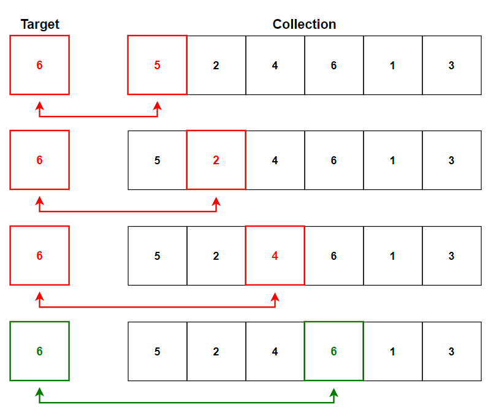

# &#128209; Table of Contents
- [💡 What is the Insertion Sort](#-what-is-the-insertion-sort)
- [💻 Implementation](#-implementation)
- [📊 Analysis](#-analysis)
- [📝 Application](#-application)
- [⏳ Historical Notes](#-historical-notes)
- [🤝 Contributing](#-contributing)
- [📧 Contact Information](#-contact-information)
- [🙏 Credits](#-credits)
- [🔏 License](#-license)

# &#128161; What is the Linear Search
The **Linear Search** stands out as the simplest known approach to search for an element in a collection. The algorithm is named for the way it applies linear (or also known as sequential) manner to the search. Knowledge and understanding of it, lays the foundation for tackling more complex searching algorithms and problem-solving strategies.

---
**Linear Search** sequentially checks each element of the collection from the beginning until a match is found or the end of the collection is reached, pretty much like the intuitive process of looking for a particular book on a shelf where are only unnamed ones. It consists of the following steps:
1. Begin with the first element of the collection.
2. Compare the current element with the target element.
3. If the current elment matches the target one, the search is successful, return an index.
4. Otherwise, move to the next element in the collection.
5. Repeat steps 2-4 until either a match is found or the end of the collection is reached.
6. If the entire collection has been traversed without finding a match, the search is unsuccessful, return a signal.

# &#x1F4BB; Implementation
Currently in Progress...

# &#128202; Analysis
Currently in Progress...

# &#128221; Application
Currently in Progress...

# &#x23F3; Historical Notes
Currently in Progress...

# &#129309; Contributing
Contributions are highly appreciated! For detailed guidelines, please refer to the [root directory's contributing section](../../../#-contributing).

# &#128231; Contact Information
For contact details and additional information, please refer to the [root directory's contact information section](../../../#-contact-information).

# &#128591; Credits
&#128218; **Books:**
- **"The Art of Computer Programming, Volume 3: Sorting and Searching" (2nd Edition)** — by Donald Ervin Knuth
  - Section 6.1: Sequential Searching
- **"Algorithms in C++, Parts 1-4: Fundamentals, Data Structure, Sorting, Searching" (3rd Edition)** — by Robert Sedgewick
  - Section 12.3: Sequential Search 

---  
&#127891; **Courses:**
- [Mastering Data Structures & Algorithms using C and C++](https://www.udemy.com/course/datastructurescncpp/) on Udemy
   - Section 7: The Array ADT (Linear Search)

---  
&#127760; **Web-Resources:**  
- [Linear Search](https://en.wikipedia.org/wiki/Linear_search) (Wikipedia)
- [Linear Search Algorithm](https://www.geeksforgeeks.org/linear-search/)

# &#128271; License
This project is licensed under the MIT License — see the [LICENSE](https://github.com/vezzolter/DSA/blob/main/LICENSE) file for details.

