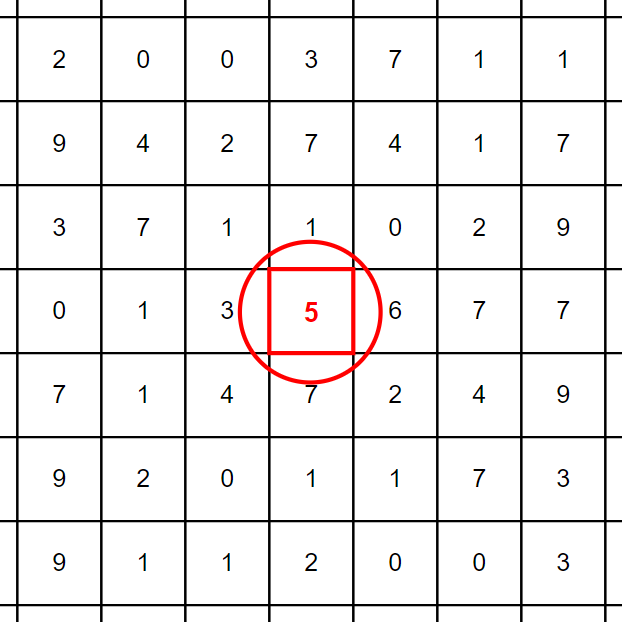

# &#128209; Table of Contents
- [💡 What is the Searching](#-what-is-the-searching)
- [💻 Implementation](#-implementation)
- [📊 Analysis](#-analysis)
- [📝 Application](#-application)
- [⏳ Historical Notes](#-historical-notes)
- [🤝 Contributing](#-contributing)
- [📧 Contact Information](#-contact-information)
- [🙏 Credits](#-credits)
- [🔏 License](#-license)

# &#128161; What is the Searching
**Searching** is a widely used operation in computer science to retrieve information. It helps to locate specific items or data within datasets in various algorithms and for all manner of applications, therefore it is important to truly understand the concept.

---
**Essential Terminology:**
- **Searching Algorithm** — is a set of steps used to retrieve a particular element within a collection of data.
  - **Successful Search** — is an outcome in which algorithm found the element(-s) containing argument. 
  - **Unsuccessful Search** — is an outcome in which algorithm didn't the element(-s) containing argument.
- **Collection** — is a data structure, which is used to group multiple elements together.
  - **Table** — is a small collection of all elements.
  - **File** — is a big collection of all elements.
  - **Database** — is a large collection of all elements.
- **Element/Record/Item** — is an individual entity within a collection.
  - **Index/Key of Element** — is a position of an element within collection.
  - **Value/Data of Element** — is an actual information stored within the element.
- **Argument** — is a parameter passed to an algorithm, which provides the criteria, which will be used to find the desired element.
- **Criterion** — is a rule used to determine whether an element meets the requirements of the search.

# &#x1F4BB; Implementation
Currently in Progress...

# &#128202; Analysis
Currently in Progress...

# &#128221; Application
Currently in Progress...

# &#x23F3; Historical Notes
Currently in Progress...

# &#129309; Contributing
Contributions are highly appreciated! For detailed guidelines, please refer to the [root directory's contributing section](../../#-contributing).

# &#128231; Contact Information
For contact details and additional information, please refer to the [root directory's contact information section](../../#-contact-information).

# &#128591; Credits
&#128218; **Books:**
- **"Grokking Algorithms: An Illustrated Guide for Programmers and Other Curious People"** — by Aditya Bhargava
  - Chapter 1.2: Binary Search
- **"Algorithms in C++, Parts 1-4: Fundamentals, Data Structure, Sorting, Searching" (3rd Edition)** — by Robert Sedgewick
  - Chapter 12: Symbol Tables and BSTs
  - Chapter 15: Radix Search
  - Chapter 16: External Searching
- **"The Art of Computer Programming, Volume 3: Sorting and Searching" (2nd Edition)** — by Donald Ervin Knuth
  - Chapter 6: Searching

---
&#127891; **Courses:**
- [Mastering Data Structures & Algorithms using C and C++](https://www.udemy.com/course/datastructurescncpp/) on Udemy
   - Section 7: The Array ADT (Linear + Binary Search)

---  
&#127760; **Web-Resources:**  
- [Search algorithm](https://en.wikipedia.org/wiki/Search_algorithm) (Wikipedia)

# &#128271; License
This project is licensed under the MIT License — see the [LICENSE](https://github.com/vezzolter/DSA/blob/main/LICENSE) file for details.

