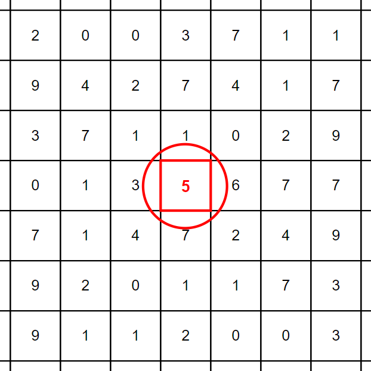

# &#128209; Table of Contents
- [💡 Overview](#-overview)
  - [Essential Terminology](#essential-terminology)
- [💻 Implementation](#-implementation)
  - [How to Implement](#how-to-implement)
  - [Pitfalls and Optimizations](#pitfalls-and-optimizations)
  - [Implemented Algorithms](#implemented-algorithms)
- [📊 Analysis](#-analysis)
  - [How to Analyze](#how-to-analyze)
  - [Trade-Offs](#trade-offs)
  - [Alternatives](#alternatives)
- [📝 Application](#-application)
  - [Common Use Cases](#common-use-cases)
  - [Some Practical Problems](#some-practical-problems)
- [🕙 Origins](#-origins)
- [🤝 Contributing](#-contributing)
- [📧 Contacts](#-contacts)
- [🙏 Credits](#-credits)
- [🔏 License](#-license)

# &#128161; Overview
**Searching** is a fundamental operation in both the real world and computer science, used to locate specific items or data within a dataset. Mastering this concept is essential — not only for its standalone applications, such as finding a contact in a phone book, but also for its role in facilitating and optimizing other algorithms by efficiently retrieving relevant information.

## Essential Terminology
- **Searching Algorithm** — is a set of steps used to retrieve a particular element within a collection of data.
  - **Successful Search** — is an outcome in which algorithm found the element(-s) containing argument. 
  - **Unsuccessful Search** — is an outcome in which algorithm didn't the element(-s) containing argument.
- **Criterion** — is a rule used to determine whether an element meets the requirements of the search.
- **Collection** — is a data structure, which is used to group multiple elements together.
  - **Table** — is a small collection of all elements.
  - **File** — is a big collection of all elements.
  - **Database** — is a large collection of all elements.
  - **Search Interval/Space**  — is subset of a collection, that is being searched and it may change dynamically depending on the algorithm.
- **Element/Record/Item** — is an individual entity within a collection.
  - **Index** — is a position of an element within collection.
  - **Value/Data** — is an actual information stored within the element.
  - **Key** — is a unique identifier or attribute associated with an element in a collection, can be used as the primary criterion for different operations.
  - **Target Element** — is a one that search algorithm seeks to find within a collection, serves as a reference for comparison.

# &#x1F4BB; Implementation
When implementing a concept, it's essential to understand the fundamental techniques that drive its behavior and ensure its correct functionality. Additionally, recognizing the critical pitfalls and potential optimizations allows you to refine the implementation, making it more efficient and robust for various scenarios.

## How to Implement
There isn't a universal search algorithm that works optimally in every scenario. This is because the nature of the data, its storage, and the specific requirements of the problem, which can vary widely — all of those factors, influence the choice. Fortunately, there aren't too many searching algorithms to cover, so I suggest categorizing them into two main approaches:  
  
- **Sequential Search (Only 1)** — elements are examined one by one until the target is found or the search reaches the end of the collection.  
**Examples:** Linear Search.

- **Interval Searches** — work by dividing the search space into intervals and focusing on the relevant section.  
**Examples:** Binary Search, Interpolation Search.

> **Note:** Unfortunately, I couldn't find any resource that would extensively cover this concept, which likely indicates that mastering it in great depth isn't as crucial/required. Therefore,  I recommend focusing primarily on the different ways linear and binary search algorithms, as these will cover the vast majority of search-related problems you'll encounter in day-to-day tasks.

## Pitfalls and Optimizations
When choosing or implementing a search algorithm, it’s important to go beyond just finding the fastest one. The context in which the algorithm will be used, the nature of the data, and potential edge cases must all be carefully considered. While an algorithm might perform well in controlled conditions, real-world complexities can introduce challenges that lead to inefficiencies or errors. To avoid these pitfalls and optimize your search algorithms, consider the following factors:

- **Data Distribution** — how is your data distributed? Some search algorithms perform best on uniformly distributed data, while others may struggle. Consider whether your algorithm can handle skewed or uneven data distributions effectively.
- **Data Size** — how large is the dataset? For smaller datasets, simpler algorithms like linear search might suffice, but as the data grows, more efficient algorithms like binary search or hash-based methods become necessary. Consider whether your algorithm scales well with the data size.
- **Data Ordering** — is your data sorted or unsorted? If your data isn't sorted, consider the trade-offs of sorting it first or using a different search approach.
- **Duplicate Elements** — how does the algorithm handle duplicates? If your dataset contains many duplicate elements, ensure your search algorithm can manage them correctly, especially when searching for all instances of a target element.
- **Search Space Size** — how large is the search space? In some cases, the search space might be too large for exhaustive search methods, making it necessary to use heuristic or probabilistic approaches to reduce the search effort.
- **Empty Collection** — how does the search algorithm behave when searching in an empty collection? Handling edge cases like empty collections gracefully is crucial to prevent unexpected errors or crashes in your application. Ensuring that the algorithm returns a sensible result, such as indicating that the item isn’t found, is important for reliability.
- **Single Element** — how does the search algorithm handle a collection with only one element? Although this might seem straightforward, ensuring that the algorithm efficiently manages single-element collections without unnecessary overhead is key to maintaining performance, especially in edge cases.
- **Worst-Case Scenarios** — how does the algorithm perform in worst-case situations? Consider the worst-case time complexity of your algorithm and how often it might occur in your application. Mitigating these cases can improve overall performance.
- **Indexing and Preprocessing** — can the search be optimized with indexing or preprocessing? Building an index or preprocessing the data can significantly speed up search operations but comes with trade-offs in terms of memory usage and preprocessing time.
- **Parallelization** — can the search process be parallelized to improve performance? In large datasets or real-time applications, parallel searching can reduce search time, but it requires careful handling of data consistency and synchronization.
- **Input Validation** — how does the algorithm handle invalid inputs or edge cases like empty collections or non-existent elements? Ensuring robust input validation can prevent unexpected crashes and improve reliability.
- **Memory Usage** — what are the memory implications of the search algorithm? Some algorithms, like those involving recursion or auxiliary data structures, may require more memory, which can be a constraint in certain environments.
- **Adaptive Strategies** — can the search algorithm adapt based on the data or usage patterns? Algorithms that adjust their behavior based on the characteristics of the data or previous searches can provide better performance in dynamic or varied environments.

## Implemented Algorithms
Discussing practical implementations, it's evident that well-established and widely recognized solutions already exist. In the context of C++, `std::find()` and `std::binary_search()` are such representatives. It's commonly recommended to rely on these proven implementations rather than reinventing the wheel. However, within the scope of this section, we'll take a closer look at simplified versions of popular searching algorithms. This exploration is aimed at gaining a deeper understanding of the fundamental design paradigms that underlie them.
- [Linear Search](https://github.com/vezzolter/DSA/tree/main/Algorithms/Searching/LinearSearch) ✅
- [Binary Search](https://github.com/vezzolter/DSA/tree/main/Algorithms/Searching/BinarySearch) ✅
- [Interpolation Search](https://github.com/vezzolter/DSA/tree/main/Algorithms/Searching/InterpolationSearch) ✅
- Fibonacci Search (?)
- Exponential Search (?)
- Jump Search (?)

# &#128202; Analysis
Understanding how to analyze a concept is crucial for identifying its key characteristics and evaluating its performance across different scenarios. Additionally, examining the trade-offs allows you to understand what you gain and what you give up when applying the concept. Finally, considering alternatives helps you determine when the concept is the best choice and when other approaches might be more appropriate.

## How to Analyze
- **Time Complexity:**
  - $O(1)$ — occurs when the search operation takes the same amount of time regardless of the size of the dataset, usually via known key and straightforward access.
   - $O(log(n))$ — occurs when the search operation divides the search space in half with each step.
  - $O(n × log(n))$ — occurs when the time of search increases linearly with the size of collection and also influenced by logarithmic factor due to divide-and-conquer strategies.
   - $O(n)$ — occurs when the search operation examines each element one by one, therefore making its time proportional to the size of the collection.
   - $O(n^2)$ — can occur in certain nested loop-based search algorithms where each element is compared with every other element in the collection.
   - $O(2^n)$ — typically associated with brute-force search algorithms that explore all possible combinations of elements.
   - **Other** — although they are in the minority, it is worth mentioning them.
  
- **Space Complexity:**
   - **In-Place** $\big(O(1)\big)$  — algorithm does not require any additional memory.
   - **Out-of-Space** $\big(O(n)/O(n×logn)/...\big)$ — algorithm does require some additional memory.  

- **Element's Mutability:**
   - **Static** — contents of the collection either rarely change or don't change at all.
   - **Dynamic** — contents of the collection frequently change.

- **Key Representation:**
   - **Actual Keys** — refers to the original keys or values used for identification and retrieval within the search algorithm.
   - **Transformed Keys** — refers to the keys, that have undergone some form of transformation (e.g. encryption, different format, preprocessing, etc) to optimize the search process.

- **Adaptability:**
   - **Adaptive** — algorithm adjusts its overall behavior (sequence of operations) based on the initial order of elements to improve performance.
   - **Non-Adaptive** — data processed through the same path of steps, regardless of their values.

- **Storage:**
   - **Internal** — algorithm takes place entirely within the main memory (RAM) of computer.
   - **External** — algorithm takes place within other storage devices (e.g. hard disk), typically due to their huge size.

## Trade-Offs
**What Searching Gives:**
- **Quick Data Retrieval** — searching algorithms allow for the efficient retrieval of specific elements from datasets, reducing the time and effort needed to find information. This efficiency is crucial in applications where data access speed is critical, such as databases or real-time systems.
- **Improved Algorithm Performance** — searching is a fundamental operation that supports and enhances many other algorithms and systems. By having robust searching capabilities, more complex and efficient applications can be developed.

---
**What Searching Takes:**
- **Time Consumption** — searching can require significant time, especially in large, unsorted datasets. This time cost becomes a critical factor in applications where speed is essential, as inefficient searches can lead to performance bottlenecks.
- **Space Consumption** — some search algorithms, particularly recursive ones, may need additional memory. This extra memory usage can impact performance, especially in environments with limited resources.
- **Data Requirements** — certain search algorithms depend on the data being sorted, which introduces a preprocessing step. This requirement can complicate implementation and affect overall performance, especially in dynamic datasets where data changes frequently.
- **Implementation Intricacies** — implementing search algorithms can involve handling edge cases, such as duplicates or missing elements, adding complexity to the code. This complexity might introduce bugs or make the code harder to maintain.

## Alternatives
- **Indexed Data Structures** — rather than performing a search operation, indexed data structures like hash tables or dictionaries provide direct access to elements using keys. These structures eliminate the need for searching by mapping keys directly to values, allowing for constant-time lookups. This approach is particularly efficient in cases where elements need to be frequently accessed based on a specific key, as indexed structures can outperform traditional searching algorithms.
- **Caching Techniques** — instead of searching through a dataset every time an element is needed, caching techniques store frequently accessed elements in fast-access memory. By maintaining a cache of recent or common queries, systems can avoid repetitive searches and retrieve data more quickly. This method is especially useful in scenarios where certain elements are accessed repeatedly, such as in web applications or database queries.

# &#128221; Application
Understanding some of the most well-known use cases of a concept is crucial for grasping its practical relevance and potential impact in real-world scenarios. Additionally, familiarizing oneself with practical problems and practicing their solutions ensures that you retain essential details and develop a deep, intuitive understanding of the concept's capabilities and limitations.

## Common Use Cases
- **Efficient Retrieval** — search algorithms are crucial for indexing data structures and enabling fast access to specific items in systems like databases and real-time applications. This quick retrieval of critical data ensures smooth operations, supports timely decision-making, and allows systems to handle large datasets while delivering up-to-date information without delay.
- **Data Filtering** — search algorithms help filter out specific elements from a dataset based on given criteria, such as finding all elements that match a particular condition. This process is essential in data processing tasks, where targeted information extraction is needed for analysis.
- **Pattern Matching in Strings** — searching algorithms locate specific patterns or substrings within larger text data. This use case is vital in text processing, search engines, and data validation, where identifying specific sequences of characters quickly is necessary.

## Some Practical Problems
**Easy Problems:**
1. [First Bad Version](https://leetcode.com/problems/first-bad-version)
2. [Binary Search](https://leetcode.com/problems/binary-search)
3. [Search in a Binary Search Tree](https://leetcode.com/problems/search-in-a-binary-search-tree)
4. [Intersection of Two Arrays II](https://leetcode.com/problems/intersection-of-two-arrays-ii)
5. [Search Insert Position](https://leetcode.com/problems/search-insert-position)

---
**Medium Problems:** 
1. [Word Search](https://leetcode.com/problems/word-search)
2. [Find Minimum in Rotated Sorted Array](https://leetcode.com/problems/find-minimum-in-rotated-sorted-array)
3. [Find the Duplicate Number](https://leetcode.com/problems/find-the-duplicate-number)
4. [Search a 2D Matrix](https://leetcode.com/problems/search-a-2d-matrix)
5. [Peak Index in a Mountain Array](https://leetcode.com/problems/peak-index-in-a-mountain-array)
6. [Kth Smallest Element in a Sorted Matrix](https://leetcode.com/problems/kth-smallest-element-in-a-sorted-matrix)
7. [Search in Rotated Sorted Array](https://leetcode.com/problems/search-in-rotated-sorted-array)
8. [Spiral Matrix](https://leetcode.com/problems/spiral-matrix)
9. [Find Peak Element](https://leetcode.com/problems/find-peak-element)
10. [Time Based Key-Value Store](https://leetcode.com/problems/time-based-key-value-store/description/)

---
**Hard Problems:** 
1. [Median of Two Sorted Arrays](https://leetcode.com/problems/median-of-two-sorted-arrays)
2. [Minimum Cost to Make Array Equal](https://leetcode.com/problems/minimum-cost-to-make-array-equal)
3. [Kth Smallest Number in Multiplication Table](https://leetcode.com/problems/kth-smallest-number-in-multiplication-table)
4. [Closest Room](https://leetcode.com/problems/closest-room/description/)
5. [Random Pick with Blacklist](https://leetcode.com/problems/random-pick-with-blacklist/description/)

# &#x1F559; Origins
The concept of searching emerged unknown-long time ago and primarily attributed to the collective ingenuity of humanity, the development of searching algorithms dates back in the early days of computing. The first search algorithms, such as **Linear Search** and **Binary Search** quickly gained widespread adoption and underwent continuous development by programmers worldwide, becoming a fundamental component in various applications. As people started to utilize tree and graph based data structures more, the relevant search algorithms like following ones appeared: **DFS**, **BFS**, **Dijkstra's Algorithm**, **A\***, **Greedy Best-First Search**, — which are still extremely valuable and efficient to this day. Another breakthrough came with the rising popularity of the internet, which created a need in sophisticated and complex search engines, that could both filtrate the large amounts of different data and decide what is relevant. One notable invention, that revolutionized web search was the **PageRank** developed by **Larry Page** and **Sergey Brin** in **1996**, which first prototype was utilized at **Google** in **1998**. Nowadays the direction of searching tend to utilize the **AI** and **NLP** driven ideas in order to deliver more accurate search results.

# &#129309; Contributing
Contributions are highly appreciated! For detailed guidelines, please refer to the [root directory's contributing section](../../#-contributing).

# &#128231; Contacts
For contact details and additional information, please refer to the [root directory's contact information section](../../#-contacts).

# &#128591; Credits
&#128218; **Books:**
- **"Introduction to Algorithms" (3rd Edition)** — by Thomas H. Cormen, Charles E. Leiserson, Ronald L. Rivest and Clifford Stein
  - Section 11: Hash Tables
- **"Algorithms in C++, Parts 1-4: Fundamentals, Data Structure, Sorting, Searching" (3rd Edition)** — by Robert Sedgewick
  - Section 12: Symbol Tables and BSTs
  - Section 13: Balanced Trees
  - Section 14: Hashing
  - Section 15: Radix Search
  - Section 16: External Searching
- **"The Algorithm Design Manual" (2nd Edition)** — by Steven S. Skiena
  - Section 4: Sorting and Searching
- **"The Art of Computer Programming, Volume 3: Sorting and Searching" (2nd Edition)** — by Donald Ervin Knuth
  - Section 6: Searching

---
&#127891; **Courses:**
- [Mastering Data Structures & Algorithms using C and C++](https://www.udemy.com/course/datastructurescncpp/) on Udemy
   - Section 7: The Array ADT (Linear + Binary Search)

---  
&#127760; **Web-Resources:**  
- [Search algorithm](https://en.wikipedia.org/wiki/Search_algorithm) (Wikipedia)
- [Search Algorithms: Sequential Search vs Interval Search](https://www.programming9.com/tutorials/competitive-programming/433-search-algorithms-sequential-search-vs-interval-search)

# &#128271; License
This project is licensed under the MIT License — see the [LICENSE](https://github.com/vezzolter/DSA/blob/main/LICENSE) file for details.

