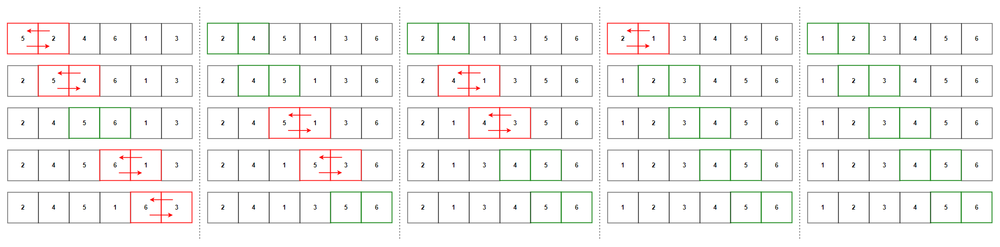
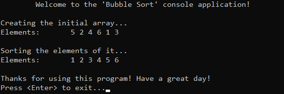

# &#128209; Table of Contents
- [💡 Overview](#-overview)
- [💻 Implementation](#-implementation)
- [📊 Analysis](#-analysis)
- [📝 Application](#-application)
- [⏳ Origins](#-origins)
- [🤝 Contributing](#-contributing)
- [📧 Contacts](#-contacts)
- [🙏 Credits](#-credits)
- [🔏 License](#-license)


# &#128161; Overview
The **Bubble Sort** stands out as one of the simplest and earliest known sorting technique, renowned for its straightforward implementation. The algorithm is named for the way the larger elements "bubble" up (move) to the top of the collection. Knowledge and understanding of it, lays the foundation for tackling more complex sorting methods and problem-solving strategies.
<p align="center"></p>

---
**Bubble Sort** iterates over a collection, comparing adjacent elements and swapping them if they are in the wrong order. This way, in each pass of the algorithm, the largest unsorted element move to its correct position at the end of the collection, much like bubbles gradually rising in water.

**Algorithm Steps:**
1. Start at the beginning of the collection.
2. Compare the first two elements.
3. If the order of them is wrong, swap them; otherwise skip this step.
4. Move to the next pair.
5. Repeat this process until no more swaps are needed.


# &#x1F4BB; Implementation
The program initializes an array of specified integers, performs ascending order sorting using the bubble sort algorithm, and finally displays the result.
<p align="center"></p>

To prioritize simplicity and emphasize algorithm itself, several design decisions were made:
- Utilizing an integer array as a collection.
- Exclusively implementing sorting in ascending order.
- Omitting certain optimizations to the algorithm.

---
Sorting algorithm implemented within the function `bubbleSort()`, which is declared in `BubbleSort.h` header file and defined in `BubbleSort.cpp` source file. This approach is adopted to ensure encapsulation, modularity and compilation efficiency. Examination of sorting technique is conducted within the `main()` function located in the `Main.cpp` file.

**Complete Implementation:**
```cpp
	void bubbleSort(int arr[], int size) {
		for (int i = 0; i < size - 1; i++) {
			bool swapped = false; 

			for (int j = 0; j < size - i - 1; j++) {
				// For descending order: arr[j] < arr[j + 1]
				if (arr[j] > arr[j + 1]) {
					// Can be optimized via swap
					int temp = arr[j];
					arr[j] = arr[j + 1];
					arr[j + 1] = temp;

					swapped = true;
				}
			}

			if (!swapped) {
				break;
			}
		}
	}
```

---
**Detailed Walkthrough:**  
1. We manage the overall passes through the **entire collection** using `size - 1` because, after each pass, the largest element is guaranteed to be at its correct position. Therefore, there is no need to iterate over the already sorted elements.
```cpp
	for (int i = 0; i < size - 1; i++) {
```
2. In the program, we utilize the variable `swapped` to facilitate loop termination. By initializing it with a value of `false`, we ensure that no swaps have occurred initially. This enables us to monitor whether any swaps take place during each pass.
```cpp
	bool swapped = false; 
```
3. Within each pass of the collection, we start another loop to **compare and move** elements using `size - i - 1`. This enables us to skip iterating over elements that are already sorted in previous passes and the current one.
```cpp
	for (int j = 0; j < size - i - 1; j++) {
```
4. Next, we compare the current element with the next one. If their order is incorrect, we swap the elements and update the indicator state; if their order is correct, we skip these actions. This process can be optimized by swapping elements, not copying.
```cpp
	// For descending order: arr[j] < arr[j + 1]
	if (arr[j] > arr[j + 1]) {
		// Can be optimized via swap
		int temp = arr[j];
		arr[j] = arr[j + 1];
		arr[j + 1] = temp;

		swapped = true;
	}
```
5. Finally, after completing a pass through the collection, we check if any swaps were made. If no swaps were made, it indicates that the elements are already sorted, and we can exit the loop.
```cpp
	if (!swapped) {
		break;
	}
```


# &#128202; Analysis
> Note: Some of the aspects described here are subject to implementation. Many sources may exploit this to their advantage, resulting in varying information for what appears to be the same concept. This can easily lead to confusion, so I highly encourage you to examine your specific case, filter through several sources, and adhere to the one that appears most accurate. I would like to discuss this topic with anyone who have related questions.

---
- **Comparison Approach:** 
  - **Comparison-Based** — algorithm operates by comparing elements pairwise to arrange them in order.

- **Time Complexity:**
     - Worst Case $\big($$O(n^2)$$\big)$  — occurs when the data is in reverse sorted order (or almost); nested loop's operations are used nearly each iteration.
     - Average Case $\big($$O(n^2)$$\big)$  — occurs when the data is randomly shuffled; nested loop's operations are used frequently enough.
     - Average Case $\big($$O(n)$$\big)$ — occurs when the data is already sorted (or almost); nested loop's operations are rarely used.

- **Space Complexity:** 
  - $O(1)$ — algorithm doesn't require any additional space.

- **Stability:** 
  - **Stable** — algorithm doesn't swap two equal elements, thus preserve their relative order.

- **Adaptabillity:** 
  - **Adaptive** — algorithm's adaptive logic lies in check whether the collection is sorted, which allows to terminate early, thus extent to which data is already sorted affects the perfomance.

- **Directness:**
   - **Direct** — algorithm sorts elements by directly manipulating themselves.

- **Storage:**
   - **Internal** — algorithm typically implemented to be an internal sorting.


# &#128221; Application
Bubble Sort's utility is limited in modern software development contexts due to its inefficiency. Even for niche applications, there are better alternatives readily available, making Bubble Sort largely obsolete. Its primary relevance lies solely in educational purpose.


# &#x23F3; Origins
In terms of computer science, Bubble Sort was one of the earliest sorting algorithms to be implemented in early computer programs. Its origin cannot be attributed to a single individual, rather it reflects the collective ingenuity of humanity. One notable contribution to this term, was documented in **1956** paper by mathematician and actuary **Edward Harry Friend**, who referred to it as "sorting exchange algorithm" and only later the well-known "Bubble Sort" name was coined by **Kenneth Eugene Iverson** in **1962**.


# &#129309; Contributing
Contributions are highly appreciated! For detailed guidelines, please refer to the [root directory's contributing section](../../../#-contributing).


# &#128231; Contacts
For contact details and additional information, please refer to the [root directory's contact information section](../../../#-contact-information).


# &#128591; Credits
&#128218; **Books:**
- **"Algorithms in C++, Parts 1-4: Fundamentals, Data Structure, Sorting, Searching" (3rd Edition)** — by Robert Sedgewick
  - Section 6.4: Bubble Sort
- **"The Art of Computer Programming, Volume 3: Sorting and Searching" (2nd Edition)** — by Donald Ervin Knuth
  - Section 5.2.2: Sorting by Exchanging

---
&#127891; **Courses:**
- [Mastering Data Structures & Algorithms using C and C++](https://www.udemy.com/course/datastructurescncpp/) on Udemy
   - Section 20: Sorting Techniques
  
---
&#127760; **Web-Resources:**  
- [Bubble Sort](https://en.wikipedia.org/wiki/Bubble_sortt) (Wikipedia)
- [Bubble Sort Algorithm](https://www.geeksforgeeks.org/bubble-sort/)
- [Bubble Sort: An Archaeological Algorithmic Analysis](https://users.cs.duke.edu/~ola/papers/bubble.pdf)


# &#128271; License
This project is licensed under the MIT License — see the [LICENSE](https://github.com/vezzolter/DSA/blob/main/LICENSE) file for details.

[](https://opensource.org/licenses/MIT)