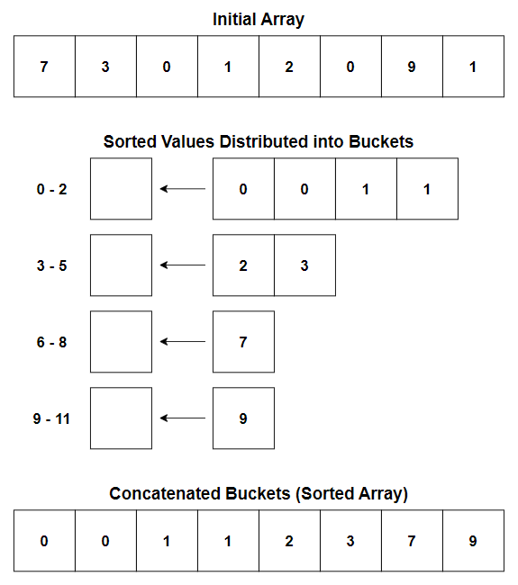

# &#128209; Table of Contents
- [💡 Overview](#-overview)
  - [Introduction](#introduction)
  - [Algorithm Steps](#algorithm-steps)
- [💻 Implementation](#-implementation)
  - [Design Decisions](#design-decisions)
  - [Complete Implementation](#complete-implementation)
  - [Detailed Walkthrough](#detailed-walkthrough)
- [📊 Analysis](#-analysis)
  - [Algorithm Characteristics](#algorithm-characteristics)
  - [Algorithm Comparison](#algorithm-comparison)
- [📝 Application](#-application)
  - [Common Use Cases](#common-use-cases)
  - [Some Practical Problems](#some-practical-problems)
- [🕙 Origins](#-origins)
- [🤝 Contributing](#-contributing)
- [📧 Contacts](#-contacts)
- [🙏 Credits](#-credits)
- [🔏 License](#-license)


# &#128161; Overview
The **Bucket Sort** (or **Bin Sort**) stands out as an efficient and simple sorting technique for uniformly distributed data. The algorithm is named for its key feature — buckets (bins), which are containers used to temporarily store elements within a specific range of values. This subsection explores idea of bucket sort not only to enhance comprehension of its concepts, but also to establish a solid foundation for a more complex algorithmic designs and problem-solving strategies.
<p align="center"></p>


## Introduction
The **Bucket Sort** algorithm sorts a collection by distributing the elements into a number of buckets, then individually sorting each bucket (via placement or sorting) and finally concatenating all the sorted buckets back into a single sorted array. 


## Important Details
1. The underlying data structures for buckets are usually implemented as linked lists or arrays.
2. To determine the number of buckets to create, common methods include using the square root of the data size, a fixed number of buckets regardless of the size, the range of input values, or even data-driven approaches.
3. For sorting elements within buckets, standard library implementations are commonly used. However, insertion sort is suitable for small datasets, quicksort works well for medium-sized buckets, and merge sort is ideal for medium to large-sized buckets.


## Algorithm Steps
1. Calculate the number of buckets to use based on the size of the input array.
2. Identify the minimum and maximum values in the array to determine the range of values.
3. Compute the range of values that each bucket will hold.
4. Create and initialize the required number of buckets.
5. Place elements into corresponding bucket based on its value.
6. Sort the elements within each bucket.
7. Concatenate sorted elements from each bucket into the original array in order.


# &#x1F4BB; Implementation
The program initializes an array of specified integers, performs ascending order sorting using the bucket sort algorithm, and finally displays the result.
<p align="center"></p>


## Design Decisions
To prioritize simplicity and emphasize algorithm itself, several design decisions were made:
- Utilizing a library implementation of dynamic array `vector<int>` both as collection and buckets.
- Determining the number of buckets via square method, and library `sqrt()` + `ceil` functions.
- Calculating the range of each bucket is done via `max_element()` and `min_element()` functions.
- Sorting elements within buckets is done via library implementation `sort()` of sorting function.
- Exclusively implementing sorting in ascending order.
- Omitting certain optimizations to the algorithm.


## Complete Implementation
Sorting algorithm implemented within the `bucketSort()` function with a few helper ones `findMax()` and `findMin()`, which are declared `BucketSort.h` header file and defined in `BucketSort.cpp` source file. This approach is adopted to ensure encapsulation, modularity and compilation efficiency. Examination of sorting technique is conducted within the `main()` function located in the `Main.cpp` file. Below you can find related code snippets.

```cpp
int findMax(const std::vector<int>& arr) {
    return *std::max_element(arr.begin(), arr.end());
}

int findMin(const std::vector<int>& arr) {
    return *std::min_element(arr.begin(), arr.end());
}

void bucketSort(std::vector<int>& arr) {
    int n = arr.size();
    int nBuckets = static_cast<int>(std::ceil(std::sqrt(n)));

    int minVal = findMin(arr);
    int maxVal = findMax(arr);
    int rangePerBucket = (maxVal - minVal + 1) / nBuckets + 1;

    std::vector<std::vector<int>> buckets(nBuckets);
    for (int i = 0; i < n; ++i) {
        int idBucket = (arr[i] - minVal) / rangePerBucket;
        buckets[idBucket].push_back(arr[i]);
    }

    arr.clear();
    for (int i = 0; i < nBuckets; ++i) {
        std::sort(buckets[i].begin(), buckets[i].end());
        for (int j = 0; j < buckets[i].size(); ++j) {
            arr.push_back(buckets[i][j]);
        }
    }
}
```


## Detailed Walkthrough
1. Calculate the number of buckets by taking the square root of the number of elements. This heuristic helps balance the size of each bucket, making sorting within each bucket more efficient.
```cpp
  int n = arr.size();
  int nBuckets = static_cast<int>(std::ceil(std::sqrt(n)));
```
2. Identify the minimum and maximum values in the array to determine the range of values. This ensures that each bucket covers an equal portion of the overall range of data. To calculate such value we calculate the total range of values in the array `maxVal - minVal + 1` (adding `+ 1` ensures that the range includes both min and max), and dividing by `nBuckets` splits the range into approximately equal parts, after that we add `+ 1` to ensure that the range is slightly larger, which helps in avoiding cases where the calculated range per bucket is zero.
```cpp
  int minVal = findMin(arr);
  int maxVal = findMax(arr);
  int rangePerBucket = (maxVal - minVal + 1) / nBuckets + 1;
```
3. Initialize a vector of vectors to serve as the buckets and iterate through it placing each element into the appropriate bucket based on its value. To calculate such id of such bucket we shift all the values so that the smallest one in the array becomes zero (this ensures that the values are correctly mapped to bucket indices starting from zero) via `arr[i] - minVal`, and also divide by `rangePerBucket`, which groups the values based on their range. For example, `(7 - 0) / 4 = 1` moves value `7` to the first bucket, `(9 - 0) / 4 = 2` moves value `9` to second bucket.
```cpp
  std::vector<std::vector<int>> buckets(nBuckets);
  for (int i = 0; i < n; ++i) {
      int idBucket = (arr[i] - minVal) / rangePerBucket;
      buckets[idBucket].push_back(arr[i]);
  }
```
4. Prepare the array to receive the sorted elements from the buckets by removing all the original elements. Iterate over buckets and apply sorting procedure of your choice (described earlier). Finally, iterate over sorted elements of each bucket, and push them back into initial array, thus forming the sorted one.
```cpp
  arr.clear();
  for (int i = 0; i < nBuckets; ++i) {
      std::sort(buckets[i].begin(), buckets[i].end());
      for (int j = 0; j < buckets[i].size(); ++j) {
          arr.push_back(buckets[i][j]);
      }
  }
```


# &#128202; Analysis
Currently in Progress...


## Algorithm Characteristics
Currently in Progress...


## Algorithm Comparison
Will be Updated in the Future...


# &#128221; Application
Currently in Progress...


## Common Use Cases
Currently in Progress...


## Some Practical Problems
Currently in Progress...


# &#x1F559; Origins
Currently in Progress...


# &#129309; Contributing
Contributions are highly appreciated! For detailed guidelines, please refer to the [root directory's contributing section](../../../#-contributing).


# &#128231; Contacts
For contact details and additional information, please refer to the [root directory's contact information section](../../../#-contacts).


# &#128591; Credits
&#128218; **Books:**
- **"Introduction to Algorithms" (3rd Edition)** — by Thomas H. Cormen, Charles E. Leiserson, Ronald L. Rivest and Clifford Stein
  - Section 8.4: Bucket Sort
- **"Data Structures and Algorithm Analysis in C++" (4th Edition)** — by Mark Allen Weiss
  - Section 7.11: Linear-Time Sorts: Bucket Sort and Radix Sort
- **"The Algorithm Design Manual" (2nd Edition)** — by Steven S. Skiena
  - Section 4.7: Distribution Sort: Sorting via Bucketing
- **"The Art of Computer Programming, Volume 3: Sorting and Searching" (2nd Edition)** — by Donald Ervin Knuth
  - Section 5.2.5: Sorting by Distribution

---  
&#127891; **Courses:**
- [Mastering Data Structures & Algorithms using C and C++](https://www.udemy.com/course/datastructurescncpp/) on Udemy
   - Section 20: Sorting Techniques

---  
&#127760; **Web-Resources:**  
- [Bucket sort](https://en.wikipedia.org/wiki/Bucket_sort) (Wikipedia)


# &#128271; License
This project is licensed under the MIT License — see the [LICENSE](https://github.com/vezzolter/DSA/blob/main/LICENSE) file for details.

[](https://opensource.org/licenses/MIT)