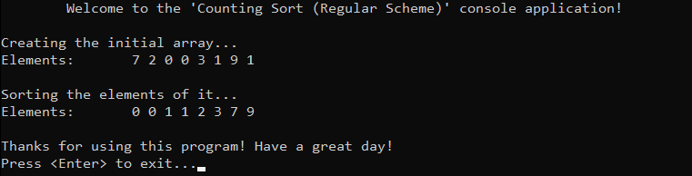

# &#128209; Table of Contents
- [💡 Overview](#-overview)
  - [Introduction](#introduction)
  - [Important Details](#important-details)
  - [Algorithm Steps (Regular Scheme)](#algorithm-steps-regular-scheme)
- [💻 Implementation](#-implementation)
  - [Design Decisions](#design-decisions)
  - [Complete Implementation](#complete-implementation)
  - [Detailed Walkthrough](#detailed-walkthrough)
- [📊 Analysis](#-analysis)
  - [Algorithm Characteristics](#algorithm-characteristics)
  - [Algorithm Comparison](#algorithm-comparison)
- [📝 Application](#-application)
  - [Common Use Cases](#common-use-cases)
  - [Some Practical Problems](#some-practical-problems)
- [🕙 Origins](#-origins)
- [🤝 Contributing](#-contributing)
- [📧 Contacts](#-contacts)
- [🙏 Credits](#-credits)
- [🔏 License](#-license)


# &#128161; Overview
The **Counting Sort** stands out as one of the most well-known non-comparative sorting technique. The name of the algorithm describes its method of sorting by counting the occurrences of each unique value in the input array and then using these counts to determine the correct positions of each value in the sorted output. This subsection explores idea of counting sort not only to enhance comprehension of its concepts, but also to establish a solid foundation for a more complex algorithmic designs and problem-solving strategies.
<p align="center"></p>


## Introduction
The **Counting Sort** works by counting the occurrences of each unique value in the initial array. Then it uses these counts to determine the position of each value in the sorted output array (refer below), therefore producing a sorted sequence without requiring any comparisons between values.


## Important Details
Basically, there are two ways you can do counting sort:
1. **Regular Scheme** — counts occurrences of each value and directly places each into the sorted output based on its count. Unstable version.
2. **Prefix-Sum Scheme** — counts occurrences of each value, transforms the count array into a prefix sum array,and then places each value into the sorted output based on its cumulative counts. Stable version.


## Algorithm Steps (Regular Scheme)
1. Determine the minimum and maximum values in the initial array to establish a count array.
2. Initialize with zeros a count array of size equal to the previously determined rannge.
3. Count occurrences by iterating through the initial array and incrementing corresponding index in the count array.
4. Iterate throught the count array and for each index in it, write the index value to the output array the number of times equal to the value at that index.


# &#x1F4BB; Implementation
The program initializes an array of specified integers, performs ascending order sorting using the counting sort algorithm, and finally displays the result.
<p align="center"></p>


## Design Decisions
To prioritize simplicity and emphasize algorithm itself, several design decisions were made:
- Utilizing an array of positive integers as a collection.
- Exclusively implementing sorting in ascending order.
- Omitting certain optimizations to the algorithm.


## Complete Implementation
Sorting algorithm implemented within the `countingSort()` function with a helper one `getMax()`, which are declared in `CountingSort.h` header file and defined in `CountingSort.cpp` source file. This approach is adopted to ensure encapsulation, modularity and compilation efficiency. Examination of sorting technique is conducted within the `main()` function located in the `Main.cpp` file. Below you can find related code snippets.

```cpp
int getMax(int arr[], int size) {
    int maxVal = arr[0];
    for (int i = 0; i < size; i++) {
        if (arr[i] > maxVal)
            maxVal = arr[i];
    }

    return maxVal;
}

void countingSort(int arr[], int size) {
    int maxVal = getMax(arr, size);

    int* count = new int[maxVal + 1];
    for (int i = 0; i <= maxVal; i++)
        count[i] = 0;

    for (int i = 0; i < size; i++)
        count[arr[i]]++;

    int index = 0;
    for (int i = 0; i <= maxVal; i++) {
        while (count[i] > 0) {
            arr[index++] = i;
            count[i]--;
        }
    }

    delete[] count;
}
```


## Detailed Walkthrough
1. Start by finding the maximum value in the array. This will determine the size of the counting array. To do so, you can simply iterate over a collection and update the max value, or resort to library implementations.
```cpp
  int maxVal = getMax(arr, size);
```
2. Using the maximum value obtained, initialize a counting array with $0$ to keep track of the number of occurrences of each value in the original array.
```cpp
  int* count = new int[maxVal + 1];
  for (int i = 0; i <= maxVal; i++)
      count[i] = 0;
```
3. Key step, iterate over the original array and increment the corresponding index in the counting array for each value found.
```cpp
  for (int i = 0; i < size; i++)
      count[arr[i]]++;;
```
4. Using the counting array, reconstruct the original array by placing each value the number of times it appears. For each value in the counting array, if the count is greater than zero, the value is placed in the original array, and the count is decremented until it reaches zero
```cpp
    int index = 0;
    for (int i = 0; i <= maxVal; i++) {
        while (count[i] > 0) {
            arr[index++] = i;
            count[i]--;
        }
    }
```
5. Finally, free the memory allocated for the counting array.
```cpp
  delete[] count;
```


# &#128202; Analysis
Currently in Progress...


## Algorithm Characteristics
Currently in Progress...


## Algorithm Comparison
Will be Updated in the Future...


# &#128221; Application
Currently in Progress...


## Common Use Cases
Currently in Progress...


## Some Practical Problems
Currently in Progress...


# &#x1F559; Origins
Currently in Progress...


# &#129309; Contributing
Contributions are highly appreciated! For detailed guidelines, please refer to the [root directory's contributing section](../../../#-contributing).


# &#128231; Contacts
For contact details and additional information, please refer to the [root directory's contact information section](../../../#-contacts).


# &#128591; Credits
&#128218; **Books:**
- **"Introduction to Algorithms" (3rd Edition)** — by Thomas H. Cormen, Charles E. Leiserson, Ronald L. Rivest and Clifford Stein
  - Section 8.2: Counting Sort
- **"Algorithms in C++, Parts 1-4: Fundamentals, Data Structure, Sorting, Searching" (3rd Edition)** — by Robert Sedgewick
  - Section 6.10: Key-Indexed Counting
- **"The Art of Computer Programming, Volume 3: Sorting and Searching" (2nd Edition)** — by Donald Ervin Knuth
  - Section 5.2: Internal Sorting

---  
&#127891; **Courses:**
- [Mastering Data Structures & Algorithms using C and C++](https://www.udemy.com/course/datastructurescncpp/) on Udemy
   - Section 20: Sorting Techniques

---  
&#127760; **Web-Resources:**  
- [Counting Sort](https://en.wikipedia.org/wiki/Counting_sort) (Wikipedia)


# &#128271; License
This project is licensed under the MIT License — see the [LICENSE](https://github.com/vezzolter/DSA/blob/main/LICENSE) file for details.

[](https://opensource.org/licenses/MIT)