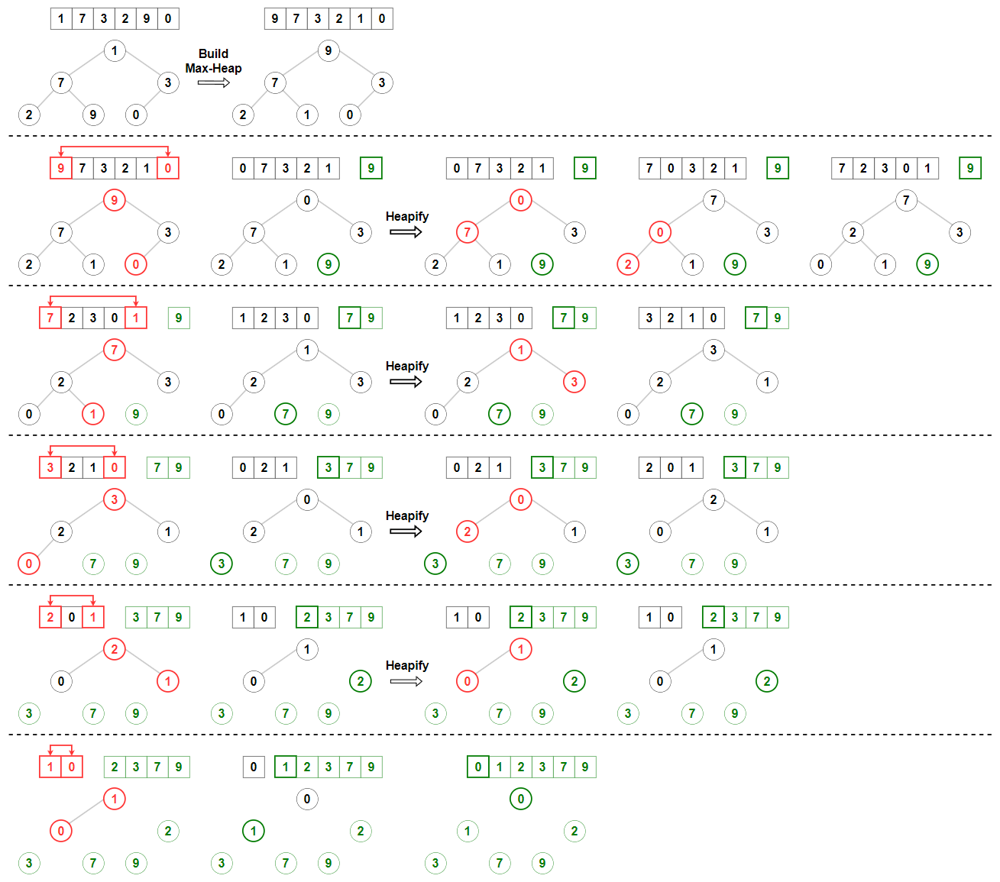
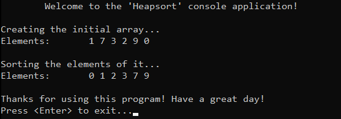

# &#128209; Table of Contents
- [💡 Overview](#-overview)
  - [Introduction](#introduction)
  - [Algorithm Steps](#algorithm-steps)
- [💻 Implementation](#-implementation)
  - [Design Decisions](#design-decisions)
  - [Complete Implementation](#complete-implementation)
  - [Detailed Walkthrough](#detailed-walkthrough)
- [📊 Analysis](#-analysis)
  - [Algorithm Characteristics](#algorithm-characteristics)
  - [Algorithm Comparison](#algorithm-comparison)
- [📝 Application](#-application)
  - [Common Use Cases](#common-use-cases)
  - [Some Practical Problems](#some-practical-problems)
- [🕙 Origins](#-origins)
- [📖 Resources](#-resources)
- [🤝 Contributing](#-contributing)
- [🔏 License](#-license)


# &#128161; Overview
The **Heapsort** stands out as one of the most well-known and efficient sorting techniques. The algorithm is named for its use of the heap data structure property, which implies that the keys of parent nodes are either greater than or equal to those of their children (in a max heap) or less than or equal to those of their children (in a min heap). This subsection explores the idea of heapsort not only to enhance comprehension of its concepts, but also to establish a solid foundation for more complex algorithmic designs and problem-solving strategies.
<p align="center"></p>


## Introduction
The **Heapsort** converts the original data into a heap data structure, divides its input into a sorted and an unsorted region, and iteratively shrinks the unsorted region by extracting the largest element (the root) from the heap and moving it to the sorted region.


## Algorithm Steps
1. Convert the input data into a max heap, so that the largest value is at the root.
2. Swap the root with the last element of the unsorted portion, thus moving the root to the sorted part.
3. Remove the swapped root from the heap.
4. Perform a heapify operation to ensure that the remaining elements maintain the heap property.
5. Repeat this process until there are no elements remaining in the unsorted part.


# &#x1F4BB; Implementation
The program initializes an array of specified integers, performs ascending order sorting using the heapsort algorithm, and finally displays the result.
<p align="center"></p>


## Design Decisions
To prioritize simplicity and emphasize algorithm itself, several design decisions were made:
- Utilizing an integer array as a collection.
- Exclusively implementing sorting in ascending order.
- Omitting certain optimizations to the algorithm.


## Complete Implementation
Sorting algorithm implemented within the `heapsort()` function with a few helper ones `swap()`, `buildMaxHeap()` and `heapify`, which are declared `Heapsort.h` header file and defined in `Heapsort.cpp` source file. This approach is adopted to ensure encapsulation, modularity and compilation efficiency. Examination of sorting technique is conducted within the `main()` function located in the `Main.cpp` file. Below you can find related code snippets.

```cpp
void heapify(int arr[], int size, int i) {
    int largest = i;      
    int left = 2 * i + 1;
    int right = 2 * i + 2;

    if (left < size && arr[left] > arr[largest]) { largest = left; }   
    if (right < size && arr[right] > arr[largest]) { largest = right; }  
    if (largest != i) {
        swap(arr[i], arr[largest]);
        heapify(arr, size, largest);
    }
}

void buildMaxHeap(int arr[], int size) {
    int startIdx = (size / 2) - 1; 
    for (int i = startIdx; i >= 0; i--) { heapify(arr, size, i); }
}

void heapsort(int arr[], int size) {
    buildMaxHeap(arr, size);

    for (int i = size - 1; i > 0; i--) {
        swap(arr[0], arr[i]);
        heapify(arr, i, 0);
    }
}
```


## Detailed Walkthrough  
1. Start by building a max heap from the input array. This process takes place in a separate from `heapsort()` function and ensures that the largest element is at the root of the heap.
```cpp
	buildMaxHeap(arr, size);
```
2. The `buildMaxheap()` function starts by calculating the index of the last non-leaf node in the heap. This is done to begin heapifying from the bottom up.
```cpp
	int startIdx = (size / 2) - 1;
```
3. Perform a reverse level order traversal from the last non-leaf node to the root, calling the `heapify()` function on each node. This ensures that the entire array satisfies the max heap property.
```cpp
	for (int i = startIdx; i >= 0; i--) { heapify(arr, size, i); }
```
4. In the `heapify()` function, initialize the largest variable as the current node index. This variable will be used to track the largest value among the node and its children. Also calculate the indices of the left and right children of the current node via respective formulas (i.e. total number of positions occupied by nodes and their children up to $i$ is $2*i$, left child would be the very next position ($+1$), and right next to the left ($+1$ once more))
```cpp
	int largest = i;      
	int left = 2 * i + 1;
	int right = 2 * i + 2;
```
5. Then simply Compare the value of the left child with the value of the current node. If the left child's value is greater, update largest to the index of the left child. Do the same for right child.
```cpp
  if (left < size && arr[left] > arr[largest]) { largest = left; }   
  if (right < size && arr[right] > arr[largest]) { largest = right; }  
```
6. If the largest value is not the current node, swap the values of the current node and the largest node. Then, recursively call heapify on the affected subtree to ensure it maintains the max heap property.
```cpp
	// If largest is not root
	if (largest != i) {
		swap(arr[i], arr[largest]);
		heapify(arr, size, largest);
	}
```
7. Once the max heap is built, proceed to sort the array. This is done by repeatedly extracting the largest element (the root of the heap) and moving it to the end of the array.
```cpp
	for (int i = size - 1; i > 0; i--) {
		swap(arr[0], arr[i]);
		heapify(arr, i, 0);
	}
```


# &#128202; Analysis
Understanding the characteristics of an algorithm is essential for choosing the right solution to a problem, as it reveals their impact on resource utilization, potential limitations and capabilities. Comparing the algorithm with other approaches provides insights into its strengths and weaknesses, helping to make informed decisions in various scenarios.


## Algorithm Characteristics
- **Comparison Approach:**
  - **Comparison-Based** — algorithm operates by comparing elements pairwise to arrange them in order.
- **Time Complexity:**
  - **All Cases** $O(n \log n)$ — occurs because the heapify process always takes $O(\log n)$ time, and this process is applied $n$ times.
- **Space Complexity:**
  - **Array Implementation** $O(1)$ — algorithm doesn't require any additional space beyond a few temporary variables.
- **Stability:**
  - **Unstable** — algorithm can swap two equal elements, thus altering their relative order. This happens because of the heapify process, which does not guarantee that equal elements will maintain their relative positions.
- **Adaptability:**
  - **Non-Adaptive** — algorithm does not inherently adapt its strategy to different input distributions, i.e. it processes data through the same path of steps, regardless of their values.
- **Storage:**
  - **Internal** — algorithm typically implemented to be an internal sorting.


## Algorithm Comparison
Will be Updated in the Future...


# &#128221; Application
Understanding some of the most well-known use cases of an algorithm is crucial for grasping its practical relevance and potential impact in real-world scenarios. Additionally, familiarizing oneself with common practical problems and practicing their solutions ensures that you remember the essential details and develop a deep, intuitive understanding of the functionality and limitations.


## Common Use Cases
- **Resource-Constrained Environments** — heapsort is used in scenarios where efficient sorting with minimal memory consumption is required. Unlike merge sort, which requires additional memory, heapsort operates in-place and still provides excellent performance; e.g. embedded systems, operating systems.
- **Guaranteed Performance** — heapsort is used when guaranteed performance is more critical than speed. While generally slower than quicksort, heapsort avoids the risk of excessive recursion depth, which can be problematic for quicksort in certain cases; e.g. introsort.


## Some Practical Problems
- [Sort an Array](https://leetcode.com/problems/sort-an-array/)


# &#x1F559; Origins
Heapsort was invented by British computer scientist **John William Joseph (Bill) Williams** in **1964**. Williams introduced Heapsort in a paper titled «Algorithm 232: Heapsort», published in the Communications of the ACM (Association for Computing Machinery) journal. He developed the algorithm to leverage the binary heap data structure, which he also introduced. The key idea was to efficiently sort data by first constructing a max heap from the input array and then repeatedly extracting the maximum element to achieve a sorted array, much like selection sort. Heapsort remains an important algorithm in computer science education and specific practical contexts, despite being less commonly used than quicksort and merge sort for general-purpose sorting.


# &#128214; Resources
&#128218; **Books:**
- **"Introduction to Algorithms" (3rd Edition)** — by Thomas H. Cormen, Charles E. Leiserson, Ronald L. Rivest and Clifford Stein
  - Section 6: Heapsort
- **"Algorithms in C++, Parts 1-4: Fundamentals, Data Structure, Sorting, Searching" (3rd Edition)** — by Robert Sedgewick
  - Section 9.4: Heapsort
- **"Data Structures and Algorithm Analysis in C++" (4th Edition)** — by Mark Allen Weiss
  - Section 7.5: Quicksort
- **"The Algorithm Design Manual" (2nd Edition)** — by Steven S. Skiena
  - Section 4.3: Heapsort: Fast Sorting via Data Structures
- **"The Art of Computer Programming, Volume 3: Sorting and Searching" (2nd Edition)** — by Donald Ervin Knuth
  - Section 5.2.3: Sorting by Selection

---  
&#127891; **Courses:**
- [Mastering Data Structures & Algorithms using C and C++](https://www.udemy.com/course/datastructurescncpp/) on Udemy
   - Section 19: Heap

---  
&#127760; **Web-Pages:**  
- [Heapsort](https://en.wikipedia.org/wiki/Heapsort) (Wikipedia)
- [USFCA: Heap Sort](https://www.cs.usfca.edu/~galles/visualization/HeapSort.html) (Visualization)


# &#129309; Contributing
Contributions are highly appreciated! For detailed guidelines, contact details, and additional information, please refer to the [root directory's contributing section](../../../#-contributing).


# &#128271; License
This project is licensed under the MIT License — see the [LICENSE](https://github.com/vezzolter/DSA/blob/main/LICENSE) file for details.

[](https://opensource.org/licenses/MIT)