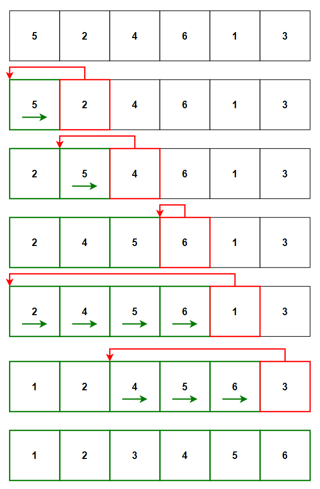
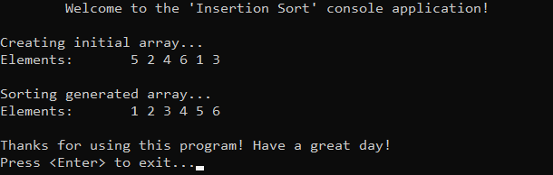

# &#128209; Table of Contents
- [💡 What is the Insertion Sort](#-what-is-the-insertion-sort)
- [💻 Implementation](#-implementation)
- [📊 Analysis](#-analysis)
- [📝 Application](#-application)
- [⏳ Historical Notes](#-historical-notes)
- [🤝 Contributing](#-contributing)
- [📧 Contact Information](#-contact-information)
- [🙏 Credits](#-credits)
- [🔏 License](#-license)


# &#128161; What is the Insertion Sort
The **Insertion Sort** stands out as one of the simplest and earliest known sorting techniques, renowned for its straightforward implementation and effectiveness. Knowledge and understanding of which, lays the foundation for tackling more complex sorting algorithms and problem-solving strategies.

<p align="center"></p>

---

**Insertion Sort** — places an unsorted element at its suitable place in each iteration, much like the intuitive process of arranging playing cards in a hand. It consists of the following steps:
1. Assume that the first element is in the sorted part.
2. Pick the first element from the unsorted part.
3. Place it in the correct position within the sorted part.
4. Repeat steps 2 and 3 until there are no elements remaining in the unsorted part.


# &#x1F4BB; Implementation
 
The program initializes an array with specified integers, performs ascending order sorting using the insertion sort algorithm, and finally displays the sorted result.
<p align="center"></p>

In order to prioritize simplicity and highlight algorithm itself there had done few things:
- the array serves as a basic collection
- `int` was chosen as data type
- sorting is exclusively performed in ascending order
- certain optimizations were omitted from the algorithm

---

The function `insertionSort()` is declared in `InsertionSort.h` header file and defined in `InsertionSort.cpp` source file. This approach is adopted to ensure encapsulation, modularity and compilation efficiency. Testing of the class functionalities is conducted within the `main()` function located in the `Main.cpp` file.

**The whole body of a function:**
```cpp
void insertionSort(int arr[], int size) {
	for (int unsorted = 1; unsorted < size; unsorted++) {
		int current = arr[unsorted];

		int sorted = unsorted - 1; // start from the end of sorted part
        // For descending order: arr[sorted] < current
		while (sorted >= 0 && arr[sorted] > current) {
			arr[sorted + 1] = arr[sorted]; // can be optimized via swap
			sorted = sorted - 1;
		}
		arr[sorted + 1] = current;
	}
}
```

---

**The Detailed Algorithm Overview:**
1. Iterate over the unsorted part of the array, starting with the second element (because the first one is considered as sorted part).
```cpp
for (int unsorted = 1; unsorted < size; unsorted++) {
```

2. Pick the first element from the unsorted part for comparison.
```cpp
int current = arr[unsorted];
```

3. Initialize the iterator of the sorted part to the last element of it.
```cpp
int sorted = unsorted - 1; // start from the end of sorted part
```

4. Then "iterate" over sorted part from the end of it and compare selected element with sorted elements.  Continue this process until either beginning is reached or the selected element becomes lower than comparing one.
```cpp
// For descending order: arr[sorted] < current
while (sorted >= 0 && arr[sorted] > current) {
```

5. If the selected element is lower than the compared element, shift the compared element to the right and move iterator to the next. This process can be optimized by swapping elements, not copying.
```cpp
arr[sorted + 1] = arr[sorted]; // can be optimized via swap
sorted = sorted - 1;
```

6. Finally, assign the selected element to its correct position. If selected element was higher than all the sorted, it is placed to right of the highest sorted, otherwise `sorted` iterator should be pointing to the next comparing element (thats why + 1).
```cpp
arr[sorted + 1] = current;
``` 


# &#128202; Analysis
Insertion Sort, though conceptually simple and intuitive, exhibits limitations in practical scenarios. It is better suited for small datasets, especially when they are either already sorted or nearly sorted, and when the additional memory usage needs to be minimized. Thus, while algorithm may find niche applications, its overall utility is limited in modern software development contexts.

---

- **Comparison Approach:** 
  - **Comparison-Based** — operates by comparing elements pairwise to arrange them in order.

- **Time Complexity:**
     - Worst Case: $O(n^2)$ — data is in reverse sorted order (or almost), nested loop used nearly each iteration.
     - Average Case: $O(n^2)$ — data is randomly shuffled, nested loop used frequently enough.
     - Best Case: $O(n)$ — data is already sorted (or almost), condition for nested loop will be rarely true.

- **Auxiliary Space Complexity:** 
  - $O(1)$ — as no additional space is required beyond the input array.

- **Stability:** 
  - **Stable** — if two elements are equal, they are not swapped, thus preserving their relative order.

- **Adaptabillity:** 
  - **Adaptive** — amount of shifts depends on extent to which data is already sorted.


# &#128221; Application
**Some of the Most Well-Known Use Cases:**
- **Trivial Small Datasets** — generally it is used where the overhead of more complex algorithms is just unnecessary; e.g. configuration settings, small list of people.

- **Resource-Constrained Environments** — occurs to be a practical choice in scenarios where memory and processing power are limited; e.g. embedded systems, microcontrollers.

- **Hybrid Sorting Approaches** — may be used as auxiliary sorting algorithm in larger ones; e.g. Timsort, Introsort.


# &#x23F3; Historical Notes
The idea of Insertion Sort can be observed in many real life activities due to its simplicity, such as arranging playing cards in a hand, sorting stones by size, or organizing items in a list. These and many other manual sortings involve repeatedly inserting elements into their correct positions relative to the already sorted. In terms of computer science, Insertion Sort was one of the earliest sorting algorithms to be implemented in early computer programs. Its origin cannot be attributed to a single individual, rather it reflects the collective ingenuity of humanity.


# &#129309; Contributing
Contributions are highly appreciated! For detailed guidelines, please refer to the [root directory's contributing section](../../../#-contributing).


# &#128231; Contact Information
For contact details and additional information, please refer to the [root directory's contact information section](../../../#-contact-information).


# &#128591; Credits
&#128218; **Books:**
- **"Introduction to Algorithms"** — by CLRS
  - Section 2.1: Insertion Sort
- **"Data Structures and Algorithm Analysis in C++""** — by Mark A. Weiss
  - Section 7.2: Insertion Sort
- **"Algorithms in C++, Parts 1-4"** — by Robert Sedgewick
  - Section 6.3: Insertion Sort

&#127891;**Courses:**
- [Mastering Data Structures & Algorithms using C and C++](https://www.udemy.com/course/datastructurescncpp/) on Udemy
   - Section 20: Sorting Techniques
  
&#127760;**Web-Resources:**  
- [Insertion Sort](https://en.wikipedia.org/wiki/Insertion_sort) (Wikipedia)


# &#128271; License
This project is licensed under the MIT License — see the [LICENSE](LICENSE) file for details.

[](https://opensource.org/licenses/MIT)