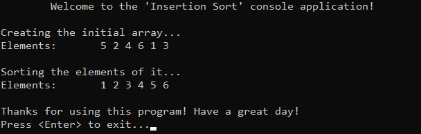

# &#128209; Table of Contents
- [💡 Overview](#-overview)
	- [Introduction](#introduction)
	- [Algorithm Steps](#algorithm-steps)
- [💻 Implementation](#-implementation)
	- [Design Decisions](#design-decisions)
	- [Complete Implementation](#complete-implementation)
	- [Detailed Walkthrough](#detailed-walkthrough)
- [📊 Analysis](#-analysis)
	- [Algorithm Characteristics](#algorithm-characteristics)
	- [Algorithm Comparison](#algorithm-comparison)
- [📝 Application](#-application)
	- [Common Use Cases](#common-use-cases)
	- [Some Practical Problems](#some-practical-problems)
- [🕙 Origins](#-origins)
- [🤝 Contributing](#-contributing)
- [📧 Contacts](#-contacts)
- [🙏 Credits](#-credits)
- [🔏 License](#-license)


# &#128161; Overview
The **Insertion Sort** stands out as one of the simplest and earliest known sorting techniques, renowned for its straightforward implementation and effectiveness. The algorithm is named for the way the elements are inserted into their proper portion of the collection. Knowledge and understanding of it, lays the foundation for tackling more complex sorting algorithms and problem-solving strategies.
<p align="center"></p>


## Introduction
**Insertion Sort** treats collection as two parts sorted and unsorted. Algorithm iterates over unsorted elements and places them at their suitable place in sorted portion, much like the intuitive process of arranging playing cards in a hand.


## Algorithm Steps
1. Assume that the first element is in the sorted part.
2. Pick the first element from the unsorted part.
3. Place it in the correct position within the sorted part.
4. Repeat steps 2 and 3 until there are no elements remaining in the unsorted part.


# &#x1F4BB; Implementation
The program initializes an array of specified integers, performs ascending order sorting using the insertion sort algorithm, and finally displays the result.
<p align="center"></p>


## Design Decisions
To prioritize simplicity and emphasize algorithm itself, several design decisions were made:
- Utilizing an integer array as a collection.
- Exclusively implementing sorting in ascending order.
- Omitting certain optimizations to the algorithm.


## Complete Implementation
Sorting algorithm implemented within the function `insertionSort()` is declared in `InsertionSort.h` header file and defined in `InsertionSort.cpp` source file. This approach is adopted to ensure encapsulation, modularity and compilation efficiency. Examination of sorting technique is conducted within the `main()` function located in the `Main.cpp` file. Below you can find related code snippets.

```cpp
	void insertionSort(int arr[], int size) {
		for (int unsorted = 1; unsorted < size; unsorted++) {
			int current = arr[unsorted];

			int sorted = unsorted - 1; // start from the end of sorted part
      // For descending order: arr[sorted] < current
			while (sorted >= 0 && arr[sorted] > current) {
				arr[sorted + 1] = arr[sorted]; // can be optimized via swap
				sorted = sorted - 1;
			}
			arr[sorted + 1] = current;
		}
	}
```


## Detailed Walkthrough 
1. Iterate over the unsorted part of the array, starting with the second element (because the first one is considered as sorted part).
```cpp
	for (int unsorted = 1; unsorted < size; unsorted++) {
```
2. Pick the first element from the unsorted part for comparison.
```cpp
	int current = arr[unsorted];
```
3. Initialize the iterator of the sorted part to the last element of it.
```cpp
	int sorted = unsorted - 1; // start from the end of sorted part
```
4. Iterate over sorted part from the end of it and compare selected element with sorted elements.  Continue this process until either beginning is reached or the selected element becomes lower than comparing one.
```cpp
	// For descending order: arr[sorted] < current
	while (sorted >= 0 && arr[sorted] > current) {
```
5. If the selected element is lower than the compared element, shift the compared element to the right and move iterator to the next. This process can be optimized by swapping elements, not copying.
```cpp
	arr[sorted + 1] = arr[sorted]; // can be optimized via swap
	sorted = sorted - 1;
```
6. Assign the selected element to its correct position. If selected element was higher than all the sorted, it is placed to right of the highest sorted, otherwise `sorted` iterator should be pointing to the next comparing element (thats why + 1).
```cpp
	arr[sorted + 1] = current;
``` 


# &#128202; Analysis
Understanding the characteristics of an algorithm is essential for choosing the right solution to a problem, as it reveals their impact on resource utilization, potential limitations and capabilities. Comparing the algorithm with other approaches provides insights into its strengths and weaknesses, helping to make informed decisions in various scenarios.


## Algorithm Characteristics
- **Comparison Approach:** 
  - **Comparison-Based** — algorithm operates by comparing elements pairwise to arrange them in order.
- **Time Complexity:**
     - **Worst Case** $O(n^2)$ — occurs when the data is in reverse sorted order (or almost);nested loop used nearly each iteration.
     - **Average Case** $O(n^2)$ — occurs when the data is randomly shuffled; nested loop used frequently enough.
     - **Best Case** $O(n)$ — occurs when the data is already sorted (or almost); condition for nested loop will be rarely true.
- **Space Complexity:** 
  - **Array Implementation** $O(1)$ — algorithm doesn't require any additional space.
- **Stability:** 
  - **Stable** — algorithm doesn't swap two equal elements, thus preserve their relative order.
- **Adaptabillity:** 
  - **Adaptive** — algorithm's adaptive logic lies in the inner loop, where it shifts elements only if they are not in sorted order, thus extent to which data is already sorted affects the perfomance.
- **Storage:**
   - **Internal** — algorithm typically implemented to be an internal sorting.


## Algorithm Comparison
Will be Updated in the Future...


# &#128221; Application
Understanding some of the most well-known use cases of an algorithm is crucial for grasping its practical relevance and potential impact in real-world scenarios. Additionally, familiarizing oneself with common practical problems and practicing their solutions ensures that you remember the essential details and develop a deep, intuitive understanding of the functionality and limitations.


## Common Use Cases
- **Trivial Small Datasets** — generally it is used where the overhead of more complex algorithms is just unnecessary; e.g. configuration settings, small list of people.
- **Resource-Constrained Environments** — occurs to be a practical choice in scenarios where memory and processing power are limited; e.g. embedded systems, microcontrollers.
- **Hybrid Sorting Approaches** — may be used as auxiliary sorting algorithm in larger ones; e.g. Timsort, Introsort.


## Some Practical Problems
- [Sort an Array](https://leetcode.com/problems/sort-an-array/)
- [Insertion Sort List](https://leetcode.com/problems/insertion-sort-list/)


# &#x1F559; Origins
The idea of Insertion Sort can be observed in many real life activities due to its simplicity, such as arranging playing cards in a hand, sorting stones by size, or organizing items in a list. These and many other manual sortings involve repeatedly inserting elements into their correct positions relative to the already sorted. In terms of computer science, Insertion Sort was one of the earliest sorting algorithms to be implemented in early computer programs. Its origin cannot be attributed to a single individual, rather it reflects the collective ingenuity of humanity.


# &#129309; Contributing
Contributions are highly appreciated! For detailed guidelines, please refer to the [root directory's contributing section](../../../#-contributing).


# &#128231; Contacts
For contact details and additional information, please refer to the [root directory's contact information section](../../../#-contacts).


# &#128591; Credits
&#128218; **Books:**
- **"Introduction to Algorithms" (3rd Edition)** — by Thomas H. Cormen, Charles E. Leiserson, Ronald L. Rivest and Clifford Stein
  - Section 2.1: Insertion Sort
- **"Algorithms in C++, Parts 1-4: Fundamentals, Data Structure, Sorting, Searching" (3rd Edition)** — by Robert Sedgewick
  - Section 6.3: Insertion Sort
- **"Data Structures and Algorithm Analysis in C++" (4th Edition)** — by Mark Allen Weiss
  - Section 7.2: Insertion Sort
- **"The Art of Computer Programming, Volume 3: Sorting and Searching" (2nd Edition)** — by Donald Ervin Knuth
  - Section 5.2.1: Sorting by Insertion

---  
&#127891; **Courses:**
- [Mastering Data Structures & Algorithms using C and C++](https://www.udemy.com/course/datastructurescncpp/) on Udemy
   - Section 20: Sorting Techniques

---  
&#127760; **Web-Resources:**  
- [Insertion Sort](https://en.wikipedia.org/wiki/Insertion_sort) (Wikipedia)


# &#128271; License
This project is licensed under the MIT License — see the [LICENSE](https://github.com/vezzolter/DSA/blob/main/LICENSE) file for details.

[](https://opensource.org/licenses/MIT)