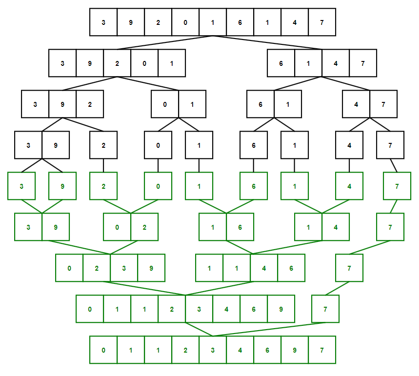
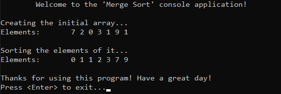

# &#128209; Table of Contents
- [💡 Overview](#-overview)
- [💻 Implementation](#-implementation)
- [📊 Analysis](#-analysis)
- [📝 Application](#-application)
- [🕙 Origins](#-origins)
- [🤝 Contributing](#-contributing)
- [📧 Contacts](#-contacts)
- [🙏 Credits](#-credits)
- [🔏 License](#-license)


# &#128161; Overview
The **Merge Sort** stands out as one of the most well-known and efficient sorting technique. The algorithm is named for the way it utilizes the idea of ability to combine two ordered inputs into one ordered output. This subsection explores idea of merge sort not only to enhance comprehension of its concepts, but also to establish a solid foundation for a more complex algorithmic designs and problem-solving strategies.
<p align="center"></p>

---
**Merge Sort** recursively divides the initial collection into halves until there is nothing to divide left, and then it starts the process of merging (combining) those subcollections back together, but only now applying the desired order, basically following the divide-and-conquer paradigm's principles.

**Algorithm Steps:**
1. Initialize the base case where conduct the check if there is a need to divide collection or it is already one element.
2. Calculate the middle index, i.e. split the collection into two subcollections - the first containing elements before the middle index and the second containing elements after the middle index.
3. Divide first half by utilizing a recursive process of calling the merge sort with updated start and end indices for every iteration until initial check stops it.
4. Divide the second half in the same manner.
5. Merge the results of previous steps by calling additional helper function `merge()` which merges elements together based on the desired sorted order and stores the them in the original collection (or in a separate temporary collection, depending on the implementation):
   1. Create an empty auxiliary collection to store the upcoming merge result.
   2. Initialize two pointers to compare elements of halves - first indicating the start of the left subcollection, and second indicating the start of the right subcollection.
   3. Compare the elements from left and right parts via pointers.
   4. Append the required element (depending on the order) to the auxiliary collection.
   5. Moves the pointer of the respective half to the next element in it.
   6. Repeats the comparison and selection process untill one half is empty, then copies any remaining elements from it to the auxiliary collection.
   7. Finally, merge the temporary collections in original one (or elsewhere).


# &#x1F4BB; Implementation
The program initializes an array of specified integers, performs ascending order sorting using the merge sort algorithm, and finally displays the result.
<p align="center"></p>

To prioritize simplicity and emphasize algorithm itself, several design decisions were made:
- Utilizing an integer array as a collection.
- Exclusively implementing sorting in ascending order.
- Omitting certain optimizations to the algorithm.

---
Sorting algorithm implemented within the `mergeSort()` and `merge()` functions, which are declared in `MergeSort.h` header file and defined in `MergeSort.cpp` source file. This approach is adopted to ensure encapsulation, modularity and compilation efficiency. Examination of sorting technique is conducted within the `main()` function located in the `Main.cpp` file.

**Complete Implementation:**
```cpp
	void merge(int* arr, const int left, const int mid, const int right) {
		int arrLeftSize = mid - left + 1;
		int arrRightSize = right - mid;
		int* arrLeft = new int[arrLeftSize];
		int* arrRight = new int[arrRightSize];
		for (int i = 0; i < arrLeftSize; i++)
			arrLeft[i] = arr[left + i]; // arr[begin...mid]
		for (int i = 0; i < arrRightSize; i++)
			arrRight[i] = arr[mid + 1 + i]; // arr[mid+1...end]

		int arrLeftIndex = 0;
		int arrRightIndex = 0;
		int arrIndex = left;
		for (; arrLeftIndex < arrLeftSize && arrRightIndex < arrRightSize; ) {
			if (arrLeft[arrLeftIndex] <= arrRight[arrRightIndex]) {
				arr[arrIndex] = arrLeft[arrLeftIndex];
				arrLeftIndex++;
			}
			else {
				arr[arrIndex] = arrRight[arrRightIndex];
				arrRightIndex++;
			}
			arrIndex++;
		}

		for (; arrLeftIndex < arrLeftSize;) {
			arr[arrIndex] = arrLeft[arrLeftIndex];
			arrLeftIndex++;
			arrIndex++;
		}	

		for (; arrRightIndex < arrRightSize;) {
			arr[arrIndex] = arrRight[arrRightIndex];
			arrRightIndex++;
			arrIndex++;
		}	

		delete[] arrLeft;
		delete[] arrRight;
	}

	void mergeSort(int* arr, const int left, const int right) {
		if (left >= right)
			return;

		int mid = left + (right - left) / 2; 
		mergeSort(arr, left, mid); // arr[begin...mid]
		mergeSort(arr, mid + 1, right); // arr[mid+1...end]
		merge(arr, left, mid, right);
	}
```

---
**Detailed Walkthrough:**  
1. Start with the setting up the base case for `mergeSort()`, which prevents following recursive division by checking whether the array contains more than one or zero elements.
```cpp
	if (left >= right)
		return;
```
2. Calculate the middle index of an array. This formula is used due to avoidance of overflow.
```cpp
	int mid = left + (right - left) / 2; 
```
3. Recursively call the merge sort on the left half until it reaches the base case and then move to the the right one and do the same. This way initial array would be divided into one-element subarrays, which are basically sorted.
```cpp
	mergeSort(arr, left, mid); // arr[begin...mid]
	mergeSort(arr, mid + 1, right); // arr[mid+1...end]
```
4. Call additional helper function to merge the sorted halves back together.
```cpp
	merge(arr, left, mid, right);
```
5. In `merge()` start by creating two auxiliary subarrays from the passed one for left and right half, which will be used to compare the elements and apply the desired order.
```cpp
	int arrLeftSize = mid - left + 1;
	int arrRightSize = right - mid;
	int* arrLeft = new int[arrLeftSize];
	int* arrRight = new int[arrRightSize];
	for (int i = 0; i < arrLeftSize; i++)
		arrLeft[i] = arr[left + i]; // arr[begin...mid]
	for (int i = 0; i < arrRightSize; i++)
		arrRight[i] = arr[mid + 1 + i]; // arr[mid+1...end]
```
6. Initialize the indices for each to keep track of the current positions. Assigning `left` to the passed array instead of `0` allows to preserve the relative positioning.
```cpp
	int arrLeftIndex = 0;
	int arrRightIndex = 0;
	int arrIndex = left;
```
7. Compare and store the elements as long as there are elements remaining in both the left and right subarrays to be merged. This process works by comparing indices of each half and choosing the smaller  value (or whichever required) to be stored in the passed array and moving respective pointers to the next elements.
```cpp
	for (; arrLeftIndex < arrLeftSize && arrRightIndex < arrRightSize; ) {
		if (arrLeft[arrLeftIndex] <= arrRight[arrRightIndex]) {
			arr[arrIndex] = arrLeft[arrLeftIndex];
			arrLeftIndex++;
		}
		else {
			arr[arrIndex] = arrRight[arrRightIndex];
			arrRightIndex++;
		}
		arrIndex++;
	}
```
8. If condition of previous loop becomes `false` it means that at least one of the half reached the end and some elements can be still left uncopied in the passed array. Therefore it is crucial to ensure that each half copied its elements, which is possible by respective iteration.
```cpp
	for (; arrLeftIndex < arrLeftSize;) {
		arr[arrIndex] = arrLeft[arrLeftIndex];
		arrLeftIndex++;
		arrIndex++;
	}	

	for (; arrRightIndex < arrRightSize;) {
		arr[arrIndex] = arrRight[arrRightIndex];
		arrRightIndex++;
		arrIndex++;
	}
```
9. Deallocate the memory for auxiliary arrays, since their values are preserved in the passed one.
```cpp
	delete[] arrLeft;
	delete[] arrRight;
```


# &#128202; Analysis
> Note: Some of the aspects described here are subject to implementation. Many sources may exploit this to their advantage, resulting in varying information for what appears to be the same concept. This can easily lead to confusion, so I highly encourage you to examine your specific case, filter through several sources, and adhere to the one that appears most accurate. I would like to discuss this topic with anyone who have related questions.

---
- **Comparison Approach:** 
  - **Comparison-Based** — algorithm operates by comparing elements pairwise to arrange them in order.

- **Time Complexity:**
     - Worst Case $O(nlogn)$ — occurs when the data is in reverse sorted order (or almost).
     - Average Case $O(nlogn)$  — occurs when the data is randomly shuffled. 
     - Best Case $O(nlogn)$$ — occurs when the data is already sorted (or almost).

- **Space Complexity:** 
  - Array $O(n)$ — algorithm requires additional space $O(n)$ for temporary subarrays and some space $O(logn)$ on call stack to store function calls.
  - List $O(logn)$ — algorithm only rearranges the pointers to connect the sorted sublists, therefore it requires only some space $O(logn)$ on call stack to store function calls.

- **Stability:** 
  - **Stable** — algorithm doesn't swap two equal elements, thus preserve their relative order.

- **Adaptabillity:** 
   - **Non-Adaptive** — algorithm does not inherently adapt its strategy to different input distributions, i.e. it processes data through the same path of steps, regardless of their values.

- **Directness:**
   - **Direct** — algorithm sorts elements by directly manipulating themselves.

- **Storage:**
   - **Internal and External** — algorithm can be used in both cases.


# &#128221; Application
**Some of the Most Well-Known Use Cases:**
- **General Sorting** — merge sort is widely used sorting in general. Its time complexity, and especially the lack of difference between the time cases, makes it a preferred choice in many scenarios.
- **Linked List** — merge sort is the best sorting (or one of the) for linked lists. It doesn't require an additional space for subcollections and random access to operate, which is significant advantage for this data structure. 
- **External Sorting** — merge sort is a good choice to sort data too large to fit entirely in the RAM. Its division approach allows to handle data in manageable chunks.
- **Parallel Processing** — merge sort is an efficient decision to implement a sorting utilizing a multiple processors at once. Since the process of one half doesn't really differ from the other, it is a good idea to do them both simultaneously.


# &#x1F559; Origins
The idea of merging goes back in **1938** to the invention of a card machine, the collator. It could merge two sorted decks of cards into one in only one pass. Few years later, the well-known Hungarian-American mathematician and physicist **John von Neumann** prepared programs for internal merge sorting in **1945**, in order to test the adequacy of some instruction codes he was proposing for the EDVAC computer. From that point on in computer science history, the idea of merging quickly gained widespread adoption and underwent continuous development by many people worldwide, becoming a widely used sorting technique.


# &#129309; Contributing
Contributions are highly appreciated! For detailed guidelines, please refer to the [root directory's contributing section](../../../#-contributing).


# &#128231; Contacts
For contact details and additional information, please refer to the [root directory's contact information section](../../../#-contacts).


# &#128591; Credits
&#128218; **Books:**
- **"Introduction to Algorithms" (3rd Edition)** — by Thomas H. Cormen, Charles E. Leiserson, Ronald L. Rivest and Clifford Stein
  - Section 2.3: Designining Algorithms (Merge Sort)
- **"Algorithms in C++, Parts 1-4: Fundamentals, Data Structure, Sorting, Searching" (3rd Edition)** — by Robert Sedgewick
  - Section 8: Merging and Mergesort
- **"Data Structures and Algorithm Analysis in C++" (4th Edition)** — by Mark Allen Weiss
  - Section 7.6: Mergesort
- **"The Algorithm Design Manual" (2nd Edition)** — by Steven S. Skiena
  - Section 4.5: Mergesort: Sorting by Divide-and-Conquer
- **"The Art of Computer Programming, Volume 3: Sorting and Searching" (2nd Edition)** — by Donald Ervin Knuth
  - Section 5.2.4: Sorting by Merging

---  
&#127891; **Courses:**
- [Mastering Data Structures & Algorithms using C and C++](https://www.udemy.com/course/datastructurescncpp/) on Udemy
   - Section 20: Sorting Techniques

---  
&#127760; **Web-Resources:**  
- [Merge Sort](https://en.wikipedia.org/wiki/Merge_sort) (Wikipedia)
- [Merge Sort Algorithm: Design, Implementation, and Analysis](https://www.enjoyalgorithms.com/blog/merge-sort-algorithm)
- [Merge Sort And It's Early History](https://www.linkedin.com/pulse/merge-sort-its-early-history-abdur-rahmaan-janhangeer/)


# &#128271; License
This project is licensed under the MIT License — see the [LICENSE](https://github.com/vezzolter/DSA/blob/main/LICENSE) file for details.

[](https://opensource.org/licenses/MIT)