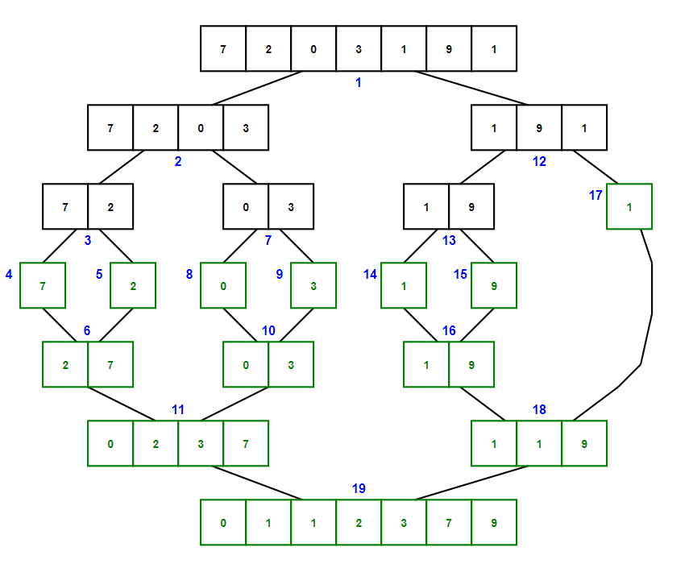

# &#128209; Table of Contents
- [💡 Overview](#-overview)
- [💻 Implementation](#-implementation)
- [📊 Analysis](#-analysis)
- [📝 Application](#-application)
- [⏳ Origins](#-origins)
- [🤝 Contributing](#-contributing)
- [📧 Contacts](#-contacts)
- [🙏 Credits](#-credits)
- [🔏 License](#-license)


# &#128161; Overview
The **Merge Sort** stands out as one of the most well-known and efficient sorting technique. The algorithm is named for the way it utilizes the idea of ability to combine two ordered inputs into one ordered output. This subsection explores idea of merge sort not only to enhance comprehension of its concepts, but also to establish a solid foundation for a more complex algorithmic designs and problem-solving strategies.
<p align="center"></p>

---
**Merge Sort** recursively divides the initial collection into halves until there is nothing to divide left, and then it starts the process of merging (combining) those subcollections back together, but only now applying the desired order, basically following the divide-and-conquer paradigm's principles.

**Algorithm Steps:**
1. Initialize the base case where conduct the check if there is a need to divide collection or it is already one element.
2. Calculate the middle index, i.e. split the collection into two subcollections - the first containing elements before the middle index and the second containing elements after the middle index.
3. Divide first half by utilizing a recursive process of calling the merge sort with updated start and end indices for every iteration until initial check stops it.
4. Divide the second half in the same manner.
5. Merge the results of previous steps by calling additional helper function `merge()` which merges elements together based on the desired sorted order and stores the them in the original collection (or in a separate temporary collection, depending on the implementation):
   1. Create an empty auxiliary collection to store the upcoming merge result.
   2. Initialize two pointers to compare elements of halves - first indicating the start of the left subcollection, and second indicating the start of the right subcollection.
   3. Compare the elements from left and right parts via pointers.
   4. Append the required element (depending on the order) to the auxiliary collection.
   5. Moves the pointer of the respective half to the next element in it.
   6. Repeats the comparison and selection process untill one half is empty, then copies any remaining elements from it to the auxiliary collection.
   7. Finally, merge the temporary collections in original one (or elsewhere).


# &#x1F4BB; Implementation
The program initializes an array of specified integers, performs ascending order sorting using the merge sort algorithm, and finally displays the result.
<p align="center"></p>

To prioritize simplicity and emphasize algorithm itself, several design decisions were made:
- Utilizing an integer array as a collection.
- Exclusively implementing sorting in ascending order.
- Omitting certain optimizations to the algorithm.

---
Sorting algorithm implemented within the `mergeSort()` and `merge()` functions, which are declared in `MergeSort.h` header file and defined in `MergeSort.cpp` source file. This approach is adopted to ensure encapsulation, modularity and compilation efficiency. Examination of sorting technique is conducted within the `main()` function located in the `Main.cpp` file.

**The Complete Implementation:**
```cpp
void merge(int* arr, const int left, const int mid, const int right) {
	int arrLeftSize = mid - left + 1;
	int arrRightSize = right - mid;
	int* arrLeft = new int[arrLeftSize];
	int* arrRight = new int[arrRightSize];
	for (int i = 0; i < arrLeftSize; i++)
		arrLeft[i] = arr[left + i]; // arr[begin...mid]
	for (int i = 0; i < arrRightSize; i++)
		arrRight[i] = arr[mid + 1 + i]; // arr[mid+1...end]

	int arrLeftIndex = 0;
	int arrRightIndex = 0;
	int arrIndex = left;
	for (; arrLeftIndex < arrLeftSize && arrRightIndex < arrRightSize; ) {
		if (arrLeft[arrLeftIndex] <= arrRight[arrRightIndex]) {
			arr[arrIndex] = arrLeft[arrLeftIndex];
			arrLeftIndex++;
		}
		else {
			arr[arrIndex] = arrRight[arrRightIndex];
			arrRightIndex++;
		}
		arrIndex++;
	}

	for (; arrLeftIndex < arrLeftSize;) {
		arr[arrIndex] = arrLeft[arrLeftIndex];
		arrLeftIndex++;
		arrIndex++;
	}

	for (; arrRightIndex < arrRightSize;) {
		arr[arrIndex] = arrRight[arrRightIndex];
		arrRightIndex++;
		arrIndex++;
	}

	delete[] arrLeft;
	delete[] arrRight;
}

void mergeSort(int* arr, const int left, const int right) {
	if (left >= right)
		return;

	int mid = left + (right - left) / 2; 
	mergeSort(arr, left, mid); // arr[begin...mid]
	mergeSort(arr, mid + 1, right); // arr[mid+1...end]
	merge(arr, left, mid, right);
}
```

---
**The Detailed Overview:**  
Currently in Progress...


# &#128202; Analysis
Currently in Progress...


# &#128221; Application
Currently in Progress...


# &#x23F3; Origins
Currently in Progress...


# &#129309; Contributing
Contributions are highly appreciated! For detailed guidelines, please refer to the [root directory's contributing section](../../../#-contributing).


# &#128231; Contacts
For contact details and additional information, please refer to the [root directory's contact information section](../../../#-contact-information).


# &#128591; Credits
&#128218; **Books:**
- **"Introduction to Algorithms" (3rd Edition)** — by Thomas H. Cormen, Charles E. Leiserson, Ronald L. Rivest and Clifford Stein
  - Section 2.3: Designining Algorithms (Merge Sort)
- **"Data Structures and Algorithm Analysis in C++" (4th Edition)** — by Mark Allen Weiss
  - Section 7.6: Mergesort
- **"Algorithms in C++, Parts 1-4: Fundamentals, Data Structure, Sorting, Searching" (3rd Edition)** — by Robert Sedgewick
  - Section 8: Merging and Mergesort
- **"The Art of Computer Programming, Volume 3: Sorting and Searching" (2nd Edition)** — by Donald Ervin Knuth
  - Section 5.2.4: Sorting by Merging

---  
&#127891; **Courses:**
- [Mastering Data Structures & Algorithms using C and C++](https://www.udemy.com/course/datastructurescncpp/) on Udemy
   - Section 20: Sorting Techniques

---  
&#127760; **Web-Resources:**  
- [Merge Sort](https://en.wikipedia.org/wiki/Merge_sort) (Wikipedia)


# &#128271; License
This project is licensed under the MIT License — see the [LICENSE](https://github.com/vezzolter/DSA/blob/main/LICENSE) file for details.

[](https://opensource.org/licenses/MIT)