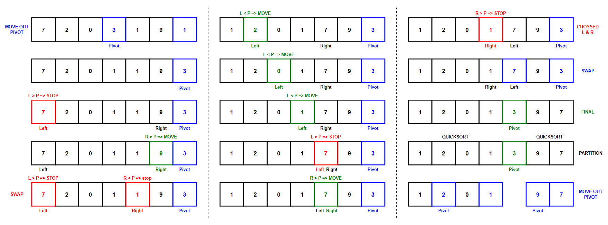

# &#128209; Table of Contents
- [💡 Overview](#-overview)
- [💻 Implementation](#-implementation)
- [📊 Analysis](#-analysis)
- [📝 Application](#-application)
- [⏳ Origins](#-origins)
- [🤝 Contributing](#-contributing)
- [📧 Contacts](#-contacts)
- [🙏 Credits](#-credits)
- [🔏 License](#-license)

# &#128161; Overview
The **Quicksort** stands out as one of the most well-known and efficient sorting technique. The author of this algorithm named it as such because he developed it to be a faster alternative to existing sortings, stating: _«the method compares very favourably with other known methods in speed, in economy of storage, and in ease of programming»_. This subsection explores idea of quicksort not only to enhance comprehension of its concepts, but also to establish a solid foundation for a more complex algorithmic designs and problem-solving strategies.

---
The **Quicksort** selects the pivot element from the collection, recursively partitions the collection into two sub-collections based on the pivot (refer below) until each of them consist of one or zero elements (i.e. basically sorted), and then algorithm combines them back together to form the final sorted collection. The process of partitioning generally classified into two schemes:
- **Hoare** — is a classic version, which ensures that the pivot is positioned between the smaller and greater parts, but it may not always be in the correct final position.
- **Lomuto** — is an alternative version, which ensures that the pivot is placed in the correct position after partitioning.

**Pivot Element** — is the element of collection, which serves as a reference point for determining the position of elements. It can be picked in a several ways, some of them are:
- **First/Last** — can provide a good partition, if the input is random, but if the input is presorted (or in reverse) order, then all the elements consistently go to only one side throughout the recursive calls, therefore providing a poor partition.
- **Middle** — can provide a better partition then previous methods, because in this case the middle element is closer to the median.
- **Random** — provides a generally good partition, unless the random number generator has a flaw and the resource to use it are available.
- **Median** — the best choice in terms of partitioning, but can considerably slow down the algorithm.
  - **Median of 3** — although can be obtained from the random elements, the preferable way is to use first, middle and last elements.
  - **Median of Medians** — although can be obtained from the random elements, the preferable way is to divide collection into groups, find the median of each and select median of those as the pivot.

---
**Algorithm Steps (Hoare Scheme):**
1. Initialize the base case where conduct the check if there is a need to partition collection further or it already contains $0$ or $1$ elements.
2. Choose a pivot from the collection using any desirable method for it.
3. Partition the collection so that all elements smaller than the pivot are moved to its left, and all elements greater - to its right, following next procedure steps:
   1. Get pivot element out the way by swapping it with the last one.
   2. Create two pointer: left as first, right as next-to-last.
   3. Start moving left pointer until it becomes greater or equal to the pivot, then stop.
   4. Start moving right pointer until it becomes less or equal to the pivot, then stop.
   5. Swap the left and right elements.
   6. Continue this process until right element is not crossed with left.
   7. Swap the pivot element with left, therefore ensuring that the all elements to the left of pivot are smaller, and all to the right are greater.
4. Recursively apply the same process to each sub-collection until initial check stops this, eventually sorting out the initial collection.

# &#x1F4BB; Implementation
Currently in Progres...

# &#128202; Analysis
Currently in Progres...

# &#128221; Application
Currently in Progres...

# &#x23F3; Origins
Currently in Progres...

# &#129309; Contributing
Contributions are highly appreciated! For detailed guidelines, please refer to the [root directory's contributing section](../../../#-contributing).

# &#128231; Contacts
For contact details and additional information, please refer to the [root directory's contact information section](../../../#-contact-information).

# &#128591; Credits
&#128218; **Books:**
- **"Grokking Algorithms: An Illustrated Guide for Programmers and Other Curious People"** — by Aditya Bhargava
  - Section 4: Quicksort
- **"Introduction to Algorithms" (3rd Edition)** — by Thomas H. Cormen, Charles E. Leiserson, Ronald L. Rivest and Clifford Stein
  - Section 7: Quicksort
- **"Algorithms in C++, Parts 1-4: Fundamentals, Data Structure, Sorting, Searching" (3rd Edition)** — by Robert Sedgewick
  - Section 7: Quicksort
- **"Data Structures and Algorithm Analysis in C++" (4th Edition)** — by Mark Allen Weiss
  - Section 7.7: Quicksort
- **"The Art of Computer Programming, Volume 3: Sorting and Searching" (2nd Edition)** — by Donald Ervin Knuth
  - Section 5.2.1: Sorting by Exchanging

---  
&#127891; **Courses:**
- [Mastering Data Structures & Algorithms using C and C++](https://www.udemy.com/course/datastructurescncpp/) on Udemy
   - Section 20: Sorting Techniques

---  
&#127760; **Web-Resources:**  
- [Quick Sort](https://en.wikipedia.org/wiki/Quicksort) (Wikipedia)
- [Quicksort by C. A. R. Hoare](https://academic.oup.com/comjnl/article-pdf/5/1/10/1111445/050010.pdf)
- [Hoare’s vs Lomuto partition scheme in QuickSort](https://www.educative.io/answers/hoares-vs-lomuto-partition-scheme-in-quicksort)

# &#128271; License
This project is licensed under the MIT License — see the [LICENSE](https://github.com/vezzolter/DSA/blob/main/LICENSE) file for details.

