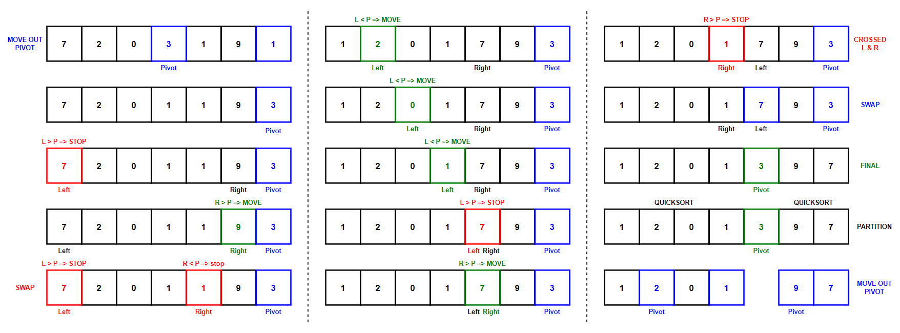
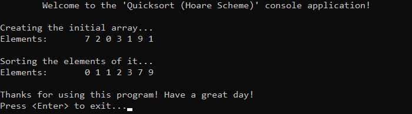

# &#128209; Table of Contents
- [💡 Overview](#-overview)
	- [Introduction](#introduction)
	- [Important Details](#important-details)
	- [Algorithm Steps (Hoare Scheme)](#algorithm-steps-hoare-scheme)
- [💻 Implementation](#-implementation)
	- [Design Decisions](#design-decisions)
	- [Complete Implementation](#complete-implementation)
	- [Detailed Walkthrough](#detailed-walkthrough)
- [📊 Analysis](#-analysis)
	- [Algorithm Characteristics](#algorithm-characteristics)
	- [Algorithm Comparison](#algorithm-comparison)
- [📝 Application](#-application)
	- [Common Use Cases](#common-use-cases)
	- [Some Practical Problems](#some-practical-problems)
- [🕙 Origins](#-origins)
- [🤝 Contributing](#-contributing)
- [📧 Contacts](#-contacts)
- [🙏 Credits](#-credits)
- [🔏 License](#-license)


# &#128161; Overview
The **Quicksort** stands out as one of the most well-known and efficient sorting technique. The author of this algorithm named it as such because he developed it to be a faster alternative to existing sortings, stating: _«the method compares very favourably with other known methods in speed, in economy of storage, and in ease of programming»_. This subsection explores idea of quicksort not only to enhance comprehension of its concepts, but also to establish a solid foundation for a more complex algorithmic designs and problem-solving strategies.
<p align="center"></p>


## Introduction
The **Quicksort** selects the pivot element from the collection, recursively partitions the collection into two sub-collections based on the pivot (refer below) until each of them consist of one or zero elements (i.e. basically sorted), and then algorithm combines them back together to form the final sorted collection. 

## Important Details
1. The process of partitioning generally classified into two schemes:
   - **Hoare** — is a classic version, which ensures that the pivot is positioned between the smaller and greater parts, but it may not always be in the correct final position.
   - **Lomuto** — is an alternative version, which ensures that the pivot is placed in the correct position after partitioning.

2. **Pivot Element** — is the element of collection, which serves as a reference point for determining the position of elements. It can be picked in a several ways, some of them are:
   - **First/Last** — can provide a good partition, if the input is random, but if the input is presorted (or in reverse) order, then all the elements consistently go to only one side throughout the recursive calls, therefore providing a poor partition.
   - **Middle** — can provide a better partition then previous methods, because in this case the middle element is closer to the median.
   - **Random** — provides a generally good partition, unless the random number generator has a flaw and the resource to use it are available.
   - **Median** — the best choice in terms of partitioning, but can considerably slow down the algorithm.
     - **Median of 3** — although can be obtained from the random elements, the preferable way is to select middle value from the first, middle and last elements.
     - **Median of Medians** — although can be obtained from the random elements, the preferable way is to divide collection into groups, find the median of each and select median of those as the pivot.


## Algorithm Steps (Hoare Scheme)
1. Initialize the base case where conduct the check if there is a need to partition collection further or it already contains $0$ or $1$ elements.
2. Choose a pivot from the collection using any desirable method for it.
3. Partition the collection so that all elements smaller than the pivot are moved to its left, and all elements greater - to its right, following next procedure steps:
   1. Get pivot element out the way by swapping it with the last one.
   2. Create two pointer: left as first, right as next-to-last.
   3. Start moving left pointer until it becomes greater or equal to the pivot, then stop.
   4. Start moving right pointer until it becomes less or equal to the pivot, then stop.
   5. Swap the left and right elements.
   6. Continue this process until right element is not crossed with left.
   7. Swap the pivot element with left, therefore ensuring that the all elements to the left of pivot are smaller, and all to the right are greater.
4. Recursively apply the same process to each sub-collection until initial check stops this, eventually sorting out the initial collection.


# &#x1F4BB; Implementation
The program initializes an array of specified integers, performs ascending order sorting using the quicksort algorithm, and finally displays the result.
<p align="center"></p>


## Design Decisions
To prioritize simplicity and emphasize algorithm itself, several design decisions were made:
- Utilizing an integer array as a collection.
- Exclusively implementing sorting in ascending order.
- Omitting certain optimizations to the algorithm.


## Complete Implementation
Sorting algorithm implemented within the `quicksort()` and `partition()` functions with a few helper ones `swap()` and `selectPivot()`, which are declared in `Quicksort.h` header file and defined in `Quicksort.cpp` source file. This approach is adopted to ensure encapsulation, modularity and compilation efficiency. Examination of sorting technique is conducted within the `main()` function located in the `Main.cpp` file. Below you can find related code snippets.

```cpp
int partition(int* arr, int l, int r) {
	int p = selectPivot(arr, l, r); // median of 3
	
	swap(arr[p], arr[r]);
	p = r;

	for (; l < r; ) {
		for (; l <= r && arr[l] < arr[p]; l++);
		for (; r >= l && arr[r] >= arr[p]; r--);
		if (l >= r) { break; }
		swap(arr[l], arr[r]);
	}

	swap(arr[l], arr[p]);
	p = l;

	return p;
}

void quicksort(int* arr, int l, int r) {
	if (l < r) {
		int p = partition(arr, l, r);
		quicksort(arr, l, p - 1);
		quicksort(arr, p + 1, r);
	}
}
```


## Detailed Walkthrough
1. Start with the setting up the check for `quicksort()`, which prevents following recursive division by checking whether the array contains more than one or zero elements.
```cpp
	if (l < r)
```
2. Partition the collection using additional function and return a value that signifies the position where the pivot element is now located within the partitioned array, which will be used in further recursive calls.
```cpp
	int p = partition(arr, l, r); 
```
3. In the `partition()` function, start by selecting the pivot element from the array. There I use a helper function implementing the median of three strategy, which can be substituted with other methods if required. See the respective file for its implementation details.
```cpp
	int p = selectPivot(arr, l, r); // median of 3
```
4. Start partitioning by iterating over considered elements until `l` and `r` meet, indicating that the process is complete.
```cpp
	for (; l < r; ) {
```
5. Now move the left pointer to the point where it encounters an element that is greater than or equal to the pivot (or exceeds the indices) and do the same but vice versa for right pointer.
```cpp
	for (; l <= r && arr[l] < arr[p]; l++);
	for (; r >= l && arr[r] >= arr[p]; r--);
```
6. Eventually they will stop. This can be achieved either if they have crossed or if they encounter elements that require swapping. Therefore you either leave or swap.
```cpp
	if (l >= r) { break; }
    swap(arr[l], arr[r]);
```
7. After all the arrangements have been done (or skipped), swap the pivot element with the last (and update the index) to ensure that all elements to the left are less or equal to the pivot and all to the right are greater or equal to the pivot.
```cpp
	swap(arr[l], arr[p]);
	p = l;
```
8. Handle subsequent recursive calls by returning the index of the pivot element.
```cpp
	return p;
```
9. Back to `quicksort()`, where quicksort is recursively called again for remaining sub-arrays until initial check stops the process, eventually sorting out the rest of the elements by the analogue.
```cpp
	quicksort(arr, l, p - 1);
	quicksort(arr, p + 1, r);
```


# &#128202; Analysis
Understanding the characteristics of an algorithm is essential for choosing the right solution to a problem, as it reveals their impact on resource utilization, potential limitations and capabilities. Comparing the algorithm with other approaches provides insights into its strengths and weaknesses, helping to make informed decisions in various scenarios.


## Algorithm Characteristics
- **Comparison Approach:** 
  - **Comparison-Based** — algorithm operates by comparing elements pairwise to arrange them in order.
- **Time Complexity:**
     - **Worst Case** $O(n^2)$ — occurs when the choice of pivot is poor for the input data, leading to consistently unbalanced partitions during each recursive call.
     - **Average Case** $O(n \log n)$— occurs when the choice of pivot is good enough for the input data, leading to consistently relatively balanced partitions during each recursive call.
     - **Best Case** $O(n \log n)$ — occurs when the choice of pivot is optimal for the input data, leading to consistently nearly equal partitions during each recursive call.
- **Space Complexity:** 
  - **Array Implementation** — algorithm requires some space $O(\log n)$ on call stack to store function calls, and only in some of the worst cases it can go up to $O(n)$.
- **Stability:** 
  - **Unstable** — algorithm can swap two equal elements, thus altering their relative order. This happens because of depending on the pivot selection and partitioning strategy, equal elements may end up in different relative positions in the sorted output. 
- **Adaptability:** 
   - **Non-Adaptive** — algorithm does not inherently adapt its strategy to different input distributions, i.e. it processes data through the same path of steps, regardless of their values.
- **Storage:**
   - **Internal** — algorithm typically implemented to be an internal sorting.


## Algorithm Comparison
Will be Updated in the Future...


# &#128221; Application
Understanding some of the most well-known use cases of an algorithm is crucial for grasping its practical relevance and potential impact in real-world scenarios. Additionally, familiarizing oneself with common practical problems and practicing their solutions ensures that you remember the essential details and develop a deep, intuitive understanding of the functionality and limitations.


## Common Use Cases
- **General Sorting** — quicksort is widely used sorting in general. Its efficient time complexity and a better space complexity compared to merge sort, makes it a preferred choice in many scenarios; e.g. libraries, programming languages, operating systems, networking applications.
- **Hybrid Sorting** — quicksort is beneficial tool for hybrid sortings. Initially partitioning a collection can provide a great nearly sorted result, which can be finished with more appropriate sorting like heapsort; e.g. introsort. 


## Some Practical Problems
- [Sort an Array](https://leetcode.com/problems/sort-an-array/)
- [Kth Largest Element in an Array](https://leetcode.com/problems/kth-largest-element-in-an-array/)
- [Query Kth Smallest Trimmed Number](https://leetcode.com/problems/query-kth-smallest-trimmed-number/)


# &#x1F559; Origins
QuickSort was conceived by British computer scientist **Tony Hoare** in **1959**. Hoare developed QuickSort while working on his PhD thesis at Moscow State University in the Soviet Union. He was tasked with translating a Russian-English dictionary and sought a more efficient method for sorting words than existing ones. Inspired by the divide-and-conquer paradigm, Hoare devised the QuickSort algorithm, which partitions the array into smaller subarrays just like merge sort, but avoids its excessive use of memory by adding a pivotal logic. Hoare initially presented QuickSort as a paper titled "Algorithm 64: Quicksort" in the Communications of the ACM (Association for Computing Machinery) journal in **1961**. However, it wasn't until later years that QuickSort gained widespread recognition and became one of the most commonly used sorting algorithms in computer science.


# &#129309; Contributing
Contributions are highly appreciated! For detailed guidelines, please refer to the [root directory's contributing section](../../../#-contributing).


# &#128231; Contacts
For contact details and additional information, please refer to the [root directory's contact information section](../../../#-contacts).


# &#128591; Credits
&#128218; **Books:**
- **"Introduction to Algorithms" (3rd Edition)** — by Thomas H. Cormen, Charles E. Leiserson, Ronald L. Rivest and Clifford Stein
  - Section 7: Quicksort
- **"Algorithms in C++, Parts 1-4: Fundamentals, Data Structure, Sorting, Searching" (3rd Edition)** — by Robert Sedgewick
  - Section 7: Quicksort
- **"Data Structures and Algorithm Analysis in C++" (4th Edition)** — by Mark Allen Weiss
  - Section 7.7: Quicksort
- **"The Algorithm Design Manual" (2nd Edition)** — by Steven S. Skiena
  - Section 4.6: Quicksort: Sorting by Randomization
- **"The Art of Computer Programming, Volume 3: Sorting and Searching" (2nd Edition)** — by Donald Ervin Knuth
  - Section 5.2.1: Sorting by Exchanging

---  
&#127891; **Courses:**
- [Mastering Data Structures & Algorithms using C and C++](https://www.udemy.com/course/datastructurescncpp/) on Udemy
   - Section 20: Sorting Techniques

---  
&#127760; **Web-Resources:**  
- [Quick Sort](https://en.wikipedia.org/wiki/Quicksort) (Wikipedia)
- [Quicksort by C. A. R. Hoare](https://academic.oup.com/comjnl/article-pdf/5/1/10/1111445/050010.pdf)
- [Hoare’s vs Lomuto partition scheme in QuickSort](https://www.educative.io/answers/hoares-vs-lomuto-partition-scheme-in-quicksort)


# &#128271; License
This project is licensed under the MIT License — see the [LICENSE](https://github.com/vezzolter/DSA/blob/main/LICENSE) file for details.

[](https://opensource.org/licenses/MIT)