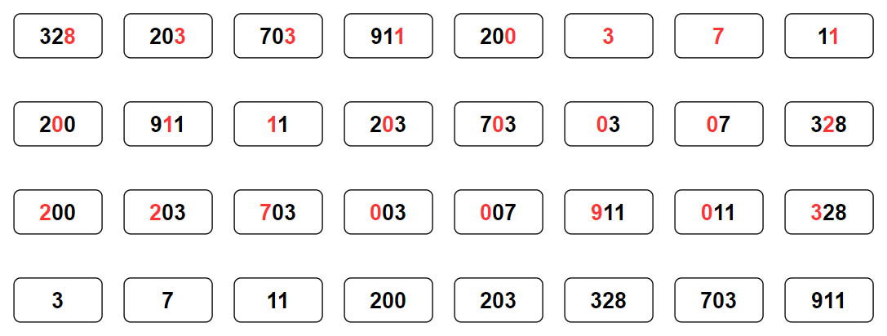
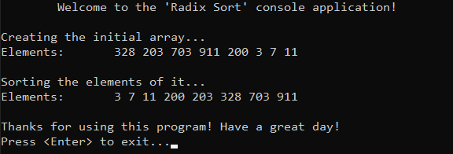

# &#128209; Table of Contents
- [💡 Overview](#-overview)
  - [Introduction](#introduction)
  - [Important Details](#important-details)
  - [Algorithm Steps](#algorithm-steps)
- [💻 Implementation](#-implementation)
  - [Design Decisions](#design-decisions)
  - [Complete Implementation](#complete-implementation)
  - [Detailed Walkthrough](#detailed-walkthrough)
- [📊 Analysis](#-analysis)
- [📝 Application](#-application)
- [🕙 Origins](#-origins)
- [🤝 Contributing](#-contributing)
- [📧 Contacts](#-contacts)
- [🙏 Credits](#-credits)
- [🔏 License](#-license)


# &#128161; Overview
The **Radix Sort** stands out as one of the most well-known non-comparative sorting technique. The name of algorithm describes its method of sorting numbers by processing individual digits according to their position within the base (radix) of the number system. This subsection explores idea of radix sort not only to enhance comprehension of its concepts, but also to establish a solid foundation for a more complex algorithmic designs and problem-solving strategies.
<p align="center"></p>


## Introduction
The **Radix Sort** processes each digit of the numbers, starting from the least significant (rightmost) to the most significant (leftmost), and sorts the numbers by distributing them into buckets based on each digit, then collecting them back into a sorted sequence after each digit processing step.


## Important Details
1. Can be applied to data that can be sorted lexicographically (e.g. integers, words, punch cards, playing cards).
2. Requires modification to handle floating-point numbers, negative integers, or strings of variable lengths, which can add overall complexity to the algorithm.
3. Works best when the numbers have the same number of digits, otherwise they need to be padded.


## Algorithm Steps
1. Determine the maximum number of digits in the largest number.
2. Initialize 10 buckets for each digit (0-9).
3. Sort the numbers by their least significant digit.
4. Collect the numbers from the buckets back into the original list.
5. Sort the numbers by the next significant digit.
6. Collect the numbers from the buckets back into the original list.
7. Repeat the sorting and collecting steps for each digit until the most significant digit of hte largest element has been processed.


# &#x1F4BB; Implementation
The program initializes an array of specified integers, performs ascending order sorting using the radix sort algorithm, and finally displays the result.
<p align="center"></p>


## Design Decisions
To prioritize simplicity and emphasize algorithm itself, several design decisions were made:
- Utilizing an array of positive integers as a collection.
- Exclusively implementing sorting in ascending order.
- Omitting certain optimizations to the algorithm.


## Complete Implementation
Sorting algorithm implemented within the `radixSort()` function with a few helper ones `getMax()` and `countingSort()`, which are declared `RadixSort.h` header file and defined in `RadixSort.cpp` source file. This approach is adopted to ensure encapsulation, modularity and compilation efficiency. Examination of sorting technique is conducted within the `main()` function located in the `Main.cpp` file. Below you can find related code snippets.


```cpp
// Finds and returns the maximum value in an array
// Allows to determine the maximum number of digits
int getMax(int arr[], int n) {
    int max = arr[0];
    for (int i = 1; i < n; i++) {
        if (arr[i] > max)
            max = arr[i];
    }
    return max;
}

void countingSort(int arr[], int n, int digitPos) {
    const int range = 10; // for digits 0-9
    int* output = new int[n];
    int count[range] = { 0 };

    // Calculate count of occurrences of each digit
    for (int i = 0; i < n; i++) {
        int digit = (arr[i] / digitPos) % 10;
        count[digit]++;
    }

    // Calculate cumulative count
    for (int i = 1; i < range; i++)
        count[i] += count[i - 1];

    // Place the elements in sorted order
    for (int i = n - 1; i >= 0; i--) {
        int digit = (arr[i] / digitPos) % 10;
        output[count[digit] - 1] = arr[i];
        count[digit]--;
    }

    // Copy the sorted elements into the original array and clear it
    for (int i = 0; i < n; i++)
        arr[i] = output[i];
    delete[] output;
}

void radixSort(int arr[], int n) {
    int max = getMax(arr, n);

    // Sorts the aray based on the current digit place, until all digits of max number
    for (int digitPos = 1; max / digitPos > 0; digitPos *= 10)
        countingSort(arr, n, digitPos);
}
```


## Detailed Walkthrough
1. Start by determining the number of digits in the largest number, which in turn determines how many passes of sorting are needed. To do so, you can simply iterate over a collection and update the max value, or resort to library implementations.
```cpp
  int max = getMax(arr, n);
```
2. Then sort array based on the current digit place, until all digits of the largest element are processed. Initialize digit position to the least significant digit, which is first from end. Loop condition ensures that the loop runs until all digit places of the maximum number are processed. After each iteration multiply position by $10$ to move to the next digit.
```cpp
  for (int digitPos = 1; max / digitPos > 0; digitPos *= 10) {
      countingSort(arr, n, digitPos);
  }
```
3. At this moment, the control flow goes to the `countingSort()` function, which starts by initializing required variables: `range` to define the number of possible digit values that can appear at any given digit position, `output` to store the sorted numbers temporarily, `count` to store the count of occurrences of each digit. Basically, you can also resort to library implementations, such as vector and hash map.
```cpp
  const int range = 10; // since digits are 0-9
  int* output = new int[n];
  int count[range] = { 0 };
```
4. Then the interesting part comes, where all the actual sorting occurs. First we need to know how many time each digit appears at the current digit position across all numbers, this helps us to understand the distribution of digits and prepares us for placing the numbers in the correct order in the next steps; e.g. if we are looking at the units position, then: for $328$ its $8$, for $3$ its $3$, for $203$ its $3$, and then count $8$ appears once, $3$ appears twice.
```cpp
  // Calculate count of occurrences of each digit
  for (int i = 0; i < n; i++) {
      int digit = (arr[i] / digitPos) % 10;
      count[digit]++;
  }
```
5. After counting the appearances, we transform them into cumulative count array, so that we could know the exact position in the sorted array, where each digit shoud go.
```cpp
  // Calculate cumulative count
  for (int i = 1; i < range; i++)
      count[i] += count[i - 1];
```
6. Knowing all that info, we are able to sort the digits. We iterate over the original array from the last element to the first (this reverse order helps in maintaining the stability of the sort), for each number we extract the digit at the current position, by using cumulative count array we place the number in the output array and update the position for the next occurence of the same digit.
```cpp
  // Place the elements in sorted order
  for (int i = n - 1; i >= 0; i--) {
      int digit = (arr[i] / digitPos) % 10;
      output[count[digit] - 1] = arr[i];
      count[digit]--;
  }
```
7. Finally, simply copy output array to initial one and clear the memory.
```cpp
  // Copy the sorted elements into the original array and clear it
  for (int i = 0; i < n; i++)
      arr[i] = output[i];
  delete[] output;
```


# &#128202; Analysis
Currently in Progress...


# &#128221; Application
Currently in Progress...


# &#x1F559; Origins
Currently in Progress...


# &#129309; Contributing
Contributions are highly appreciated! For detailed guidelines, please refer to the [root directory's contributing section](../../../#-contributing).


# &#128231; Contacts
For contact details and additional information, please refer to the [root directory's contact information section](../../../#-contacts).


# &#128591; Credits
&#128218; **Books:**
- **"Introduction to Algorithms" (3rd Edition)** — by Thomas H. Cormen, Charles E. Leiserson, Ronald L. Rivest and Clifford Stein
  - Section 8.3: Radix Sort
- **"Algorithms in C++, Parts 1-4: Fundamentals, Data Structure, Sorting, Searching" (3rd Edition)** — by Robert Sedgewick
  - Section 10: Radix Sorting
- **"Data Structures and Algorithm Analysis in C++" (4th Edition)** — by Mark Allen Weiss
  - Section 7.11: Linear-Time Sorts: Bucket Sort and Radix Sort
- **"The Art of Computer Programming, Volume 3: Sorting and Searching" (2nd Edition)** — by Donald Ervin Knuth
  - Section 5.2.2: Sorting by Exchanging

---  
&#127891; **Courses:**
- [Mastering Data Structures & Algorithms using C and C++](https://www.udemy.com/course/datastructurescncpp/) on Udemy
   - Section 20: Sorting Techniques

---  
&#127760; **Web-Resources:**  
- [Radix Sort](https://en.wikipedia.org/wiki/Radix_sort) (Wikipedia)


# &#128271; License
This project is licensed under the MIT License — see the [LICENSE](https://github.com/vezzolter/DSA/blob/main/LICENSE) file for details.

[](https://opensource.org/licenses/MIT)