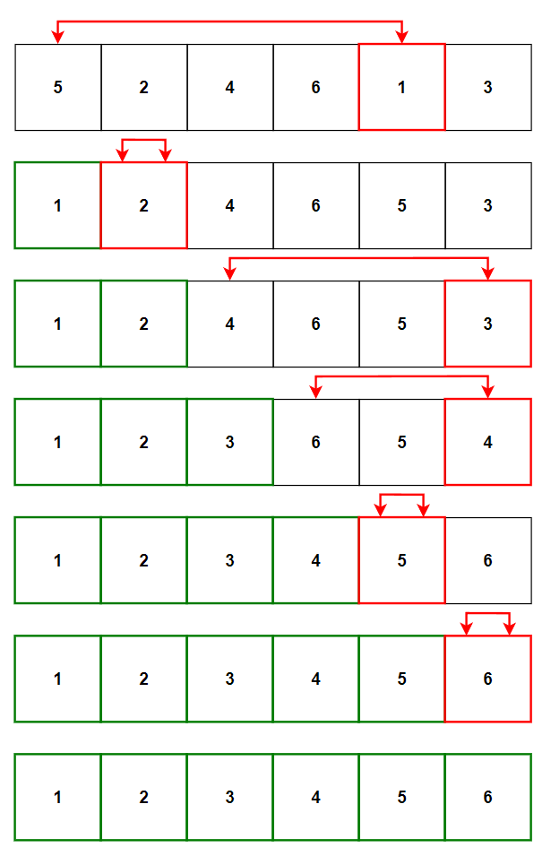
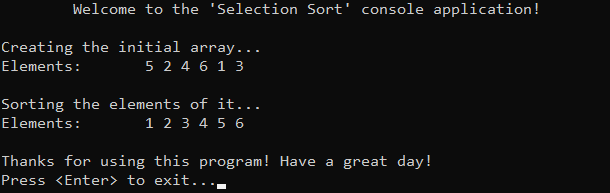

# &#128209; Table of Contents
- [💡 Overview](#-overview)
	- [Introduction](#introduction)
	- [Algorithm Steps](#algorithm-steps)
- [💻 Implementation](#-implementation)
	- [Design Decisions](#design-decisions)
	- [Complete Implementation](#complete-implementation)
	- [Detailed Walkthrough](#detailed-walkthrough)
- [📊 Analysis](#-analysis)
	- [Algorithm Characteristics](#algorithm-characteristics)
	- [Algorithm Comparison](#algorithm-comparison)
- [📝 Application](#-application)
	- [Common Use Cases](#common-use-cases)
	- [Some Practical Problems](#some-practical-problems)
- [🕙 Origins](#-origins)
- [🤝 Contributing](#-contributing)
- [📧 Contacts](#-contacts)
- [🙏 Credits](#-credits)
- [🔏 License](#-license)


# &#128161; Overview
The **Selection Sort** stands out as one of the simplest and earliest known sorting technique, renowned for its straightforward implementation. The algorithm is named for its method of selecting the smallest (or largest) elements from a collection. Knowledge and understanding of it, lays the foundation for tackling more complex sorting methods and problem-solving strategies.
<p align="center"></p>


## Introduction
**Selection Sort** treats a collection as two parts: sorted and unsorted. The algorithm iterates over the unsorted elements, selecting the lowest (or highest) value and exchanging it with the element at the beginning of the unsorted part, thus forming the sorted portion; much like the intuitive process of arranging books on a shelf from shortest to tallest. 


## Algorithm Steps
1. Assume that all elements belong to the unsorted part, thus start with the first one in it.
2. Select the element with the smallest (or highest) value.
3. Exchange it with the first element of the unsorted part; thus form a sorted part.
4. Proceed to the next unsorted element.
5. Repeat this process until there are no elements remaining in the unsorted part.


# &#x1F4BB; Implementation
The program initializes an array of specified integers, performs ascending order sorting using the selection sort algorithm, and finally displays the result.
<p align="center"></p>


## Design Decisions
To prioritize simplicity and emphasize algorithm itself, several design decisions were made:
- Utilizing an integer array as a collection.
- Exclusively implementing sorting in ascending order.
- Omitting certain optimizations to the algorithm.


## Complete Implementation
Sorting algorithm implemented within the function `selectionSort()`, which is declared in `SelectionSort.h` header file and defined in `SelectionSort.cpp` source file. This approach is adopted to ensure encapsulation, modularity and compilation efficiency. Examination of sorting technique is conducted within the `main()` function located in the `Main.cpp` file. Below you can find related code snippets.

```cpp
void selectionSort(int arr[], int size) {
	for (int i = 0; i < size - 1; i++) {

		int min = i;
		for (int j = i + 1; j < size; j++) {
			if (arr[j] < arr[min]) { min = j; }
		}

		if (min != i) {
			int temp = arr[i];
			arr[i] = arr[min];
			arr[min] = temp;
		}
	}
}
```


## Detailed Walkthrough
1. Iterate over the unsorted elements, excluding the last one `size - 1`, as it is going to be at correct position, naturally after all the previous iterations.
```cpp
	for (int i = 0; i < size - 1; i++) {
```
2. Select the index of first element from the unsorted part as the minimum, because there are no other known elements at this stage.
```cpp
	int min = i;
```
3. Iterate over the remaining unsorted elements to determine if there is a lower value, by comparing value of current minimum element with the rest of remaining unsorted elements. By starting at `j = i + 1`, we ensure that we don't compare the already previously selected element with itself.
```cpp
	for (int j = i + 1; j < size; j++) {
		if (arr[j] < arr[min]) { min = j; }
	}
```
4. Swap the selected minimum element with the first element from the unsorted part if they are different. While this check provides more 'adaptive' behavior, the overall adaptability of the algorithm doesn't change, because the number of comparisons, which mostly contribute to the time complexity, stays the same.
```cpp
	if (min != i) {
		int temp = arr[i];
		arr[i] = arr[min];
		arr[min] = temp;
	}
```


# &#128202; Analysis
Understanding the characteristics of an algorithm is essential for choosing the right solution to a problem, as it reveals their impact on resource utilization, potential limitations and capabilities. Comparing the algorithm with other approaches provides insights into its strengths and weaknesses, helping to make informed decisions in various scenarios.


## Algorithm Characteristics
- **Comparison Approach:** 
  - **Comparison-Based** — algorithm operates by comparing elements pairwise to arrange them in order.
- **Time Complexity:**
     - **Worst Case** $O(n^2)$ — occurs when the data is in reverse sorted order (or almost).
     - **Average Case** $O(n^2)$  — occurs when the data is randomly shuffled. 
     - **Best Case** $O(n^2)$ — occurs when the data is already sorted (or almost).
- **Space Complexity:** 
  - **Array Implementation** $O(1)$ — algorithm doesn't require any additional space beyond a few temporary variables.
- **Stability:** 
  - **Unstable** — algorithm considered to be unstable due to the fact that it doesn't consider the original positions of equal elements when performing swaps, thus it doesn't guarantee the preservation of the relative order.
- **Adaptability:** 
    - **Non-Adaptive** — algorithm does not inherently adapt its strategy to different input distributions, i.e. it processes data through the same path of steps, regardless of their values.
- **Storage:**
   - **Internal** — algorithm typically implemented to be an internal sorting.


## Algorithm Comparison
Will be Updated in the Future...


# &#128221; Application
Understanding some of the most well-known use cases of an algorithm is crucial for grasping its practical relevance and potential impact in real-world scenarios. Additionally, familiarizing oneself with common practical problems and practicing their solutions ensures that you remember the essential details and develop a deep, intuitive understanding of the functionality and limitations.


## Common Use Cases
- **Educational Purposes** — bubble sort is primarily valuable for educational purposes, offering a simple way to teach fundamental sorting concepts and algorithmic thinking. In modern software development contexts, its utility is largely considered obsolete due to its inefficiency.


## Some Practical Problems
- None


# &#x1F559; Origins
The idea of Selection Sort can be observed in many real life activities due to its simplicity, such as arranging playing cards in a hand, sorting stones by size, or organizing items in a list. These and many other manual sortings involve repeatedly selecting the smallest/highest elements and moving to the start/end. In terms of computer science, Selection Sort was one of the earliest sorting algorithms to be implemented in early computer programs. Its origin cannot be attributed to a single individual, rather it reflects the collective ingenuity of humanity.


# &#129309; Contributing
Contributions are highly appreciated! For detailed guidelines, please refer to the [root directory's contributing section](../../../#-contributing).


# &#128231; Contacts
For contact details and additional information, please refer to the [root directory's contact information section](../../../#-contacts).


# &#128591; Credits
&#128218; **Books:**
- **"Algorithms in C++, Parts 1-4: Fundamentals, Data Structure, Sorting, Searching" (3rd Edition)** — by Robert Sedgewick
  - Section 6.2: Selection Sort
- **"The Algorithm Design Manual" (2nd Edition)** — by Steven S. Skiena
  - Section 2.4.1: Selection Sort
- **"The Art of Computer Programming, Volume 3: Sorting and Searching" (2nd Edition)** — by Donald Ervin Knuth
  - Section 5.2.3: Sorting by Selection

---
&#127891; **Courses:**
- [Mastering Data Structures & Algorithms using C and C++](https://www.udemy.com/course/datastructurescncpp/) on Udemy
   - Section 20: Sorting Techniques

---  
&#127760; **Web-Resources:**  
- [Selection Sort](https://en.wikipedia.org/wiki/Selection_sort) (Wikipedia)
- [How does Selection Sort Algorithm work?](https://www.geeksforgeeks.org/selection-sort/)
- [Selection Sort Algorithm](https://www.tutorialspoint.com/data_structures_algorithms/selection_sort_algorithm.htm)


# &#128271; License
This project is licensed under the MIT License — see the [LICENSE](https://github.com/vezzolter/DSA/blob/main/LICENSE) file for details.

[](https://opensource.org/licenses/MIT)