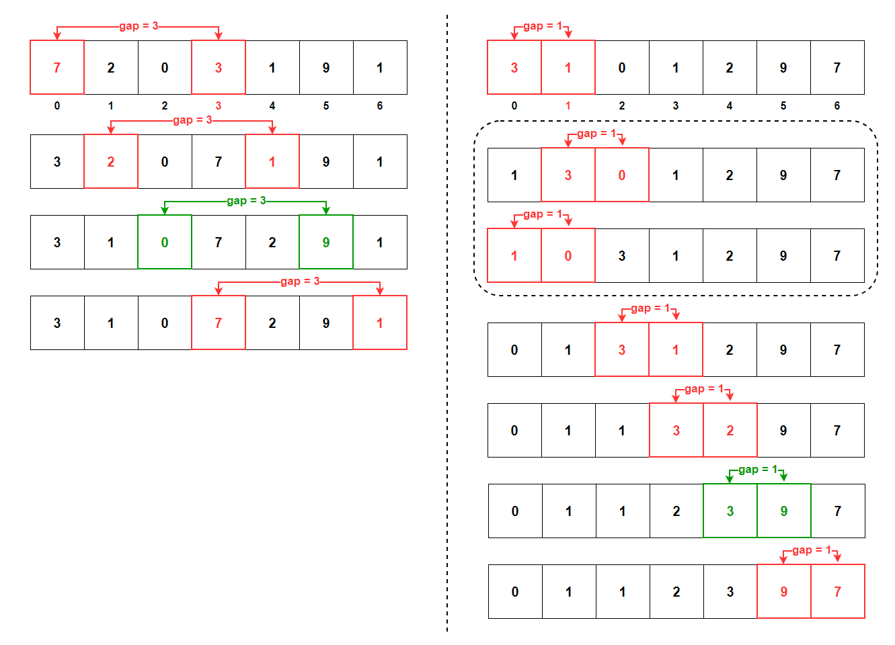
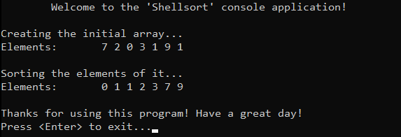

# &#128209; Table of Contents
- [💡 Overview](#-overview)
  - [Introduction](#introduction)
  - [Important Details](#important-details)
  - [Algorithm Steps](#algorithm-steps)
- [💻 Implementation](#-implementation)
  - [Design Decisions](#design-decisions)
  - [Complete Implementation](#complete-implementation)
  - [Detailed Walkthrough](#detailed-walkthrough)
- [📊 Analysis](#-analysis)
  - [Algorithm Characteristics](#algorithm-characteristics)
  - [Algorithm Comparison](#algorithm-comparison)
- [📝 Application](#-application)
  - [Common Use Cases](#common-use-cases)
  - [Some Practical Problems](#some-practical-problems)
- [🕙 Origins](#-origins)
- [🤝 Contributing](#-contributing)
- [📧 Contacts](#-contacts)
- [🙏 Credits](#-credits)
- [🔏 License](#-license)


# &#128161; Overview
The **Shellsort** stands out as an early and efficient optimization of insertion sort, known for sorting elements more quickly by comparing and moving items that are far apart before focusing on those that are close together. Shellsort is named after its inventor, Donald  Lewis Shell. Knowledge and understanding of it, lays the foundation for tackling more complex sorting algorithms and problem-solving strategies.
<p align="center"></p>


## Introduction
**Shellsort** begins by organizing elements that are far apart, gradually reducing the gap between compared elements until the entire collection is sorted. This approach allows larger jumps in the early stages, efficiently moving elements closer to their correct positions before finalizing the sort with smaller, more precise steps.


## Important Details
There are several way to pick a gap sequence for algorithm, here are some of them:
 - **Shell's Sequence (1959)**  — is original one, simple to implement, but not the most efficient for large datasets.  
 **General Term:** $\lfloor\frac{n}{2^k}\rfloor-\text{where }k\text{ is iteration},n\text{ is number of elements}$  
 **Concrete Gap:** $\frac{n}{2}, \frac{n}{4}, \frac{n}{8}, ..., 1$  
 **Time Complexity:** $O(n^2)$
   
 - **Hibbard's Sequence (1963)**  — is designed to avoid large gaps in the data during sorting, helping to position elements closer to their final sorted positions early on, which reduces the number of subsequent operations needed.  
 **General Term:** $2^k-1$  
 **Concrete Gap:** $1, 3, 7, 15, 31, 63 ...$  
 **Time Complexity:** $O(n^{\frac{3}{2}})$
   
 - **Pratt's Sequence (1971)** — is theoretically efficient, utilizing a dense set of gap values that systematically cover a wide range of element distances; however, the complexity of its generation makes it less common in practical applications.  
 **General Term:**  $2^i×3^j-\text{where }i\text{ and }j\text{ are just non-negative integers}$  
 **Concrete Gap:** $1, 2, 3, 4, 6, 8, 9, 12,  ...$  
 **Time Complexity:** $O(n\log^2n)$
   
 - **Knuth's Sequence (1973)** — is particularly appreciated for its practical balance between simplicity and efficiency, making it a go-to choice for many Shellsort implementations due to its effective gap progression.   
 **General Term:** $\frac{(3^k-1)}{2}$  
 **Concrete Gap:** $1, 4, 13, 40, 121, ...$  
 **Time Complexity:** $O(n^{\frac{3}{2}})$
   
 - **Sedgewick's Sequence (1986)**  — is crafted to carefully minimize the total number of comparisons and swaps, by varying the gaps more dynamically, resulting in a more efficient sort, especially for larger datasets.   
 **General Term:** $\begin{cases}9(2^k-2^{\frac{k}{2}})+1&\text{if }k\text{ is even} \\8×2^k-6×2^{\frac{k+1}{2}}&\text{if }k\text{ is odd}\end{cases}$  
 **Concrete Gap:** $1, 5, 19, 41, 109, ...$  
 **Time Complexity:** $O(n^{\frac{4}{3}})$


## Algorithm Steps
1. Iterate over a gap sequence numbers, starting from a large one and progressively reducing it until it becomes $1$, ensuring that all elements are brought closer to their correct positions in each iteration and eventually sorting the entire collection.
2. Perform a gapped insertion sort for each element, starting from the element located at the current gap index and continuing through the rest of the array:
   1. Store the current element in a temporary variable to preserve its value for potential insertion later.
   2. Key part, shift larger elements forward (by copying larger elements to the current positions and moving the current indices to the previous positions of the larger elements), if two conditions are met:
      - current element must be within boundaries.
      - current element must be greater, than element gap positions before it.
   3. Insert the current element into its correct position:
      - if a larger element was shifted, place the value from the temporary variable into the position now vacated.
      - if no shifting occurred, the current element remains in its place


# &#x1F4BB; Implementation
The program initializes an array of specified integers, performs ascending order sorting using the shellsort algorithm, and finally displays the result.
<p align="center"></p>


## Design Decisions
To prioritize simplicity and emphasize algorithm itself, several design decisions were made:
- Using Shell's original version as a gap sequence.
- Utilizing an integer array as a collection.
- Exclusively implementing sorting in ascending order.
- Omitting certain optimizations to the algorithm.


## Complete Implementation
Sorting algorithm implemented within the `shellsort()` function, which is declared in `Shellsort.h` header file and defined in `Shellsort.cpp` source file. This approach is adopted to ensure encapsulation, modularity and compilation efficiency. Examination of sorting technique is conducted within the `main()` function located in the `Main.cpp` file. Below you can find related code snippets.

```cpp
void shellsort(int arr[], int size) {
    for (int gap = size / 2; gap > 0; gap /= 2) {
        for (int i = gap; i < size; i++) {
            int temp = arr[i];
            
            int j;
            for (j = i; j >= gap && arr[j - gap] > temp; j -= gap)
                arr[j] = arr[j - gap];

            arr[j] = temp;
        }
    }
}
```


## Detailed Walkthrough
1. Start by iterating over Shell's gap sequence numbers. This means creating a loop that progressively reduces the gap size by half on each iteration, ultimately reaching a gap of $1$
```cpp
  for (int gap = size / 2; gap > 0; gap /= 2) {
```
2. Now apply insertion sort logic within the context of the current gap. To achieve this, iterate over the elements of the array starting from the first element that is gap positions from the beginning
```cpp
  for (int i = gap; i < size; i++) {
```
3. Just as with insertion sort, store the current element in a temporary variable. This element will be compared to other elements that are gap positions apart and eventually inserted into its correct position.
```cpp
  int temp = arr[i];
```
4. Declare an iterator variable to track the current position in the array as the algorithm compares and shifts elements before the loop, so that it can be used to represent correct position where the stored element (`temp`) will be placed after the loop ends. In the loop, it starts as the index of the current element being sorted (`j = i`) and then moves gap steps backwards (`j -= gap`) as the algorithm looks for the correct position to insert the current stored element.
```cpp
  int j; 
```
5. Shift elements that are greater than the current stored element (`temp`) to the right by gap positions. This is done by creating a loop which ensures that it does not go out of bounds when accessing elements gap positions back in the array (`j >= gap`) and checks whether the element gap positions before the current one is greater than current stored (`arr[j - gap] > temp`). If that is the case, it copies the larger element forward by gap positions.
```cpp
  for (j = i; j >= gap && arr[j - gap] > temp; j -= gap)
    arr[j] = arr[j - gap];
```
6. Finally, when the correct position for the current stored element is found, place the value there. Repeat the process, until gap becomes $1$, which will ensure that all elements are in their correct positions relative to each other.
```cpp
  arr[j] = temp;
```


# &#128202; Analysis
Understanding the characteristics of an algorithm is essential for choosing the right solution to a problem, as it reveals their impact on resource utilization, potential limitations and capabilities. Comparing the algorithm with other approaches provides insights into its strengths and weaknesses, helping to make informed decisions in various scenarios.


## Algorithm Characteristics
- **Comparison Approach:**
  - **Comparison-Based** — algorithm operates by comparing elements pairwise to arrange them in order.
- **Time Complexity:**
  - **Worst Case** $O(n^2)$ — occurs with inefficient gap sequences, as the algorithm may not effectively reduce the number of comparisons and swaps, regardless of the initial order of the data.
  - **Average Case** $O(n^{\frac{3}{2}})$ to $O(n\log^2n)$ — occurs with more efficient sequences, where the improved gap sequences significantly reduce the number of comparisons and swaps, regardless of the initial order of the data.
  - **Best Case** $O(n\log n)$ — occurs with highly efficient gap sequences, where the algorithm effectively reduces the number of comparisons and swaps, regardless of the initial order of the data.
- **Space Complexity:**
  - **Array Implementation** $O(1)$ — algorithm doesn't require any additional space beyond a few temporary variables.
- **Stability:**
  - **Unstable** — algorithm is generally considered unstable because it can change the relative order of equal elements during the sorting process, particularly when elements are swapped across different gaps. However, stability can be introduced with careful implementations, though this is not typical.
- **Adaptability:**
  - **Non-Adaptive** — algorithm does not inherently adapt its strategy to different input distributions, i.e., it processes data through the same path of steps, regardless of their values.
- **Storage:**
  - **Internal** — algorithm typically implemented to be an internal sorting.


## Algorithm Comparison
Will be Updated in the Future...


# &#128221; Application
Currently in Progress...


## Common Use Cases
Currently in Progress...


## Some Practical Problems
Currently in Progress...


# &#x1F559; Origins
Currently in Progress...


# &#129309; Contributing
Contributions are highly appreciated! For detailed guidelines, please refer to the [root directory's contributing section](../../../#-contributing).


# &#128231; Contacts
For contact details and additional information, please refer to the [root directory's contact information section](../../../#-contacts).


# &#128591; Credits
&#128218; **Books:**
- **"Algorithms in C++, Parts 1-4: Fundamentals, Data Structure, Sorting, Searching" (3rd Edition)** — by Robert Sedgewick
  - Section 6.6: Shellsort
- **"Data Structures and Algorithm Analysis in C++" (4th Edition)** — by Mark Allen Weiss
  - Section 7.4: Shellsort
- **"The Art of Computer Programming, Volume 3: Sorting and Searching" (2nd Edition)** — by Donald Ervin Knuth
  - Section 5.2.1: Sorting by Insertion

---  
&#127891; **Courses:**
- [Mastering Data Structures & Algorithms using C and C++](https://www.udemy.com/course/datastructurescncpp/) on Udemy
   - Section 20: Sorting Techniques

---  
&#127760; **Web-Resources:**  
- [Shellsort](https://en.wikipedia.org/wiki/Shellsort) (Wikipedia)


# &#128271; License
This project is licensed under the MIT License — see the [LICENSE](https://github.com/vezzolter/DSA/blob/main/LICENSE) file for details.

[](https://opensource.org/licenses/MIT)