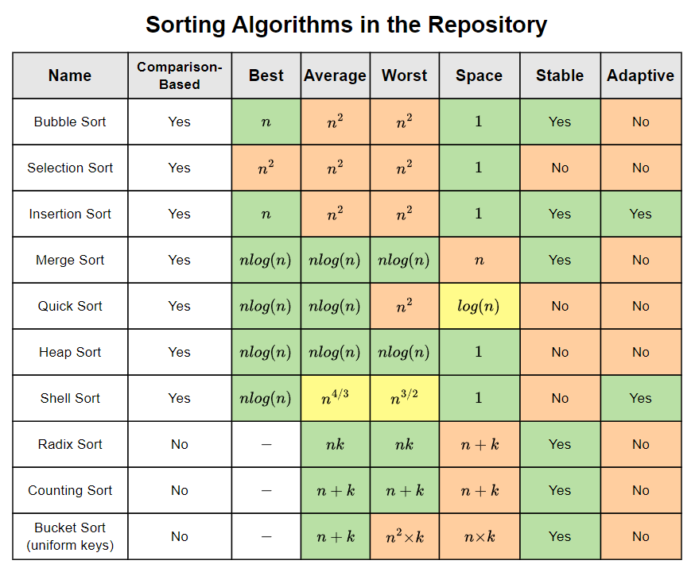

# &#128209; Table of Contents
- [💡 What is the Sorting](#-what-is-the-sorting)
- [💻 Implementation](#-implementation)
- [📊 Analysis](#-analysis)
- [📝 Application](#-application)
- [⏳ Historical Notes](#-historical-notes)
- [🤝 Contributing](#-contributing)
- [📧 Contact Information](#-contact-information)
- [🙏 Credits](#-credits)
- [🔏 License](#-license)

# &#128161; What is the Sorting
**Sorting** is a widely used operation in computer science to arrange items in a particular order. It helps to organize data efficiently in various algorithms and for all manner of applications, therefore it is important to truly understand the concept.

---

**Sorting Algorithm** — set of steps used to arrange elements in a specific order. It introduces the following terms:
- **Collection** — a grouping of elements arranged in a specific order.
- **Specific Order** — the arrangement of elements within a collection based on a defined set of criteria. 
- **Criterion** — a rule used to make the decisions about the order of elements.
- **Element** — an individual entity within a collection.
- **Index of an Element** — the position of an element within collection.
- **Value of an Element** — the actual data stored within the element.

# &#x1F4BB; Implementation
The list of known sorting algorithms is extensive and continues to grow. When it comes to implementation, some share some common ideas, while others possess distinctive characteristics. The choice between them depends on the specific requirements of the cases at hand. There are plenty of metrics to classify algorithms by (each of which can impose certain specifications on implementation), most used of them are:

- **Comparison Approach:**
   - **Comparison-Based** — sort elements by comparing them using pairwise comparisons to determine their relative order; suitable for scenarios where the comparison of elements' values are practical and necessary.
   - **Non-Comparison-Based** — sort elements without explicitly comparing them, often using specific properties of data; suitable for scenarios where the comparison of elements' values are impractical and unnecessary.

- **Time Complexities:**
   - $O(n×logn)$ — effecient performance, divide the input into smaller subproblems and solve them recursively.
   - $O(n)$ — proportional to the size of the input data, each element is compared or moved at most once.
   - $O(n^2)$ — less eficient, typically involve nested loops or multiple comparisons.
   - **Other** — although they are in the minority, it is worth mentioning them.
  
- **Space Complexity:**
   - **In-Place** $\big(O(1)\big)$  — do not require additional memory; suitable for small amount of data.
   - **Out-of-Space** $\big($e.g. $O(n)\big)$ — require some additional memory; suitable for massive amount of data.

- **Stability:**
   - **Stable** — preserve the relative order of equal elements; suitable for the data, which has multiple essential criteria.
   - **Unstable** — disregard the relative order of equal elements; suitable for the data, which prioritize only efficiency.

- **Adaptability:**
   - **Adaptive** — sequences of operations depend on comparison result; suitable for varying input data.
   - **Non-Adaptive** — sequences of operations disregard the comparison result; suitable for relatively consistent input data.

- **Directness:**
   - **Direct Algorithms** — sort elements, directly manipulating the elements themselves to reorder them; suitable for small amount of data.
   - **Indirect Algorithms** — sort elements, via manipulating the identifiers, rather then actual data; suitable for massive amount of data.

- **Storage:**
   - **Internal** — takes place entirely within the main memory (RAM) of computer; suitable for small amount of data.
   - **External** — takes place within other devices (e.g. hard disk); suitable for massive amount of data.

# &#128202; Analysis
The analysis of sorting algorithms in general relies on the assessment of previously mentioned metrics. Here I will provide a continually updated overview with relevant to this repository sortings. The following table represents a concise summary of these algorithms, highlighting their respective performances. For a more in-depth examination of any specific algorithm, simply navigate to its corresponding folder.

# &#128221; Application
**Some of the Most Well-Known Use Cases in Various Fields:**
- **Search and Retrieval** — sorting facilitates efficient searching and retrieval operations in various data structures like arrays, trees, and hash tables. Sorted data allows for faster lookup times using techniques like binary search.

- **Ordering and Ranking** — sorting used for arranging data in ascending or descending order based on specific criteria, such as numerical values, alphabetical order, or timestamps. This enables easier analysis, visualization, and decision-making processes.

- **Data Presentation and Visualization** — comes from previous, sorted data is often presented visually in charts, graphs, and reports to convey trends, patterns, and insights effectively. Visualization tools rely on sorted data to generate meaningful and informative visual representations.

- **Optimization Problems** — sorting is used in various optimization problems, such as job scheduling, task prioritization, and resource allocation. Sorted data enables the efficient allocation of resources and scheduling of tasks based on predefined criteria or constraints.

- **Data Deduplication** — Sorting helps identify and remove duplicate entries or records from datasets efficiently. By sorting the data, duplicate entries can be easily identified and eliminated, improving data quality and reducing storage overhead.

---

**Common Practical Problems:**
- Sort elements by frequency.
- Sort an array in wave form.
- Widest vertical area between two points containing no points.
- Find missing elements of a range.
- Majority element.
- Sort an array/list of 0s, 1s and 2s.
- Remove all duplicates.
- Find the point where maximum intervals overlap.
- Sort a matrix in all way increasing order.
- Find surpasser count of each element in array.
- Count distinct occurrences as a subsequence.
- Minimum absolute difference.
- Count minimum number of subsets (or subsequences) with consecutive numbers.

# &#x23F3; Historical Notes
While sorting as concept emerged unknown-long time ago and throughout the whole world naturally, the development of sorting algorithms dates back in the early days of computing. One notable early milestone in the history of sorting methods goes back in the late **1880s**, when American genius **Herman Hollerith** started to work on tabulating machines and came up with efficient solution to automate the manual process by formulating an algorithm, which only later led to the **Radix Sort**.

The breakthrough came with the invention of divide-and-conquer sorting algorithm **Merge Sort** by Hungarian-American computer scientist **John von Neumann** in **1945** and other pioneers, that were born in the **1950s** such as **Bubble Sort** and the **Selection Sort**, which were simple but quite inefficient and thus impractical for large datasets. Later the famous **Quicksort** was developed by British computer scientist **Tony Hoare** in **1959** and published in **1961**, which still remains a commonly used algorithm for sorting and. These individuals, among others, played crucial roles in integrating sorting into practical programming paradigms.

# &#129309; Contributing
Contributions are highly appreciated! For detailed guidelines, please refer to the [root directory's contributing section](../../#-contributing).

# &#128231; Contact Information
For contact details and additional information, please refer to the [root directory's contact information section](../../#-contact-information).

# &#128591; Credits
&#128218; **Books:**
- **"Introduction to Algorithms"** — by CLRS
  - Chapter 2: Sorting and Order Statistics
- **"Data Structures and Algorithm Analysis in C++""** — by Mark A. Weiss
  - Chapter 7: Sorting
- **"Grokking Algorithms"** — by Aditya Bhargava
  - Chapter 2: Selection Sort
  - Chapter 5: Quicksort
- **"Algorithms in C++, Parts 1-4"** — by Robert Sedgewick
  - Chapter 6: Elementary Sorting Methods
  - Chapter 7: Quicksort
  - Chapter 8: Merging and Mergesort

&#127891;**Courses:**
- [Mastering Data Structures & Algorithms using C and C++](https://www.udemy.com/course/datastructurescncpp/) on Udemy
   - Section 20: Sorting Techniques
  
&#127760;**Web-Resources:**  
- [Sorting Algorithm](https://en.wikipedia.org/wiki/Sorting_algorithm) (Wikipedia)
- [Sorting Algorithms in Computer Science](https://www.studysmarter.co.uk/explanations/computer-science/algorithms-in-computer-science/sorting-algorithms/)
- [Sorting Algorithms Explained](https://www.freecodecamp.org/news/sorting-algorithms-explained/)
- [Sorting Algorithms](https://www.geeksforgeeks.org/sorting-algorithms/)
- [The first sorting algorithm and the founding of IBM](https://www.linkedin.com/pulse/first-sorting-algorithm-founding-ibm-nilesh-d/)
- [The Evolution of Sorting Algorithms Over the Years](https://dev.to/shhossain/the-evolution-of-sorting-algorithms-over-the-years-bubble-sort-to-ai-driven-sort-31pg#:~:text=The%20birth%20of%20sorting%20algorithms,them%20impractical%20for%20large%20datasets.)

# &#128271; License
This project is licensed under the MIT License — see the [LICENSE](LICENSE) file for details.

