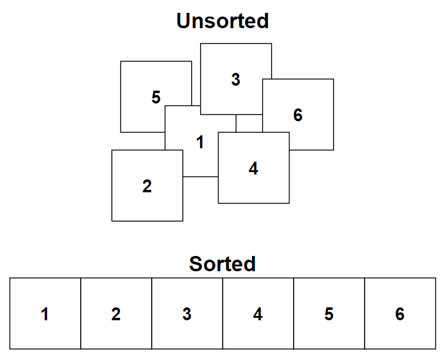

# &#128209; Table of Contents
- [💡 Overview](#-overview)
  - [Essential Terminology](#essential-terminology)
- [💻 Implementation](#-implementation)
  - [How to Implement](#how-to-implement)
  - [Pitfalls and Optimizations](#pitfalls-and-optimizations)
  - [Implemented Algorithms](#implemented-algorithms)
- [📊 Analysis](#-analysis)
  - [How to Analyze](#how-to-analyze)
  - [Trade-Offs](#trade-offs)
  - [Alternatives](#alternatives)
- [📝 Application](#-application)
  - [Common Use Cases](#common-use-cases)
  - [Some Practical Problems](#some-practical-problems)
- [🕙 Origins](#-origins)
- [🤝 Contributing](#-contributing)
- [📧 Contacts](#-contacts)
- [🙏 Credits](#-credits)
- [🔏 License](#-license)

# &#128161; Overview
**Sorting** is a fundamental operation in both the real world and computer science, organizing items into a specific order to improve data management. Mastering this concept is essential — not just for its broad practical applications, but for its ability to unlock more advanced problem-solving capabilities and optimize performance across various domains.

## Essential Terminology
- **Sorting Algorithm** — is set of steps used to obtain a particular order of elements within a collection of data.
   - **Hybrid Sorting** — is a sorting method that combines two or more algorithms to leverage their individual strengths, resulting in improved overall efficiency.
- **Criterion** — is a rule used to make the decisions about the order of elements.
- **Order** — is an arrangement of elements within a collection based on a defined set of criteria.
  - **Ascending/Increasing/Non-Decreasing** $(x\geqslant y)$ — from smallest to largest, with duplicates; e.g. $1, 2, 2, 2, 3$.
  - **Descending/Decreasing/Non-Increasing** $(x\leqslant y)$ — from largest to smallest, with duplicates; e.g. $3, 2, 2, 2, 1$.
  - **Strictly Increasing** $(x>y)$ — from smallest to largest, without duplicates; e.g. $1, 2, 3, 4, 5$.
  - **Strictly Decreasing** $(x<y)$ — from largest to smallest, without duplicates; e.g. $5, 4, 3, 2, 1$.
  - **Lexicographical** — elements are ordered based on their dictionary sequence; e.g. $12, 123, 2, 23, 3$.
  - **Custom** — elements are sorted based on a user-defined criterion; e.g. $2, 3, 5, 4, 6$ (ascending with prime number first).
- **Collection** — is a data structure, which is used to group multiple elements together.
  - **Table** — is a small collection of all elements.
  - **File** — is a big collection of all elements.
  - **Database** — is a large collection of all elements.
- **Element/Record/Item** — is an individual entity within a collection.
  - **Index** — is a position of an element within collection.
  - **Value/Data** — is an actual information stored within the element.

# &#x1F4BB; Implementation
When implementing a concept, it's essential to understand the fundamental techniques that drive its behavior and ensure its correct functionality. Additionally, recognizing the critical pitfalls and potential optimizations allows you to refine the implementation, making it more efficient and robust for various scenarios.

## How to Implement
There isn't a universal sorting algorithm, a true "jack of all trades," that fits every situation. The diversity in sorting algorithms arises because different data types, sizes, and constraints require different methods of organization. Each algorithm has its strengths and weaknesses, making some better suited for specific tasks than others. That's why many programming languages and libraries use a combination of sorting algorithms along with heuristics that adaptively select the most appropriate one based on the characteristics of the data, ensuring better performance and efficiency in each specific case.

The foundational sorting techniques, many of which were developed in the early days of computing, generally fall into several key categories. These categories serve as a guide for understanding how sorting can be implemented, with many modern algorithms building on these fundamental ideas or refining them for improved performance. Below, you'll find an overview of common sorting approaches along with examples of algorithms that exemplify each method.

- **Insertion Sorting** — inserts each element into its correct position relative to previously sorted elements, building the sorted array incrementally. This approach is simple and effective for small or nearly sorted datasets.  
**Examples:** Insertion Sort, Shell Sort.

- **Exchanging Sorting** — compares pairs of elements and swaps them if they are out of order. This process repeats until all elements are in the correct order. These algorithms are straightforward but often inefficient for large datasets.  
**Examples:** Bubble Sort, Quicksort.

- **Selection Sorting** — repeatedly selects the smallest or largest element from the unsorted portion of the array and moves it to its final position. This method is systematic but can be slow due to the large number of comparisons.  
**Examples:** Selection Sort, Heapsort.

- **Enumeration Sorting** — compares each element to every other element, counting how many elements it is greater than or equal to, and uses that count to determine its final position in the sorted array. This approach can be inefficient due to the number of comparisons required.  
**Examples:** Rank Sort, Enumeration Sort.

- **Merging Sorting** — divides the data into smaller segments, sorts each segment, and then merges them back together into a fully sorted list. This divide-and-conquer approach is efficient for large datasets and stable, preserving the relative order of equal elements.  
**Examples:** Merge Sort, K-Way Merge Sort.

- **Counting Sorting** — counts the occurrences of each element and uses this information to determine the final position of each element. This method is efficient for specific types of data, particularly when the range of values is known and limited.  
**Examples:** Counting Sort, Radix Sort.

- **Special-Purpose Sorting** — designed for specific use cases, such as sorting small, fixed-size datasets or handling unique constraints. These methods may not be generalizable but can be very efficient in their intended scenarios.  
**Examples:** Gnome Sort, Pigeonhole Sort.

- **Hybrid Sorting** — combines multiple sorting strategies to optimize performance. Hybrid algorithms adapt to the structure of the data, using different methods as needed to improve efficiency.  
**Examples:** Timsort, Introsort.

> **Note:** For a truly comprehensive and meticulous overview of sorting approaches, including many advanced versions, I suggest checking out Donald Knuth's «The Art of Computer Programming, Volume 3: Sorting and Searching». Even though many people consider it to be dull and old, it's still the most structured and detailed resource I've found on this topic.

## Pitfalls and Optimizations
When selecting or using a sorting algorithm, it’s not just about picking the most efficient one; you need to consider how it will perform in various real-world scenarios. While an algorithm might work well in simple cases, unforeseen issues can arise in more complex situations, potentially leading to significant problems later on. To avoid these pitfalls and uncover optimization opportunities, it’s essential to think critically about several factors before deciding on an algorithm. Additionally, each algorithm may have its own distinct things to consider.

- **Data Distribution** — what is the most likely distribution of your data? How will the algorithm handle best, average, and worst-case scenarios?
- **Data Size** — how large is the dataset? Will you need to consider external sorting methods for very large datasets?
- **Data Type** — is the data type compatible with the algorithm? Will the algorithm handle all data types flawlessly?
- **Empty Collection** — how does the algorithm behave when sorting an empty collection?
- **Sorted Order** — what happens if the collection is already sorted? Will the algorithm recognize this and optimize its process?
- **Single Element** — how does the algorithm handle a single-element collection?
- **Duplicate Elements** — how does the algorithm manage collections with many duplicate elements? Does it maintain stability?
- **Parallelization** — can the algorithm be parallelized effectively? Does it need to be?
- **Input Validation** — how does the algorithm handle invalid inputs? Does it fail gracefully or crash unexpectedly?
- **Pathological Cases** — how does the algorithm perform in worst-case scenarios, and can you mitigate those risks?
- **Combining Algorithms** — is it beneficial to combine this algorithm with others, perhaps using a hybrid approach to improve performance or reliability?

## Implemented Algorithms
Discussing practical implementations, it's evident that well-established and widely recognized solutions already exist. In the context of C++, `std::sort()` is a such representative. It's commonly recommended to rely on these proven implementations rather than reinventing the wheel. However, within the scope of this section, we'll take a closer look at simplified versions of popular sorting algorithms. This exploration is aimed at gaining a deeper understanding of the fundamental design paradigms that underlie them.
- [Bubble Sort](https://github.com/vezzolter/DSA/tree/main/Algorithms/Sorting/BubbleSort) ✅
- [Selection Sort](https://github.com/vezzolter/DSA/tree/main/Algorithms/Sorting/SelectionSort) ✅
- [Insertion Sort](https://github.com/vezzolter/DSA/tree/main/Algorithms/Sorting/InsertionSort) ✅
- [Merge Sort](https://github.com/vezzolter/DSA/tree/main/Algorithms/Sorting/MergeSort) ✅
- [Quicksort](https://github.com/vezzolter/DSA/tree/main/Algorithms/Sorting/Quicksort) ✅
- [Heapsort](https://github.com/vezzolter/DSA/tree/main/Algorithms/Sorting/Heapsort) ✅
- [Counting Sort](https://github.com/vezzolter/DSA/tree/main/Algorithms/Sorting/CountingSort) ✅
- [Radix Sort](https://github.com/vezzolter/DSA/tree/main/Algorithms/Sorting/RadixSort) ✅
- [Bucket Sort](https://github.com/vezzolter/DSA/tree/main/Algorithms/Sorting/BucketSort) ✅
- [Shell Sort](https://github.com/vezzolter/DSA/tree/main/Algorithms/Sorting/Shellsort) ✅

# &#128202; Analysis
Understanding how to analyze a concept is crucial for identifying its key characteristics and evaluating its performance across different scenarios. Additionally, examining the trade-offs allows you to understand what you gain and what you give up when applying the concept. Finally, considering alternatives helps you determine when the concept is the best choice and when other approaches might be more appropriate.

## How to Analyze
- **Comparison Approach:**
   - **Comparison-Based** — algorithm sorts elements by comparing them using pairwise comparisons to determine their relative order.
   - **Non-Comparison-Based** — algorithm sorts elements without explicitly comparing them, often using specific properties of data.

- **Time Complexity:**
   - $O(nlogn)$ — efficient performance, divide the input into smaller subproblems and solve them recursively.
   - $O(n)$ — proportional to the size of the input data, each element is compared or moved at most once.
   - $O(n^2)$ — less efficient, typically involve nested loops or multiple comparisons.
   - **Other** — although they are in the minority, it is worth mentioning them.
  
- **Space Complexity:**
   - **In-Place** $\big(O(1)\big)$  — algorithm doesn't require any additional memory.
   - **Out-of-Space** $\big(O(n)/O(nlogn)/...\big)$ — algorithm does require some additional memory.

- **Stability:**
   - **Stable** — algorithm preserves the relative order of equal elements, i.e. if two elements from the input are considered equal, stable algorithm ensures that they will maintain this order in sorted output.
   - **Unstable** — algorithm doesn't guarantee the preservation of the relative order of equal elements; i.e. they can either be swapped or kept, algorithm doesn't consider the original positions.

- **Adaptability:**
   - **Adaptive** — algorithm adjusts its overall behavior (sequence of operations) based on the initial order of elements to improve performance.
   - **Non-Adaptive** — algorithm processes data through the same path of steps, regardless of their values.

- **Directness:**
   - **Direct** — algorithm sorts elements directly manipulating themselves.
   - **Indirect** — algorithm utilizes some sort of a pointer onto elements in order to sort them, typically it is done because moving huge chunks can be more resourceful operation compared to little shortcuts.

- **Storage:**
   - **Internal** — algorithm takes place entirely within the main memory (RAM) of computer.
   - **External** — algorithm takes place within other devices (e.g. hard disk), typically due to their huge size.

## Trade-Offs
**What Sorting Gives:**
- **Organized Data** — sorting transforms unordered data into a structured form, enhancing the efficiency of subsequent operations, such as searching and merging. In many applications, having sorted data simplifies logic and improves performance, making it easier to manage and process large datasets.  
- **Improved Algorithm Performance** — many algorithms are designed to work more efficiently with sorted data. Sorting can therefore be a prerequisite step that unlocks the potential of these algorithms, allowing them to operate optimally.

---
**What Sorting Takes:**
- **Time Investment** — sorting requires computational resources, and for large datasets, this time investment can be significant. Sorting is often a prerequisite rather than the final goal, making this time cost an important consideration in time-sensitive applications.
- **Memory Usage** — some sorting algorithms, particularly those that are not in-place, require additional memory. In memory-constrained environments, this trade-off can be critical. Even in-place algorithms like quicksort can have hidden memory costs, such as stack space for recursive calls.
- **Complexity in Implementation** — efficient sorting algorithms can be complex to implement and optimize, requiring careful consideration of edge cases and algorithmic design. This complexity might introduce bugs or make the code harder to maintain.
- **Energy and Power Consumption** — in resource-constrained environments, such as embedded systems, the energy cost of sorting operations can be a significant trade-off, impacting battery life and system performance.

## Alternatives
1. **Ordered Data Structures** — these data structures maintain elements in a specific order as they are added or removed, which eliminates the need for full sorting. They are particularly useful in dynamic environments where data changes frequently. Examples include balanced binary search trees (e.g. AVL trees, Red-Black trees), heaps (e.g. min-heaps, max-heaps), and skip lists. These structures ensure that you can always access elements in order without having to perform an explicit sorting operation.
2. **Specific Techniques** — these approaches focus on dividing or organizing data based on specific criteria without requiring a full sort. For example, partitioning techniques can separate data into meaningful groups (e.g. splitting data into smaller and larger halves) without the overhead of sorting all elements. The two-pointer method is often used to solve problems by traversing the data from both ends, allowing efficient categorization or selection. Quickselect is a specialized algorithm that finds the k-th smallest element in an unsorted list, which is more efficient than sorting the entire dataset.
3. **Problem-Specific Logic** — in certain cases, sorting can be bypassed by applying tailored solutions that address the problem more directly. This might involve processing elements in a specific order relevant to the task at hand, such as using a graph traversal method to prioritize nodes without needing to sort them. These custom approaches leverage the unique characteristics of the problem, avoiding the time and resource costs of sorting.

# &#128221; Application
Understanding some of the most well-known use cases of a concept is crucial for grasping its practical relevance and potential impact in real-world scenarios. Additionally, familiarizing oneself with practical problems and practicing their solutions ensures that you retain essential details and develop a deep, intuitive understanding of the concept's capabilities and limitations.

## Common Use Cases
- **Search and Retrieval** — sorting facilitates efficient searching and retrieval operations in various data structures like arrays, trees, and hash tables. Sorted data allows for faster lookup times using techniques like binary search.
- **Ordering and Ranking** — sorting used for arranging data in ascending or descending order based on specific criteria, such as numerical values, alphabetical order, or timestamps. This enables easier analysis, visualization, and decision-making processes.
- **Data Presentation and Visualization** — comes from previous, sorted data is often presented visually in charts, graphs, and reports to convey trends, patterns, and insights effectively. Visualization tools rely on sorted data to generate meaningful and informative visual representations.
- **Optimization Problems** — sorting is used in various optimization problems, such as job scheduling, task prioritization, and resource allocation. Sorted data enables the efficient allocation of resources and scheduling of tasks based on predefined criteria or constraints.
- **Data Deduplication** — sorting helps identify and remove duplicate entries or records from datasets efficiently. By sorting the data, duplicate entries can be easily identified and eliminated, improving data quality and reducing storage overhead.

## Some Practical Problems
**Easy Problems:**
1. [Sorting the Sentence](https://leetcode.com/problems/sorting-the-sentence)
2. [Widest Vertical Area Between Two Points Containing No Points](https://leetcode.com/problems/widest-vertical-area-between-two-points-containing-no-points)
3. [Sort the People](https://leetcode.com/problems/sort-the-people)
4. [Intersection of Two Arrays](https://leetcode.com/problems/intersection-of-two-arrays)
5. [Relative Sort Array](https://leetcode.com/problems/relative-sort-array)
6. [Matrix Cells in Distance Order](https://leetcode.com/problems/matrix-cells-in-distance-order)
7. [Valid Anagram](https://leetcode.com/problems/valid-anagram)
8. [Merge Sorted Array](https://leetcode.com/problems/merge-sorted-array)
9. [Sort Even and Odd Indices Independently](https://leetcode.com/problems/sort-even-and-odd-indices-independently)
10. [Largest Perimeter Triangle](https://leetcode.com/problems/largest-perimeter-triangle)

---
**Medium Problems:** 
1. [Sort an Array](https://leetcode.com/problems/sort-an-array)  
2. [Sort List](https://leetcode.com/problems/sort-list)  
3. [Sort the Matrix Diagonally](https://leetcode.com/problems/sort-the-matrix-diagonally)  
4. [Group Anagrams](https://leetcode.com/problems/group-anagrams)  
5. [Find Polygon With the Largest Perimeter](https://leetcode.com/problems/find-polygon-with-the-largest-perimeter)  
6. [Sort Colors](https://leetcode.com/problems/sort-colors)  
7. [Car Fleet](https://leetcode.com/problems/car-fleet)  
8. [3Sum](https://leetcode.com/problems/3sum)  
9.  [Top K Frequent Elements](https://leetcode.com/problems/top-k-frequent-elements)
10. [Maximum Gap](https://leetcode.com/problems/maximum-gap)
11. [Find Original Array From Doubled Array](https://leetcode.com/problems/find-original-array-from-doubled-array)
12. [Merge Intervals](https://leetcode.com/problems/merge-intervals)
13. [Find if Array Can Be Sorted](https://leetcode.com/problems/find-if-array-can-be-sorted)
14. [Shortest Unsorted Continuous Subarray](https://leetcode.com/problems/shortest-unsorted-continuous-subarray)
15. [Maximize Area of Square Hole in Grid](https://leetcode.com/problems/maximize-area-of-square-hole-in-grid)

---
**Hard Problems:** 
1. [Make Array Strictly Increasing](https://leetcode.com/problems/make-array-strictly-increasing)
2. [Orderly Queue](https://leetcode.com/problems/orderly-queue)
3. [Minimum Replacements to Sort the Array](https://leetcode.com/problems/minimum-replacements-to-sort-the-array)
4. [Find Median from Data Stream](https://leetcode.com/problems/find-median-from-data-stream)
5. [Recover the Original Array](https://leetcode.com/problems/recover-the-original-array)
6. [GCD Sort of an Array](https://leetcode.com/problems/gcd-sort-of-an-array)
7. [Minimize Manhattan Distances](https://leetcode.com/problems/minimize-manhattan-distances)
8. [Make Array Empty](https://leetcode.com/problems/make-array-empty)
9. [Sum of Subsequence Widths](https://leetcode.com/problems/sum-of-subsequence-widths)
10. [Find K-th Smallest Pair Distance](https://leetcode.com/problems/find-k-th-smallest-pair-distance)

# &#x1F559; Origins
While sorting as concept emerged unknown-long time ago and throughout the whole world naturally, the development of sorting algorithms dates back in the early days of computing. One notable early milestone in the computer science's history of sorting methods goes back in the late **1880s**, when American genius **Herman Hollerith** started to work on tabulating machines and came up with efficient solution to automate the manual process by formulating an algorithm, which only later led to the **Radix Sort**.

The breakthrough came with the invention of divide-and-conquer sorting algorithm **Merge Sort** by Hungarian-American computer scientist **John von Neumann** in **1945** and other pioneers, that were born in the **1950s** such as **Bubble Sort** and the **Selection Sort**, which were simple but quite inefficient and thus impractical for large datasets. Later the famous **Quicksort** was developed by British computer scientist **Tony Hoare** in **1959** and published in **1961**, which still remains a commonly used algorithm for sorting. Summarizing, these individuals, among others, played crucial roles in integrating sorting into practical programming paradigms.

# &#129309; Contributing
Contributions are highly appreciated! For detailed guidelines, please refer to the [root directory's contributing section](../../#-contributing).

# &#128231; Contacts
For contact details and additional information, please refer to the [root directory's contact information section](../../#-contacts).

# &#128591; Credits
&#128218; **Books:**
- **"Introduction to Algorithms" (3rd Edition)** — by Thomas H. Cormen, Charles E. Leiserson, Ronald L. Rivest and Clifford Stein
  - Section 6: Heapsort
  - Section 7: Quicksort
  - Section 8: Sorting in Linear Time
  - Section 9: Medians and Order Statistics
- **"Algorithms in C++, Parts 1-4: Fundamentals, Data Structure, Sorting, Searching" (3rd Edition)** — by Robert Sedgewick
  - Section 6: Elementary Sorting Methods
  - Section 7: Quicksort
  - Section 8: Merging and Mergesort
  - Section 9: Priority Queues and Heapsort
  - Section 10: Radix Sort
  - Section 11: Special-Purpose Sorts
- **"Data Structures and Algorithm Analysis in C++" (4th Edition)** — by Mark Allen Weiss
  - Section 7: Sorting
- **"The Algorithm Design Manual" (2nd Edition)** — by Steven S. Skiena
  - Section 4: Sorting and Searching
- **"The Art of Computer Programming, Volume 3: Sorting and Searching" (2nd Edition)** — by Donald Ervin Knuth
  - Section 5: Sorting

---
&#127891; **Courses:**
- [Mastering Data Structures & Algorithms using C and C++](https://www.udemy.com/course/datastructurescncpp/) on Udemy
   - Section 20: Sorting Techniques

---  
&#127760; **Web-Resources:**  
- [Sorting Algorithm](https://en.wikipedia.org/wiki/Sorting_algorithm) (Wikipedia)

# &#128271; License
This project is licensed under the MIT License — see the [LICENSE](https://github.com/vezzolter/DSA/blob/main/LICENSE) file for details.

