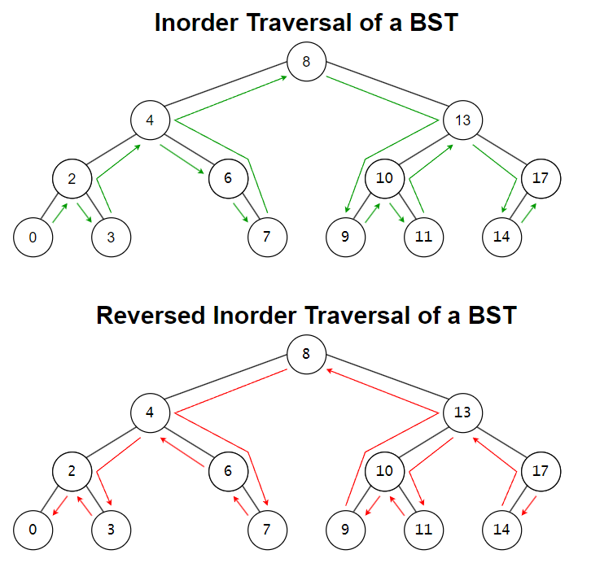
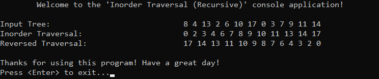

# &#128209; Table of Contents
- [💡 Overview](#-overview)
  - [Introduction](#introduction)
  - [Important Details](#important-details)
  - [Algorithm Steps (Recursive)](#algorithm-steps-recursive)
- [💻 Implementation](#-implementation)
  - [Design Decisions](#design-decisions)
  - [Complete Implementation](#complete-implementation)
  - [Detailed Walkthrough](#detailed-walkthrough)
- [📊 Analysis](#-analysis)
  - [Characteristics](#characteristics)
  - [Trade-Offs](#trade-offs)
- [📝 Application](#-application)
  - [Common Use Cases](#common-use-cases)
  - [Some Practical Problems](#some-practical-problems)
- [🕙 Origins](#-origins)
- [📖 Resources](#-resources)
- [🤝 Contributing](#-contributing)
- [🔏 License](#-license)


# &#128161; Overview
**Inorder traversal** is a fundamental algorithm for visiting nodes in a binary tree. When you think of traversal names as root placement plus left-to-right reading order, it is possible to observe that the name «inorder» means the root is visited IN between the left and right subtrees. Knowledge and understanding of it lay a solid foundation for algorithmic design and tackling more complex problem-solving strategies.
<p align="center"></p>


## Introduction
The algorithm visits the root node in between its left and right children — following the order Left-Root-Right in the standard version, and Right-Root-Left in the reversed version.


## Important Details
1. When inorder traversal is applied to a BST, it visits nodes in **ascending sorted order** due to the tree’s inherent ordering property; when reversed inorder traversal is used, it processes nodes in **descending sorted order** instead.
2. Can be implemented using **recursion**, **iteration**, or **Morris traversal**, where the recursive approach relies on an implicit function call stack, the iterative approach uses an explicit stack, and Morris traversal achieves the same result with $O(1)$ extra space by temporarily modifying tree links.


## Algorithm Steps (Recursive)
**Standard Version:**
1. Set up the base case, stopping recursion when traversal reaches the end of a branch.
2. Recursively traverse the left subtree by calling the function on the left child.
3. Process the current node (this step depends on the specific task at hand).
4. Recursively traverse the right subtree by calling the function on the right child.

---
**Reversed Version:**
1. Set up the base case, stopping recursion when traversal reaches the end of a branch.
2. Recursively traverse the right subtree by calling the function on the right child.
3. Process the current node (this step depends on the specific task at hand).
4. Recursively traverse the left subtree by calling the function on the left child.


# &#x1F4BB; Implementation
The program manually constructs a binary tree that resembles a BST, but does not strictly enforce its rules — nodes are added in a predefined order rather than inserted dynamically. It then displays the order of insertion, applies inorder traversal, which prints the values in ascending order, and reversed inorder traversal, which prints them in descending order.
<p align="center"></p>


## Design Decisions
To prioritize simplicity and emphasize algorithm itself, several design decisions were made:
- Replacing tree-like structure with a simple node struct and predefined order of nodes.
- Printing node values as the only processing step during traversal.


## Complete Implementation
The inorder traversal algorithm is implemented in `inorderTraversal()`, the reversed inorder traversal in `reversedInorderTraversal()`, both are declared in [InorderTraversal.h](https://github.com/vezzolter/DSA/blob/inorder-traversal/Algorithms/TreeAlgorithms/InorderTraversal/Include/InorderTraversal.h) header file and defined in [InorderTraversal.cpp](https://github.com/vezzolter/DSA/blob/inorder-traversal/Algorithms/TreeAlgorithms/InorderTraversal/Source/InorderTraversal.cpp) source file. This approach is adopted to ensure encapsulation, modularity and compilation efficiency. The tree construction and traversal execution are handled within the `main()` function located in the [Main.cpp](https://github.com/vezzolter/DSA/blob/inorder-traversal/Algorithms/TreeAlgorithms/InorderTraversal/Source/Main.cpp) file. Below you can find related code snippets.

```cpp
void inorderTraversal(TreeNode* root) {
	if (!root) { return; }
	inorderTraversal(root->left);
	std::cout << root->val << " ";
	inorderTraversal(root->right);
}

void reversedInorderTraversal(TreeNode* root) {
	if (!root) { return; }
	reversedInorderTraversal(root->right);
	std::cout << root->val << " ";
	reversedInorderTraversal(root->left);
}
```


## Detailed Walkthrough
**Standard Version:**
1. Start by setting up the base case, where if the current node is `nullptr`, the function returns immediately, stopping recursion.
```cpp
  if (node == nullptr) { return; }
```
2. Recursively traverse the left subtree by calling the function on the left child. This ensures all left-side nodes are processed before visiting the root.
```cpp
  inorderTraversal(node->left);
```
3. Process the current node, which in this case involves printing its value (designer decision).
```cpp
  std::cout << node->val << " ";
```
4. Recursively traverse the right subtree by calling the function on the right child. This ensures all right-side nodes are processed after visiting the root.
```cpp
  inorderTraversal(node->right);
```

---
**Reversed Version:**
1. Start by setting up the base case, where if the current node is `nullptr`, the function returns immediately, stopping recursion.  
```cpp
  if (node == nullptr) { return; }
```
2. Recursively traverse the right subtree by calling the function on the right child. This ensures all right-side nodes are processed before visiting the root.
```cpp
  reversedInorderTraversal(node->right);
```
3. Process the current node, which in this case involves printing its value (designer decision).
```cpp
  std::cout << node->val << " ";
```
4. Recursively traverse the left subtree by calling the function on the left child. This ensures all left-side nodes are processed after visiting the root.
```cpp
  reversedInorderTraversal(node->left);
```


# &#128202; Analysis
Understanding the characteristics of an algorithm is essential for choosing the right solution to a problem, as it reveals their impact on resource utilization, potential limitations, and capabilities. Additionally, understanding its strengths and weaknesses enables more informed decisions, helping to determine the most suitable algorithm for a given problem among alternative approaches.


## Characteristics
- **Time Complexities:**  
  - $O(n)$ — each node is visited exactly once.
- **Auxiliary Space Complexity:** 
   - $O(height)$ — the recursion depth depends on the height of the tree, which is $O(\log n)$ for balanced trees and $O(n)$ for skewed trees. The iterative implementation uses a stack to track nodes, while Morris traversal achieves in-place traversal by temporarily modifying tree links using threaded binary trees.


## Trade-Offs
> **Note**: I think it doesn’t make sense to evaluate this algorithm in terms of «pros and cons» — just like a tool, it serves a specific purpose. We don’t ask whether a hammer or a table has advantages or disadvantages; we simply use them as needed for the task at hand. 


# &#128221; Application
Currently in Progress...


## Common Use Cases
Currently in Progress...


## Some Practical Problems
Currently in Progress...


# &#x1F559; Origins
Currently in Progress...


# &#128214; Resources
Currently in Progress...


# &#129309; Contributing
Contributions are highly appreciated! For detailed guidelines, contact details, and additional information, please refer to the [root directory's contributing section](../../../#-contributing).


# &#128271; License
This project is licensed under the MIT License — see the [LICENSE](https://github.com/vezzolter/DSA/blob/main/LICENSE) file for details.

[](https://opensource.org/licenses/MIT)