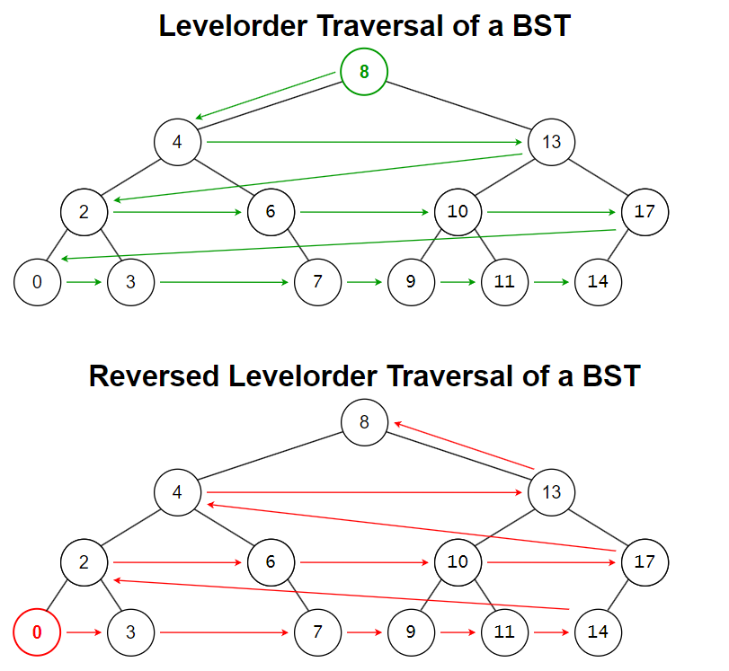

# &#128209; Table of Contents
- [💡 Overview](#-overview)
  - [Introduction](#introduction)
  - [Important Details](#important-details)
  - [Algorithm Steps](#algorithm-steps)
- [💻 Implementation](#-implementation)
  - [Design Decisions](#design-decisions)
  - [Complete Implementation](#complete-implementation)
  - [Detailed Walkthrough](#detailed-walkthrough)
- [📊 Analysis](#-analysis)
  - [Characteristics](#characteristics)
  - [Trade-Offs](#trade-offs)
- [📝 Application](#-application)
  - [Common Use Cases](#common-use-cases)
  - [Some Practical Problems](#some-practical-problems)
- [🕙 Origins](#-origins)
- [📖 Resources](#-resources)
- [🤝 Contributing](#-contributing)
- [🔏 License](#-license)

# &#128161; Overview
**Levelorder traversal** is a fundamental algorithm for visiting nodes in a binary tree. The name «LEVELorder» reflects the fact that nodes are visited according to their depth level in the tree, starting from the root and moving downward level by level. Knowledge and understanding of it lay a solid foundation for algorithmic design and tackling more complex problem-solving strategies.

## Introduction
Currently in Progress....

## Important Details
Currently in Progress...

## Algorithm Steps
Currently in Progress...

# &#x1F4BB; Implementation
Currently in Progress...

## Design Decisions
Currently in Progress...

## Complete Implementation
Currently in Progress...

## Detailed Walkthrough
Currently in Progress...

# &#128202; Analysis
Currently in Progress...

## Characteristics
Currently in Progress...

## Trade-Offs
Currently in Progress...

# &#128221; Application
Currently in Progress...

## Common Use Cases
Currently in Progress...

## Some Practical Problems
Currently in Progress...

# &#x1F559; Origins
I couldn’t find any definitive records tracing its origins, so I’m assuming it naturally emerged when people started thinking about trees as a more natural, top-down structure rather than a recursive one.

# &#128214; Resources
&#128218; **Books:**
- **"Algorithms in C++, Parts 1-4: Fundamentals, Data Structure, Sorting, Searching" (3rd Edition)** — by Robert Sedgewick
  - Section 5.6: Tree Traversal
  - Section 5.7: Recursive Binary-Tree Algorithms
- **"Data Structures and Algorithm Analysis in C++" (4th Edition)** — by Mark Allen Weiss
  - Section 4.1: Preliminaries
  - Section 4.2: Binary Trees
  - Section 4.6: Tree Traversals (Revisited)
- **"The Art of Computer Programming, Volume 1: Fundamental Algorithms" (3rd Edition)** — by Donald Ervin Knuth
  - Section: 2.3.1: Traversing Binary Trees

---
&#127891; **Courses:**
- [Accelerated Computer Science Fundamentals Specialization](https://www.coursera.org/specializations/cs-fundamentals) on Coursera
  - Section 2.2: Introduction to Tree Structures
- [Mastering Data Structures & Algorithms using C and C++](https://www.udemy.com/course/datastructurescncpp/) on Udemy
  - Section 15: Trees

# &#129309; Contributing
Contributions are highly appreciated! For detailed guidelines, contact details, and additional information, please refer to the [root directory's contributing section](../../../#-contributing).

# &#128271; License
This project is licensed under the MIT License — see the [LICENSE](https://github.com/vezzolter/DSA/blob/main/LICENSE) file for details.

