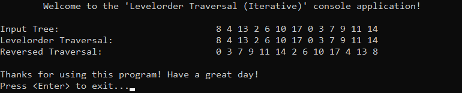

# &#128209; Table of Contents
- [💡 Overview](#-overview)
  - [Introduction](#introduction)
  - [Important Details](#important-details)
  - [Algorithm Steps (Iterative)](#algorithm-steps-iterative)
- [💻 Implementation](#-implementation)
  - [Design Decisions](#design-decisions)
  - [Complete Implementation](#complete-implementation)
  - [Detailed Walkthrough](#detailed-walkthrough)
- [📊 Analysis](#-analysis)
  - [Characteristics](#characteristics)
  - [Trade-Offs](#trade-offs)
- [📝 Application](#-application)
  - [Common Use Cases](#common-use-cases)
  - [Some Practical Problems](#some-practical-problems)
- [🕙 Origins](#-origins)
- [📖 Resources](#-resources)
- [🤝 Contributing](#-contributing)
- [🔏 License](#-license)


# &#128161; Overview
**Levelorder traversal** is a fundamental algorithm for visiting nodes in a binary tree. The name «LEVELorder» reflects the fact that nodes are visited according to their depth level in the tree, starting from the root and moving downward level by level. Knowledge and understanding of it lay a solid foundation for algorithmic design and tackling more complex problem-solving strategies.
<p align="center"></p>


## Introduction
The algorithm visits nodes level by level from top to bottom — processing all nodes at the same depth from left to right before moving to the next level. The reversed version walks through the same levels from bottom to top, but still processes nodes left to right within each level.


## Important Details
1. This algorithm is typically implemented **iteratively** using an explicit queue. The queue allows nodes to be visited in the exact order they are discovered — as each node is removed from the front, its children are added to the back, so all nodes at one depth are processed before any at the next. This structure naturally enforces level-by-level traversal without needing to track depth or use recursion, and guarantees left-to-right order within each level by preserving the sequence in which children are added.


## Algorithm Steps (Iterative)
**Standard Version:**
1. Create an empty linear queue container.
2. Add root node to the queue — this represents the first level of the tree.
3. Begin a loop to process nodes level by level (while the queue is not empty).
4. Access the current node at the front of the queue — this represents the node to process at the current level.
5. Remove the current node from the queue, since we are about to process it, it must be removed to avoid revisiting later.
6. Process the current node (this step depends on the specific task at hand).
7. If the current node has a left child, enqueue it to continue forming the next level (or start forming it, if this is the first node).
8. If the node has a right child, enqueue it to continue forming the next level (or start forming it, if this is the first node).

---
**Reversed Version:**
1. Create an empty linear queue container and an empty stack container.
2. Add the root node to the queue — this represents the first level of the tree.
3. Begin a loop to process nodes level by level (while the queue is not empty).
4. Access the current node at the front of the queue — this represents the node to process at the current level.
5. Remove the current node from the queue, since we are about to process it, it must be removed to avoid revisiting later.
6. Push the current node onto the stack instead of processing it immediately.
7. If the current node has a left child, enqueue it to continue forming the next level (or start forming it, if this is the first node).
8. f the node has a right child, enqueue it to continue forming the next level (or start forming it, if this is the first node).
9. After the queue is fully processed, pop and process all nodes from the stack to produce the final reversed order.


# &#x1F4BB; Implementation
The program manually constructs a binary tree that resembles a BST, but does not strictly enforce its rules — nodes are added in a predefined order rather than inserted dynamically. It then displays the order of insertion and applies both levelorder and reversed levelorder traversals, each of which simply prints the visited node values.
<p align="center"></p>


## Design Decisions
To prioritize simplicity and emphasize algorithm itself, several design decisions were made:
- Replacing tree-like structure with a simple node struct and predefined order of nodes.
- Printing node values as the only processing step during traversal.
- Using `queue` as the traversal core to maintain top-down and left-to-right processing order.
- Using `stack` to reverse the output sequence for bottom-up traversal.


## Complete Implementation
The levelorder traversal algorithm is implemented in `levelorderTraversal()`, the reversed levelorder traversal in `reversedLevelorderTraversal()`, both are declared in [LevelorderTraversal.h](https://github.com/vezzolter/DSA/blob/main/Algorithms/TreeAlgorithms/LevelorderTraversal/Include/LevelorderTraversal.h) header file and defined in [LevelorderTraversal.cpp](https://github.com/vezzolter/DSA/blob/main/Algorithms/TreeAlgorithms/LevelorderTraversal/Source/LevelorderTraversal.cpp) source file. This approach is adopted to ensure encapsulation, modularity and compilation efficiency. The tree construction and traversal execution are handled within the `main()` function located in the [Main.cpp](https://github.com/vezzolter/DSA/blob/main/Algorithms/TreeAlgorithms/LevelorderTraversal/Source/Main.cpp) file. Below you can find related code snippets.

```cpp
void levelorderTraversal(TreeNode* root) {
	if (!root) { return; }

	std::queue<TreeNode*> q;
	q.push(root);

	for (; !q.empty(); ) {
		TreeNode* curr = q.front();
		q.pop();

		std::cout << curr->val << " ";

		if (curr->left) { q.push(curr->left); }
		if (curr->right) { q.push(curr->right); }
	}
}

void reversedLevelorderTraversal(TreeNode* root) {
	if (!root) { return; }

	std::queue<TreeNode*> q;
	q.push(root);
	std::stack<TreeNode*> s;

	for (; !q.empty(); ) {
		TreeNode* curr = q.front();
		q.pop();

		s.push(curr);

		if (curr->right) { q.push(curr->right); } // right should be first
		if (curr->left) { q.push(curr->left); }
	}

	for (; !s.empty(); ) {
		std::cout << s.top()->val << " ";
		s.pop();
	}
}
```

## Detailed Walkthrough
**Standard Version:**
1. Check if the tree (or subtree) is empty and return immediately if there is no root to process. This stops the traversal early when there's nothing to process. 
```cpp
  if (!root) { return; }
```
2. Create an empty queue to manage the traversal, and add the root node as the starting point — this represents the first level of the tree.
```cpp
  std::queue<TreeNode*> q;
  q.push(root);
```
3. Begin a loop that continues while there are still nodes in the queue — this loop ensures all levels are processed one by one.
```cpp
  for (; !q.empty(); ) {
```
4. Get access to the current node of the level, and since we are about to process it, it must be removed from the queue to avoid revisiting later.
```cpp
  TreeNode* curr = q.front();
  q.pop();
```
5. Process the current node, which in this case involves printing its value (designer decision).
```cpp
  std::cout << curr->val << " ";
```
6. If the current node has a left or right child, enqueue them to form the next level — children are added in left-to-right order to preserve that structure in traversal.
```cpp
  if (curr->left) { q.push(curr->left); }
  if (curr->right) { q.push(curr->right); }
```

---
**Reversed Version:**
1. Check if the tree (or subtree) is empty and return immediately if there is no root to process. This stops the traversal early when there's nothing to process. 
```cpp
  if (!root) { return; }
```
2. Create an empty queue to manage the traversal, and add the root node as the starting point — this represents the first level of the tree.
```cpp
  std::queue<TreeNode*> q;
  q.push(root);
```
3. Create an empty stack to temporarily store visited nodes. The stack will be used to reverse the order in which nodes are output.
```cpp
	std::stack<TreeNode*> s;
```
4. Begin a loop that continues while there are still nodes in the queue — this loop ensures all levels are processed one by one.
```cpp
  for (; !q.empty(); ) {
```
5. Get access to the current node of the level, and since we are about to process it, it must be removed from the queue to avoid revisiting later.
```cpp
  TreeNode* curr = q.front();
  q.pop();
```
6. Push the current node onto the stack instead of printing it right away — this delays the output until all nodes are processed and allows us to reverse the order.
```cpp
  s.push(curr);
```
7. If the current node has a left or right child, enqueue them to form the next level — the right child is enqueued before the left to preserve left-to-right order when reversed.
```cpp
  if (curr->right) { q.push(curr->right); }
  if (curr->left) { q.push(curr->left); }
```
8. After all nodes have been traversed and stored in the stack, pop and print them one by one to produce the final reversed levelorder output (designer decision).
```cpp
  for (; !s.empty(); ) {
    std::cout << s.top()->val << " ";
    s.pop();
  }
```


# &#128202; Analysis
Understanding the characteristics of an algorithm is essential for choosing the right solution to a problem, as it reveals their impact on resource utilization, potential limitations, and capabilities. Additionally, understanding its strengths and weaknesses enables more informed decisions, helping to determine the most suitable algorithm for a given problem among alternative approaches.


## Characteristics
- **Time Complexities:**  
  - $O(n)$ — each node is visited exactly once.
- **Auxiliary Space Complexity:**  
  - $O(width)$ — the space complexity depends on how many nodes the queue may store at once, which is determined by the tree’s maximum width — the number of nodes present at the widest level. In a perfectly balanced binary tree (worst case in terms of nodes at level), the widest level is the last one, which may contain up to $n/2$ nodes, which still results in $O(n)$ space in asymptotic terms.


## Trade-Offs
> **Note**: I think it doesn’t make sense to evaluate this algorithm in terms of «pros and cons» — just like a tool, it serves a specific purpose. We don’t ask whether a hammer or a table has advantages or disadvantages; we simply use them as needed for the task at hand. 


# &#128221; Application
Understanding some of the most well-known use cases of an algorithm is crucial for grasping its practical relevance and potential impact in real-world scenarios. Additionally, familiarizing oneself with common practical problems and practicing their solutions ensures that you remember the essential details and develop a deep, intuitive understanding of the functionality and limitations.


## Common Use Cases
- **Level-by-Level Display** — levelorder traversal is ideal for printing or displaying trees in a human-readable structure, as it naturally outputs nodes in the same order they would appear by visual depth, mirroring the shape of the tree.

- **Serialization & Deserialization** — levelorder is commonly used in tree serialization formats (e.g. in coding platforms or network communication) because it captures the structure in breadth-first order, which simplifies reconstruction using a queue.

- **Shortest Path in Unweighted Trees** — levelorder traversal can be used to find the shortest path from the root to a target node in unweighted trees, since it explores all nodes at a given depth before going deeper.


## Some Practical Problems
Since levelorder traversal is widely used in tree-related problems, common problems that involve it are best described in the [tree's respective section](../../../DataStructures/Tree/Tree.md#some-practical-problems).


# &#x1F559; Origins
I couldn’t find any definitive records tracing its origins, so I’m assuming it naturally emerged when people started thinking about trees as a more natural, top-down structure rather than a recursive one.


# &#128214; Resources
&#128218; **Books:**
- **"Algorithms in C++, Parts 1-4: Fundamentals, Data Structure, Sorting, Searching" (3rd Edition)** — by Robert Sedgewick
  - Section 5.6: Tree Traversal
  - Section 5.7: Recursive Binary-Tree Algorithms
- **"Data Structures and Algorithm Analysis in C++" (4th Edition)** — by Mark Allen Weiss
  - Section 4.1: Preliminaries
  - Section 4.2: Binary Trees
  - Section 4.6: Tree Traversals (Revisited)
- **"The Art of Computer Programming, Volume 1: Fundamental Algorithms" (3rd Edition)** — by Donald Ervin Knuth
  - Section: 2.3.1: Traversing Binary Trees

---
&#127891; **Courses:**
- [Accelerated Computer Science Fundamentals Specialization](https://www.coursera.org/specializations/cs-fundamentals) on Coursera
  - Section 2.2: Introduction to Tree Structures
- [Mastering Data Structures & Algorithms using C and C++](https://www.udemy.com/course/datastructurescncpp/) on Udemy
  - Section 15: Trees


# &#129309; Contributing
Contributions are highly appreciated! For detailed guidelines, contact details, and additional information, please refer to the [root directory's contributing section](../../../#-contributing).


# &#128271; License
This project is licensed under the MIT License — see the [LICENSE](https://github.com/vezzolter/DSA/blob/main/LICENSE) file for details.

[](https://opensource.org/licenses/MIT)