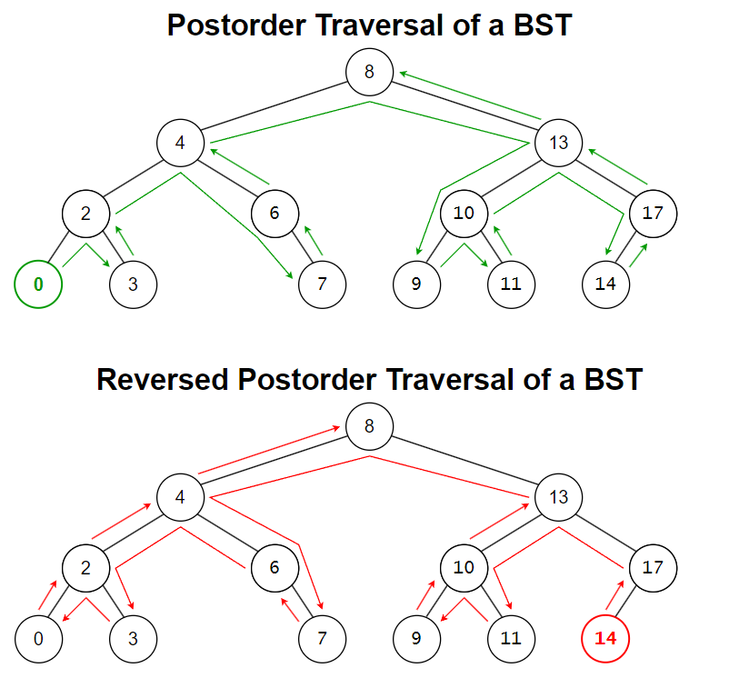

# &#128209; Table of Contents
- [💡 Overview](#-overview)
  - [Introduction](#introduction)
  - [Important Details](#important-details)
  - [Algorithm Steps (Recursive)](#algorithm-steps-recursive)
- [💻 Implementation](#-implementation)
  - [Design Decisions](#design-decisions)
  - [Complete Implementation](#complete-implementation)
  - [Detailed Walkthrough](#detailed-walkthrough)
- [📊 Analysis](#-analysis)
  - [Characteristics](#characteristics)
  - [Trade-Offs](#trade-offs)
- [📝 Application](#-application)
  - [Common Use Cases](#common-use-cases)
  - [Some Practical Problems](#some-practical-problems)
- [🕙 Origins](#-origins)
- [📖 Resources](#-resources)
- [🤝 Contributing](#-contributing)
- [🔏 License](#-license)

# &#128161; Overview
**Postorder traversal** is a fundamental algorithm for visiting nodes in a binary tree. When you think of traversal names as root placement plus left-to-right reading order, it is possible to observe that the name «POSTorder» means the root is visited AFTER the left and right subtrees. Knowledge and understanding of it lay a solid foundation for algorithmic design and tackling more complex problem-solving strategies.

## Introduction
Currently in Progress...

## Important Details
Currently in Progress...

## Algorithm Steps (Recursive)
Currently in Progress...

# &#x1F4BB; Implementation
Currently in Progress...

## Design Decisions
Currently in Progress...

## Complete Implementation
Currently in Progress...

## Detailed Walkthrough
Currently in Progress...

# &#128202; Analysis
Currently in Progress...

## Characteristics
Currently in Progress...

## Trade-Offs
Currently in Progress...

# &#128221; Application
Currently in Progress...

## Common Use Cases
Currently in Progress...

## Some Practical Problems
Currently in Progress...

# &#x1F559; Origins
Currently in Progress...

# &#128214; Resources
Currently in Progress...

# &#129309; Contributing
Contributions are highly appreciated! For detailed guidelines, contact details, and additional information, please refer to the [root directory's contributing section](../../../#-contributing).

# &#128271; License
This project is licensed under the MIT License — see the [LICENSE](https://github.com/vezzolter/DSA/blob/main/LICENSE) file for details.

