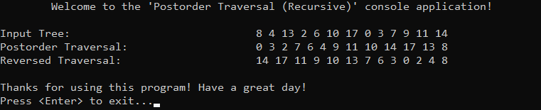

# 📑 Table of Contents
- [💡 Overview](#-overview)
  - [Introduction](#introduction)
  - [Important Details](#important-details)
  - [Algorithm Steps (Recursive)](#algorithm-steps-recursive)
- [💻 Implementation](#-implementation)
  - [Design Decisions](#design-decisions)
  - [Complete Implementation](#complete-implementation)
  - [Detailed Walkthrough](#detailed-walkthrough)
- [📊 Analysis](#-analysis)
  - [Characteristics](#characteristics)
  - [Trade-Offs](#trade-offs)
- [📝 Application](#-application)
  - [Common Use Cases](#common-use-cases)
  - [Some Practical Problems](#some-practical-problems)
- [🕙 Origins](#-origins)
- [📖 Resources](#-resources)
- [🤝 Contributing](#-contributing)
- [🔏 License](#-license)


# 💡 Overview
**Postorder traversal** is a fundamental algorithm for visiting nodes in a binary tree. When you think of traversal names as root placement plus left-to-right reading order, it is possible to observe that the name «POSTorder» means the root is visited AFTER the left and right subtrees. Knowledge and understanding of it lay a solid foundation for algorithmic design and tackling more complex problem-solving strategies.
<p align="center"></p>


## Introduction
The algorithm visits both subtrees before processing the root node — following the order Left-Right-Root in the standard version, and Right-Left-Root in the reversed version.


## Important Details
1. Can be implemented using **recursion** or **iteration**, but unlike inorder and preorder, iterative postorder is more complex due to the need to ensure both children are visited before the node; it often requires two stacks or clever use of a single stack with tracking.


## Algorithm Steps (Recursive)
**Standard Version:**
1. Set up the base case, stopping recursion when traversal reaches the end of a branch.
2. Recursively traverse the left subtree by calling the function on the left child.
3. Recursively traverse the right subtree by calling the function on the right child.
4. Process the current node (this step depends on the specific task at hand).

---
**Reversed Version:**
1. Set up the base case, stopping recursion when traversal reaches the end of a branch.
2. Recursively traverse the right subtree by calling the function on the right child.
3. Recursively traverse the left subtree by calling the function on the left child.
4. Process the current node (this step depends on the specific task at hand).


# &#x1F4BB; Implementation
The program manually constructs a binary tree that resembles a BST, but does not strictly enforce its rules — nodes are added in a predefined order rather than inserted dynamically. It then displays the order of insertion and applies both postorder and reversed postorder traversals, each of which simply prints the visited node values.
<p align="center"></p>


## Design Decisions
To prioritize simplicity and emphasize algorithm itself, several design decisions were made:
- Replacing tree-like structure with a simple node struct and predefined order of nodes.
- Printing node values as the only processing step during traversal.


## Complete Implementation
The postorder traversal algorithm is implemented in `postorderTraversal()`, the reversed postorder traversal in `reversedPostorderTraversal()`, both are declared in [PostorderTraversal.h](https://github.com/vezzolter/DSA/blob/postorder-traversal/Algorithms/TreeAlgorithms/PostorderTraversal/Include/PostorderTraversal.h) header file and defined in [PostorderTraversal.cpp](https://github.com/vezzolter/DSA/blob/postorder-traversal/Algorithms/TreeAlgorithms/PostorderTraversal/Source/PostorderTraversal.cpp) source file. This approach is adopted to ensure encapsulation, modularity and compilation efficiency. The tree construction and traversal execution are handled within the `main()` function located in the [Main.cpp](https://github.com/vezzolter/DSA/blob/postorder-traversal/Algorithms/TreeAlgorithms/PostorderTraversal/Source/Main.cpp) file. Below you can find related code snippets.

```cpp
void postorderTraversal(TreeNode* root) {
	if (!root) { return; }
	postorderTraversal(root->left);
	postorderTraversal(root->right);
	std::cout << root->val << " ";
}

void reversedPostorderTraversal(TreeNode* root) {
	if (!root) { return; }
	reversedPostorderTraversal(root->right);
	reversedPostorderTraversal(root->left);
	std::cout << root->val << " ";
}
```


## Detailed Walkthrough
**Standard Version:**
1. Start by setting up the base case, where if the current node is `nullptr`, the function returns immediately, stopping recursion. 
```cpp
  if (node == nullptr) { return; }
```
2. Recursively traverse the left subtree by calling the function on the left child.
```cpp
  postorderTraversal(node->left);
```
3. Recursively traverse the right subtree by calling the function on the right child.
```cpp
  postorderTraversal(node->right);
```
4. Process the current node, which in this case involves printing its value (designer decision).
```cpp
  std::cout << node->val << " ";
```

---
**Reversed Version:**
1. Start by setting up the base case, where if the current node is `nullptr`, the function returns immediately, stopping recursion.
```cpp
  if (node == nullptr) { return; }
```
2. Recursively traverse the right subtree by calling the function on the right child.
```cpp
  reversedPostorderTraversal(node->right);
```
3. Recursively traverse the left subtree by calling the function on the left child.
```cpp
  reversedPostorderTraversal(node->left);
```
4. Process the current node, which in this case involves printing its value (designer decision).
```cpp
  std::cout << node->val << " ";
```


# &#128202; Analysis
Understanding the characteristics of an algorithm is essential for choosing the right solution to a problem, as it reveals their impact on resource utilization, potential limitations, and capabilities. Additionally, understanding its strengths and weaknesses enables more informed decisions, helping to determine the most suitable algorithm for a given problem among alternative approaches.


## Characteristics
- **Time Complexities:**  
  - $O(n)$ — each node is visited exactly once.
- **Auxiliary Space Complexity:**  
  - $O(height)$ — the recursion depth depends on the height of the tree, which is $O(\log n)$ for balanced trees and $O(n)$ for skewed trees. The iterative implementation typically uses two stacks, or one stack with tracking logic, to simulate postorder behavior.


## Trade-Offs
> **Note**: I think it doesn’t make sense to evaluate this algorithm in terms of «pros and cons» — just like a tool, it serves a specific purpose. We don’t ask whether a hammer or a table has advantages or disadvantages; we simply use them as needed for the task at hand. 


# &#128221; Application
Understanding some of the most well-known use cases of an algorithm is crucial for grasping its practical relevance and potential impact in real-world scenarios. Additionally, familiarizing oneself with common practical problems and practicing their solutions ensures that you remember the essential details and develop a deep, intuitive understanding of the functionality and limitations.


## Common Use Cases
- **Tree Deletion or Cleanup** — postorder traversal is commonly used when freeing memory or deleting tree nodes, because it ensures children are handled before their parent. This avoids accessing dangling pointers and respects dependency order during teardown.

- **Expression Tree Evaluation** — postorder traversal corresponds to postfix notation (Reverse Polish notation), where operands are visited before their operator. It allows expression trees to be evaluated naturally using a stack-based approach, which is heavily used in interpreters and compilers.

- **Dependency Resolution & Build Systems** — postorder traversal is used in systems like make, where tasks (nodes) depend on sub-tasks (children). By visiting dependencies first, postorder ensures everything a task needs is resolved before the task itself is executed.


## Some Practical Problems
Since postorder traversal is widely used in tree-related problems, common problems that involve it are best described in the [tree's respective section](../../../DataStructures/Tree/Tree.md#some-practical-problems).


# &#x1F559; Origins
I couldn’t find any definitive records tracing its origins, so I’m assuming it naturally emerged as people began exploring tree structures and needed a way to process children before their parent nodes. As recursion and bottom-up processing became more common, the Left-Right-Root order likely stood out as a clean way to finalize a node only after fully handling everything beneath it.


# &#128214; Resources
&#128218; **Books:**
- **"Algorithms in C++, Parts 1-4: Fundamentals, Data Structure, Sorting, Searching" (3rd Edition)** — by Robert Sedgewick
  - Section 5.6: Tree Traversal
  - Section 5.7: Recursive Binary-Tree Algorithms
- **"Data Structures and Algorithm Analysis in C++" (4th Edition)** — by Mark Allen Weiss
  - Section 4.1: Preliminaries
  - Section 4.2: Binary Trees
  - Section 4.6: Tree Traversals (Revisited)
- **"The Art of Computer Programming, Volume 1: Fundamental Algorithms" (3rd Edition)** — by Donald Ervin Knuth
  - Section: 2.3.1: Traversing Binary Trees

---
&#127891; **Courses:**
- [Accelerated Computer Science Fundamentals Specialization](https://www.coursera.org/specializations/cs-fundamentals) on Coursera
  - Section 2.2: Introduction to Tree Structures
- [Mastering Data Structures & Algorithms using C and C++](https://www.udemy.com/course/datastructurescncpp/) on Udemy
  - Section 15: Trees


# &#129309; Contributing
Contributions are highly appreciated! For detailed guidelines, contact details, and additional information, please refer to the [root directory's contributing section](../../../#-contributing).


# &#128271; License
This project is licensed under the MIT License — see the [LICENSE](https://github.com/vezzolter/DSA/blob/main/LICENSE) file for details.

[](https://opensource.org/licenses/MIT)